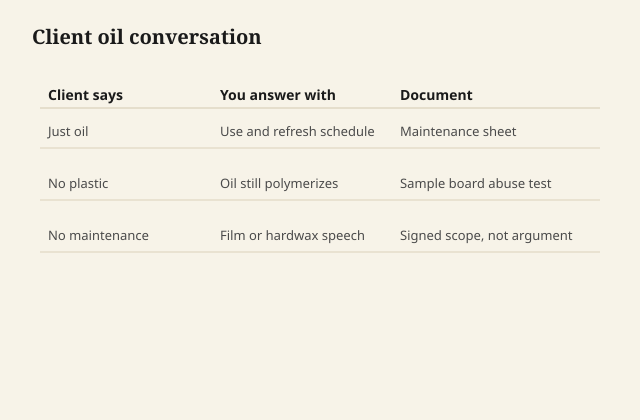

# What to tell a client who wants "just oil"

They do not want linseed. They want
a feeling: wood under the hand, no
gym-floor flash, no plastic, maybe
their grandfather, maybe a
photograph of a slab with a window
behind it.

Your job is to translate the feeling
into a binder and a maintenance
sentence, or to refuse the binder
they named.

## Ask what "just" is protecting
them from

Usually polyurethane they saw on a
bad kitchen in 2004. Sometimes a
refinisher who buried oak under
gloss. Sometimes a wellness sentence
about fumes and "chemicals," which
is a real apartment constraint and
also a place where people then buy
an oil that is still a chemical
reaction with a rag fire attached.

<figure class="ffc-figure">
  
  <figcaption><strong>Figure 1.</strong> Oil looks honest and marks faster; varnish films protect more with less feeding.</figcaption>
</figure>
Name the constraint. A low-odor
waterborne in a matte, thin build
may be the feeling they want. An
honest hardwax may be. Raw linseed
on a family dining table usually
is not.

## Ask what the table will eat

Homework, mustard, a laptop, a
house that does not use coasters,
a porch, a child with a spoon.
"Just oil" plus mustard is a
weekly story. If they accept the
story, write it down and charge
for the feeling. If they do not
accept the story, they did not
want just oil. They wanted the
photograph of oil and the armor
of a film.

That sentence has saved more
friendships than a discount.

## Show two boards, not one

One: the oil or hardwax, used.
Two: the thin matte film, used.
Let them touch both after a wet
glass. People can hear themselves
change their minds with their
hands. They cannot hear it in an
email about "natural."

## If they still want oil

Then give them oil, not a wiping
varnish secretly, unless you say
wiping varnish. The lie on the
can is how this whole series
started. Do not become the can.

Give them the rag rule if they
will ever refresh it themselves.
Give them the cure clock before
the holiday dinner. Give them the
card in the drawer.

## If they want milk paint "because
it's natural" on the same table

Legs, maybe. Field, only with the
topcoat and chip conversation.
Natural is not a use case. Casein
is a protein film with lime in it.
That is enough honesty for one
meeting.

## The words I will say out loud

"Oil polymerizes. It does not dry
like water. It will not be ready
for your in-laws on Sunday if we
start on Friday."

"If I put a film on this, we can
make it look less like plastic than
the one you hate. Matte and thin
are choices."

"If we do oil, you are on the
maintenance crew. I am not coming
every spring unless you hire me
every spring."

"I will not put a finish on a
mystery old paint until we know
it is not lead."

"I will not mix you a kitchen
chemistry so it can be more
food-safe than the can that
already exists."

## The close

A client who wants just oil is
asking for trust: that the wood
will still be the wood. You can
keep that trust with oil, or with
a film that knows when to stop
building, or with a no. What you
cannot do is keep it with a smile
and a product that is the opposite
of the sentence they used.

The shop is the place the sentence
gets a binder. That is the work.
The chemistry was only ever there
so the sentence could be true.
