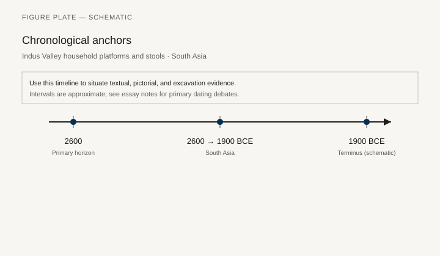
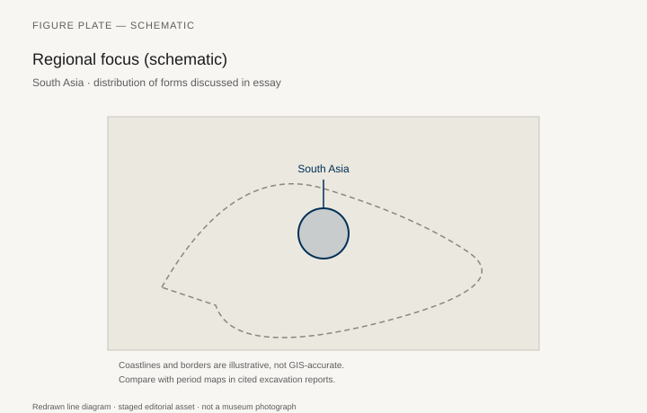
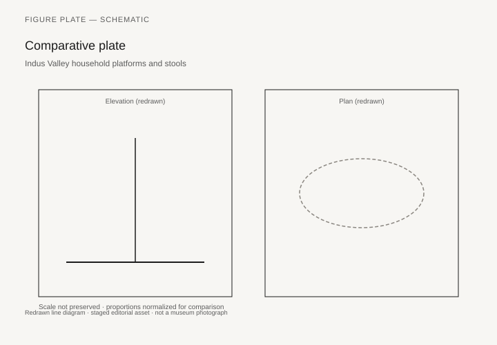

# Platforms Under the Dead

James Mellaart’s 1960s notebooks keep returning to the same east wall. A double platform, plastered and often painted, runs along it and ends in a bench. The south end of the room holds the oven and the hearth. A ladder came down through the roof; there is no street door. Under the north and east platforms, after the flesh had gone, people buried people. The house is mudbrick, the floors are fine white plaster renewed until they became a geology of their own, and the furniture — if the word is allowed for something you do not pick up — is a set of raised rectangles that organize sleep, work, display, and the dead.

Çatalhöyük sits on the Konya plain. The East Mound’s main occupation is now dated, in Ian Hodder’s project synthesis, from the early seventh millennium into the centuries around 6000 BCE. Mellaart excavated in 1961–65 and published *Çatal Hüyük: A Neolithic Town in Anatolia* (1967). He split the buildings into houses and shrines. Hodder’s Çatalhöyük Research Project (1993–2017) and Bleda Düring’s architectural studies walked that split back. The same buildings cooked, stored lentils, knapped obsidian, and held horn cores and paintings. Furniture at Çatalhöyük is not a suite of types. It is a graded floor.

## The kit Mellaart called standard

Mellaart’s 1961 season report, later folded into the 1967 book, already lists the pieces: raised platforms, a bench on the east wall, a raised hearth and a wall oven at the south, bins, plastered posts painted red, niches, occasional plaster shelves. “All these are standard features in every house,” he wrote, “and they betray great sophistication.” The sentence is dated in tone and accurate in inventory. Building after building repeats the south-fire / east-platform plan. The 2005 archive report from the South and 4040 Areas traces a double platform ending against a bench from Level VII into Levels IV–II: Buildings 58, 57, 55, 44, 56. Sometimes horns are set in the bench, as in Mellaart’s “Shrine” A.VI.1 and Building 52. Building 52 flips the arrangement to the west wall. Continuity is the story; the exceptions prove people could rearrange the kit.

Sharon Steadman’s 2018 paper in the *Cambridge Archaeological Journal* (“Material Geographies of House Societies”) restates Hodder’s 2006 and 2014 list: fire installation in the south; ladder; raised benches; a building wrapped in its own outer walls; anterooms with bins. Düring (2007) had already argued that “shrine” versus “house” does not survive a count of burials and ovens. The bucrania and the paintings cluster; they do not empty the room of dinner.

What, then, is a platform? It is a low plinth of packing and plaster, high enough to keep a body or a pile of mats off the dirty central floor, low enough to sit on. It is a bed without a bedstead, a bench without legs, a dais without a throne. Burials under the north and east platforms are not an afterthought. They are why those platforms were rebuilt. Each replastering is a decision to keep living on top of the same dead. Furniture here has a stratigraphy.

## Horn benches and the problem of display

A bench with cattle horns set in its sides is still a bench. It is also a display of animals that were not, in the simple sense, livestock portraits. Mellaart’s photographs of horned benches became the site’s postcard. Hodder’s Building 52, with its collapsed cattle skull and its western platforms, made the postcard three-dimensional again. The horns do not turn the bench into a non-seat. They load sitting and lying with a history of animals that the house insisted on keeping in view.

Ruth Tringham and Mirjana Stevanović’s work on house closure — the deliberate filling and burning of buildings — matters for furniture studies even though they were not writing one. When a house is closed, its platforms are buried with it. There is no heirloom chair. There is a new house, often on the same footprint, with new plaster and a memory of where the old platforms were. That is a different transmission than a workshop handing a stool form down three generations.

The south-wall oven, rebuilt and blocked and moved (Building 1 in the North Area is the textbook case: oven blocked, new oven in the western room, a lentil bin, a grinding spot, a cache of obsidian blanks), shows the furniture of work as clearly as the east platforms show the furniture of rest. A bin is a container fixed to the house. A grinding set in front of the bin is a table that cannot be sold. Çatalhöyük’s “tables,” such as they are, are these working patches of floor, sometimes rimmed with clay.

## Mats, plaster, and the missing wood

Wood existed. Posts, ladder poles, roof beams, and occasional small objects appear in the reports. The furniture that has made the site famous is plaster architecture, not joinery. Mats and textiles, inferred from phytoliths and from the need to soften a plaster sleeping surface, are the perishable half of the bed. `[CITE NEEDED: specific phytolith papers on platform mats — Hodder volume essays, e.g. Rosen or Ryan on phytoliths.]` Without them the platforms are hard. With them they are close to the low, textile-covered sitting of later Southwest Asian rooms — a comparison to make cautiously, four thousand years and many cultures away from the first *sofra*.

Red paint on platforms and around some burials is not upholstery, but it is a finish. The floor was colored on purpose. A white platform with a red kerb is already a designed object. Mellaart’s “ribs in plaster” and lamp niches are the cupboards and sconces of a house that stored light and shadow as carefully as grain.

## Why this site belongs in a furniture history

A history that waits for the first free-standing chair will skip the seventh millennium. That history is a history of portable prestige. Çatalhöyük is a history of the room as a piece of furniture. The platforms invent nothing that a person sitting on a packed earth ledge in a much older Levantine house did not already know. They stabilize the ledge, repeat it, bury under it, and decorate it until the house becomes a catalog of levels.

Jerichos’s Pre-Pottery houses, the plastered skulls of the Levant, and Aşıklı Höyük’s earlier central-Anatolian rooms are the neighborhood, not the origin myth. Each site has its own floor grammar. Çatalhöyük’s contribution to this series is the completeness of the grammar: fire south, dead and display north-east, storage in cells, entry from above. Skara Brae, two thousand years later and a continent away, will rhyme without quoting — hearth center, display opposite the door, boxes at the sides. No migration of form is required. People who build one-room houses keep rediscovering the raised rectangle.

## Neighbors: Aşıklı, Hacılar, and the Levantine ledge

Aşıklı Höyük, earlier than Çatalhöyük and still in central Anatolia, already knows the mudbrick room and the burial under the floor. Hacılar, which Mellaart also dug, has painted plaster and a different plan. Levantine Pre-Pottery houses at Jericho and ‘Ain Ghazal plastered skulls and built benches without matching Çatalhöyük’s south-fire / east-platform grammar. The point of naming them is not to build a family tree. It is to stop the Konya mound from standing as the only Neolithic house in a furniture book.

What Çatalhöyük adds, besides the completeness of the grammar, is the duration of replastering. A platform that has been skinned fifty times is a conservative object. People could have moved the bench. Often they did not. The house’s furniture is a memory practice. Hodder’s later language of “history houses” — buildings that accumulate more burials and more installations — is a furniture language: some platforms are heavier with the dead than others. Rank, if it is here, may be the right to sleep on a more storied rectangle.

The Indus tradition (**2600–1900 BCE**) never produced a European-style chair typology either. What survives is architecture that dictates posture — courtyards, staircases to upper rooms, brick bathing platforms — and a handful of stone and terracotta objects that hint at elevation without naming a joinery tradition. John Marshall’s Mohenjo-daro house plans show compounds with wells, staircases, and upper-storey rooms reached from courtyards; raised floors are platforms in the architectural sense, not imported bedsteads. Marshall’s “Seated Nobleman” from Mohenjo-daro (L Area, Chamber 75) — headless alabaster, one knee raised, found in situ above pavement — is sculpture, not a chair, yet it documents how an elite body occupied space. Jonathan Mark Kenoyer’s syntheses stress perishable furnishings that decayed while brick and stone survived. The comparison to Çatalhöyük is parallel, not genealogical: two urban traditions that made rank a surfaced elevation.

Obsidian caches, lentil bins, and the grinding set in Building 1’s later phase are the kitchen. A furniture series that only photographs horned benches will lie about the day’s work. The south end of the room is hot, dirty, and full of tools. The north and east are cleaner, painted, and reserved. That split is as close as this site comes to a “suite.”

## How a platform is built, and what the dirt still holds

A Çatalhöyük platform is not a slab dropped on a floor. It is a low plinth of packing — reused brick, midden, clay — skinned with white plaster that had to be mixed, spread, and left to set. Wendy Matthews’s micromorphology, published through the Hodder volumes, is the closest thing this site has to a joiner’s section. Thin-sections from the central floors show trampled ash, food crumbs, and the grit of daily traffic. Thin-sections from the north and east platforms show cleaner plaster, fewer inclusions, and the repeated skins of repair. The furniture of the room can be read in dirt. South was hot and dirty because that is where the oven lived. North and east were reserved because people slept there and buried there and painted there. That split is not a story a visitor projects onto a ruin. It is a laboratory fact about which surfaces were allowed to get filthy.

The plaster itself is a recipe. Marl from the plain, sometimes mixed with other clays, laid in coats thin enough that a building lived long enough can look, in section, like a closed book. Red paint on a kerb or around a burial is a finish chosen in advance of the next replastering. Shahina Farid’s building biographies for the project treated each house as a sequence of those decisions: oven blocked, platform raised, bin added, ladder moved. Building 1 in the North Area remains the textbook because the sequence is long and the publication is thick. None of this requires a named plasterer. It requires a household that knew how to make a floor and when to skin it again.

## Building 77, history houses, and the argument about rank

Building 77, in the South Area, burned. Fire is why we have more of it than of its quieter neighbors: a painted calf’s head with the horns still on, set above a niche ringed in red; a row of painted hands on the north wall; a horned bench and bucrania toward the northeast; more than nine burials under the painted platform, with more still coming when the 2011 archive report was written. Jason Quinlan’s site photographs of those installations are the images that replaced Mellaart’s shrine postcards for a generation of readers. Daniel Eddisford and later James Taylor treated the building as a biography, not a type. The house sits in the slot of the unusually large Building 132. Someone chose to rebuild smaller and heavier with the dead.

Hodder and Peter Pels named buildings of this kind “history houses” (2010): houses rebuilt on the same footprint, richer in burials and installations than their neighbors, carrying a memory practice that looks, from outside, like rank. The Shrine 10 sequence — Mellaart’s old number, Hodder’s long cut — runs from the early seventh millennium into the middle of the site. Another late sequence, Buildings 65–56–44–10, keeps the internal layout through rebuild after rebuild. Critics of the category say it is too neat: burial counts grade rather than split, and a “history house” can look like a house that simply lasted. Düring had already argued that shrine versus house does not survive a count. The history-house argument is the same fight with better numbers. Rank, if it is here, may be the right to sleep on a more storied rectangle, and to bury more people under it, and to paint the wall that faces those graves.

Mellaart’s seated female figurine from a grain bin — the object popular books still caption “Mother Goddess” — belongs to this argument even though it is not furniture. It trained a generation to read platforms as altars first and beds second. Hodder’s project did not deny ritual. It refused the empty shrine. Building 77 cooked. It also held a painted calf over a platform full of bodies. A furniture history that keeps only the horns will lie about the lentils. A furniture history that keeps only the lentils will lie about the horns.

## After Mellaart’s town

Phytoliths and the rare mat impression are the soft half of the bed. Without them the platform is a plaster ledge; with them it is closer to later Southwest Asian floor sitting than a European bedstead will ever be. The comparison is a rhyme, not a genealogy. Four thousand years and many cultures sit between a Konya platform and a *sofra*. What they share is a refusal to treat the floor as empty.

The word “town” in Mellaart’s subtitle has been argued to a standstill. Population estimates swing. Streetless clusters of houses entered from the roof do not behave like a High Street. For furniture, the urban question is simpler: was there a specialist who only built platforms? The regularity of the plan looks like shared know-how, not a named workshop. No tool kit has been isolated as “the plasterer’s furniture set.” The sophistication Mellaart saw is real and anonymous.

Hodder’s final project volumes (*Çatalhöyük Research Project* series, British Institute at Ankara / Cotsen) are the place to follow individual buildings. Building 77’s installations, Building 52’s horns, Building 1’s sequence of ovens — these are the monographs behind this essay’s generalizations. A magazine chapter cannot replace them. It can insist that the next time a reader meets an Egyptian bed-frame in a glass case, they remember a Konya platform that held a body above other bodies, and that this, too, was a way to make a place to lie down. The platform is not a failed chair. It is a finished raised rectangle with a stratigraphy of plaster and a grave under the sleep. Mellaart’s 1961 list — platforms, east bench, south oven, bins, red posts, niches — is still the inventory. Hodder and Düring changed the interpretation, not the kit. That is enough to keep this mound in a furniture series that otherwise waits for a free-standing back.

## Notes

- James Mellaart, *Çatal Hüyük: A Neolithic Town in Anatolia* (London: Thames & Hudson, 1967); season reports in *Anatolian Studies* 12–16 (1962–66).
- Ian Hodder, *The Leopard’s Tale* (London: Thames & Hudson, 2006); Hodder, ed., *Çatalhöyük Excavations* project volumes (2013–); Hodder 2014 synthesis essays.
- Bleda Düring, *Constructing Communities* (Leiden: Nederlands Instituut voor het Nabije Oosten, 2006); Düring 2007 on houses versus shrines.
- Sharon R. Steadman, “Material Geographies of House Societies: Reconsidering Neolithic Çatalhöyük, Turkey,” *Cambridge Archaeological Journal* 28, no. 3 (2018).
- Çatalhöyük 2005 Archive Report, South Area concluding remarks (catalhoyuk.com); 2011 Archive Report on Building 77 (Eddisford; Quinlan photographs).
- Ian Hodder and Peter Pels, “History Houses,” in Hodder, ed., *Religion in the Emergence of Civilization* (Cambridge: Cambridge University Press, 2010).
- Wendy Matthews, micromorphology essays in the Çatalhöyük Research Project volumes, on dirty central floors versus cleaner platform plasters.

## Figure plan

*Fig. 1.* Chronological anchors for the evidence discussed below. Schematic redrawn line diagram; staged editorial asset (2026). Not a photograph of a museum object.

*Fig. 2.* Regional focus for circulation and local workshop traditions. Schematic redrawn line diagram; staged editorial asset (2026). Not a photograph of a museum object.

*Fig. 3.* Morphological typology for archaeology (idealized morphotypes). Schematic redrawn line diagram; staged editorial asset (2026). Not a photograph of a museum object.

*Fig. 4.* Comparative elevation and plan plate for archaeology. Schematic redrawn line diagram; staged editorial asset (2026). Not a photograph of a museum object.

### Supplemental photographs and redraws

**Fig. 5.** Reconstruction painting or photograph of a Çatalhöyük interior with east platforms and south oven.  
Hodder project reconstruction house, or Mellaart-era reconstruction drawing.  
License: project CC or © Çatalhöyük Research Project; use only a released still.  
Alt: Plastered room with raised side platforms, ladder, and oven.  
Caption: Fire at the south, platforms along the east: the plan that keeps returning from Level VII to Level II.

**Fig. 6.** Field photograph, Building 52, horned bench.  
Çatalhöyük Research Project.  
License: project, permission required unless a Wikimedia upload exists.  
Alt: Mudbrick bench with cattle horn cores set in the plaster.  
Caption: A bench can hold a body and a herd at once.

**Fig. 7.** Plan of a typical house (e.g. Building 1 or Mellaart Level VI house).  
Published project plan.  
License: redrawn from Hodder/Düring figures.  
Alt: Plan with platforms, bench, oven, bins, and roof entry marked.  
Caption: Steadman and Düring read this as a residence, not a shrine that sometimes cooked.

**Fig. 8.** Section through replastered platforms.  
Project archive.  
Alt: Layer-cake of white plaster floors and packing.  
Caption: Each skin of plaster is a decision to keep the same furniture in the same place.

**Fig. 9.** Burial under a platform, archive photograph (use a published, ethically cleared image).  
Hodder volumes; avoid sensational unpublished human remains.  
License: as published.  
Alt: Excavated platform with a burial cut visible in section, if a non-graphic published image is available; otherwise omit.  
Caption: The east and north platforms were floors and graves. That is not a metaphor.

**Fig. 10.** Exterior of the experimental house on site.  
Wikimedia Commons / project photo.  
Alt: Mudbrick house cluster with roof openings.  
Caption: You entered from above. The furniture was waiting on the raised edges of the room.
