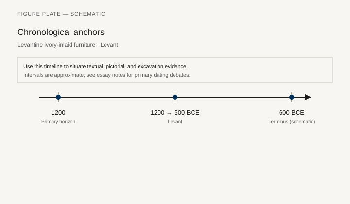
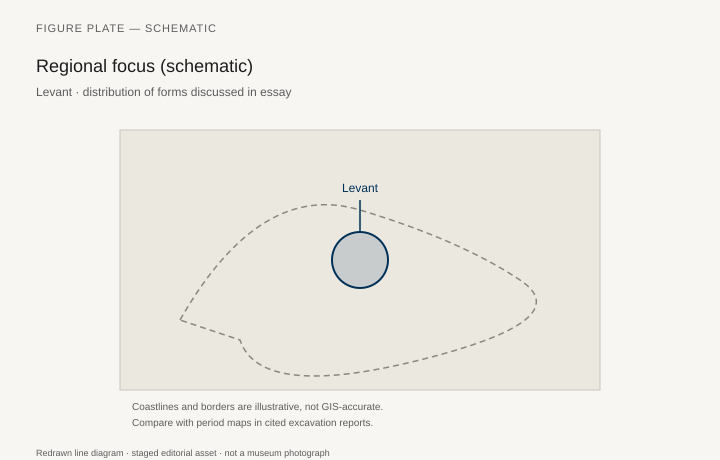
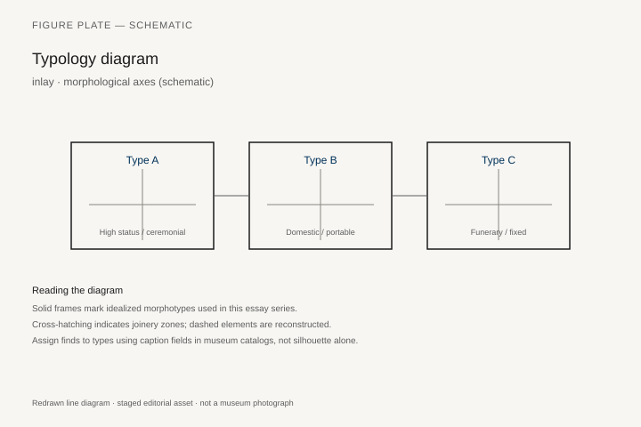
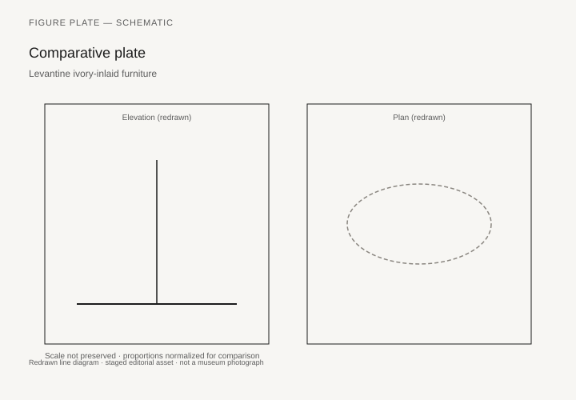

# Ivory Houses of the Tigris

*Fig. 1.* Chronological anchors for the evidence discussed below. Schematic redrawn line diagram; staged editorial asset (2026). Not a photograph of a museum object.

*Fig. 2.* Regional focus for circulation and local workshop traditions. Schematic redrawn line diagram; staged editorial asset (2026). Not a photograph of a museum object.

*Fig. 3.* Morphological typology for inlay (idealized morphotypes). Schematic redrawn line diagram; staged editorial asset (2026). Not a photograph of a museum object.

*Fig. 4.* Comparative elevation and plan plate for inlay. Schematic redrawn line diagram; staged editorial asset (2026). Not a photograph of a museum object.

The Hebrew Bible’s later taunt — Ahab’s “house of ivory,” the beds of ivory in Amos — is a memory of a luxury that Mesopotamia and the Levant had already practiced for a thousand years. The taunt is not evidence for a particular chair. It is evidence that ivory on furniture was a known way to say wealth. The archaeological problem is older and quieter: wood rots in the floodplain; what remains are fittings, impressions, stone and metal stands, and a few carbonized or waterlogged members.

Woolley’s Ur excavations (1922–34) gave the Royal Cemetery its fame through gold and lapis, not through chairs. The “standard” of Ur is a box, not a stool. Puabi’s tomb (PG 800) held a sledge, not a drawing-room. What Ur does give a furniture historian is the habit of sheathing a wooden core — in gold, in mosaic, in inlay — and the presence of small tables and stands in grave photographs that later catalogs treat with caution. `[CITE NEEDED: Woolley, Ur Excavations II, specific furniture catalog numbers; avoid inventing a “throne of Puabi.”]` The musical instruments, with their inlaid soundboxes, are the closest cousins: wooden architecture, precious skin, animal terminals.

Further north and later, at Mari on the Euphrates, palace inventories and a few fittings suggest beds and thrones as administrative facts: objects that can be listed, issued, repaired. Jean-Claude Margueron’s architecture of the palace is the frame; the furniture itself is mostly text. `[CITE NEEDED: ARM tablet publications that list beds or chairs by name.]` A palace without surviving chairs is still a palace that had a department for them.

## What the ground keeps

Mesopotamian clay is a poor friend to joinery and a good friend to writing. So the furniture of the third millennium is often a word: *gu-za* and its descendants for a seat, bed terms that lexicographers still argue, offering lists that put a bed next to a jar. When a stone statue sits — Gudea of Lagash on his stool, later Assyrian kings on backed thrones — the seat is a sculptor’s type, not a carpenter’s drawing. The stool under Gudea is a cubic throne with side panels, a form that will have a long life as a “box throne” in the Near East. It may record a wooden object. It may be stone thinking about stone.

Metal stands from Ur and later sites — tripods, rod-tripods, offering tables — show the other half of the room: a place to set a vessel at a height. These are furniture if the definition includes any raised working surface. They are also a reminder that “table” in this world is often a stand for a specific act (libation, meal, display), not a family dining table in the European sense.

Ivory arrives as a trade good from African and, later, Syrian elephants, and as a carving tradition that will explode in the first millennium (chapter 6). In the second millennium, Levantine and Syrian palaces already know the ivory plaque as a furniture skin. Ugarit, Megiddo, and the older layers behind Samaria’s later ivories are the addresses. The Megiddo ivory hoard (Late Bronze, University of Chicago excavations) includes plaques whose size and dowel holes make more sense as box and furniture ornament than as free sculptures. Gordon Loud’s *The Megiddo Ivories* (1939) is the old catalog; later writers have reassigned functions without always finding the chair.

## Banquet reliefs and the missing couch

Akkadian and Neo-Sumerian banquet scenes — the seated drinker with a cup, a servant, a bit of food — use a stool or a low chair. The body is upright. The Greek and Etruscan reclining banquet is not yet the rule. When an Assyrian king in the first millennium reclines on a garden couch (Ashurbanipal in the British Museum’s lion-hunt and garden reliefs), he is doing something the third millennium’s offering lists did not require of a god or a king in the same way. The history of the couch in the Near East is a history of posture, and the evidence is later than Ur.

That said, beds are in the texts early. A bed is a household and a wedding and a death. Wooden beds with inlay, if we had them, would look — on the analogy of Egyptian frames and later Assyrian reliefs — like rectangular frames with animal or block legs. Analogy is not a find. This chapter will not draw an Ur bed in the style of Hetepheres and call it science.

## Imported wood, local mud

Southern Mesopotamia is, like Egypt, a timber importer. Cedar from the west, other hardwoods by river and caravan, reeds and date-palm ribs for the architecture of the poor. A reed hut’s furniture is the mat and the low clay bench: Çatalhöyük’s idea in a different vernacular. The palace’s furniture is imported wood plus imported ivory plus local goldsmiths. The social split is a materials split.

Fire and flood take the rest. A burned palace can leave charcoal furniture; most did not get recorded as such in early excavations. Mallowan’s Nimrud, in the next chapter, is the exception that trained a generation to look for ivory in the ash. Woolley’s Ur was not that kind of dig for wood. Later Iraqi and Syrian excavations have been more alert and, since 1990 and 2011, more often interrupted. `[CITE NEEDED: any published carbonized furniture from Mashkan-shapir, Emar, or later palace fires.]`

## Why “ivory house” is a furniture phrase

When the Bible and the Assyrian royal inscriptions talk about ivory, they are talking about surfaces: beds, thrones, rooms paneled or furnished so that the eye meets tusk instead of grain. Irene Winter’s later work on Nimrud (chapter 6) is the art-historical end of that sentence. The beginning is this: a wooden object too expensive to leave plain, in a region that could not grow luxury timber at home, using a material that signaled distance — Africa, the Orontes, the dead elephant.

Egypt, in the same centuries, used ivory as inlay on stools and boxes (Tutankhamun’s tomb is a late, rich example). The Mesopotamian and Levantine habit is more plaque than inlay: a carved panel nailed or pegged to a frame that has disappeared. That is why our museums are full of ivories and empty of the chairs they faced.

## Language on clay, furniture in the air

Lexical lists from the third and second millennia — the great compilations that teach scribes the words for things — are a furniture catalog written for a different purpose. A bed, a stool, a box, a stand: the signs exist. What they pointed to on a given Tuesday in a house at Nippur is harder. Some texts distinguish a “night bed” from a ceremonial seat; some list repairs of a throne as an administrative event, like the issue of oil. The Mari palace, again, is the richest address for that kind of sentence when the tablets are published with furniture in the index. Until a tablet is cited, this paragraph stays general. `[CITE NEEDED: CAD or PSD entries for bed/chair terms with a palace-repair example.]`

Stone statues sit because stone lasts. Gudea’s cubic throne, the later seated goddesses, the Assyrian king already on a backed chair in relief: these are the public faces of sitting. Behind them, the reed mat and the low clay bench did the daily work, as they had since the first packed houses on these rivers. A furniture history that only chases ivory will miss the majority sitters.

Trade in cedar is not a metaphor in the royal inscriptions. Kings boast of mountains and of logs floated down. A beam for a temple and a rail for a bed may travel on the same water. The difference is scale and finish. The carpenter at the end of the journey still has to cut a joint the flood will not see.

Megiddo’s ivories, again, are the Levantine hinge: a palace that looked both to Egypt and to Mesopotamia, plaques that may have faced boxes and chairs, a catalog (Loud 1939) that later writers have nibbled without replacing. Samaria’s later hoard (Crowfoot) is the Israelite chapter of the same trade. The Bible’s ivory house is a neighbor of those plaques, not a photograph of them.

## Gudea’s cube, Tello, and stone that may be remembering wood

The seated statues of Gudea of Lagash, carved in diorite about 2120 BCE and found at Tello (ancient Girsu) by Ernest de Sarzec from 1877, are the third millennium’s most stubborn furniture drawings. Louvre AO 2 — Gudea B, “the Architect with a Plan” — shows the ruler on a cubic stool, a tablet with a temple plan on his lap, a stylus and a graduated rule. The seat is a box: paneled sides, a flat top, no animal legs, no stretchers a carpenter would photograph. Other seated Gudeas repeat the cube. Art historians call it a box throne. It may record a wooden object sheathed or paneled. It may be stone thinking about stone. The honest sentence is the one that keeps both. A furniture history that treats AO 2 as a carpenter’s working drawing will be disappointed. A furniture history that ignores it will miss the fact that, in the neo-Sumerian court, the seat of a ruler could be imagined as a block with sides, not as a lion.

Early Dynastic Mari already knew furniture as a surface for inlay. The so-called War Panel from the Temple of Ishtar, courtyard 20 — Louvre AO 17572, excavation M. 470 — is catalogued as *incrustation de meuble*: shell figures that André Parrot once mounted as a single mosaic and that the Louvre has since split into three. Soldiers, prisoners, a chariot. The wooden chassis is gone. The inlay is what the ground kept. Woolley’s Standard of Ur (BM 121201) is a cousin of that habit, a box rather than a chair, wooden architecture with a precious skin. Puabi’s tomb (PG 800) held a sledge and lyres, not a throne a catalog can number. The Queen’s Lyre in the British Museum (121198) and its cousins in Philadelphia are the closest Ur comes to a named wooden object with animal terminals. They are instruments. They are also the thought a lost chair would have shared: a wooden core, a mosaic skin, a beast at the end of a member.

## Ebla’s burned chairs and Ugarit’s bed that is not a shop

Royal Palace G at Ebla (Tell Mardikh) burned around 2300 BCE. Fire, for once, was a friend to joinery. Paolo Matthiae’s excavations recovered carbonized wood and inlay from rooms above the Court of Audience — L.2601 among them — enough for later work to reconstruct a chair and a table. The chair carried carved animal-contest scenes and inlay; the table used dovetail joints on the order of eight to ten centimeters `[CITE NEEDED: the reconstruction essay on Palace G furniture, placing and measurements]`. Those are carpenter’s facts, rare in this river system. They belong in a furniture history that is tired of being told that Mesopotamia has only words. Ebla had a shop, or several, capable of openwork, pegs, and a ceremonial chair that was not a statue’s cube.

Mari, five centuries later in the palace Jean-Claude Margueron has spent a career planning, is richer in architecture and poorer in wood. The Investiture painting from court 106 (Louvre AO 19826) shows Zimri-Lim before Ishtar; it is a political picture, not a furniture catalog. The ARM tablets are the catalog. Beds, chairs, and repairs appear in the administrative language of a palace that issued objects the way it issued oil `[CITE NEEDED: specific ARM numbers that list giš-ná or chairs]`. A department for furniture is still a department if the chairs have gone back to the river.

Claude Schaeffer found the ivory furniture of Ugarit’s royal palace in Court III, a garden court, stacked or dropped on about twelve square meters (his point 302). He thought the pieces had been rushed from an ivory workshop in room 44 as the city burned. Jacqueline Gachet-Bizollon, publishing the bed panel in *Syria* 78 (2001) and the ivories as a corpus in 2007, walked that story back. There are no tools, no offcuts, no work in progress. Margueron read room 44 as a rest pavilion by the garden, a room that could have held a bed. The ivories themselves, already mounted on wood, make more sense as finished furniture than as a shop’s inventory.

The bed panel — Damascus National Museum 3599, joining Ras Shamra 16.56 and 28.31 — is the Late Bronze object this chapter can finally point at without inventing a throne for Puabi. Both faces carried carved plaques; Egyptianizing figures and plants run in registers. A separate ivory skin belonged to a small table, a *guéridon* on a wooden stem with an ivory capital. Lion paws in ivory survive as feet. A “triple frame” of plain ivory moldings was complete when found and has never been fully remounted; the fragments remain in Damascus boxes. That last sentence is the one to keep. Even a famous ivory bed is a reconstruction plus a tray of moldings.

Megiddo’s hoard, from the treasury of Palace 2041 in Stratum VIIA, is the other Late Bronze address. Gordon Loud’s *The Megiddo Ivories* (Oriental Institute, 1939) is still how most readers meet the plaques. Dowel holes and formats make more sense as box and furniture ornament than as free sculpture. Anthony Cutler’s *The Craft of Ivory* (1985) is the technical book for how a tusk becomes a plaque. The plaque becomes furniture only when someone still has the wood. SW7, in the next chapter, is the room that finally keeps the arrangement.

## Toward Assyria

The next chapter is a storeroom: Fort Shalmaneser, Room SW7, nineteen furniture backs stacked as the city died in 612 BCE. That room is the payoff of the trade this chapter can only outline. To get there, a reader needs Ur’s caution, Mari’s lists, Megiddo’s plaques, and the refusal to invent a throne for Puabi. The Tigris and Euphrates kept the words. The wood went back to the river.

A reader coming from Giza will want a reconstructed chair. Ur will not give one. What it gives is the habit of sheathing, the administrative list, the plaque with dowel holes, the later Assyrian couch in relief. Those are enough if the chapter refuses to draw a throne for Puabi and call the drawing evidence. The next room — SW7 — is the first time we can count backs. This room is the trade that made those backs possible: tusks, cedars, a floodplain that eats joinery and keeps clay words.

## A plaque with holes, a statue with a box throne

Loud’s Megiddo plaques still have dowel holes. The holes are the furniture. Without them a carved ivory is jewelry. With them it is a skin that once had a wooden body in a Late Bronze palace that looked toward Egypt and toward the rivers. Samaria’s later hoard (Crowfoot and Crowfoot, 1938) is the Israelite chapter of the same trade. Ahab’s ivory house in the Book of Kings is a neighbor of those plaques, not a photograph of them.

Gudea’s cubic seat (Louvre seated statues, AO numbers to be confirmed in layout) is the public face of sitting in stone. It may remember a wooden box throne. It may be stone thinking about stone. Either way, the carpenter is not named. Behind the statue, reed mats and clay benches did the daily work. A furniture history that only chases tusk will miss the majority sitters.

Cedar boasts in royal inscriptions are not metaphors. Logs floated. A temple beam and a bed rail may travel on the same water. The difference is scale and finish. The floodplain keeps the words on clay and eats the joints. That is why this chapter can outline a trade and cannot reconstruct Puabi’s chair. SW7, next, is the first time we can count backs.

## Notes

- C. Leonard Woolley, *Ur Excavations*, vol. II, *The Royal Cemetery* (London and Philadelphia, 1934).
- Gordon Loud, *The Megiddo Ivories* (Chicago: University of Chicago Press, 1939).
- Irene J. Winter, “Carved Ivory Furniture Panels from Nimrud,” *Metropolitan Museum Journal* 11 (1976) — preview of chapter 6.
- Jean-Claude Margueron, *Mari: Capital of Northern Mesopotamia in the Third Millennium* (Oxford: Oxbow, 2014), for palace context.
- Richard D. Barnett, *A Catalogue of the Nimrud Ivories in the British Museum* (London: British Museum, 1957; 2nd ed. 1975), for the later hoard’s bibliography.
- Biblical citations as literary memory, not as excavation: 1 Kings 22:39; Amos 6:4; Ezekiel 27 (Tyre and ivory).
- Louvre AO 2 (Gudea B, “Architecte au plan”); AO 17572 (Mari, Temple of Ishtar, furniture inlay); AO 19826 (Investiture painting, court 106).
- Jacqueline Gachet-Bizollon, “Le panneau de lit en ivoire de la Cour III du Palais Royal d’Ougarit,” *Syria* 78 (2001); Gachet-Bizollon, *Les ivoires d’Ougarit* (Paris: ERC, 2007). Damascus National Museum 3599 (RS 16.56 + 28.31).
- Anthony Cutler, *The Craft of Ivory* (Washington, D.C.: Dumbarton Oaks, 1985).
- Paolo Matthiae and later reconstructions of wooden furniture from Ebla, Royal Palace G, room L.2601 `[CITE NEEDED: placing-and-reconstruction essay]`.

## Figure plan

**Fig. 1.** Gudea seated, Neo-Sumerian.  
Louvre, AO 20112 or AO 2 (confirm seated Gudea inventory before layout).  
License: Louvre / Wikimedia PD photographs of the sculpture.  
Alt: Diorite statue of a ruler seated on a cubic stool.  
Caption: A stone throne that may be remembering a wooden one. The carpenter is not named.

**Fig. 2.** Standard of Ur, “peace” side, banquet.  
British Museum, ME 121201.  
License: BM image license (usually CC BY-NC-SA 4.0).  
Alt: Inlaid box panel with seated drinkers.  
Caption: Not furniture, but the earliest famous picture of people sitting to drink in this river system.

**Fig. 3.** Megiddo ivory plaque with architectural or furniture format.  
Oriental Institute, Chicago — Megiddo ivory (e.g. OIM A22251 or catalog equivalent; confirm).  
License: OIM terms.  
Alt: Carved ivory plaque with figures in registers.  
Caption: Loud’s 1939 plates are still how most readers meet Levantine furniture ivory before Nimrud.

**Fig. 4.** Puabi’s sledge or lyre (Ur).  
British Museum / Penn Museum, Royal Cemetery.  
License: BM or Penn Open Access as applicable.  
Alt: Reconstructed lyre with inlaid soundbox, or sledge fittings.  
Caption: Wooden cores, precious skins: the same thought as a lost chair.

**Fig. 5.** Assyrian garden scene of Ashurbanipal reclining (preview of later posture).  
British Museum, ME 124920.  
License: BM CC BY-NC-SA.  
Alt: Relief of a king on a couch under a vine.  
Caption: The couch as royal furniture is a first-millennium image. Do not read it back into Ur.

**Fig. 6.** Map of ivory and cedar routes (Levant, Africa, Gulf).  
Redrawn for this series.  
Alt: Map with arrows from Lebanon, Syria, and Africa into southern Mesopotamia.  
Caption: The furniture was local work on foreign skin.
