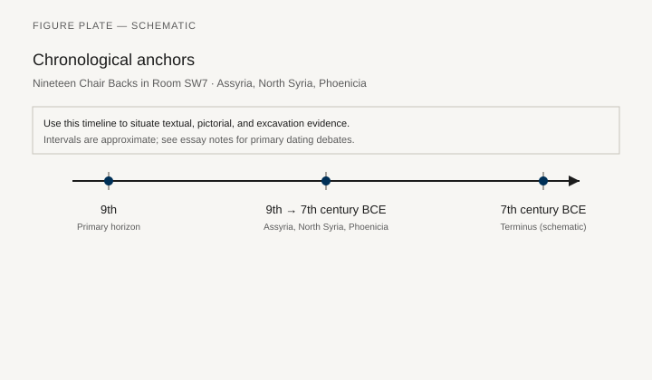
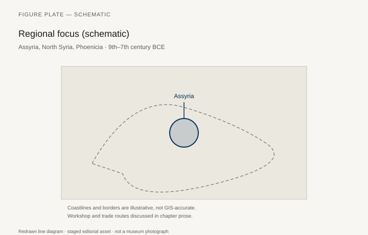
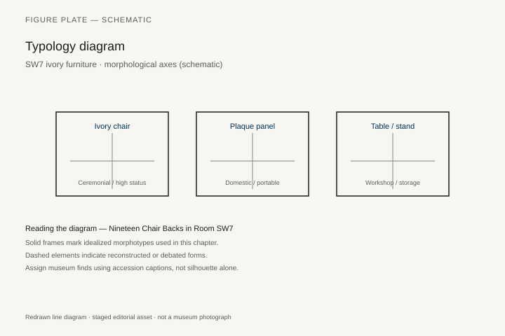
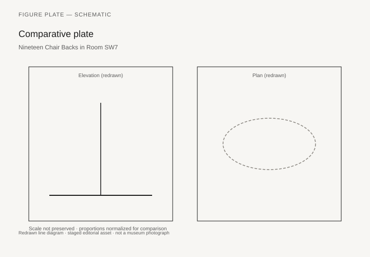

# Nineteen Chair Backs in Room SW7

When the Assyrian palaces at Nimrud burned in 612 BCE, someone had already stacked a set of ivory-faced furniture in Room SW7 of Fort Shalmaneser. Max Mallowan’s British School of Archaeology in Iraq, digging from 1949 to 1963, found them in orderly rows: about nineteen decorated pieces, long enough and alike enough to be chair backs, not — as a first guess had it — bed-heads. The wooden frames had gone. The ivories kept their arrangement because they had been buried in the sack, not scattered in a shop. The Metropolitan Museum of Art received a share in return for supporting the excavation. Among them is a non-figural panel with tree patterns and star-in-circle borders, now set in a modern wood frame (Met 59.107.1 and related strips 59.107.2a, b). The museum’s catalog says it plainly: these are rare examples of ancient ivory furniture still in something like its original form.

Irene J. Winter’s 1976 article in the *Metropolitan Museum Journal* — “Carved Ivory Furniture Panels from Nimrud: A Coherent Subgroup of the North Syrian Style” — is the essay that turned a storeroom into a workshop problem. She argued that the SW7 plaques belong together stylistically: oval faces, high receding foreheads, large eyes and noses, small mouths, little chin; garments longer at the back than the front, beaded borders; chariot scenes and figures holding blossoms. The group is, in F. Poulsen’s old distinction, free of the Egyptianizing that marks Phoenician ivories. Winter’s conclusion about function — chair backs, not bed-heads — is now the sentence museums repeat.

## Three styles, one capital

Nimrud (Kalhu), rebuilt as a capital by Ashurnasirpal II in the ninth century, took in ivory as tribute and booty. The royal inscriptions are not shy about it. The ivories themselves are not, for the most part, “Assyrian” in the sense of the palace reliefs. Richard D. Barnett, publishing the British Museum’s Layard and Loftus pieces in 1957 (second edition 1975), sorted a mass of calcined fragments into Phoenician, Syrian, and a smaller Assyrian group. Layard had found ivories on the second day of work in the Northwest Palace in December 1845 and had already seen that the Egyptian look was not Egyptian manufacture. Georgina Herrmann’s later corpus volumes for the British School (*Ivories from Nimrud*) are the heavy catalog; Barnett is the first map.

Phoenician-style plaques like Egyptian crowns, sphinxes, openwork, colored glass inlay. North Syrian plaques like Winter’s SW7 faces. Assyrian-style pieces speak the same visual language as the orthostats: kneeling genies, sacred trees, a harder outline. One storeroom, three carving traditions, and a fourth fact: some ivories in older museum trays are not from Nimrud at all. Barnett had to peel those away. The “Nimrud ivories” are a heap with a name, not a single commission.

Fort Shalmaneser’s SW7 is the cleanest furniture context in that heap. Nineteen related backs, stacked. A bed or couch is suggested by long ivory strips (Met 59.107.2a, b). The rest of Nimrud is fittings without frames: thousands of plaques that once nailed to boxes, chairs, and couches now known only as “furniture ornament.”

## What a chair back is doing in a fort

Fort Shalmaneser was a palace and an arsenal, a place to store what campaigns brought home. The SW7 stack is not a dining room. It is a reserve of prestige seating — or of seating taken from somewhere else and not yet reissued. We do not know who sat in these chairs, or whether they were sat in at Kalhu at all. We know they were valued enough to store and not valued enough, in the last days, to carry away.

Winter’s North Syrian attribution points toward workshops in the zone from the Hatay to the upper Euphrates, the same world as Tell Halaf and the later “Syro-Hittite” principalities. The carvers may have worked at home, the plaques traveling as tribute; they may have worked in Assyria from imported tusks. The royal inscriptions allow both. What they do not allow is the lazy picture of an Assyrian sculptor moonlighting in ivory. The reliefs and the plaques are different trades.

Construction: ivory strips and plaques attached to a wooden chassis, sometimes with additional materials (wood, metal, glass) in the moldings. The Met’s tree-pattern panel has a curved top molding that originally alternated ivory with something now missing, restored in wood. The chair, when complete, was a mixed-media object: dark wood, pale ivory, perhaps gold leaf, perhaps colored inlay. Our white museum ivories are a bleach of that object.

## Layard’s heap and Loftus’s forgotten room

Layard’s popular books (*Nineveh and Its Remains*, 1849; *Discoveries in the Ruins of Nineveh and Babylon*, 1853) made the ivories famous before they could be mended. The British Museum’s trays held, as Barnett later complained, more than Layard ever found: Loftus’s “horse-trappings” and smashed ivories from another part of the palace, plus strays. The 1957 catalog is a work of un-mixing. Georgina Herrmann and the Nimrud Ivories Project then spent decades giving fragments back to groups and, where possible, to rooms.

This matters for furniture because a plaque without a room is jewelry. A plaque in SW7 is a chair. The difference is archaeological, not aesthetic. A reader looking at a beautiful sphinx in a gallery is looking at a furniture part until proven otherwise.

## Biblical furniture, again

Amos’s people who “lie upon beds of ivory” and Ahab’s ivory house are eighth-century sentences. They are contemporary with the world that filled Nimrud’s storerooms. They are not captions for SW7. Samaria, Ahab’s capital, produced its own ivory hoard (Crowfoot and Crowfoot, *Early Ivories from Samaria*, 1938), closer to the Phoenician style, from a palace that the Bible also knew as luxurious. The same trade system — tusks, carvers, palaces — runs from Samaria to Kalhu to the Phoenician coast. Ezekiel’s lament over Tyre, listing ivory among the cargoes, is a merchant’s inventory turned into a poem.

Winter, in the 1976 article, puts those texts in a footnote and keeps her eyes on the faces. That is the right ratio. The Bible proves that ivory furniture was a known scandal of wealth. SW7 proves what it looked like when stacked.

## Tribute, three styles, a chair that is now a diaspora

Ashurnasirpal’s Kalhu took ivory as tribute. The plaques are mostly not “Assyrian” in the orthostat sense. Barnett (1957/1975) sorted Layard and Loftus heaps into Phoenician, Syrian, and a smaller Assyrian group; Herrmann’s corpus volumes are the heavy catalog. Phoenician work likes Egyptian crowns, sphinxes, openwork, glass inlay. Winter’s SW7 faces do not. Assyrian-style pieces speak like the reliefs. One storeroom, three trades, and Barnett’s warning that some trays are not even from Nimrud.

SW7 is the clean furniture context: about nineteen backs stacked, long strips for a couch (Met 59.107.2), a tree-pattern back (59.107.1) in a modern frame. We do not know who sat. We know the pieces were stored and not carried out in 612. Construction was mixed-media: ivory on a wooden chassis, moldings that once alternated materials now restored in wood. Museum ivories are a bleach of that object.

Ahab’s ivory house and Amos’s ivory beds are eighth-century sentences, contemporary with the trade, not captions for SW7. Samaria’s hoard (Crowfoot 1938) is closer to Phoenician style. Ezekiel’s Tyre list is a merchant poem. Winter kept those texts in a footnote. The fire that preserved arrangement also calcined much ivory. A chair that was one chair is now London, New York, Baghdad.

## How big a back is, and how a tusk becomes a chair

Irene Winter gave the measurements. The SW7 panels run about 85 by 55 centimeters. Each back is not one slab of ivory — a tusk will not give that — but a center of four to six contiguous plaques, framed top and bottom by narrow strips, then bound at the sides by two or three vertical plaques. The whole was backed on wood that is gone. Mallowan and Georgina Herrmann published the set as *Ivories from Nimrud* III, *Furniture from SW7, Fort Shalmaneser* (London: British School of Archaeology in Iraq, 1974): commentary, catalog, 111 plates. Winter’s 1976 *Metropolitan Museum Journal* essay is the argument that turned those plates into a workshop problem. The first guess, bed-heads, dies on the dimensions and on the comparison. High-backed chairs with carved panels under the arms appear on the reliefs of Tiglath-pileser III, Sennacherib, and Ashurbanipal, and on North Syrian reliefs from Carchemish and Zincirli (Sam'al). Decorated backs are what those silhouettes lead you to expect.

Construction is mixed media. Ivory plaques pegged or pinned to a wooden chassis; moldings that once alternated ivory with a second material now missing; sometimes glass inlay, sometimes gold leaf, sometimes stain that the fire and the conservators have since bleached. The Met’s tree-pattern panel (59.107.1) still has a curved top molding restored in wood. Our white museum ivories are a bleach of a darker, colored object. A reader who thinks “ivory furniture” means a chair carved from a single tusk is thinking of a different luxury, and a later one.

Winter also put Ugarit’s Court III bed in the footnote where it belongs: the practice of joining plaques into a furniture panel is already Late Bronze. SW7 is not the invention of the habit. It is the first time we can count the backs and say nineteen, stacked, in a room that died in 612 BCE.

## Rooms that were not SW7

Fort Shalmaneser had other ivory rooms. Herrmann’s later fascicles — especially *Ivories from Nimrud* IV, on room SW37 — are the heavy reminder that SW7 is the clean furniture context, not the only pile. The Northwest Palace, where Layard worked from December 1845, produced the first famous heap: calcined fragments that Barnett had to sort in 1957, then sort again in 1975. Loftus’s smashed ivories and so-called horse-trappings came from another part of the palace and spent a century in the wrong trays. Mallowan’s wells, including Well AJ, later gave up ivory heads that had been thrown down the shaft. The Burnt Palace had its own group. The Iraq Museum, the British Museum, and the Metropolitan split the shares. A chair that was one chair is now a diaspora of plaques, and some of the plaques were never a chair.

This matters because a plaque without a room is jewelry. A plaque in SW7 is a chair. The difference is archaeological, not aesthetic. Georgina Herrmann’s life’s work was giving fragments back to groups and, where the records allowed, to rooms. Joan and David Oates kept the architecture honest. The 1990s–2000s looting of the Iraq Museum, and the 2015 destruction of the Northwest Palace by the Islamic State, are part of the objects’ later life. They are not part of SW7’s death. Those backs had already been lifted, divided, and framed.

## Woman at the window, Egyptian looks, and a capital that consumed workshops

The Phoenician-style plaques like Egyptian crowns, sphinxes, openwork, and the “woman at the window” — a frontal female face in a recessed frame, a type the British Museum’s trays made famous — are not Egyptian manufacture. Layard saw that on the second day. They are Levantine carving in an Egyptianizing dialect, colored glass in the cut-outs, a different trade from Winter’s oval North Syrian faces. Assyrian-style pieces speak the language of the orthostats: genies, sacred trees, a harder outline. One storeroom, three carving traditions. The royal inscriptions of Ashurnasirpal II and his successors are not shy about ivory as tribute and booty. Kalhu was rebuilt to receive it.

Who carved, and where, remains the live argument. Workshops in the Hatay and the upper Euphrates, plaques traveling as tribute; carvers working in Assyria from imported tusks; both, in different years. What the inscriptions do not support is an Assyrian relief-sculptor moonlighting in ivory. The trades are different. The tusks are African and, still in this century, Syrian; the Syrian elephant would not last. Cutler’s craft book, again, is the place for how a tusk is split. We do not know who sat in these chairs, or whether they were sat in at Kalhu at all. We know they were valued enough to store in an arsenal-palace and not valued enough, in the last days, to carry away. Nineteen backs. The wood gone. The faces still in a row.

## After 612

The fire that preserved the arrangement also calcined much of the ivory. British Museum pieces from Layard’s rooms are often a ghost of a ghost. The Met’s SW7 group is in better health because of the way the room died. Modern frames, modern plaster fills, and the 1990s–2000s catastrophe of looting at Nimrud (the site, not SW7’s already-excavated ivories) are part of the objects’ later life. Some ivories still in Baghdad, some in London, some in New York: a chair that was one chair is now a diaspora of plaques.

For this series, SW7 is the first time we can count backs and say “nineteen.” Egypt gave us whole chairs. Assyria gave us a storeroom of faces. Both are furniture. Only one still has its linen seat.

## A storeroom, not a dining room

Fort Shalmaneser was palace and arsenal. The SW7 stack is a reserve of prestige seating — or of seating taken from somewhere else and not yet reissued. We do not know who sat. We know the pieces were stored and not carried out in 612. Winter’s North Syrian faces (oval, high forehead, blossom-holders) point toward workshops from the Hatay to the upper Euphrates. The carvers may have worked at home, the plaques traveling as tribute; they may have worked in Assyria from imported tusks. The royal inscriptions allow both. They do not allow an Assyrian relief sculptor moonlighting in ivory. Different trades.

Layard’s popular books made the ivories famous before they could be mended. Barnett’s 1957 catalog (second edition 1975) is a work of un-mixing: Layard, Loftus, and strays that were never Nimrud. Herrmann’s corpus volumes then spent decades giving fragments back to groups and, where possible, to rooms. A plaque without a room is jewelry. A plaque in SW7 is a chair. The difference is archaeological.

Construction was mixed-media: ivory on a wooden chassis, moldings that once alternated materials now restored in wood. The Met’s tree-pattern panel (59.107.1) has a curved top that originally was not only ivory. Museum ivories are a bleach of that object. Some of the chair is in London, some in New York, some still in Baghdad. A chair that was one chair is now a diaspora of plaques. Egypt gave us whole chairs. Assyria gave us a storeroom of faces. Both are furniture. Only one still has its linen seat.

## Notes

- Irene J. Winter, “Carved Ivory Furniture Panels from Nimrud: A Coherent Subgroup of the North Syrian Style,” *Metropolitan Museum Journal* 11 (1976): 25–54.
- Metropolitan Museum of Art, “Panel with a tree pattern,” 59.107.1; strips 59.107.2a, b.
- R. D. Barnett, *A Catalogue of the Nimrud Ivories in the British Museum* (London, 1957; 2nd ed. 1975).
- Georgina Herrmann, *Ivories from Nimrud* (London: British School of Archaeology in Iraq / British Institute for the Study of Iraq), multiple volumes.
- Max Mallowan, *Nimrud and Its Remains* (London: Collins, 1966).
- J. W. and G. M. Crowfoot, *Early Ivories from Samaria* (London: Palestine Exploration Fund, 1938).
- Joan Oates, “Assyrian Nimrud and the Phoenicians,” *Archaeology International* (on Layard’s first days).
- M. E. L. Mallowan and Georgina Herrmann, *Ivories from Nimrud* III, *Furniture from SW7, Fort Shalmaneser* (London: British School of Archaeology in Iraq, 1974).
- Georgina Herrmann, *Ivories from Nimrud* IV, on Fort Shalmaneser room SW37.

## Figure plan

*Fig. 1.* Chronological anchors for **Nineteen Chair Backs in Room SW7** (9th–7th century BCE). Schematic redrawn line diagram; staged editorial asset (2026). Not a photograph of a museum object.

*Fig. 2.* Regional focus (schematic): Assyria, North Syria, Phoenicia. Schematic redrawn line diagram; staged editorial asset (2026). Not a photograph of a museum object.

*Fig. 3.* Morphological typology for SW7 ivory furniture (idealized morphotypes). Schematic redrawn line diagram; staged editorial asset (2026). Not a photograph of a museum object.

*Fig. 4.* Comparative elevation and plan plate for SW7 ivory furniture. Schematic redrawn line diagram; staged editorial asset (2026). Not a photograph of a museum object.

### Supplemental photographs and redraws

**Fig. 5.** Panel with a tree pattern, from SW7.  
Met 59.107.1, Neo-Assyrian context, North Syrian style, modern wood frame.  
License: Met Open Access, CC0.  
Alt: Rectangular ivory furniture back with vertical plant motifs and star borders.  
Caption: The only SW7 piece without figures, and one of the few ancient chair backs that still reads as a back.

**Fig. 6.** Figural SW7 plaque (woman with blossoms or chariot, Met example).  
Met collection, Nimrud SW7 group — use 59.107 series or 61.197 as catalogued.  
License: CC0.  
Alt: Ivory plaque with a North Syrian-style figure.  
Caption: Winter’s faces: large eye, small chin, a garment longer at the back.

**Fig. 7.** Fort Shalmaneser, plan with SW7 marked.  
After Mallowan 1966.  
License: redrawn.  
Alt: Plan of the fort with storeroom SW7 highlighted.  
Caption: Not a dining room. A reserve of seating in an arsenal.

**Fig. 8.** Phoenician-style ivory (sphinx or Egyptianizing figure), British Museum.  
BM Nimrud ivory, e.g. BM 118102 or current display ID — confirm on Collection Online.  
License: BM CC BY-NC-SA 4.0.  
Alt: Openwork ivory sphinx with an Egyptian crown.  
Caption: Same city, different carvers. Barnett’s Phoenician group.

**Fig. 9.** Layard’s 1849 plate of Nimrud ivories.  
*Nineveh and Its Remains*, public domain.  
Alt: Nineteenth-century engraving of ivory fragments.  
Caption: Famous before they could be mended.

**Fig. 10.** Samaria ivory plaque.  
Israel Antiquities / Rockefeller / PEF publication plate.  
License: as published; PD plates from 1938 Crowfoot.  
Alt: Small ivory plaque from Samaria.  
Caption: Ahab’s century, a different palace, the same material scandal.
