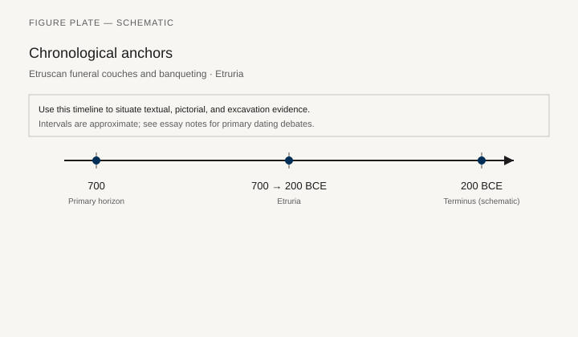
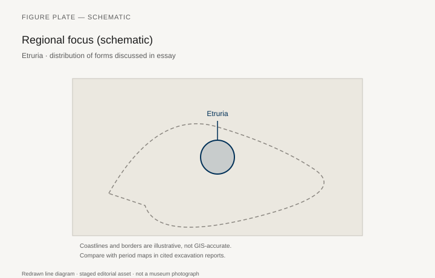
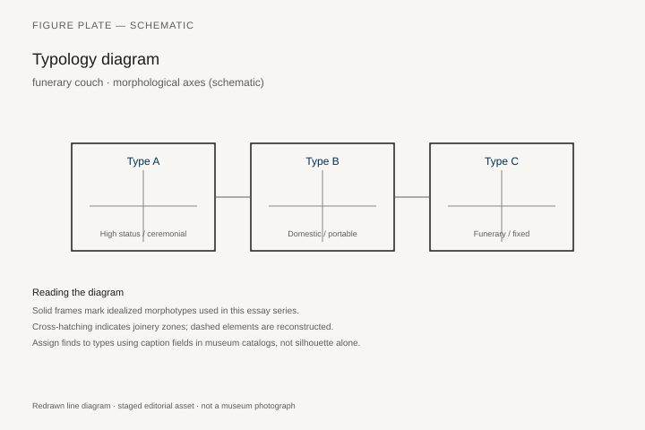
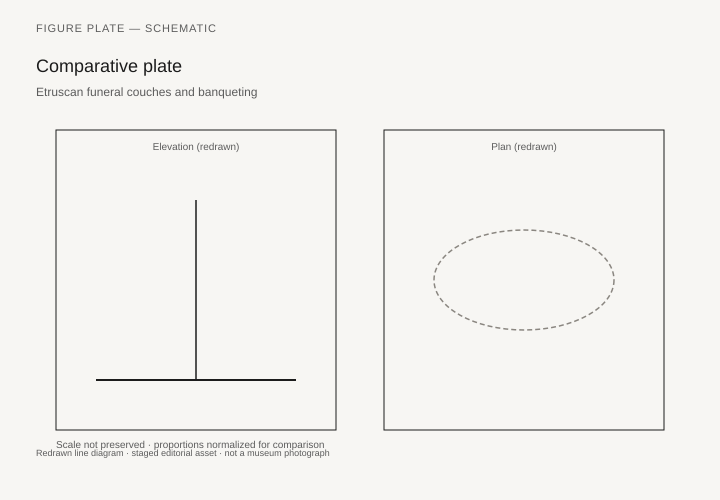

# Banquet Couches of Etruria

The terracotta couple on the lid of the “Sarcophagus of the Spouses” (Louvre Cp 5194, from Cerveteri, late sixth century BCE; a close cousin in the Villa Giulia, Rome) do not sit in chairs. They recline on a couch that is also their coffin lid. Her hand is near his; cushions rise behind them; the banquet goes on in death. Etruscan furniture history begins, for most museum visitors, with that lid. The wood of the living banquet is gone. The tomb furniture — stone and terracotta couches, painted walls full of klinai, a few bronze and wooden remnants from wet burials — is what we have.

Richter’s 1966 chapters on Etruscan furniture still sort the types against the Greek words: throne, stool, couch. The Etruscan difference is not a new joint. It is a different insistence on the couple. Greek symposium vases are a men’s room. Etruscan tomb paintings at Tarquinia (Tomb of the Leopards, Tomb of the Triclinium, Tomb of the Shields) put women on the couches with men, dressed for the occasion, not as hired entertainment. Larissa Bonfante and Sybille Haynes have written the social history; the furniture follows the social history. A couch that holds two named spouses is a different object from a couch that holds two drinking companions.

## Tomb as showroom

Cerveteri’s Banditaccia cemetery and Tarquinia’s Monterozzi necropolis are underground houses. Chairs are carved from the tufa; beds are left as benches; in some tombs a stone throne with a footstool faces the door. The Tomb of the Reliefs at Cerveteri covers the walls with stucco tools, weapons, and household things — a catalog of objects that includes the furniture of a life the dead intended to keep. This is not “influence from Egypt.” It is a local decision to make the grave a room that already knows how to be furnished.

Wooden furniture from Etruscan wet contexts is rare and precious. The few published fragments — turned legs, bronze fittings from Vulci and other sites — suggest a luxury trade with Greece and the Near East and a local turning shop that could match either. `[CITE NEEDED: specific catalog of wooden Etruscan furniture fragments, e.g. from Blera or the Sperandio tomb publications.]` Bronze situlae and cists show banquet scenes in relief that match the paintings: couches, tables, servants, pipers.

The “Etruscan throne” in modern auction language is often a nineteenth-century fantasy. The real high seats are the tufa thrones in tombs and the bronze-fitted ceremonial chairs inferred from fittings. A circular throne type, sometimes linked to later Roman and Italic ritual seats, appears in the literature with more enthusiasm than examples. Stay with the couches. They are the type Etruria finished.

## Banquet and the table

Small tables in the paintings stand in front of the couches, loaded with vessels. They are Greek in idea (*trapeza*) and local in the shape of the legs. The banquet is a sequence of furniture acts: recline, take from the table, give the cup, hear the pipes. The couch’s head end is raised; textiles pile up. A joiner’s drawing would be a frame, slats or webbing, a separate mattress. The painters skip the slats.

Chairs appear for people who are not reclining: attendants, musicians, sometimes a figure in a heavy cloak on a *thronos*. The folding stool is already in Italy, as it was in Egypt and the Levant. Etruscan bronze workshops made furniture fittings — feet, attachments, decorative heads — that Roman houses would still recognize.

## Why the couple matters to a furniture series

A history of furniture that treats the couch as a Greek export with an Italian warehouse will miss the lid in the Louvre. The spouses’ couch is a bed, a dining seat, a tomb, and a public statement about who dines. Roman *lectus* culture (chapter 10) inherits this as much as it inherits Athens. The Roman *triclinium*’s three couches, the rules about who lies where, the later *stibadium*: these are Italian problems with a Greek vocabulary. Etruria is the hinge.

Women on the couch also refuse a simple story about “the ancient chair” as a male honor and “the ancient bed” as a female interior. Here the honor is the couch, and it is shared, at least in the art the families paid for. Whether living banquets always matched the tombs is a question Bonfante does not pretend to close. The furniture type is still the couch for two.

## Bronze, wet wood, and the shops we do not name

Etruscan bronze workshops at Vulci, Tarquinia, and elsewhere made more than mirrors. Furniture feet, attachments in the shape of heads, candelabra that stand beside a couch: these are the surviving hardware of rooms whose planks are gone. A bronze foot in a museum tray is a chair or a table until the catalog says which. Richter sorted many of them. Later excavation reports from wet contexts — Blera, the more recent care with organics — add a few turned legs that match the bronzes’ sockets. `[CITE NEEDED: a specific wet-site Etruscan table leg with a publication.]`

The couple on the Louvre lid eat in death the way the Tarquinia walls eat in paint: cushions, a shared mattress, a small table, a servant with a fan or a strainer. The terracotta is a translation of textiles. Without the textiles the couch is a frame. With them it is a banquet. Museums show the frame and ask the visitor to imagine the rest. The paintings are the better witness to color.

Roman authors later treated Etruscan luxury as a moral warning (as they treated Persian luxury, as they treated their own). That literature is not a catalog. It is a reminder that Italian sitting-to-dine was already old when a Roman senator wrote about it as if it had arrived last Tuesday from Athens.

Chiusi, Orvieto, and the inland cities have their own tomb furniture — stone couches with carved legs, urns that sit on thrones. The coastal paintings have stolen the attention. An inland stone kline is less pretty in a photograph and just as much a seat. The Tomb of the Monkey at Chiusi and the so-called Tomb of the Five Chairs at Cerveteri — terracotta figures on seats in a chamber — keep the chair in the story without replacing the couch as the type Etruria finished.

## After the paintings stop

Hellenistic Etruria and early Rome overlap. Stone funerary couches continue; wooden household furniture becomes, archaeologically, Roman. The next chapter’s Herculaneum beds are the first time this peninsula’s wood speaks at length. When it speaks, it speaks in a language that has already been through Tarquinia: a raised head, a frame, a textile, a room arranged for lying down to eat.

## A wooden throne at Verucchio

The auction-house “Etruscan throne” is usually a fantasy. A real wooden throne exists, and it is earlier than the Louvre couple. In the autumn of 1972 the Superintendency opened tomb 89 in the Lippi necropolis at Verucchio, inland from Rimini: a cremation burial of the last years of the eighth century and the first of the seventh, Villanovan in rite and princely in kit. Among the weapons, amber, and textiles sat a wooden throne with a cylindrical base and a curved back, the interior and exterior of the back engraved with figured scenes — weaving, animals, a community looking at itself. The Civic Archaeological Museum at Verucchio exhibits it. The 2002 volume *Guerriero e sacerdote*, edited by Patrizia von Eles, published the tomb as a talking object: the throne is a text addressed to the living, not a silent seat.

Later campaigns in the same cemetery (2005–2009) found more thrones, not all as ornate. Laura Bentini and colleagues, writing in 2018, placed them in Stephan Steingräber’s *Thronetyp I* and noted that they occur in both male and female graves, of adults and children, in dolium burials and in more elaborate wooden boxes. A throne set on top of a dolium (Lippi 72/2008) or in a lateral niche (Lippi 73/2008, 76/2008, 82/2008) is furniture used as a marker, then buried. Wood analyses in the 89/1972 volume identified the local timbers; the famous back is usually described as poplar or a related pale wood. `[CITE NEEDED: the exact species line in the 2002 wood chapter.]` What matters for this series is simpler. Central Italy had a high-backed wooden seat, carved and incised, a century and more before the terracotta spouses reclined.

The ceramic miniature throne from grave 18 at Olmo Bello, Bisenzio, and the bronze and stone seats from Orientalizing Palestrina and Cerveteri belong to the same family of ideas. Verucchio is the one that kept the tree. Wet, anaerobic sediments under the hill saved organics that the tufa tombs at Cerveteri could not: tables, stools, footrests, chests, boxes, and the wool textiles that made a seat look like a seat. Amber from the Adriatic trade sits in the same graves; Verucchio was a distribution point, and the throne’s neighbors in the case are fibulae and a wool toga, not only weapons. A furniture history that starts Etruria with the Louvre lid has skipped a workshop.

## The Regolini-Galassi bed and Murlo’s terracotta banquet

In 1836, at Cerveteri, the Regolini-Galassi tomb was found intact under a mound forty-eight metres across. The Vatican’s Museo Gregoriano Etrusco still holds the bronze funerary bed from the antechamber (cat. 15052): six hollow-cast bronze feet, a frame of cast bars, a web of metal strips riveted on the diagonal so the surface would give under a body the way leather webbing would. Length 187 cm, width 73, height 38. Date of the deposit: about 675–650 BCE. Around it stood bucchero mourners. Beside it, carts — a chariot, a passenger cart, a heavy cart for a coffin — and the silver of a woman buried in the inner chamber. The bed itself, Maurizio Sannibale and the later Dutch restudy noted, showed no certain human remains. An empty bed in an antechamber can be a display for mourning, a *lectus* for a rite, or a symbol of the marriage bed facing the door. The object will bear all three readings. What it will not bear is the claim that Etruria had no real couches, only paintings of them.

Elizabeth Baughan has compared this bed with other metal klinai, including a bronze example later associated with Lydia. The point of the comparison is construction. Interwoven strips on a bronze frame are a translation of a wooden bed’s cord or leather. When the wood is gone, the bronze remembers the weave.

Poggio Civitate at Murlo, a sixth-century aristocratic complex in the hills south of Siena, never gave us a wooden couch. It gave us terracotta frieze plaques of a banquet: couples reclining, servants, vessels, the same social fact as Tarquinia, in architectural clay, for a standing building. The Antiquarium at Murlo holds the plaques. They are not tomb painting. They are the furniture of a roof, advertising a room that existed in daylight. Haynes and the Murlo excavation literature treat the site as a political house, not a cemetery. The banquet furniture, in other words, was not only for the dead.

Chiusi, inland, carved stone couches with turned-looking legs and seated the dead of an earlier rite on thrones that hold canopic jars. Orvieto’s painted tombs and the François Tomb from Vulci (the originals long removed; the copies still argue) keep the couch in a narrative of war and banquet. The Ficoroni cista from Palestrina, a bronze toilet-box of the fourth century now in the Villa Giulia, is not furniture and still belongs here as a workshop document: Praenestine bronze-workers who could chase a scene could also chase a furniture foot. Richter, in 1966, had already sorted bronze feet and attachments without always being able to say chair, table, or couch. The socket still waits for a wooden member that the tomb did not keep.

The joiner’s name is missing. The shop is not. Turned profiles, bronze sockets, a webbing pattern that bronze can copy, a terracotta couple who know how to share a mattress: these are a trade. When Roman writers later scolded Etruscan luxury they were scolding a furniture habit their own dining rooms had already adopted. The carbonized *lectus* in the next chapter is not a Greek import that skipped Italy. It is what happens when the wood of this peninsula finally survives.

## Notes

- Gisela M. A. Richter, *The Furniture of the Greeks, Etruscans and Romans* (London: Phaidon, 1966).
- Sybille Haynes, *Etruscan Civilization: A Cultural History* (Los Angeles: Getty, 2000).
- Larissa Bonfante, *Etruscan Dress* (Baltimore: Johns Hopkins, 1975; rev. ed. 2003), and essays on couples at banquet.
- Louvre, Sarcophagus of the Spouses, Cp 5194; Museo Nazionale Etrusco di Villa Giulia, companion sarcophagus.
- Stephan Steingräber, *Abundance of Life: Etruscan Wall Painting* (Los Angeles: Getty, 2006), for Tarquinia tombs.
- Patrizia von Eles, ed., *Guerriero e sacerdote: Autorità e comunità nell’età del ferro a Verucchio. La Tomba del Trono* (Florence: All’Insegna del Giglio, 2002).
- Laura Bentini et al., “Wooden thrones: ritual and function in Italian Iron Age,” in the Verucchio conference papers (2018).
- Vatican Museums, Museo Gregoriano Etrusco, Regolini-Galassi funerary bed, cat. 15052.

## Figure plan

*Fig. 1.* Chronological anchors for the evidence discussed below. Schematic redrawn line diagram; staged editorial asset (2026). Not a photograph of a museum object.

*Fig. 2.* Regional focus for circulation and local workshop traditions. Schematic redrawn line diagram; staged editorial asset (2026). Not a photograph of a museum object.

*Fig. 3.* Morphological typology for archaeology (idealized morphotypes). Schematic redrawn line diagram; staged editorial asset (2026). Not a photograph of a museum object.

*Fig. 4.* Comparative elevation and plan plate for archaeology. Schematic redrawn line diagram; staged editorial asset (2026). Not a photograph of a museum object.

### Supplemental photographs and redraws

**Fig. 5.** Sarcophagus of the Spouses.  
Louvre Cp 5194, Cerveteri, late 6th c. BCE, terracotta.  
License: Louvre / Wikimedia PD photographs.  
Alt: Terracotta couple reclining on a couch-shaped sarcophagus lid.  
Caption: The banquet furniture and the coffin are the same object.

**Fig. 6.** Tomb of the Leopards, Tarquinia, banquet wall.  
In situ; Wikimedia CC photographs.  
Alt: Wall painting of couples reclining on couches with small tables.  
Caption: Women on the kline, not beside it.

**Fig. 7.** Tomb of the Reliefs, Cerveteri, interior.  
Wikimedia CC.  
Alt: Tufa tomb chamber with stucco household objects on the walls.  
Caption: A furnished room cut from rock, tools included.

**Fig. 8.** Stone throne or bench, Banditaccia tomb (specify tomb on layout).  
Site photograph.  
License: CC.  
Alt: Chair carved from tufa in a tomb.  
Caption: When the wood was gone, the seat was still worth cutting from the wall.

**Fig. 9.** Bronze banquet cist or situla with couches in relief.  
Villa Giulia or Vatican; confirm inventory.  
License: museum / Wikimedia.  
Alt: Bronze vessel with a small banquet scene.  
Caption: Fittings and vessels keep the couch’s outline when the frame does not.
