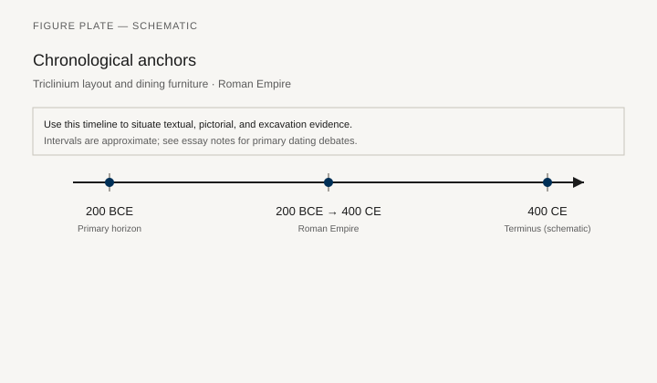
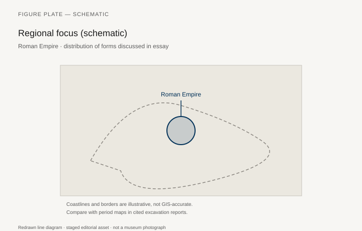
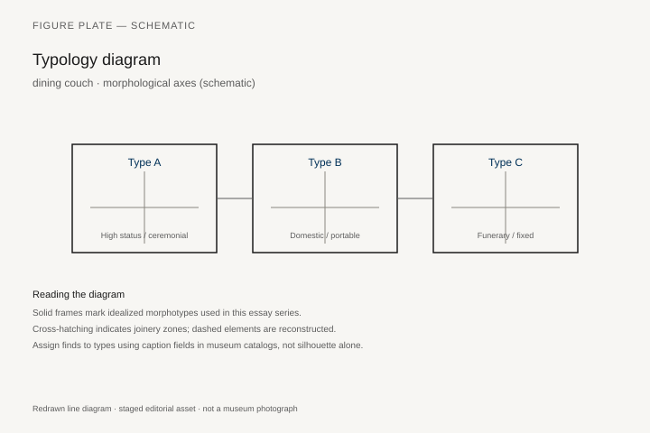
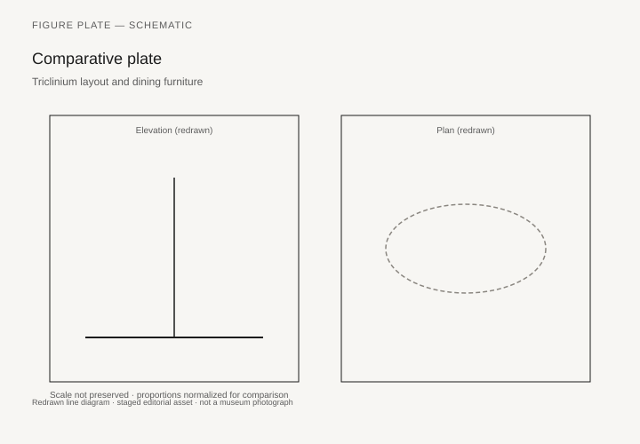

# Furniture on the Frontier

*Fig. 1.* Chronological anchors for the evidence discussed below. Schematic redrawn line diagram; staged editorial asset (2026). Not a photograph of a museum object.

*Fig. 2.* Regional focus for circulation and local workshop traditions. Schematic redrawn line diagram; staged editorial asset (2026). Not a photograph of a museum object.

*Fig. 3.* Morphological typology for dining couch (idealized morphotypes). Schematic redrawn line diagram; staged editorial asset (2026). Not a photograph of a museum object.

*Fig. 4.* Comparative elevation and plan plate for dining couch. Schematic redrawn line diagram; staged editorial asset (2026). Not a photograph of a museum object.

The Simpelveld sarcophagus, found in 1930 in the village of that name in South Limburg and now in the Rijksmuseum van Oudheden, Leiden, is a stone box whose interior walls are carved with a villa’s rooms. A woman reclines on a couch. Cabinets, chairs, and tables stand around her. The sarcophagus is a provincial self-portrait of furniture: not a Campanian carbonized bed, but a northern elite’s idea of what a furnished life looked like, cut in stone so it would last.

Mols used Simpelveld as a hinge between Herculaneum and the Rhine. The types match. The woods do not. Oak and ash, pine and fir, yew where it grows, imported cedar and citrus when a merchant could be paid: the empire’s furniture is a map of forests. Vindolanda’s writing tablets (thin oak and birch) are not furniture, but they are the same craft of splitting and smoothing that makes a leaf of a cupboard door. Waterlogged forts on Hadrian’s Wall and along the German limes have given up stool legs, bench members, and the occasional joint that a dry Italian site would have lost.

## Egypt in the empire

Roman Egypt kept wood the way pharaonic Egypt had: by being dry. Karanis, Hawara, and the Fayum cemeteries produced stools, boxes, and beds that sit in Michigan, London, and Cairo labeled “Graeco-Roman.” Some are Egyptian types in a new paint; some are Mediterranean types in a Nile timber. The folding stool continues. The high bed continues. Portrait boards from mummy wrappings are not furniture, but the same workshops knew how to panel. A provincial furniture history that forgets Roman Egypt will think wood on the frontier is only a northern, wet problem.

The Crimea — the Bosporan kingdom, a client world — has yielded Hellenistic and Roman wooden sarcophagi and, more rarely, furniture fragments from tombs. Mols flags the Crimea as under-used. `[CITE NEEDED: specific published Crimean wooden furniture catalogs, e.g. Kerch / Hermitage.]` Dry and wet both preserve. Politics of excavation and publication decide what a Western reader sees.

## Britain: benches, not thrones

Roman Britain’s wooden furniture is a scatter: waterlogged pieces from Vindolanda, London, and Carlisle; metal fittings from villas; stone bench supports in bath buildings; the picture of a “Roman interior” in mosaic (couches at banquet) that may be a pattern-book Mediterranean more than a Yorkshire dining room. Joanna Bird and others have written the caution. A villa triclinium in the Cotswolds is an architectural aspiration. Whether three wooden couches stood there every winter is a different sentence.

Folding stools and campaign furniture make sense on a frontier. The army moved. Prefects sat. The *sella* of a commander is in the texts; the archaeological stool is a few bronze hinges and a hope. Civilian houses in towns used benches and stools more than the klismos of a vase-painter’s memory. Rank still used a backed chair when it could get one.

## North Africa and the stone couch

In the African provinces, stone and mosaic do more of the talking. The *stibadium* — the curved dining couch of the later empire — appears in architecture and in mosaic (Piazza Armerina in Sicily is the famous villa; African mosaics show the same crescent). Katherine Dunbabin’s work on dining (*The Roman Banquet*, 2003) is the guide. A masonry *stibadium* with a fountain in the middle is furniture built into the house, like Skara Brae’s dresser after a long imperial life. Portable wooden couches still existed; the rich also poured the banquet in concrete.

Carthage, Timgad, and Lepcis have stone benches in public buildings that are civic furniture: sitting as a right of veterans and decurions. The *bisellium* honor is an inscription as much as a seat.

## Vindolanda, London, and the wet north

The Vindolanda tablets made the fort famous for handwriting. The same anaerobic mud keeps stool rails, box parts, and the occasional joint that still shows a tool mark. Publication has favored the tablets, which is fair and frustrating. A furniture historian has to read the wood reports in the back of volumes. London’s Walbrook and waterfront deposits, Carlisle’s wet layers, and the Rhine forts Mols pointed at are the same kind of archive: not a house stopped in a surge, a dump that happens to include a leg.

What those legs show is unsurprising and therefore important. Turned profiles travel. Oak replaces fir. Joints stay Roman. A frontier carpenter had a pattern in his head that Campania would have recognized. He also had a winter that Campania did not, and the textiles — now gone — would have been thicker. A northern *lectus* without its blankets is a skeleton.

Mosaics in British villas that show banquets are pattern-book Mediterranean more often than Yorkshire reportage. A couch in tesserae is a wish. The Simpelveld stone woman is closer to a portrait of furniture because the carver was making a room for a specific dead person, not decorating a floor with a fashionable scene.

Karanis, again, is the dry corrective: a provincial town in Egypt where wood and basketwork lasted. The Kelsey Museum’s house reconstructions put stools back in rooms that also had grain and tax receipts. A frontier is not only a wall in Britain. It is any place the empire’s types met a local timber and a local floor.

## What “Roman” means on a table leg

A turned leg with a baluster profile, a bronze lion paw, a bone hinge, a lock plate with a maker’s name: these travel. Local taste shows in timber, in the height of a bed (colder floors, more textiles), in the presence or absence of a cupboard. The koine is real. So is the oak bench that never saw Campania.

Late antique changes — the rise of the chair in Christian assembly, the bishop’s *cathedra*, the still-reclining banquet in some mosaics — belong to the next chapter. On the frontier in the second century the old kit still works: couch, stool, cupboard, small table. Simpelveld’s woman knows that kit. She had it cut around her body so that no fire and no damp could take the picture.

## A cupboard in a Rhine cabin

In 2003, at Vleuten-De Meern near Utrecht, a Roman river barge was lifted from a silted branch of the Rhine. De Meern 1 had wrecked around 190 CE while still in use. The cabin came up intact. Inside it Mols studied a cupboard, a chest, and part of a bed. The cupboard stands about 72–73 cm high, two doors, four internal compartments. The left door was found closed, the right open. Framing on the doors is a moulding, not a true frame-and-panel. Hinges are metal, nailed through and bent over at the back — a shipwright’s habit. The chest is 132 cm long and probably doubled as a bench. The bed legs are turned and nailed, the nails bent again. All three pieces reuse older wood. Visible faces were finished; hidden faces were not. Museum Hoge Woerd now shows the ship.

Mols’s point is not that a sailor made clumsy furniture. It is that a man with a ship’s toolkit — recovered with the wreck, and striking for the absence of a moulding plane — made objects that still look Roman from the front. The bent nail is his signature, common on ships, rare in the Campanian cabinet. The types match Herculaneum and the Simpelveld couch: cupboard, chest-bench, turned legs. The woods do not. The cupboard’s frame includes field maple (*Acer campestre*, “Spaanse aak” in the Dutch reports), oak in the floor and sides, alder shelves, ash in a moulding that may be a repair, beech in a divider and the back. `[CITE NEEDED: confirm every species against the Woodan / Jansma report if a caption uses them.]` A Rhine carpenter used what the river and the salvage pile offered.

Simpelveld itself is later than a casual reader thinks and more specific than a postcard. Andreas Wierts found the sandstone cist in 1930 while building on Stampstraat; the Rijksmuseum van Oudheden bought it that December (inv. l 1930/12.1). Date: about 150–175 CE. Dimensions: 228 by 111 cm, 73 cm high. The woman, middle-aged, is shown on a couch in a room of wooden furniture — paneled cupboard, chest with a lock, tables, racks of vessels. No marble tables. No bronze showpieces. Mols reads that absence as a choice: the carver inventoried the daily room, not the atrium’s prestige kit. A villa excavated in 1937 near the find-spot is the obvious house; it is still a guess. Leiden restored the cist in 2020–21. A replica stands in Heerlen.

Vindolanda’s Wooden Underworld gallery now puts the fort’s oak and birch in public: furniture fragments, boxes, bowls, barrels stamped with makers’ marks, a toilet seat that has done more for the site’s fame than any stool rail. The tablets remain the headline. The same anaerobic floors produced both. London’s Walbrook and the Bloomberg site, Carlisle’s wet layers, and the German limes forts are the same class of archive: a dump or a waterlogged floor, not a surge. Joanna Bird’s caution on mosaic banquets still holds. A couch in tesserae at a Cotswold villa is a pattern-book wish until a joint turns up in the ditch. Fishbourne’s palace mosaics and the London Bloomberg waterlogged floors are the same split: a beautiful floor, a few oak fragments, and a long gap between them.

## Shale, desert beds, and the Crimean gap

Mols notes a fourth material that handbooks skip: Kimmeridge shale, the bituminous rock of the Dorset coast, cut into table legs and other furniture whose shapes follow the wooden types. The British Museum and Dorset museums hold the pieces. They are provincial in stone the way Simpelveld is provincial in sandstone: the empire’s profiles, a local block.

Roman Egypt remains the dry archive. The University of Michigan excavations at Karanis in the 1920s and 1930s filled the Kelsey Museum with stools, boxes, beds, and the basketwork that did the work of drawers. Elaine Gazda’s 1983 volume is still the public door. Hawara, under Flinders Petrie, produced the mummy portraits that made the Fayum famous and, in the same cemeteries, boxed and turned wood that catalogs still file as “Graeco-Roman” without always saying which workshop habit — Egyptian bed, Mediterranean stool — is in the object. The folding stool does not die. The high bed does not die. Portrait boards are not furniture; the shops that paneled them knew how to panel a chest. `[CITE NEEDED: a Kelsey or BM accession for one published Karanis stool or bed used in the figure list.]`

The Crimea is the other dry-and-sometimes-wet archive. Hellenistic and Roman wooden sarcophagi from the Kerch peninsula sit in the Hermitage; Mikhail Rostovtzeff published some of the painted tombs and their furniture-shaped coffins. Household furniture fragments are scarcer in the Western literature. Mols flagged the gap more than a decade ago. It has not closed in English. A chapter that pretends to cover “the provinces” while using only Britain and Tunisia is repeating a library accident.

North Africa speaks in mosaic and masonry. Dunbabin’s *The Roman Banquet* tracks the *stibadium* from outdoor masonry crescents (already in first-century Pompeii, House VIII.3.15; Hadrian’s Villa at the Canopus) into the indoor triconch halls of the fourth century. Piazza Armerina’s Villa Romana del Casale, late third or early fourth century, sets as many as three *sigmata* around one floor. A Carthaginian mosaic of the late fourth century, the one Dunbabin and Horst Blanck have worried over, shows diners sitting on benches — a Western shift toward sitting that the Eastern Mediterranean was slower to make. Wooden couches still existed. The rich also poured the banquet into the house. Timgad, Lepcis, and Carthage keep stone benches whose inscriptions name the *bisellium* as a right. Civic furniture is a sentence in Latin. The wood of the theatre seat is gone.

What “Roman” means on a table leg, after this tour, is a profile and a joint, not a passport. The De Meern cupboard wants to look like Herculaneum. Its nails admit it was built in a cabin. Simpelveld’s woman had that kit cut around her so that neither fire nor the river could take the picture. The next chapter will watch the chair rise in a church. On the frontier in the second century the old kit still works.

## Notes

- Stephan Mols, “Ancient Roman Household Furniture and Its Use: From Herculaneum to the Rhine,” *Anales de prehistoria y arqueología* 27–28 (2011–12).
- Rijksmuseum van Oudheden, Simpelveld sarcophagus.
- Katherine M. D. Dunbabin, *The Roman Banquet: Images of Conviviality* (Cambridge: Cambridge University Press, 2003).
- Vindolanda Trust publications on wood (tablets and objects).
- Elaine K. Gazda, ed., *Karanis: An Egyptian Town in Roman Times* (Ann Arbor: Kelsey Museum, 1983), for provincial Egyptian interiors.
- Stephan Mols, “Meubilair uit de roef,” in the De Meern 1 excavation report (Amersfoort, 2007); Museum Hoge Woerd for the displayed ship.
- Rijksmuseum van Oudheden, Simpelveld cist, inv. l 1930/12.1.
- On Kimmeridge shale furniture: British Museum provincial catalogs; Mols 2011–12.

## Figure plan

**Fig. 1.** Simpelveld sarcophagus, interior relief with couch.  
Rijksmuseum van Oudheden, Leiden.  
License: museum; Wikimedia if a CC file exists.  
Alt: Stone interior carved with a reclining woman and household furniture.  
Caption: A northern villa’s furniture, inventoried in stone.

**Fig. 2.** Waterlogged wooden stool or bench member, Vindolanda or London.  
Vindolanda Trust / Museum of London.  
License: institution.  
Alt: Dark oak furniture fragment with a joint visible.  
Caption: Oak instead of Campanian fir; the joint is still Roman.

**Fig. 3.** Graeco-Roman stool or bed from Karanis or Hawara.  
Kelsey Museum or British Museum.  
License: as marked; BM CC BY-NC-SA if BM.  
Alt: Dry-preserved wooden stool from Roman Egypt.  
Caption: The desert kept working after the pharaohs.

**Fig. 4.** Mosaic of a *stibadium* banquet (Piazza Armerina or African museum).  
Wikimedia CC.  
Alt: Mosaic of diners on a crescent couch.  
Caption: In the later empire the dining seat can be masonry.

**Fig. 5.** Bronze furniture fitting from a British or German villa (lion paw or hinge).  
British Museum or Römisch-Germanisches Museum.  
License: as marked.  
Alt: Small bronze paw or lock plate.  
Caption: Fittings travel farther than frames.

**Fig. 6.** Inscription recording a *bisellium* (e.g. from Pompeii or a provincial theatre).  
Wikimedia PD squeeze or stone.  
Alt: Latin inscription mentioning a seat of honor.  
Caption: Sometimes the furniture is a right, named in stone, and the wood is gone.
