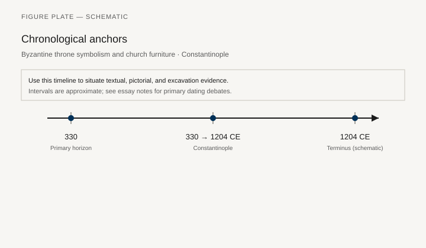
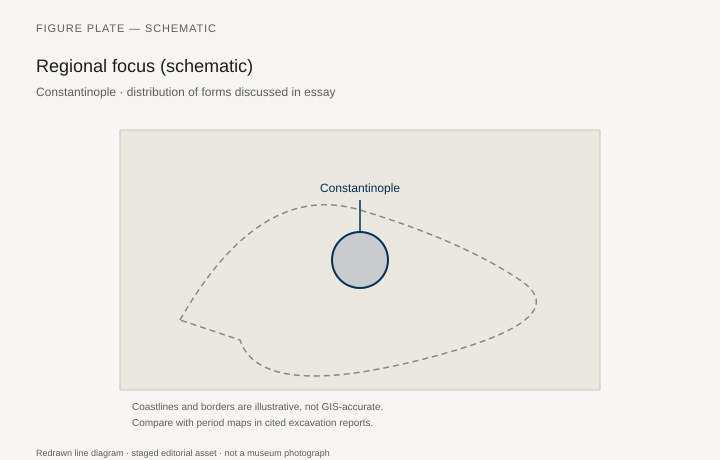
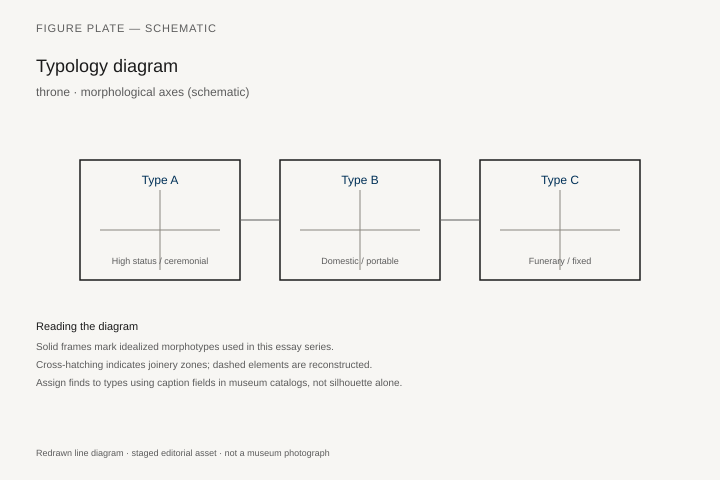
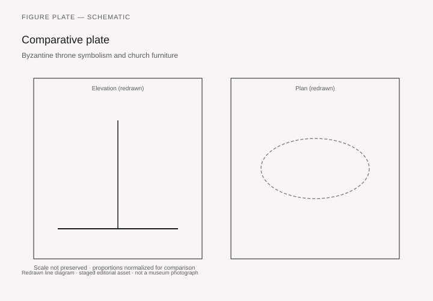

# Ivory Thrones After Rome

*Fig. 1.* Chronological anchors for the evidence discussed below. Schematic redrawn line diagram; staged editorial asset (2026). Not a photograph of a museum object.

*Fig. 2.* Regional focus for circulation and local workshop traditions. Schematic redrawn line diagram; staged editorial asset (2026). Not a photograph of a museum object.

*Fig. 3.* Morphological typology for throne (idealized morphotypes). Schematic redrawn line diagram; staged editorial asset (2026). Not a photograph of a museum object.

*Fig. 4.* Comparative elevation and plan plate for throne. Schematic redrawn line diagram; staged editorial asset (2026). Not a photograph of a museum object.

The Throne of Maximian in Ravenna (Museo Arcivescovile) is a sixth-century chair sheathed in ivory panels: Joseph stories, John the Baptist, vines, the monogram of a bishop. It is a *cathedra* in the new sense — the seat of a Christian teacher — built with the old materials of a consular diptych. Late antique furniture does not invent the chair. It changes who faces the room from one.

The consular diptychs themselves (ivory plaques issued by consuls in the fifth and sixth centuries, now in the V&A, the Louvre, the Met, and other cabinets) show the magistrate in a *sella curulis* or on a throne, a footstool under the feet, attendants and games below. They are furniture pictures issued as gifts. Anthony Cutler’s work on ivory (*The Craft of Ivory*, 1985; later papers) is the technical companion: how a tusk becomes a throne’s skin, how workshops in Constantinople and the West shared a language.

## From lectus to assembly

Banquets continue. Dunbabin’s late mosaics still show the *stibadium*. But the new public room is the church, and the church’s furniture is a problem of visibility and hierarchy: the bishop’s chair, the synthronon (benches for clergy in the apse), the ambo, the chancel screens, the later iconostasis that is architecture more than a chair. Wooden tables for the Eucharist are documented and almost never survive. Stone altars do. A furniture history of Christianity that only lists thrones will miss the table; a history that only lists altars will miss the fact that a bishop sits.

The *cathedra* in a basilica is often masonry, a seat built into the apse, sometimes with a mosaic behind it (Ravenna’s other churches). Maximian’s ivory chair is portable prestige in a world that still understood ivory as the skin of office. Whether it was sat on every Sunday or reserved for ceremony is a local question. It was made to be seen.

## Households in the new capitals

Constantinople’s wooden furniture is a textual subject. Book of Ceremonies, saints’ lives, and a few manuscript illuminations show couches, tables, and curtains. The physical city has burned and been rebuilt too often for a Herculaneum. What survives in museums as “Byzantine furniture” is often a later monastic chest, a Coptic stool from Egypt, or a fragment of inlay. Coptic Egypt is the dry exception again: painted boxes, stools, and the continuation of Nile joinery under Christian images. The Brooklyn Museum and the Coptic Museum in Cairo hold the types. `[CITE NEEDED: specific Coptic stool accession for the figure list.]`

Silver *missoria* and household plate show dining without always showing the table. Textiles — the real luxury of a late antique room — are in the textile catalogs, not the furniture catalogs. A Byzantine interior is curtains and cushions as much as wood. The floor may be mosaic; the seat may be a piled textile on a low wooden frame.

## The folding stool’s last politics

The *sella curulis* dies as a republican honor and lives as an image. Barbarian and early medieval kings in the West sit on chairs that want to look Roman, or on benches that do not care. The iron folding stools of migration-period graves (a few published examples from Frankish and Alamannic contexts) are the sad, practical heirs of the curule. `[CITE NEEDED: a specific grave with a folding stool, e.g. from the Rhineland.]` Byzantium keeps the jeweled throne as an imperial object (the later “Throne of Solomon” stories, the mechanical thrones in Liudprand of Cremona’s offended description of Constantine VII’s court). Liudprand’s lions and rising seat are a tenth-century theatre. They are also evidence that a throne could be a machine.

## Ravenna, Constantinople, and the Coptic exception

Ravenna keeps Maximian’s chair because a treasury kept it. Constantinople kept mechanical thrones that Liudprand found offensive and that we know from his irritation: lions, rising seats, a theatre of gold. Whether every gear he describes existed as he says is a problem for Byzantinists. The useful fact for furniture is that a tenth-century court still thought a throne could move by itself, and that a Western bishop would write the scene down as a trick. A chair that rises is a claim about a king who does not stand to greet you.

Coptic Egypt, dry again, keeps painted boxes, stools, and the continuation of Nile joinery under crosses and saints. The Brooklyn Museum and the Coptic Museum in Cairo are the addresses. A “Byzantine stool” in a Western catalog is often one of these: Egyptian wood, Christian paint, a Mediterranean joint. Caption the find-spot.

Household sitting in the new capitals, as far as texts allow, is still a mix of couches and cushions. The church did not abolish the *stibadium* overnight. Dunbabin’s late mosaics show the crescent couch in Christian houses. The bishop’s *cathedra* and the dining couch lived in the same centuries. A furniture history that treats conversion as a style break will invent a clean line the rooms did not have.

Silver plate and curtains did more visual work than wood in a rich Constantinopolitan room. The furniture catalogs of our museums are biased toward what treasuries saved (ivory) and what deserts saved (Coptic wood). The lost middle is textile.

## Why this chapter is short on wood and long on ivory

Because ivory survived in treasuries and wood did not. The same bias will haunt the medieval West until choir stalls and chests become too big to ignore. Late antiquity is the first period in this series when the Christian church is a major furniture patron. The next chapters split: oak halls and stalls in Latin Europe; minbars and *rahle*s in the Islamic world. Both inherit late antique woodwork — vine scrolls, arched panels, the idea of a raised seat for a speaker — without remaining “Roman.”

Maximian’s chair is the object to keep. It is a bishop’s *klismos* after the klismos, a *thronos* after the magistrates, a tusk after Nimrud, in a city that still thought of itself as Roman.

## How a tusk becomes a chair

Maximian’s chair is wood underneath. The ivory is a skin. Twenty-six panels were planned: ten on the armrests with the Joseph cycle; a front with the four Evangelists and John the Baptist holding the Lamb, the monogram of Maximianus above; and a back of Christ scenes of which nine panels are now missing. Height about 150 cm, width about 65. The vines in the frames are the old Mediterranean furniture language — the same family of scroll that will run on a minbar and a choir-stall standard. The workshop is argued. Constantinople has the quality of the cutting and the court that could ship a bishop a throne. Alexandria has the iconography: the Virgin on a mattress, not a Western chair, in the Nativity; Salome the midwife; the spinning Virgin of the Annunciation, a type whose closest cousins are Coptic. Cutler’s *Craft of Ivory* is the technical book: how a tusk is split, how a panel is thinned, how a workshop that also made diptychs could sheath a chair. The argument about city will not be settled by a magazine paragraph. The useful fact is that a bishop in Ravenna, consecrator of San Vitale and Sant’Apollinare in Classe (546–556), sat — or was seen to own — a chair made in the Greek East and read like a book. In San Vitale’s mosaic he stands named, in vestments, beside Justinian; the ivory chair is the other portrait, portable, and still in the palace museum a few streets away.

The consular diptychs are the chair’s cousins issued as gifts. Anastasius, Justinian, Boethius, Magnus: two leaves of ivory, the magistrate on a *sella curulis* or a high-backed seat, footstool under the feet, games and bags of coin below. The V&A, the Cabinet des Médailles, the Louvre, and the Met hold the famous ones. They are furniture pictures. They taught later ivory-cutters, and later furniture historians, what a seat of office looked like when the wood was already gone.

A basilica’s everyday *cathedra* was often masonry, built into the apse, a synthronon of stepped benches for clergy around it. Hagia Irene in Istanbul still shows the stone idea. Ravenna’s other churches show the mosaic behind the seat. Hagia Sophia’s synthronon is mostly a memory in the apse; the marble went to later builders. What remains in Istanbul is enough to see that clergy furniture could be a stair. Wooden altar tables are in the texts and almost never in the treasury. Stone altars took their job. The ambo is a raised voice in marble or wood; the later iconostasis is a wall. Church furniture is a problem of who is seen. Maximian’s ivory solution is portable prestige. The masonry solution is a seat that cannot be stolen without taking the wall.

## Dagobert’s stool, Hessigheim, and the western curule

The old need for a named migration-period folding stool can be partly retired. An iron folding stool from grave 75 in the Muckenloch cemetery at Hessigheim, Kreis Ludwigsburg, is in the Archäologisches Landesmuseum Baden-Württemberg. It was found in a robbed chamber grave of a woman, near the head and upper body. The museum’s note is careful: north of the Alps, folding stools in graves are almost always in richly furnished women’s burials; most are wood with an iron axle; all-iron stools are treated as imports from Romano-Byzantine shops. A Bavarian woman’s grave of the seventh century, discussed in the same literature, holds another. There are not thirty early medieval folding chairs in Europe. They are rare, gendered in the ground in a way the texts do not explain, and politically loud: a portable seat of the old curule type, buried when the republic that invented the honor was already a schoolbook.

The so-called Throne of Dagobert is the Western celebrity of the type. Bronze, a curule X, traditionally linked to Dagobert I and the treasury of Saint-Denis, now associated with the Cabinet des Médailles. The folding stool is the early part, often placed in the seventh century. The back and arms are later, usually called ninth-century, and they stop the stool from folding. A king gained a back and lost a campaign seat. Charlemagne’s stone throne at Aachen is a different claim: not a fold, a block. Liudprand of Cremona, at Constantinople in 968, described the Magnaura’s mechanical throne — lions, rising seat — in the *Relatio de legatione Constantinopolitana*. He thought it a trick. A furniture historian can use the irritation without taking every gear as a measured drawing. A tenth-century court still wanted a chair that moved by itself. A Western bishop wrote the scene down because the chair had done political work.

Coptic Egypt remains the household archive. Painted boxes and stools in Brooklyn and in the Coptic Museum, Cairo, continue Nile joinery under Christian paint. Doors from the Church of Sitt Barbara and the hanging church in Old Cairo are architecture, and they are also the furniture of a sanctuary: wood as a screen, the same job a chancel barrier does in a Latin choir. `[CITE NEEDED: one Brooklyn painted box or stool accession for the figure list.]` Caption the find-spot. A “Byzantine stool” without a place is often an Egyptian one.

Manuscripts fill the lost wood. Evangelists sit on thrones with cushions and footstools in tenth-century Gospel books; the painter still knows the footstool when the joiner’s name is gone. The Rossano Gospels and the Vienna Genesis, earlier, already treat the seat as a gold idea with a cushion, not as a measured frame. The Book of Ceremonies, compiled under Constantine VII, inventories couches, curtains, and the etiquette of who sits. Processions in that book are furniture cues: which couch is dressed, which curtain is pulled, who may approach the footstool. The *De cerimoniis* is not a joiner’s manual; it is still a list of objects that had to be in the room. Silver *missoria* show the dinner and skip the table. The missing middle of a Constantinopolitan room is textile. Ivory survived in treasuries. Wood survived in Egypt. The oak hall and the minbar, in the next chapters, inherit the raised wooden place for a voice without remaining Roman. Maximian’s chair is still the object to keep: a tusk after Nimrud, a *cathedra* after the magistrates, in a city that still called itself Rome.

## Notes

- Anthony Cutler, *The Craft of Ivory* (Washington, D.C.: Dumbarton Oaks, 1985).
- Museo Arcivescovile, Ravenna, Throne of Maximian.
- Katherine Dunbabin, *The Roman Banquet* (Cambridge, 2003), late chapters.
- Liudprand of Cremona, *Antapodosis* / *Relatio de legatione Constantinopolitana*, on the mechanical throne — literature, not a workshop manual.
- John Lowden, *Early Christian and Byzantine Art* (London: Phaidon, 1997), for church interiors.
- Archäologisches Landesmuseum Baden-Württemberg, iron folding stool from Hessigheim, Grab 75, Muckenloch.
- Cabinet des Médailles, “Throne of Dagobert,” bronze curule seat from the Saint-Denis treasury.

## Figure plan

**Fig. 1.** Throne of Maximian, Ravenna.  
Museo Arcivescovile. Ivory on wood, 6th century.  
License: museum; Wikimedia photographs, check terms.  
Alt: High-backed chair covered in carved ivory panels.  
Caption: A bishop’s seat in the material of consuls.

**Fig. 2.** Consular diptych (e.g. Anastasius or Justinian, V&A or Cabinet des Médailles).  
V&A or BnF.  
License: as marked.  
Alt: Ivory plaque of a consul on a throne or curule stool.  
Caption: Furniture issued as a gift, in two leaves.

**Fig. 3.** Synthronon, Hagia Irene or a surviving apse bench.  
Istanbul, site photograph.  
License: Wikimedia CC.  
Alt: Stepped stone benches in an apse.  
Caption: Clergy furniture built into the wall.

**Fig. 4.** Coptic painted box or stool.  
Brooklyn Museum or Coptic Museum — confirm ID.  
License: museum Open Access if Brooklyn.  
Alt: Wooden box with Christian painting.  
Caption: Dry Egypt, again, keeps the household.

**Fig. 5.** Manuscript illumination of an emperor or evangelist on a throne (e.g. a 10th-c. Gospel book).  
BnF or BL, PD if date allows.  
Alt: Painted gold throne with a cushion and footstool.  
Caption: When the wood is gone, the painter still knows the footstool.
