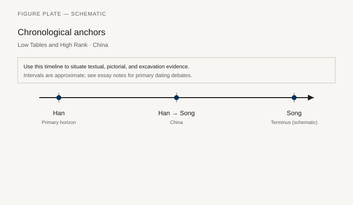
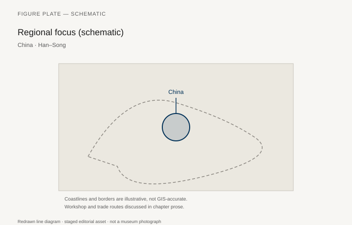
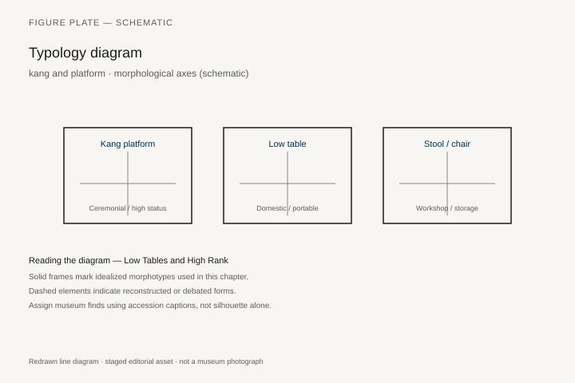
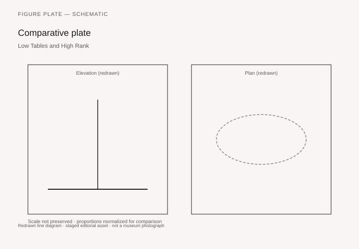

# Low Tables and High Rank

A Han tomb can hold a low lacquer table, a screened couch, and a set of mats, and still be called, in older Western books, a house “without chairs.” The sentence is wrong twice. China had raised seats early — the *zuo* of ritual texts, the mat grades of the classics — and it had, by the Tang, the folding stool and the high chair that would become, in the Ming, a hardwood philosophy. This chapter stays below the Ming *huanghuali* line (chapter 19) and asks what a room was when the floor was still the main seat.

Sarah Handler’s *Austere Luminosity of Chinese Classical Furniture* (2001) and Wang Shixiang’s catalogs are Ming-facing. For earlier periods the evidence is tomb furniture, murals, and a few lacquer pieces from waterlogged or sealed graves. The Mawangdui tombs at Changsha (early Western Han, excavated 1972–74) remain the richest published household: lacquer dishes, low tables, screens, a complete textile world. The furniture is low because the sitters were low. Rank was a mat, a screen, a table height, not yet a yoke-back chair.

## Mat, screen, couch

The mat (*xi*, *yan*) is furniture. So is the screen that stops a draft and makes a room inside a room. The couch (*ta*, later *chuang*) is a raised platform for sitting and lying, a cousin of the Çatalhöyük idea with lacquer and joinery instead of plaster. In murals of the Northern Wei and Tang, a couch can hold a group; a low table (*an*, *ji*) sits on it or in front of it. Eating, writing, and display happen at heights that later dining chairs would call “wrong.”

Mawangdui Tomb 1, the burial of Xin Zhui, Lady Dai, is the room a reader can still furnish from objects. She died about 168 BCE. Her husband’s tomb (Li Cang, Marquis of Dai, Tomb 2) and their son’s (Tomb 3, closed in 168 BCE) complete the household. Among more than seven hundred lacquer pieces, the painted wooden-body table from Tomb 1 is a low rectangle cut from a single timber: about 60.2 by 40 centimeters, 5 centimeters high, a raised lip to keep dishes from sliding, four small bracket feet. The underside is inscribed in red: 轪侯家, “household of the Marquis of Dai.” Bamboo slips in the tomb give a length and width that convert to nearly the same numbers. When the table was lifted, five small dishes, an eared cup, two *zhi*, a meat skewer, and a pair of chopsticks were still on it. One dish held food residue. The Hunan museum’s label is blunt enough: nobles ate from individual trays. A separate tray sat in front of each person. That is a dining system, not the absence of one.

The north chamber of Tomb 1 was laid out as a dining room, with servant figurines, musicians, and the tray. A double-layered cosmetic box from Tomb 3 — lacquer over wood, clouds outlined in white on a black ground, a bronze mirror in the lower layer — has been lent to the Met for exhibition. Among more than five hundred lacquers from the site, only a few were painted in oil-bound mineral pigments this way. The Met’s own Eastern Han set of seven nested boxes (1994.10.1a, b–.7a, b), black lacquer with silver foil, purchased with Irving money, is the later shop chemistry in a New York case: thin cores, a putty coat, a large round box that once held the set. The Freer and the Met hold early cups and boxes that teach the standard of a Han shop. A furniture series that waits for “classical hardwood” will miss this chemistry.

Buddhist furniture — the lion throne, the high seat of a teacher — enters with the religion and with Central Asian and Indian images. A monk on a raised seat is a different politics of sitting than a Han official on a mat. The two systems live together for centuries. Craig Clunas, in *Superfluous Things* (1991) and later essays, is mostly Ming; his caution about treating later hardwood taste as timeless China applies backward. Do not read a 17th-century *huanghuali* chair into a Tang mural.

## Before the Han: lacquer already, bronze already

The Marquis Yi of Zeng, buried about 433 BCE at Leigudun, Suizhou, left a tomb whose lacquered wood is a furniture chapter of its own. The Hubei Provincial Museum holds the nested coffins, the stands, the low tables, the drum on a bird-and-tiger base. The famous bells get the postcards. The tables are the household. They are already low, already lacquered, already a dining and ritual height for people who sit on mats or on a platform. Zhongshan, a generation later, answers in metal. The tomb of King Cuo at Pingshan, Hebei, late fourth century BCE, produced a bronze table whose frame is four dragons and four phoenixes: a stand that is sculpture and furniture at once. `[CITE NEEDED: current Hebei museum inventory number for the Cuo table.]` Neither find is “proto-Ming.” Both are proof that a raised surface for vessels existed long before anyone needed a yoke-back.

Handler’s type chapters are still useful here if they are read against the grain. She sorts *an* and *ji*, the screened couch, the later *kang* table. The Han versions are shorter and more perishable. What survives is the sealed grave and the waterlogged pit. What does not survive is the bamboo and cane majority — everyday, regional, hard to date. They always were. The hardwood chapter will be a chapter about a minority of objects that survived because collectors wanted them.

## Heated platforms before the mature kang

The brick **kang** of North China — sleeping platform linked to a stove flue — is a late mature form. The Han–Song window in this chapter tracks **antecedents**: pounded-clay sleeping surfaces, stove-linked warm benches, and architecture that already ducted heat through walls. Calling every warm platform a “kang” would collapse two millennia of experiment; the distinction matters for any furniture history that treats the floor as furniture.

Neolithic and early sites in the northeast record **direct-fired clay beds** (open fire on a pounded surface, ashes cleared before sleep). Han dynasty ruins summarized in Chinese archaeological press describe **kitchen ranges with discharge flues** beside bathing spaces — heat and smoke routed on purpose, architectural cousins to Roman hypocaust logic and Korean *jjokgudeul*, not identical copies. Western Han evidence tightened when excavators published a kang-like platform from **Dongheishan**, Xushui County, Hebei — a multi-period mound with an early Western Han heated surface that pushed documented flue-platform history earlier than some textbook timelines.

Typology here contrasts **open-fired clay bed**, **single-flue bench/platform**, and **mat-on-floor summer habit** — behaviors as much as objects. Han lacquer platform beds in tombs belong to a parallel track: portable prestige furniture versus immovable heat architecture. Museum dioramas that show a family on a mature Qing-era kang should not be read backward into the Han without citing the excavation that proves flues under the sleeping surface.

## The folding stool and the coming of the chair

The folding stool (*huchuang*, “barbarian bed/seat”) is associated in the texts with northern and western usage and with military camps. It is the old Egyptian–West Asian traveler’s seat arriving, again, with people who ride. Eastern Han and Wei-Jin notices treat it as a foreign convenience that officials also wanted. By the Tang it is at home. High chairs with backs appear in Tang and Song paintings of officials and scholars. The Song academy’s pictures of domestic interiors — a chair here, a low table there — show a mixed room, not a sudden conversion.

Dunhuang caves and the tomb murals of the Chang’an hinterland (Princess Yongtai, 706; a run of late seventh- and eighth-century chambers around Xi’an) put sitters on couches, on stools, and, increasingly, on chairs with backs. Northern Qi already knew the mix: the tomb of Xu Xianxiu (571) at Taiyuan paints a household that is not a mat-only room. Why the high chair spread is a social argument: clothing (the chair suits certain robes), status display, architectural change (higher furniture in higher rooms), the prestige of a “foreign” seat that became Chinese. None of these has to be the only cause. The archaeological lag is real: paintings lead; surviving wooden chairs of the Song are almost absent.

One pre-Ming wooden chair that is not a painting sits in a Liao tomb. Yemaotai Tomb 7, Faku County, Liaoning, excavated in 1974, is an early Liao brick tomb, probably before Shengzong (r. 983–1031), unrobbed. In the main chamber, beside a wooden house-shaped coffin shelter (a *guanchuang xiaozhang* whose joinery Nancy Steinhardt has matched to a form in Li Jie’s *Yingzao fashi*), the excavators found a wooden table and a wooden chair. The chair had a woven rope seat. A set of *shuanglu* (backgammon) sat on it. The table held lacquer bowls, a glass-rimmed dish, an agate cup; two white porcelain ewers stood underneath. Liaoning Provincial Museum, Shenyang, reconstructed the cypress-bark house for display. The two silk paintings from the same tomb — *Meeting for Weiqi in the Mountain* and *Bamboo, Sparrows and a Pair of Rabbits* — got the art-historical attention. The chair is the news for this series. It is not a Ming yoke-back. It is a dated wooden seat with a textile sitting surface, in a Khitan-period tomb that used Chinese burial furniture without being a Song studio.

## What a painting will swear to

The Palace Museum’s *Night Revels of Han Xizai*, a Song copy after a composition associated with Gu Hongzhong and the Southern Tang court, is a furniture document disguised as gossip. The minister sits, listens to a pipa, plays a drum, rests on a bed, watches five women with flutes. Screens divide the night into rooms. The musicians sit on chairs. A modern caption sometimes says that Tang musicians sat on mats and that the chairs prove a later date. The safer sentence is the one the scroll will actually support: by the time this copy was painted, a banquet of this rank used chairs, couches, and screens together. No one in the painting smiles. The furniture is not festive. It is a set of positions for watching and being watched.

Zhang Zeduan’s *Along the River During the Qingming Festival*, also in the Palace Museum, is a street catalog: shop counters, benches, the low furniture of a city that sold food at the height of a stool. Rural and urban sitting were never one system. A scholar’s studio in a Song album leaf — a high chair, a low table, a painting hung or rolled — is an elite room. The stall in the same city is another. Handler and Tian Jiaqing, when they discuss the *huchuang*, are describing a type that paintings and texts made famous and that wood almost never kept.

## Ritual law of the mat

Ritual texts grade mats and positions. Who sits facing whom, who is on which layer of mat, who may use a stool: these are furniture laws. The *Liji* and the older ceremonial books are not excavation reports. They are prescriptions that a Han household could fail. A history of Chinese furniture that begins with a 17th-century armchair and a poem about simplicity skips the part where sitting was already an ethic. The Ming chair inherits that ethic and changes its height.

The screened couch is the Han and Tang form of that ethic made architectural. A screen at the head or back of a *ta* marks the honorable side. Guests are placed. The low table on the couch is not a coffee table *avant la lettre*. It is a surface for the person who has already been seated correctly. Tomb inventories list screens with the same seriousness they list food. Mawangdui’s painted silk and the wooden screen fragments from other Han burials are the three-dimensional proof.

## Lacquer as structure

Lacquer is not only a finish. On a Han table it is a skin that also stiffens and seals. Later carved lacquer (*diaoqi*) and filled lacquer will become furniture surfaces in their own right, especially in the Ming and Qing, sometimes over a modest wood. The Mawangdui project directed by Chen Jianming (2008–14) sorted the site’s lacquer, wood, and bamboo as a single craft problem. That is the right grouping. A table, a box, a coffin, a cup: the same shop chemistry, different duties.

Bamboo and cane remain the missing majority. Dating an unsigned bamboo stool is usually hopeless. The honest caption gives a collection date. The dishonest one says “Han style.”

## Dunhuang, the academy, and the lag in the ground

Cave paintings at Dunhuang put sitters on platforms, on stools, and, in later caves, on chairs with backs, in a Buddhist setting that is not a Jiangnan studio. The furniture is a teaching seat, a donor’s bench, a low table for offerings. Dating a cave’s chairs by style is a specialist’s fight; using the caves as proof that high sitting was available on the Gansu corridor by the Tang is safer. Chang’an tomb murals do the metropolitan version of the same work. The archaeological lag remains. A mural can furnish a room in a morning. A wooden chair needs a sealed chamber, a dry pocket, or a Liao frost the way Yemaotai provided.

Song academy painting of scholars’ studios — album leaves in Taipei and Beijing, a few in Western collections — should be captioned as paintings. A chair in ink is a type. It is not Met 1997.92. The temptation to read the Ming hardwood line backward into those leaves is the habit Clunas warned against, applied one dynasty too early. The mixed room is the fact. The museum armchair is the later fashion.

## What the classics already knew

The Yemaotai chair does not close the gap the draft of this chapter marked: a specific dated pre-Ming wooden chair in a Chinese museum, published as furniture rather than as a tomb extra. It comes close. Liaoning’s reconstruction is a house around a sarcophagus, not a gallery of seating. The chair still has to be asked for. Until a Song hardwood armchair is excavated and published with joints drawn, paintings lead. The mixed room — mat, couch, folding stool, high chair — is the Tang and Song fact. The Ming chair did not invent sitting. It raised a sitting that the classics had already graded, and it did so in woods that later collectors would treat as the beginning of the subject.

## Notes

- Sarah Handler, *Austere Luminosity of Chinese Classical Furniture* (Berkeley: University of California Press, 2001) — use for types, not for Han dates.
- Wang Shixiang, *Connoisseurship of Chinese Furniture* (Hong Kong: Art Media Resources, 1990).
- Mawangdui excavation reports (Wenwu Press) and the Hunan Provincial Museum catalogs; table from Tomb 1 inscribed 轪侯家, c. 60.2 × 40 × 5 cm.
- Metropolitan Museum of Art, Eastern Han nested boxes 1994.10.1a, b–.7a, b.
- Nancy Shatzman Steinhardt, “Liao Archaeology: Tombs and Ideology along the Northern Frontier of China,” *Ars Orientalis* (on Yemaotai Tomb 7, 1974; Liaoning Provincial Museum).
- Craig Clunas, *Superfluous Things: Material Culture and Social Status in Early Modern China* (Cambridge: Polity, 1991).
- On the *huchuang*: standard discussions in Handler and in Chinese furniture surveys by Tian Jiaqing.
- Palace Museum, Beijing: *Night Revels of Han Xizai* (Song copy); Zhang Zeduan, *Along the River During the Qingming Festival*.
- Marquis Yi of Zeng, Leigudun, c. 433 BCE, Hubei Provincial Museum; King Cuo of Zhongshan, Pingshan, late 4th c. BCE.

## Figure plan

*Fig. 1.* Chronological anchors for **Low Tables and High Rank** (Han–Song). Schematic redrawn line diagram; staged editorial asset (2026). Not a photograph of a museum object.

*Fig. 2.* Regional focus (schematic): China. Schematic redrawn line diagram; staged editorial asset (2026). Not a photograph of a museum object.

*Fig. 3.* Morphological typology for kang and platform (idealized morphotypes). Schematic redrawn line diagram; staged editorial asset (2026). Not a photograph of a museum object.

*Fig. 4.* Comparative elevation and plan plate for kang and platform. Schematic redrawn line diagram; staged editorial asset (2026). Not a photograph of a museum object.

### Supplemental photographs and redraws

**Fig. 5.** Low lacquer table, Han, Mawangdui Tomb 1.  
Hunan Provincial Museum; inscribed 轪侯家; c. 60.2 × 40 × 5 cm.  
License: museum; published excavation plates.  
Alt: Low rectangular lacquered table with a raised lip.  
Caption: A dining and offering height for people who sit on mats. The dishes were still on it.

**Fig. 6.** Mawangdui painted silk or a tomb inventory photograph of screens.  
Hunan Provincial Museum.  
License: as published.  
Alt: Lacquer screen or a painted scene of a screened couch.  
Caption: A room made with a screen, not with a suite.

**Fig. 7.** Tang mural of figures on a couch or in chairs (e.g. a tomb at Xi’an).  
Wikimedia / museum.  
Alt: Wall painting of seated figures at mixed heights.  
Caption: The mixed room: mats, couch, the first high seats.

**Fig. 8.** Wooden chair and table, Yemaotai Tomb 7, Liao, excavated 1974.  
Liaoning Provincial Museum, Shenyang.  
License: museum.  
Alt: Simple wooden chair with a rope seat beside a low table.  
Caption: A pre-Ming wooden chair that is not a painting. A backgammon set sat on it.

**Fig. 9.** *Night Revels of Han Xizai*, detail with chairs and a screened couch.  
Palace Museum, Beijing, Song copy.  
License: museum.  
Alt: Painted banquet with sitters on chairs behind a screen.  
Caption: Paintings lead; the Song chair in wood is still a rarity in the ground.

**Fig. 10.** Han lacquer boxes, Met 1994.10.1a, b–.7a, b, or a Freer cup.  
Met CC0 or Smithsonian as marked.  
Alt: Nested black lacquer boxes with silver foil.  
Caption: The same shop chemistry that coated the tables.
