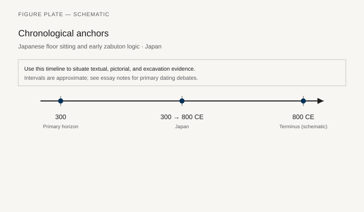
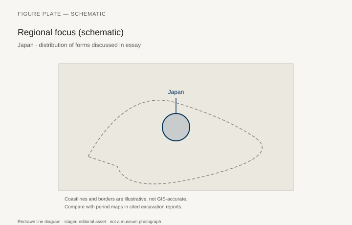
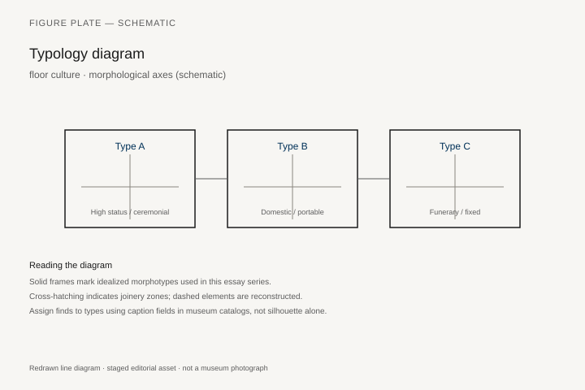
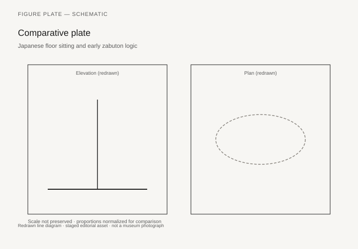

# The Floor as Furniture

*Fig. 1.* Chronological anchors for the evidence discussed below. Schematic redrawn line diagram; staged editorial asset (2026). Not a photograph of a museum object.

*Fig. 2.* Regional focus for circulation and local workshop traditions. Schematic redrawn line diagram; staged editorial asset (2026). Not a photograph of a museum object.

*Fig. 3.* Morphological typology for floor culture (idealized morphotypes). Schematic redrawn line diagram; staged editorial asset (2026). Not a photograph of a museum object.

*Fig. 4.* Comparative elevation and plan plate for floor culture. Schematic redrawn line diagram; staged editorial asset (2026). Not a photograph of a museum object.

A Heian noble room, as *The Tale of Genji* and the surviving picture-scrolls allow us to see it, is a floor of mats, a set of portable curtains (*kichō*), low tables, armrests, and writing boxes. The building’s sliding screens (*shōji*, later *fusuma*) are walls that move. The furniture is what you carry to the mat you will occupy. William Coaldrake’s *The Way of the Carpenter* (1990) is architecture; for objects, the Seager and Koizumi literature on *tansu* and the catalogs of lacquer (*maki-e*) are the tools. This chapter refuses to treat Japan as a footnote to Ming chairs or as a “minimalist” lesson for later modernists. It has its own sequence.

The tatami mat — standardized, modular, a measure of rooms — is furniture and floor. Its history as a ubiquitous covering is later than the Heian court (where woven mats were thinner and more local). By the late medieval and Edo periods, a room’s size is counted in mats. Sitting is *seiza* or a looser floor posture; the *zaisu* (legless chair) and the *kyōsoku* armrest are accommodations, not the room’s center.

## A portable room, not an empty one

Murasaki Shikibu’s novel and the illustrated *Genji* scrolls (the twelfth-century fragments in the Tokugawa and Gotoh museums are the famous set) show a court that moved its privacy. A *kichō* is a free-standing frame with a textile hung from a horizontal bar: a wall you carry. A *kichō* and a pair of low screens can make a sleeping place or a conversation inside a larger hall. The building itself is a kit of movable planes. *Shitomi* shutters lift or swing; later *shōji* slide on tracks; *fusuma* are opaque sliding walls that can take a painting. The person is placed on a mat. The rank is which mat, how many layers, how close to the blinds that open on the garden.

Heian mats were not yet the thick, cloth-bordered modules of an Edo inn. They were thinner woven surfaces, laid where they were needed. The later tatami — *igusa* rush over a rice-straw core, a cloth border (*heri*) whose pattern could mark status — becomes a room-measure in the late medieval and early modern house. A six-mat room, an eight-mat room: the numbers are furniture counts. *Seiza*, the formal kneeling sit, is an Edo tightening of posture, not a prehistoric Japanese essence. People sat cross-legged, they sat loosely, they used an armrest. The *zaisu* is a back without legs, a chair that admits the floor is still the seat.

## Boxes that travel: tansu and kodansu

*Tansu* are chests, often with metal corner plates and drawer locks, made to be carried, stacked, and, in some types, wheeled or shouldered. They are merchant and household architecture in wood: *kaidan-dansu* (stair chests), *isho-dansu* (for clothes), sea chests. The Smithsonian’s National Museum of Asian Art holds a miniature tansu (F1911.147) and a small *kodansu* (F1944.20) in lacquer and shell; these are elite cousins of the sugi-and-keyaki shop pieces. Ty Heineken and Kiyoko Heineken, *Tansu: Traditional Japanese Cabinetry* (1981), remain the English handbook. Kazuko Koizumi’s *Traditional Japanese Furniture* (1986) is the other door. Dates on unsigned tansu are often optimistic. Trust hardware typology and wood more than a dealer’s “Edo.”

F1911.147 is a collector’s scale: 3⅝ by 5½ inches, nineteen-century?, bought by Charles Lang Freer in 1911 from Kita Toranosuke in Kyoto, entered as a “bronze” in the old list, now a miniature chest. It teaches the type without teaching the weight. A real clothing tansu in keyaki (*zelkova*) and sugi (cedar) is a pair of people on a stair. The Heinekens sorted regional hardware: Sendai’s dense iron, Sado’s island habits, Osaka plates, the difference between a merchant’s wheeled chest and a sea chest (*funa-dansu*) built to survive a deck. Brooklyn’s *kaidan-dansu* (77.142), nineteenth century, 78 by 45 by 30 inches, attributed to Kawagoe in Saitama, came through Theodore Heineken to Harry and Margery Kahn and then to the museum in 1977. It is a stair that is a cupboard: each riser a drawer or a door, the whole piece a piece of the house that can, in theory, be carried out of the house.

Lacquer writing boxes and low tables are the Heian–Muromachi luxury line. The Met’s Momoyama *nanban* cabinets (2015.500.2.29a–k; and the related chest with a single drawer) are a different sentence: furniture made for Portuguese and other Europeans, in a European chest shape, with *maki-e* and mother-of-pearl, sometimes quoting Indian textile geometry. They are Japanese work for a foreign room. They prove a workshop could change its box without changing its finish.

## A Portuguese chest, a Japanese finish

Met 2015.500.2.29a–k is small: 10¼ by 10⅝ by 10¼ inches, gold *maki-e* on black lacquer, mother-of-pearl, silver mounts, Irving gift, 2015. The form follows Iberian writing cabinets. The leaves and flowers and the geometric borders, the Met’s note says, are not the usual domestic Japanese repertoire; they may show Indian designs that arrived with other trade goods. A second Irving cabinet, 2015.500.2.45a–h, early seventeenth century, six drawers, autumn flowers and shells on the fronts, literary scenes on the top and sides, belongs to the class European inventories called *secrétaires* or *comptoiren*. One of the earliest export cabinets without a fall front was already at Schloss Ambras around 1607. Kyoto shops, working in a language related to Kōdaiji *maki-e*, made objects for people who would never sit on a tatami.

The large coffer is the same argument at trunk scale. Met 2016.508, late sixteenth to early seventeenth century, 25 by 49 3/16 by 21 7/16 inches, *hiramaki-e* and shell, animals in landscape panels divided by strips that imitate European metal bands and then fill them with textile geometry. Tigers and peacocks the lacquerers had not seen alive sit among Japanese plants. Gilt-bronze locks carry European-style angels. Met 1991.408 is an eighteenth-century painted coffer in the same export family, 24 13/16 by 52 3/16 by 23 7/16 inches, a Dutch East India Company shape. *Nanban* — “southern barbarians” — is the period word for the patrons, not a style of sitting. The floor at home remained the seat. The box for export learned legs and locks.

## Tea, the tokonoma, and the display of almost nothing

The tea room’s furniture is a hearth, a kettle, a few utensils, a hanging scroll in the *tokonoma*. That is a real historical interior (Sen no Rikyū’s aesthetic as later schools transmitted it) and a later national story. The Tai-an at Myōki-an, a two-mat room associated with Rikyū, is the extreme of that story: almost no portable furniture, a hearth in the floor, a narrow alcove. Do not let it erase the loud furniture of merchants: gold screens, heavy tansu, wedding sets. Edo Japan is both.

Folding screens (*byōbu*) are furniture of the first order: they make rooms, they paint weather and the Tale of Genji, they travel between residences. A pair of six-panel screens is a wall you can pack. The Smithsonian and the Met are rich in them. A furniture series that only admits things with legs will miss the screen. The *tokonoma* is a built-in frame for a hanging scroll and a flower or a stone. It is display as architecture. The tea schools later wrote rules for what may hang and when. Those rules are Edo and after. The Muromachi elite already knew the alcove.

## Carpenters and the temple

Temple and palace carpentry — the *miyadaiku* tradition — is a joinery culture that does not need nails. Its relation to household tansu is cousinly, not identical. Tools, apprenticeships, and the treatment of exposed members are shared habits. Coaldrake is the architectural door. For household shops, region matters: Sado, Sendai, Osaka hardware styles.

The *shoin* study of the Muromachi and later elite — built-in desk (*tsukeshoin*), staggered shelves (*chigaidana*), tokonoma — is architecture as furniture, the Japanese parallel to the *studiolo* and the *kang*. Katsura Imperial Villa, in its seventeenth-century form, is the house a design magazine will photograph and then over-explain. The staggered shelves are the cabinet. The built-in desk is the table. Portable objects decorate the built-in. A writing box of lacquer sits on a surface the carpenter already made. Built-in wins.

Nijō Castle’s *shoin* rooms, with their ranks of mats and their painted *fusuma*, are the political version: a floor graded so that a visitor knows how far to sit from the daimyo. The furniture of that room is the floor count and the wall paintings. A chair would be a mistake.

## Regional hardware, sea chests, and the unsigned majority

The Heineken handbook is useful because it treats hardware as geography. Sendai chests carry dense, dark iron: corner plates, lock faces, and drawer pulls that read as armor. Sado island shops, working off a mining and shipping economy, have their own plate profiles. Osaka hardware is a merchant language, often quicker to a wheeled chest. A *funa-dansu* (sea chest) is built to a different brief: thick members, waterproofing habits, locks that matter when the box is the shop. Dates on all of these, when the piece is unsigned, come from plate typology, wood, and the honesty of a dealer. “Edo” on a tag is a wish until the plates agree.

Everyday tansu outnumber the lacquer *kodansu*. Sugi interiors, keyaki fronts, a stain that looks older than it is: the majority household cupboard of the late Edo and Meiji street is this, not Freer’s miniature. Brooklyn 77.142 is already a large object and still only one stair in one town (Kawagoe). A furniture series that photographs only *maki-e* will miss the merchant house the way a Ming series that photographs only *huanghuali* misses bamboo.

Writing boxes (*suzuribako*) and low writing tables are the Heian–Muromachi luxury line that sits on the mat the tansu does not occupy. Gold and silver powders in lacquer, a stone, a water dropper: the box is a room for ink. It is furniture at the scale of two hands. Catalogs of *maki-e* are the literature; this chapter only needs the reminder that a floor-level room still wanted a place to set a brush down without staining the mat.

## Screens as the walls you can pack

A pair of six-panel *byōbu* is a portable architecture. Gold-ground landscapes, scenes from Genji, birds on a dark field: the painting is what museums hang. The furniture fact is the hinge, the paper or silk, the weight two people can move between residences. Seasonal change in an elite house was partly a change of screens. The Met and the Freer are rich in them; a figure list should pick one pair with an accession and a license, not “a Japanese screen.” The *tsuitate* (a single standing screen) is the smaller cousin. Both do the work a European wall does, without promising permanence.

The *kichō* of the Heian chapters of Genji is the ancestor of that habit: a textile wall on a frame, carried to the mat you will occupy. Later *fusuma* paint the sliding wall in place. The sequence is not a progress from primitive curtains to real rooms. It is a sequence of ways to divide a timber hall. Furniture is the divider.

Coaldrake’s carpenter is a temple and palace worker: exposed joinery, no nail where a joint will do, an apprenticeship that is a lineage. Household tansu shops borrowed the habit and not the monument. A stair chest in Kawagoe is not a pagoda. It is the same respect for a member that shows. The difference matters. This chapter will not fold the *miyadaiku* and the merchant cupboard into one “Japanese wood style.”

## After Perry, before the design magazine

Meiji export furniture and the later *mingei* movement belong to chapters 35 and 39 as much as here. This chapter stops when the floor is still the seat for most daily life and the tansu is still the cupboard. The twentieth century will put Japanese sitting on legs for schools and offices. That is a break, not a destiny already visible in Genji.

What the break does not erase is the carpenter’s habit. A *kaidan-dansu* in Brooklyn, a miniature tansu Freer bought in 1911, a nanban cabinet the Irvings gave in 2015: three dates of collecting, one refusal to treat Japan as a country that waited for a chair. The floor was the furniture. The box moved. The screen made a room inside the room. Anyone who needs a “Japanese chair” for a modernist parable can find a *zaisu* and miss the house.

## Temple chairs, castle floors, a department-store afterlife

Abbots’ chairs (*kyokuroku*) and castle audience seats are the high exceptions in a floor culture. They are ranked objects, few in a province, easy to photograph as proof that “Japan had chairs all along.” They prove the opposite: a chair was a mark. The farmhouse and the merchant house kept the mat.

Meiji imports and department-store catalogs then add Western chairs at speed. The older logic does not vanish; it retreats to tea, to inns counted in tatami, to *tansu* that still travel. Unsigned chests acquire optimistic “Edo” dates in the trade. Trust hardware and wood. The Freer miniature (F1911.147) and Brooklyn’s stair chest (77.142) remain the public teachers: one a collector’s toy, one a piece of a house that can, in theory, be carried out of the house. *Nanban* export cabinets (Met 2015.500.2.29) learned European locks without teaching the home floor to stand up.

## Notes

- Ty Heineken and Kiyoko Heineken, *Tansu: Traditional Japanese Cabinetry* (New York: Weatherhill, 1981).
- Kazuko Koizumi, *Traditional Japanese Furniture* (Tokyo and New York: Kodansha, 1986).
- William H. Coaldrake, *The Way of the Carpenter* (New York: Weatherhill, 1990).
- Metropolitan Museum of Art, nanban portable cabinet 2015.500.2.29a–k; cabinet 2015.500.2.45a–h; coffer 2016.508; coffer 1991.408.
- National Museum of Asian Art, F1911.147a–i (miniature tansu, Freer, 1911, Kita Toranosuke); F1944.20 (*kodansu*).
- Brooklyn Museum 77.142 (*kaidan-dansu*, Kawagoe, 19th century).
- On *nanban* lacquer: catalogs of the 2015 Irving gift and earlier Freer/Sackler essays; Schloss Ambras inventory c. 1607 for an early export cabinet without fall front.

## Figure plan

**Fig. 1.** Tatami room with tokonoma, a historic house (Katsura or a museum house).  
Wikimedia CC, rights as marked.  
Alt: Empty-looking room with mats, an alcove, and a hanging scroll.  
Caption: The floor is the seat. The alcove is the display.

**Fig. 2.** Stair chest (*kaidan-dansu*).  
Brooklyn Museum 77.142, 19th century, Kawagoe.  
License: Brooklyn CC.  
Alt: Wooden staircase whose risers are drawers.  
Caption: A cupboard that is also the way upstairs.

**Fig. 3.** Miniature tansu.  
Smithsonian NMAA F1911.147a–i.  
License: Smithsonian Open Access, CC0.  
Alt: Small lacquered chest with many tiny drawers.  
Caption: Freer’s 1911 purchase from Kita Toranosuke: the type in a collector’s scale.

**Fig. 4.** Nanban portable cabinet.  
Met 2015.500.2.29a–k, Momoyama, *maki-e* and shell.  
License: Met, check Open Access status on the Irving lacquer.  
Alt: Small cabinet with gold lacquer, mother-of-pearl, silver mounts.  
Caption: A Portuguese chest, a Japanese finish, Indian-looking borders.

**Fig. 5.** Folding screen (a PD or OA pair).  
Met CC0 if available, or Freer.  
Alt: Six-panel screen with a landscape or Tale of Genji scene.  
Caption: A wall that folds.

**Fig. 6.** *Shoin* built-in shelves (*chigaidana*).  
Historic house photograph, Katsura or a museum *shoin*.  
License: CC.  
Alt: Staggered wooden shelves in an alcove beside a desk.  
Caption: The studiolo’s cousin: the room does the cabinet’s work.
