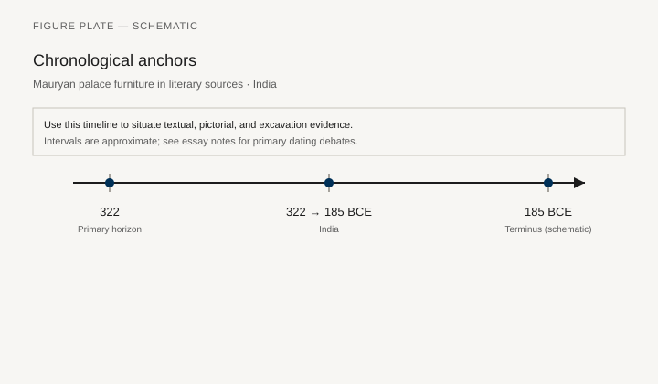
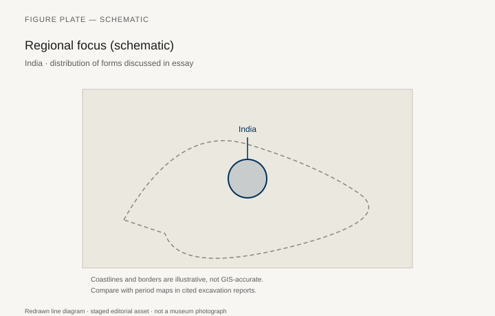
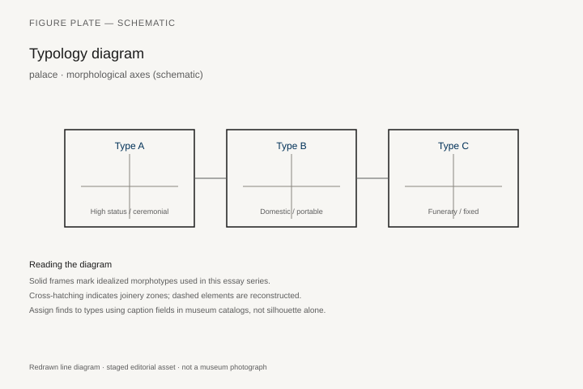
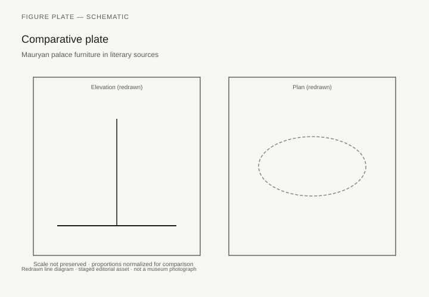

# Charpoy, Howdah, and the Mughal Seat

A *charpai* or charpoy is a rectangular frame with four legs and a web of rope, cane, or webbing. It is a bed, a day seat, a guest place in a courtyard, a piece of furniture that can be stood on its side and carried by one person. It is older than any surviving Mughal throne and harder to date, because a type this useful does not need a dynasty. The V&A holds turned legs and later complete examples; village carpentry still makes the form. A furniture history of South Asia that begins with a jeweled court seat and ignores the charpoy has started at the wrong height.

Ibn Battuta, writing about Indian beds around 1350, described four conical legs, four staves laid on them, and a plait of silk or cotton between. The V&A’s object record for a painted Delhi charpai leg of about 1880 (IS.763-1883) still quotes him, and still says the description applies. Cheaper frames were netted with rush rope; finer ones with broad tape. Materials ran from bamboo to ivory; the form stayed. The museum bought the leg as one of a set of four for two shillings and threepence. That is the economic fact that belongs next to any peacock throne. Temple sculpture from Mathura, Sanchi, and later sites shows stools, couches, and the lion throne of a Buddha or a king. These are types in stone, with the usual caution. Wooden palace furniture of the ancient and medieval periods is almost gone. Heat, monsoon, termites, and reuse are the climate. What remains is stone, metal fittings, ivory (a long Indian specialty), and the later, better-preserved Mughal and Rajput courts.

## Lion thrones that outlasted their wood

The *simhasana* (lion throne) is a word and an image before it is a surviving chair. Kushan and later Mathura sculpture puts a seated Buddha or a king on a seat whose supports are lions. The fifth-century Sarnath Buddha, in the Archaeological Museum at Sarnath, sits above a base where lions and a wheel do the heraldic work. The wood is gone. The stone still knows the type. A reader who wants a Mauryan chair will not find one in a warehouse. A reader who wants the idea of a raised, animal-supported seat will find it in every major Buddhist site catalog. Do not invent a surviving palace armchair for Ashoka.

Mauryan furniture **322–185 BCE** lives in two registers that rarely touch: Greek ambassador prose about a wooden capital, and Indian administrative text about how a king moves through guarded rooms. Archaeology adds a third — polished sandstone columns without seat joinery. Megasthenes’ *Indica*, preserved in Strabo (*Geography* 15.1.35–36), describes Palibothra/Pataliputra as a parallelogram city with a perforated wooden rampart and a court where the king’s name compounds with the city’s; treat the comparison to Persian Susa as testimony about perceived scale, not as a verified inventory. At Patna, Kumrahar excavations documented an **eighty-pillared hall** of polished Mauryan sandstone — audience architecture whose timber superstructure decayed, binding how elites sat on platforms or cushions lost to fire and monsoon. Kautilya’s *Arthashastra* (Shamasastry trans., 1915) is clearer on **protocol** than on joinery: the king rises from bed through successive guarded compartments; assassins hide **under a bed** in the women’s quarters — furniture as danger locus. When a gallery mounts a “Mauryan throne,” ask whether the object is Mauryan or a later stylistic echo.

Mughal painting — the *Padshahnama*, the Jahangir albums — shows emperors on jeweled seats under textiles, a footstool, attendants with fly-whisks. The Windsor *Padshahnama*, the imperial presentation volume of Shah Jahan’s reign, is the thickest visual record: low, wide thrones more like small platforms than European armchairs, a textile floor for everyone else, a canopy for one. Susan Stronge’s *Painting for the Mughal Emperor* (2002) is the V&A door into those folios. Some leaves are in Windsor, some in other collections; a caption must name the folio, not “a Mughal miniature.” Rank is a height difference of inches, then a cloth in the air.

The so-called Peacock Throne is a lost object with a loud afterlife. Shah Jahan’s court commissioned a jeweled seat that later European and Persian writers described until the descriptions became a type of their own. Nader Shah took the Mughal treasury in 1739. What happened to the throne after that — broken up, recast, renamed, confused with later Iranian seats — is a problem for jewel historians, not a reconstruction job for this series. Do not draw it from rumor. Use a painted throne that still exists on a page, or a later palace seat that still exists in a gallery.

## Thrones as architecture, and a late pair that can be measured

Some later palace thrones were metal and stone as much as wood. The Nelson-Atkins pair from Dungarpur (2013.10.2.1 and its mate) are the documented example the draft of this chapter asked for, and they are late enough to need a careful sentence. In 1911 the Maharawal of that small Rajasthani state commissioned European-style silver chairs — Chippendale in silhouette, lions for legs, peacocks and Hanuman on the backs, red velvet, a *chhatri* and a *chauri* in the set — for a new palace, in the year of George V’s Delhi Durbar. Molded and carved silver sheet wrapped around a wood core; 59 1/16 by 31½ by 35 7/16 inches for 2013.10.2.1. A former ruler took them to Europe in 1969. The museum bought them in 2013 and spent years cleaning the silver and covering worn velvet. They are not Mughal. They are what a princely workshop did with a throne idea after two centuries of European pattern books and a colonial durbar calendar. Recent research, the museum notes, suggests that if the pair were used together they may have seated two high-ranking men, not a king and queen. Use them as a measured, published royal seat. Do not read them backward into Shah Jahan’s hall.

The Mughal *diwan-i-am* and *diwan-i-khas* remain the architectural type: a hall whose seating is a throne plus a textile floor. The emperor’s platform is a piece of the building. The rest of the court is a carpet. Inches, then a canopy.

## A throne that walks

A howdah is furniture on an elephant: a seat with rails, sometimes a canopy, strapped to a pad. It is a vehicle and a throne. Processional furniture — palanquins, howdahs, portable thrones — is central to South Asian display in a way a sedentary European court only partly matches. The Virginia Museum of Fine Arts holds a silver-clad howdah (2004.17a–b), about 1896–1917, 26 by 57½ by 40½ inches, with a furled parasol, Robert A. and Ruth W. Fisher Fund. The museum’s note is not shy. Princely howdahs of the eighteenth to twentieth centuries were meant to overwhelm a crowd at a coronation or a birthday. Seated high was the grandest and, the label adds, the safest way through a throng. It is a late object. It is a real howdah, not a drawing.

The Met’s 2022.215 is not furniture. It is a Kota charcoal drawing, about 1680, of a caparisoned elephant with an empty howdah and a hookah waiting. The Howard Hodgkin collection sale put it in New York. Use it as a workshop document: the seat exists in the drawing before the prince is painted in. Nelson-Atkins also holds a set of Benares workshop watercolors, about 1880, designs for howdahs and palanquins (2011.31.2 and companions, from Stuart Cary Welch). Those sheets are furniture drawings in the strict sense. A shop in a river city was selling paper thrones to patrons who already knew the animal.

Palanquins (*palki*, *tonjon*, and related types) are processional furniture for a human body: an enclosed or canopied box, poles, bearers who are not in the museum case. The Met’s 2008.645.4 is a sixteenth- or seventeenth-century brass palanquin cover with a makara head, from Karnataka, 6 by 17 by 7¾ inches — a fitting, not the litter. Complete historic palanquins survive in the V&A and in South Asian palaces; confirm the accession at layout rather than inventing a Met litter. `[CITE NEEDED: a specific V&A or Smithsonian palanquin accession for the figure list.]`

## Ivory, ebony, and the coastal shops

Gujarati and south Indian ivory-inlaid furniture, later Goan and Coromandel work for export, and the so-called “Vizagapatam” inlaid boxes and chairs of the eighteenth century are a workshop history tied to ports. They are not “ancient India.” They are early modern shops answering Portuguese, Dutch, and English rooms with Indian skill. Amin Jaffer, *Furniture from British India and Ceylon* (2001), is the catalog for that later story. This chapter notes it as the afterlife of older inlay habits (ivory on wood, bone, precious woods) visible in Mughal boxes and in Deccani work.

Vizagapatam (Visakhapatnam) on the east coast made sandalwood and rosewood furniture and small wares with engraved ivory, often after English pattern-book shapes. The V&A’s oval table IS.20-1980 follows 1780s English designs — inlaid top, tapering legs, bellflowers — and carries a monogram read as Mary Baker, possibly the wife of a Madras Presidency resident listed from 1783 to 1807. A glove box, 01143(IS), sandalwood with an ivory border, was shown at the 1855 Paris exposition and transferred from the India Museum in 1879. The shops that could veneer a glove box could veneer a chair. The chair, when it appears, is often an English type in an Indian skin.

Ebony chairs in an “Indo-Portuguese” manner confuse beginners. Some are Indian; some are made in Lisbon from Indian wood; some are nineteenth-century revival. Jaffer and the V&A labels are the filter. Goa, the Coromandel coast, and Gujarat each had a different mix of patrons. A mother-of-pearl Gujarati chest made for the Ottoman market (David Collection 22/1983, already in chapter 17) is the same coastal skill pointed west rather than toward London.

## Floor, charpoy, and the mixed room

Domestic sitting in many regions was, and is, on the floor, on a charpoy, on a *takht* (a raised platform with textiles), on a *pirhi* or low stool. Cushions and dhurries are furniture. The mixed room is the normal room: a rope bed in the courtyard, a platform in the hall, a chair in a colonial office, a throne in a painting. No single “Indian seat” covers it. The honest series sentence is the charpoy’s: four legs, a web, a type that Ibn Battuta could still explain.

Wooden temple cars (*ratha*) and processional palanquins for images are religious furniture at building scale. Tamil and other South Indian cars, rebuilt and repainted on festival calendars, have their own carpenters and their own timber accounts. A series that only admits household objects will miss the largest wooden seats in the subcontinent. The god sits. The car moves. The joinery is a temple workshop’s, not a parlor’s.

## Takht, pirhi, and the room that is not a court

A *takht* is a raised wooden platform, often slatted or webbed, dressed with textiles: a daybed, a reception seat, a place for more than one body. It is closer to the Han couch than to a Mughal throne, and it is still in use. A *pirhi* or *pitha* is a low stool, sometimes carved, sometimes a plain block, the individual seat that is not a charpoy. Together with the rope bed they make a domestic kit that needs no emperor. Court painting erased them the way European travelers erased the rahle: by looking only at the canopy.

Deccani and later Rajput rooms mixed the kit with chairs that had already arrived through Portuguese and Mughal channels. A European chair in a painted durbar is a collected object, as in a Javanese *kraton*. It does not cancel the floor. It adds a height for a particular guest. Jaffer’s later catalog is full of those hybrids. This chapter only needs the earlier fact: the mixed room is old. The export chair is one more guest in it.

Temple cars in Tamil Nadu and other southern districts are rebuilt on festival cycles. Timber accounts, carpenter lineages, and the god’s itinerary are the documents. The seat is a shrine. The wheels are the furniture’s feet. A reader who has stood under a *ratha* at rest — a building on wheels, carved until the wood is a text — has seen the largest wooden “chair” the subcontinent still uses. Household furniture is smaller. It is not lesser. Ibn Battuta’s four staves and a plait remain the successful design.

Ivory was a South Asian furniture skin long before Vizagapatam cut bellflowers for Madras. Mughal and Deccani boxes, fly-whisk handles, and the small luxury trades of Gujarat sit behind Jaffer’s later chairs. The coastal shop did not invent inlay in order to please a Company officer. It pointed an old skill at a new room. When the room was Ottoman, the fittings went palmette (David 22/1983). When the room was English, the legs went tapering (IS.20-1980). The skill is the constant. The patron is the variable.

What this chapter will not do is fill the monsoon gap with a reconstructed Mauryan suite. Stone lions, a painted platform, a rope bed, a silver howdah of 1900, an ivory table of the 1780s: those are the objects that still exist. The lost Peacock Throne can stay lost. The charpoy is still being strung.

## Export chairs, village tape, a throne that should stay on the page

Vizagapatam and other coastal shops made ivory-inlaid seats for a European order. They are sometimes labeled “typical Indian furniture.” They are a port answering a pattern book. Keep them in the export sentence. The charpoy Ibn Battuta described — four legs, staves, a plait of silk or cotton — is the type that did not need a dynasty. V&A IS.763-1883, a painted Delhi leg bought for two shillings and threepence, is the economic fact that belongs next to any jeweled seat.

The Peacock Throne remains a lost object with a loud afterlife. Use a painted throne that still exists on a *Padshahnama* folio, or a measured later palace seat (the Nelson-Atkins Dungarpur pair, 2013.10.2), dated 1911 and honest about it. Do not draw Shah Jahan’s hall from rumor.

## Notes

- Amin Jaffer, *Furniture from British India and Ceylon* (London: V&A, 2001) — for later export shops.
- Susan Stronge, *Painting for the Mughal Emperor* (London: V&A, 2002) — for painted thrones; Windsor *Padshahnama* folios as specified at layout.
- V&A: charpai leg IS.763-1883 (Delhi, c. 1880; Ibn Battuta quoted on the record); Vizagapatam table IS.20-1980; glove box 01143(IS).
- Virginia Museum of Fine Arts 2004.17a–b (silver howdah, c. 1896–1917).
- Nelson-Atkins Museum of Art 2013.10.2.1 (Dungarpur royal throne, 1911); howdah designs 2011.31.2.
- Metropolitan Museum of Art 2022.215 (Kota drawing, elephant with howdah); 2008.645.4 (palanquin cover, Karnataka).
- David Collection 22/1983 (Gujarati mother-of-pearl chest, early 17th c.).
- On ancient types: Mathura and Sarnath lion thrones in sculpture catalogs; do not invent a surviving Mauryan chair.
- Ibn Battuta, *Rihla*, on Indian beds, c. 1350, as quoted in V&A IS.763-1883.

## Figure plan

*Fig. 1.* Chronological anchors for the evidence discussed below. Schematic redrawn line diagram; staged editorial asset (2026). Not a photograph of a museum object.

*Fig. 2.* Regional focus for circulation and local workshop traditions. Schematic redrawn line diagram; staged editorial asset (2026). Not a photograph of a museum object.

*Fig. 3.* Morphological typology for archaeology (idealized morphotypes). Schematic redrawn line diagram; staged editorial asset (2026). Not a photograph of a museum object.

*Fig. 4.* Comparative elevation and plan plate for archaeology. Schematic redrawn line diagram; staged editorial asset (2026). Not a photograph of a museum object.

### Supplemental photographs and redraws

**Fig. 5.** Charpai leg, or a complete ethnographic charpoy.  
V&A IS.763-1883, Delhi, c. 1880, painted wood.  
License: V&A.  
Alt: Turned wooden bed-leg painted with flowers.  
Caption: One of four legs the museum bought for two shillings. Ibn Battuta had already described the type.

**Fig. 6.** Mughal painting of an emperor on a throne (*Padshahnama* folio).  
Royal Collection, Windsor, or V&A / Chester Beatty — specify folio.  
License: as marked; some RC images restricted.  
Alt: Painted king on a jeweled low throne under a textile.  
Caption: Inches above the textile floor, a canopy for one.

**Fig. 7.** Howdah.  
VMFA 2004.17a–b, silver, wood, velvet, c. 1896–1917.  
License: museum.  
Alt: Canopied silver seat designed to be strapped to an elephant.  
Caption: A late princely throne that walks. Caption the date.

**Fig. 8.** Ivory-inlaid table, Vizagapatam.  
V&A IS.20-1980, sandalwood and engraved ivory, 18th century.  
License: V&A.  
Alt: Oval inlaid table with tapering legs.  
Caption: An English pattern, an east-coast shop, a Madras monogram.

**Fig. 9.** Palanquin or palanquin fitting.  
Met 2008.645.4 (makara cover) or a confirmed V&A litter.  
License: as marked.  
Alt: Brass makara head from a palanquin, or an enclosed wooden litter.  
Caption: Processional furniture for a human body — or the piece that faced forward.

**Fig. 10.** Buddhist lion throne in stone (Sarnath or Mathura).  
Archaeological Museum, Sarnath, or an Indian museum / Wikimedia PD.  
Alt: Stone Buddha seated on a throne with lion supports.  
Caption: The *simhasana* as a sculptor knew it. The wood is gone.
