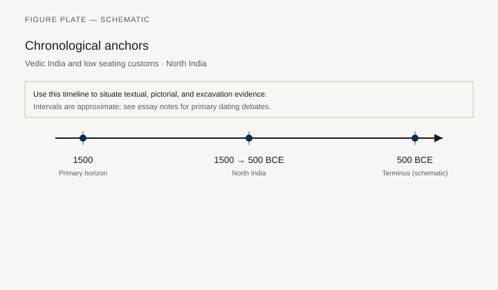
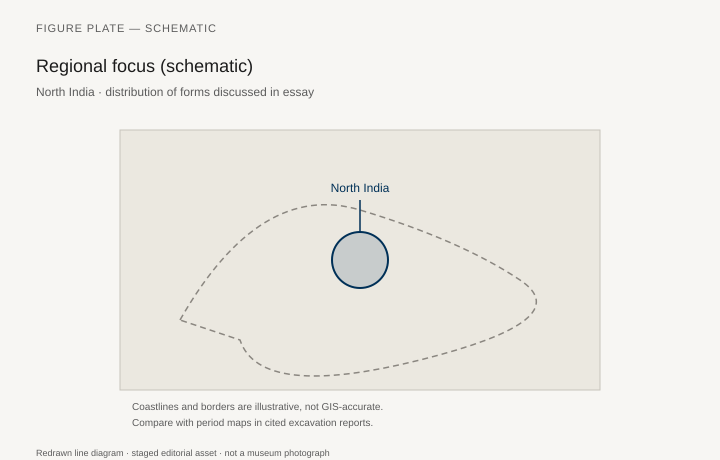
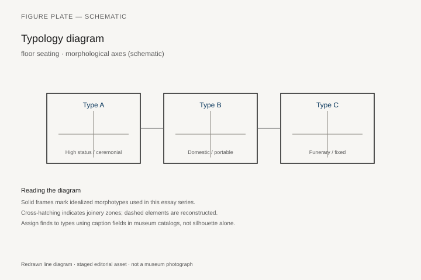
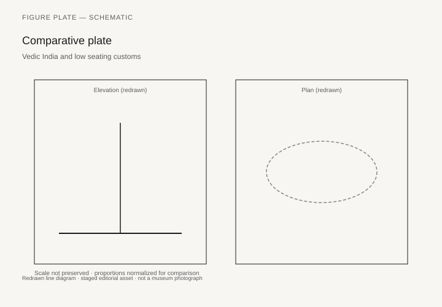

# Teak, Rattan, and the Island Workshop

Teak (*Tectona grandis*) grows in monsoon forests from India into mainland Southeast Asia. Rattan climbs. Bamboo is a grass that behaves like a timber. A furniture history of this region that starts with a European planter’s bungalow suite has already missed the house: piled dwellings, mat floors, built-in platforms, textile walls, and a long tradition of woodcarving that went first to ships, houses, and religious buildings.

This chapter cannot be a complete national survey. It can refuse two errors: that Southeast Asia is a “source of materials” for other people’s chairs, and that court furniture here is a failed copy of China or Islam. Thai, Burmese, Khmer, Javanese, Balinese, and Malay workshops had their own seats, chests, and palanquins. The scholarship is uneven. Where it is thin, the text will say so.

## Platforms and the piled house

A Malay or Minangkabau or Thai house on piles uses the floor as a sitting surface and the raised inner platform as a rank marker. Built-in benches along walls, storage under the floor, ladders: Skara Brae’s problem in timber and humidity. Furniture that would rack on a damp earth floor is the wrong furniture. Chests have short legs or sit on frames. Textiles do the soft work.

Roxana Waterson’s *The Living House* (Singapore: Oxford University Press, 1990) is still the book that treats the house as a social object rather than a postcard. Minangkabau *rumah gadang* in West Sumatra, Malay *rumah* along the peninsula and the east-coast rivers, Thai houses on piles in the Chao Phraya basin: the details differ, the sitting problem does not. You climb. You leave shoes. You sit on a mat whose weave is a local crop. The inner raised section — sometimes a dais of a few inches, sometimes a separate platform — is where a guest of rank is placed. Height is a step in the floor, not a high back. Waterson’s photographs and plans are architecture. They are also furniture drawings, if furniture is allowed to be built-in.

Rattan and bamboo seating — stools, low chairs, later the planter’s chair that colonial catalogs claimed — is an old vegetal technology. Dating anonymous bamboo stools is usually hopeless. Ethnographic museums (Leiden’s Museum Volkenkunde; the Tropenmuseum’s collections, now under the Wereldmuseum; the Smithsonian) hold types; treat them as types, not as “ancient examples.” The collection date is often the only date. A stool accessioned in 1912 after a Dutch field trip is a 1912 document of a living shop, not a tenth-century survival.

## Court and temple wood

Thai and Burmese palaces used gilded and lacquered wood, mother-of-pearl, glass inlay, and a low throne or pavilion seat that is architecture. The V&A and the National Museums in Bangkok and Yangon hold thrones and manuscript chests. Khmer stone is more famous than Khmer wood; termites ate the palace. Angkor’s reliefs show palanquins and seated kings — stone again.

The manuscript cabinet is the furniture type a reader can still stand in front of. Monasteries needed a box for palm-leaf books and for *khoi*-paper texts. Donors paid for gold on lacquer. The Thai technique, *lai rot nam* (also written *lai rod nam*), is gold leaf laid on a lacquer ground and washed so the drawing stays. Celestial adorants and combat scenes from the *Ramakien* — the Thai *Ramayana* — are the favored subjects. Met 1971.139, late eighteenth to early nineteenth century, Ratanakosin, Bangkok, wood with gold and lacquer, about 62½ by 34 1/16 by 31⅛ inches, bequest of Caroline S. Hanway, is a monastic cupboard of that kind. The Met’s note flags an openwork stand with two drawers, carved in a Chinese manner and likely later than the box. Cabinets grow stands. Captions should say so.

Doris Duke’s Southeast Asian collection, given to the Asian Art Museum in San Francisco, holds a group of related cabinets and chests. 2006.27.41 is a *Ramakien* cabinet, about 1800–1900, 61½ by 38 by 31¼ inches, lacquered and gilded wood, iron fittings. 2006.27.6, 1850–1900, 65¼ by 38½ by 33 inches, carries the life of the Buddha and five Buddhas of past, present, and future. 2006.27.44 is a smaller chest with the Bhuridatta Jataka, 17½ by 26¼ by 16½ inches. Donors chose the stories. The shop cut the carcase and laid the gold. These are nineteenth-century objects in a much older monastic job: keep the book off the floor and in the merit of the giver.

Burmese *sadaik*, the manuscript chest of the same Buddhist world, uses gilded *thayo* lacquer and often glass inlay. Yangon’s National Museum and the V&A hold examples; confirm the inventory at layout. `[CITE NEEDED: a specific Yangon or V&A *sadaik* number for the figure list.]` The type is a cousin, not a copy, of the Bangkok cabinet. Glass inlay is a Burmese brightness the Thai gold ground does not always want.

## Angkor’s stone memory of wood

The Bayon, late twelfth to early thirteenth century, and the earlier Angkor Wat reliefs keep processions that wood could not keep: palanquins, parasols, kings on raised seats, bearers whose labor is the length of a pole. The palace carpentry is gone. The sandstone still knows the umbrellas. A furniture chapter that treated Khmer sitting as “unknown” would be ignoring the largest picture catalog in the region. The caution is the usual one. A relief is a type, not a workshop drawing. Joints are not visible. The howdah and the palanquin of chapter 22 have cousins here, with their own names and their own ranks of shade.

Javanese *kraton* furniture in Yogyakarta and Surakarta mixes local carving, Islamic chests, and, later, European chairs as status imports. A Dutch chair in a Javanese court is not “influence” as surrender; it is a collected object in a room that still knows the floor. The *pendopo* is a columned hall whose furniture is the floor and the columns. Chairs appear in later photographs of audiences; mats appear in the same photographs. Both are true. Balinese and Javanese woodcarving for temples (doors, shrines, the seats of offerings) is furniture-adjacent. Some offering thrones and *padmasana* are seats for gods, not people. The Balinese *padmasana* is an empty seat for Sanghyang Widhi Wasa, a throne whose occupant is not a body. That is a furniture fact if the series will admit a seat no one sits on — a problem chapter 24 will meet again in Kumasi, for different reasons.

## The teak trade

Teak’s later fame is a colonial and steam-ship fame: decks, camp furniture, the Bombay and Rangoon yards. Before that, local boatbuilders and house carpenters already knew the wood. *Tectona grandis* likes a monsoon forest with a dry season. Mainland Southeast Asia and parts of India grew it; island Southeast Asia had other hardwoods and imported teak when it needed decks. A nineteenth-century “campaign chair” in teak is a European type in an Asian timber. Put it in chapter 34 if the design is British. Put the forest here.

The people who felled and rafted teak are rarely in the furniture catalog. British and later forestry services in Burma produced volumes on yield and grade. Those volumes are extractive documents. They still record a knowledge that village yards already had: heartwood that lasts, a oil that resists water, a board that can be a boat or a house post. A furniture series that only meets teak as a colonial deck has met it too late.

Rattan’s later fame is the modernist and the restaurant chair. The plant — climbing palms in *Calamus*, *Daemonorops*, and related genera — and the village shop are older. `[CITE NEEDED: a serious history of rattan furniture before the colonial catalog — if none exists, say so.]` The literature is still stronger on export than on local use. Until that history is written, the honest caption on a Leiden or Smithsonian stool is: vegetal joinery, collected on a date, used in a house that also had mats and a platform. Do not hang a Bauhaus story on a cane seat the collector did not date.

Bamboo is the other majority material. It splits, it lashes, it becomes a wall or a stool. It does not take a museum accession number as often as gilt lacquer. The missing majority of this chapter is bamboo, rattan, and un-gilded teak in houses that were never photographed for a catalog.

## Ships, yards, and the carpenter who was not carving a throne

Boatbuilding is the other wood culture this chapter cannot treat as a sidebar. Teak that later became a colonial deck was already a hull, a house post, and a temple beam. Malay and Bugis yards, Burmese river craft, Thai and Khmer boats on inscriptions and in relief: the joinery habits move between water and land. A chest with short legs and a good lid is a dry-land cousin of a hatch. Waterson’s piled house, with storage in the undercroft and a ladder as the door, is a maritime idea even when the village is inland. Humidity is the climate. Furniture that cannot be lifted off a wet floor is the wrong furniture.

Javanese carved doors and shrine seats, when they enter Dutch collections (Leiden, the old Colonial Museum), often arrive with a collection date and a thin village name. Treat them as architectural furniture. The offering seat and the *padmasana* are not failed chairs. They are seats whose occupant is not a diner. A European catalog that filed them under “idol” was making a category mistake the Asante chapter will also have to refuse.

Thai and Burmese palace thrones — low, gilded, sometimes under a built-in spire — are architecture first. Bangkok’s National Museum and the surviving palace halls are the places to see the type in situ or near it. A fragment in the V&A should be captioned as a fragment. Glass inlay on a Burmese *sadaik* and gold wash on a Bangkok cabinet are two finishes for the same monastic job: the book off the floor, the donor’s name in the shine.

Mat floors in the piled house are crop and craft: pandanus, rattan peel, bamboo split, a weave that can be rolled and sunned. They are the soft furniture the gilt cabinet is not. A survey that only photographs gold will miss the sitting surface the way a traveler who only photographed a throne missed the *sedir*. Waterson’s plans show where the mat stops and the inner platform begins. That line is the rank. A stool of rattan may sit on either side of it. The collection date on the stool will not tell you which side. The house will, if the house is still there.

Doris Duke bought as a traveler with money and a taste for gilded rooms. The San Francisco cabinets are her eye as much as Bangkok’s. That is not a reason to discard 2006.27.41. It is a reason to keep the monastic job and the collector’s date in the same caption, the way a Mamluk revival kursi must keep Cairo 139 and Penn NEP69 from collapsing into one object.

## What a survey cannot do

Thai, Burmese, Khmer, Malay, Minangkabau, Javanese, Balinese: seven words already too many for one essay and not enough for the region. The Asian Civilisations Museum in Singapore, the National Museum of Indonesia, and Bangkok’s National Museum are the places a later writer should go to break this chapter into chapters. What this one can leave is a set of refusals and a few objects with numbers. Met 1971.139 is a book cupboard, not a “Thai style.” Waterson’s piled house is a sitting system, not an absence of chairs. The Bayon’s palanquin is a seat in stone because the wooden one was eaten. The Dutch chair in a *kraton* photograph is a guest, not the host.

The next chapter is a stool that must not be sat upon. The step from a Balinese empty throne to an Asante golden one is not a diffusion story. It is a reader’s path through two societies that gave a seat the work of holding a people, or a god, rather than a diner. Southeast Asia’s everyday answer remains simpler and easier to miss: a platform, a mat, a box for the book, a forest that knew teak before a shipyard named it.

## Boat joints, colonial chairs, a kitchen rack the palace catalogs skip

House-building and boat-building share timbers and joints with chests. A Malay or Javanese chest may be closer to a hull plank than to an Antwerp cabinet. Dutch, Spanish, and later French inventories add chairs and armoires that local shops copy and alter. The hybrid is the history. Waterson’s *The Living House* (1990) treats the piled house as a social object; the inner platform is a rank marker of a few inches, not a high-backed throne.

Ethnographic stools accessioned in 1912 are 1912 documents of living shops, not tenth-century survivals. Court gilding in Bangkok or Mandalay is architecture as much as furniture. Kitchen racks and rattan work rarely enter those catalogs. An essay that only climbs palace stairs has not been in the house. Teak’s later career as a colonial veranda wood belongs in chapter 41 as a tree. Here the tree is still a house.

## Notes

- Regional museum catalogs: Bangkok National Museum; National Museum of Indonesia; Asian Civilisations Museum, Singapore; National Museum, Yangon.
- Metropolitan Museum of Art, Manuscript Storage Cabinet 1971.139 (Bangkok, late 18th–early 19th c.).
- Asian Art Museum, San Francisco, Doris Duke gifts: 2006.27.41, 2006.27.6, 2006.27.44.
- Roxana Waterson, *The Living House: An Anthropology of Architecture in South-East Asia* (Singapore: Oxford University Press, 1990).
- On colonial teak furniture: Jaffer (chapter 22) and campaign-furniture catalogs — keep them secondary here.
- Waterson and local architectural studies for platform sitting; do not invent a single “Southeast Asian chair.”
- On *lai rot nam* and monastic cabinets: Met 1971.139 label; Asian Art Museum object records for the Duke cabinets.

## Figure plan

*Fig. 1.* Chronological anchors for the evidence discussed below. Schematic redrawn line diagram; staged editorial asset (2026). Not a photograph of a museum object.

*Fig. 2.* Regional focus for circulation and local workshop traditions. Schematic redrawn line diagram; staged editorial asset (2026). Not a photograph of a museum object.

*Fig. 3.* Morphological typology for archaeology (idealized morphotypes). Schematic redrawn line diagram; staged editorial asset (2026). Not a photograph of a museum object.

*Fig. 4.* Comparative elevation and plan plate for archaeology. Schematic redrawn line diagram; staged editorial asset (2026). Not a photograph of a museum object.

### Supplemental photographs and redraws

**Fig. 5.** Interior of a piled house (Minangkabau or Malay historic house).  
Wikimedia CC.  
Alt: Wooden room on a raised floor with mats and a higher inner platform.  
Caption: Rank is a step in the floor, not a high back.

**Fig. 6.** Thai manuscript storage cabinet, gold on lacquer.  
Met 1971.139, Bangkok, late 18th–early 19th century.  
License: Met, check OA.  
Alt: Tall gilded wooden cabinet with Ramakien scenes.  
Caption: A monastic cupboard for palm-leaf books. The Chinese-style stand may be later.

**Fig. 7.** Javanese carved door or Balinese *padmasana*.  
Museum Nasional or a temple photograph used with care.  
License: as marked.  
Alt: Densely carved wooden architectural panel, or an empty stone-and-wood throne for a god.  
Caption: The same shops cut houses and seats for gods. Some seats are empty on purpose.

**Fig. 8.** Rattan stool, ethnographic collection, dated as a type.  
Smithsonian or Leiden (Museum Volkenkunde).  
License: OA if Smithsonian.  
Alt: Woven rattan stool.  
Caption: A vegetal joint. The date is usually the collection date.

**Fig. 9.** Angkor relief of a king in a palanquin or on a throne.  
Bayon or Angkor Wat; Wikimedia PD.  
Alt: Stone relief of a seated ruler under umbrellas.  
Caption: The palace wood is gone. The stone still knows the umbrellas.
