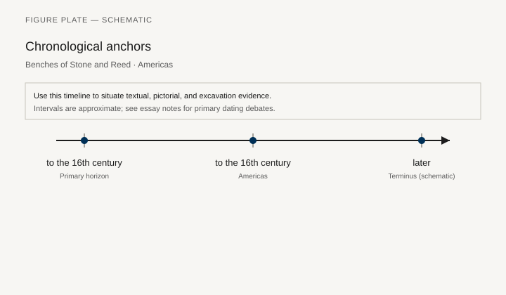
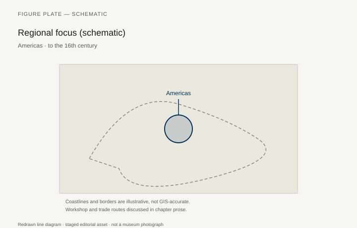
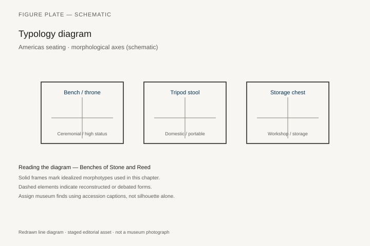
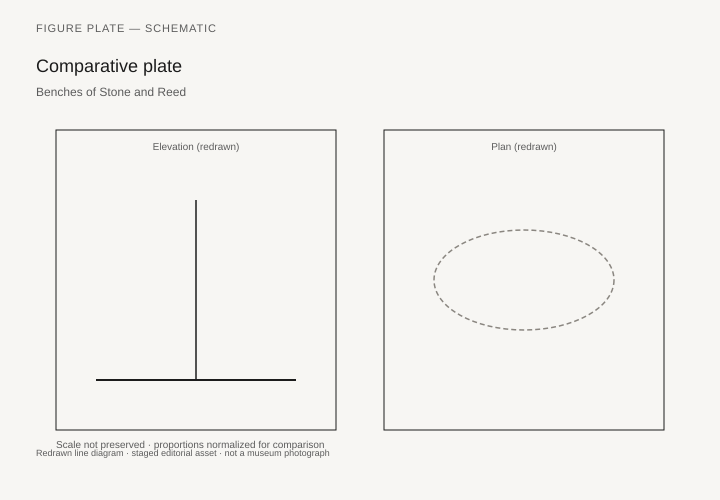

# Benches of Stone and Reed

At Bonampak, in Room 1 of Structure 1, a bench runs under the paintings. Maya elite interiors, as standing architecture and as ceramic models show them, use masonry benches as the main seat and bed. Wooden furniture existed — lintels prove the carpentry — and almost none of the household wood has come through the humidity. This chapter starts with what is left: stone benches, ceramic model houses, stone *metates* that are work-furniture, Andean textile and wood from dry coasts, Caribbean *duhos*, and the honesty that a continent is not a type.

A single “pre-Columbian chair” is a collector’s wish. What there is, instead, is a set of regional answers to sitting, sleeping, and displaying rank, interrupted in the sixteenth century by a new politics of objects.

## Maya and Mesoamerica

Mary Miller’s work on Bonampak and the catalogs of Palenque and Copan describe benches with painted or stuccoed fronts, sometimes with iconography of captives or cosmic seats. A ruler’s bench is a throne. A household bench in a smaller house is a bed. The difference is finish and position, not always form. Ceramic “house models” from Nayarit and other West Mexican shaft tombs (Met and other collections) show people on benches and platforms inside built rooms — useful, and not Maya.

Aztec and earlier central Mexican seats include the *icpalli*, a backed seat of reed or wood for lords, known from Codex images and from a few stone versions. The reed throne in a manuscript is a furniture document. Surviving reed is rare. Stone *icpalli* in museums should be captioned as stone, not as the everyday seat.

Olmec and later monumental thrones (La Venta, the “altars” that are seats) are political sculpture. They belong here as seats at a scale that is not household.

## The Caribbean duho

Taino *duhos* — low ceremonial seats, often of wood, sometimes with gold inlay, often with a high back and a forward tilt — survive in a small number of examples (British Museum, Musée du Quai Branly, Caribbean museums). They are among the few pre-colonial wooden chairs of the Americas that a reader can stand in front of. Their use in cohoba ritual and in chiefly display is discussed in the archaeological literature with more care than older museum labels (“idol”). `[CITE NEEDED: a specific BM duho registration number for the figure list.]` Humidity and early collecting mean the corpus is tiny. Each piece carries too much weight.

## Andes: wood, reed, textile

Coastal Peru’s dryness kept wood and fiber: boxes, ceremonial *tumi* stands, litter parts, the reed *caballito* as a vehicle, textile as the real furniture of a room. Inca palaces, as Spanish descriptions give them, used built-in stone benches and textile hangings. The *tiana*, a low seat of honor, appears in texts and in a few stone examples. A wooden Inca chair in the European sense is not the type.

Chavín, Moche, and Wari objects include throne-like platforms in iconography. Keep them in their catalogs. Do not build a single Andean “style of sitting.”

## North America

Mississippian stone statues sit on bent knees or on low seats; wooden stools from the Southeast are scarce. Arctic and Northwest Coast bentwood boxes are furniture of the first order: steamed, kerfed, sewn or pegged, the box as cupboard and as coffin. A Kwakwaka’wakw or Tlingit chest is a room’s wall of wealth. Later chapters on modernism will steal the box’s look; this chapter should name the box first as a local invention. The Smithsonian’s National Museum of the American Indian and the AMNH hold the types. Captions must follow current tribal names and museum protocols.

Pueblo built-in benches and roof-entry rooms rhyme, at a distance, with other piled and platform houses in this series. The rhyme is not a migration story.

## After 1492, in one paragraph

European chairs enter as power and as trade. Indigenous shops keep making benches, boxes, and ritual seats. A colonial “mestizo” cabinet is a later chapter’s object. The break is real. So is the continuity of the bench and the box.

## A clay house that still has sitters

The Metropolitan’s Nayarit house model 1979.206.359 is ceramic and slip, West Mexico, 200 BCE–300 CE: 11 15/16 by 8 5/8 by 6 1/8 inches, Rockefeller bequest, 1979. Patricia J. Sarro’s 2023 catalog note is the text to trust. Downstairs a woman grinds corn on a *metate*; two other adults have set food on a plate; a dog waits at the entry. Upstairs four adults take a feast. A pregnant woman leans against a roof post. A couple rest against the back wall of the portico with plates lined up before them. Two birds watch. The house is a two-storey thatched portico over a kitchen. The sitters sit on the architecture. There is no separate chair to inventory.

Joanne Pillsbury, Sarro, James Doyle, and Juliet Wiersema put this object, and others like it, in *Design for Eternity: Architectural Models from the Ancient Americas* (Met, 2015). The models came from shaft tombs. They are not Maya, and they are not “illustrations of daily life” in the innocent sense. They are tomb furniture that happens to be a picture of household furniture. A second Met house model, 2015.306, crowds twenty-seven adults onto a portico and a ledge; six male-and-female pairs sit as if the feast were also a genealogy. `[CITE NEEDED: confirm 2015.306 dimensions on the live Met page before layout.]` What both models will still admit is posture: people sit on platforms, against walls, on the floor of a built room. The bench is the house.

West Mexican shaft-tomb ceramics have a market history that captions now flag. Rockefeller provenances in the Michael C. Rockefeller Wing are mid-century collecting, not excavation numbers. Use the objects for what they show. Do not invent a village name the label does not give.

## The metate as a work-bench, and sometimes a seat

A *metate* is a grinding table. In a kitchen it is furniture in the strict sense: a raised working surface with a *mano*, used until the stone remembers the corn. The Met’s Guanacaste-Nicoya ceremonial metate 1979.206.429, Costa Rica, 4th–8th century, volcanic stone, 12 by 10 by 18 inches, has a fretted edge, tripod legs in geometric relief, and a bird’s-head motif at one end. The museum’s own note says what has to be said twice: even today stone metates grind maize; this one’s decoration suggests ceremony; some writers have suggested a throne as well as a mill. Caption it as a grinding table first. The throne reading is a hypothesis, not a provenience.

The Central Region “flying-panel” metate 1979.206.426, 1–500 CE, 28 15/16 by 18 1/4 by 19 inches, is carved from one block so that toucans and a vulture-like bird seem to hang in the negative space under the slab. Excavated examples of the type have been found in burials with jade and mace heads; some show no traces of use. A tool can be made too fine to work. That is still a furniture fact. The everyday *metate* in a Nayarit kitchen model and the flying-panel stone in a tomb are the same class of object at two budgets.

Olmec “altars” at La Venta — Altar 4 is the one most often photographed, a seated figure in a cave-niche under a table-like slab — are political sculpture at a scale no household used. They belong in this chapter as seats that are monuments. Palenque’s Palace benches, with stuccoed fronts and, in the royal rooms, iconography of cosmic order, are the Maya version of the same idea at living scale. Mary Miller and Claudia Brittenham’s *The Spectacle of the Late Maya Court* (2013) keeps Bonampak’s Room 1 bench under the paintings, which is where a furniture history needs it: the mural is a crowd that requires a ledge.

Wooden Maya furniture existed. The carved lintels of Yaxchilán and Tikal are carpentry of the first order, still in situ or in museums, and they prove that elite buildings had joiners. Household stools, beds, and boxes have not come through the Petén’s humidity in any number a catalog can count. `[CITE NEEDED: a published wooden Maya stool or bench fragment with a site and inventory number, if one exists outside copal-encrusted offerings.]` The honesty is not that the Maya sat only on stone. It is that stone is what we have.

## Guayacán, gold, and Am1949,22.118

The British Museum’s Taíno *duho* Am1949,22.118 is the number the earlier draft asked for. It is a low ritual seat from Hispaniola (the old label said Santo Domingo), carved from *Guaiacum* — guayacán, a wood so dense it sinks — in the form of a male figure on all fours. Eyes, mouth, and shoulders carry gold inlay. The back of the seat is geometric. Ostapkowicz’s radiocarbon work, published with Caroline Cartwright and others, puts this object in a late pre-colonial range; a Barbier-Mueller exhibition caption that cites the same piece gives a calibrated band around 1292–1399 for the wood. `[CITE NEEDED: the exact 14C interval as printed in Ostapkowicz et al., *Journal of Archaeological Science* 2013, for Am1949,22.118.]` A high-backed *duho* published from Puerto Plata as BM Am 9753 is 72.5 cm high and belongs to a different formal class; confirm that old number against the live British Museum registration before a figure list uses it. Ostapkowicz’s 2012 paper on AMS dates for Caribbean wood sculpture treats high-back, low-back, and extended *duhos* as types that are already in use after about 1100 CE, and not only in the last decades before 1492.

Cohoba ritual — the inhalation of a powdered snuff before a *cemí* — is the use the archaeological literature now discusses instead of the older museum word “idol.” A *cacique* sat on the *duho*. The seat is a person-object, closer to the Asante stool in chapter 24 than to a European chair. Gold at the joints and orifices is not jewelry added later; it is how the figure sees. Early collecting, humidity, and a tiny corpus mean each surviving *duho* is asked to speak for islands. It cannot. Caption the island, the wood, the registration. Leave the rest of the Greater Antilles in the notes as a gap.

Musée du quai Branly holds related seats from older Trocadéro numbers; those registrations wander in secondary literature. `[CITE NEEDED: a current Quai Branly inventory for a published high-back duho.]`

## A chest made by turning a corner

The Met’s Tlingit storage chest 1979.206.421a, b, Alaska, about 1880, wood and paint, 20 1/4 by 30 5/8 by 20 1/2 inches, is late for a chapter titled “before 1492.” It is here because the bentwood box is older than that example, and because a furniture series that waits for a pre-contact Northwest Coast box with a perfect excavation number will wait past the printer. Bill Holm’s technical essays — steaming a kerfed cedar plank until it turns a right angle, sewing or pegging the fourth corner, fitting a lid that is itself a small architecture — describe a type already in use when eighteenth-century traders began to write it down. The Smithsonian’s National Museum of the American Indian and the American Museum of Natural History hold earlier and later chests. Captions follow current tribal names. A Kwakwaka’wakw box is not a Tlingit box because both are kerfed.

A lidded storage box, Met 2007.215.10a, b, given as “Alaska or British Columbia,” nineteenth century, 26 by 19 5/8 by 19 inches, is the caution: even a great museum will sometimes not name a nation. Do not name one for it.

The box is cupboard, wealth-display, and, in some uses, a coffin. Later modernism will steal the silhouette (chapter 37 will want the clean corner). This chapter names the corner as a local invention: heat, water, a scored line, a plank that agrees to become four walls. Pueblo built-in benches, at a distance, rhyme with the masonry ledges of this series. The rhyme is construction, not a migration story.

Andean rooms, on the dry coast, kept fiber and wood that the Maya forest would not. A *tiana* — the low seat of Inca honor — appears in Spanish descriptions and in a few stone examples; Garcilaso and later colonial dictionaries are the textual door. `[CITE NEEDED: a stone tiana with a museum inventory, Cuzco or Lima, for the figure list.]` The textile that made an Inca room is almost never in the same case as the stone. Caption the absence.

What this continent refuses is a single chair. Bonampak’s ledge, a Nayarit portico, a Costa Rican mill-table, a Hispaniolan *duho*, a Tlingit chest, a Pueblo bench: six answers to sitting, sleeping, grinding, and storing. 1492 interrupts the politics of those objects. It does not invent the need for them.

## Notes

- Mary Miller and Claudia Brittenham, *The Spectacle of the Late Maya Court* (Austin: University of Texas Press, 2013), for Bonampak’s rooms.
- Metropolitan Museum of Art, Nayarit house model 1979.206.359; ceremonial metate 1979.206.429; flying-panel metate 1979.206.426; Tlingit storage chest 1979.206.421a, b.
- Joanne Pillsbury, Patricia Joan Sarro, James Doyle, and Juliet Wiersema, *Design for Eternity: Architectural Models from the Ancient Americas* (New York: Metropolitan Museum of Art, 2015).
- Joanna Ostapkowicz et al., “Birdmen, cemís and duhos,” *Journal of Archaeological Science* 40 (2013); British Museum Am1949,22.118.
- On Northwest Coast boxes: Bill Holm, *The Box of Daylight* and technical essays on bentwood.
- Codex images of the *icpalli*: *Florentine Codex* and earlier manuscripts, as reproduced in standard editions.

## Figure plan

*Fig. 1.* Chronological anchors for **Benches of Stone and Reed** (to the 16th century). Schematic redrawn line diagram; staged editorial asset (2026). Not a photograph of a museum object.

*Fig. 2.* Regional focus (schematic): Americas. Schematic redrawn line diagram; staged editorial asset (2026). Not a photograph of a museum object.

*Fig. 3.* Morphological typology for Americas seating (idealized morphotypes). Schematic redrawn line diagram; staged editorial asset (2026). Not a photograph of a museum object.

*Fig. 4.* Comparative elevation and plan plate for Americas seating. Schematic redrawn line diagram; staged editorial asset (2026). Not a photograph of a museum object.

### Supplemental photographs and redraws

**Fig. 5.** Bonampak, Structure 1, Room 1, bench and paintings.  
Reconstruction or a published photograph (Miller/Brittenham).  
License: as published; INAH for site photos.  
Alt: Maya room with a masonry bench under mural figures.  
Caption: The seat is the architecture. The paintings need it.

**Fig. 6.** Nayarit house model.  
Met 1979.206.359, ceramic and slip, 200 BCE–300 CE.  
License: Met, check OA for Rockefeller works.  
Alt: Ceramic model of a thatched two-storey house with people seated at a feast.  
Caption: Sitters on the architecture. No separate chair to inventory.

**Fig. 7.** Taíno duho.  
British Museum Am1949,22.118, guayacán and gold, Hispaniola.  
License: BM CC BY-NC-SA.  
Alt: Low wooden seat carved as a crouching male figure with gold inlay.  
Caption: Ostapkowicz’s number. Older labels said “idol.”

**Fig. 8.** Ceremonial metate, Guanacaste-Nicoya.  
Met 1979.206.429, volcanic stone, 4th–8th century.  
License: Met, check OA.  
Alt: Tripod stone grinding table with a bird-head terminal.  
Caption: Work-furniture first. A throne only if the caption says “suggested.”

**Fig. 9.** Tlingit storage chest.  
Met 1979.206.421a, b, wood and paint, Alaska, ca. 1880.  
License: Met, check OA.  
Alt: Painted wooden chest with a fitted lid.  
Caption: Late for 1492; the kerfed corner is older than this example.

**Fig. 10.** Codex image of a lord on an *icpalli*.  
PD facsimile.  
Alt: Manuscript painting of a seated ruler on a reed or framed seat.  
Caption: Central Mexico’s backed seat, as a painter knew it.
