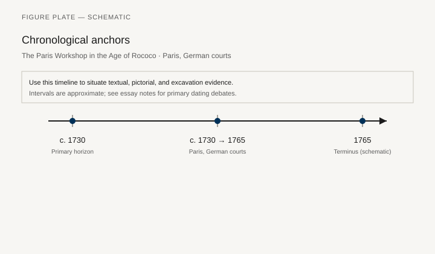
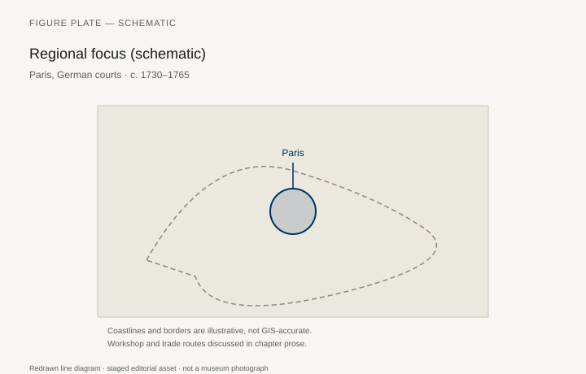
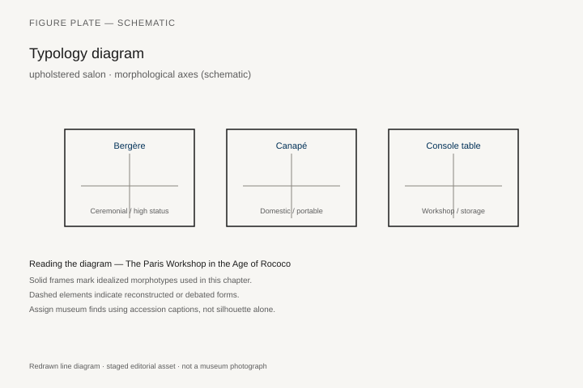
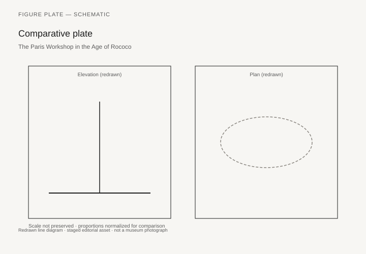

# The Paris Workshop in the Age of Rococo

A *bombe* commode by Charles Cressent or by a later *ébéniste* using Cressent’s mounts; a *bureau plat* with gilt-bronze corners that have become dragons; a chair by a *menuisier* whose stamp is on the seat rail — the Paris Rococo is a stamp, a guild, and a curve. The *estampille* becomes, after 1743 and more strictly later, a way to name a carcase. Salverte’s *Les ébénistes du XVIIIe siècle* and the Getty’s indexes of stamps are the phone books. The objects are in the Louvre, the Met, the Wallace, the Rijksmuseum, and a hundred princely German copies.

Rococo sitting is lower and more talkative than Louis XIV sitting. The *fauteuil à la reine* (flat back) and the *fauteuil en cabriolet* (curved back) are conversation chairs. The *canapé* and the *duchesse* invent new lengths for the body. Upholstery — silk, the *menuisier*’s frame as a servant of the *tapissier* — takes more of the budget than the wood. A furniture history that photographs frames in the white is a history of what the museum stripped.

## The curve as a joint problem

A cabriole leg that looks like a single pour is a set of carved members and a seat rail that has to take racking. The *menuisier* is a sculptor of oak or beech; the gilder is another shop; the tapissier is another. The *ébéniste*’s commode, meanwhile, has gone from Boulle’s metal skin to veneers of tulipwood, kingwood, end-cut *bois de bout* flowers (the J. F. Oeben and Riesener world, already sliding toward the next chapter’s classicism). Cressent, who was also a sculptor of mounts, sits on the join between the two trades. His dragons are furniture and bronze at once.

German Rococo (the Wies, the Amalienburg, the palaces of Franconia) takes the curve into architecture. German *ébénistes* (the Spindler brothers, the palaces of Potsdam) compete with Paris and also order from Paris. A “French” commode in a German inventory may have traveled. A “German” one may be quoting a print.

## Prints and the spread

Juste-Aurèle Meissonnier’s *Livre d’ornements* and the later *cahiers* of furniture prints teach the asymmetry that provincial shops will flatten. Chippendale’s *Director* (chapter 31) will steal from this print world and from Gothic and Chinese fashions at once. Rococo is portable as paper before it is portable as a chair.

Chinoiserie and *singerie* are the period’s fantasies of elsewhere: not Chinese furniture, but European lacquer and painted monkeys. Actual Chinese and Japanese lacquer screens were cut up and mounted (*vernis Martin* is the local imitation). Caption the difference.

## Women as patrons, not as upholstery

Madame de Pompadour’s patronage of Oeben and of a modern, smaller, more private furniture is a documented story (the *bureau du roi* is later, Riesener, already transitional). Women’s apartments at Versailles and in the hôtels of the Faubourg Saint-Germain required writing surfaces, needlework tables, and chairs that could be moved by a servant in a tight circle. The *table à ouvrage* is a type. So is the *voyeuse*, a chair you straddle or lean on to watch a card game. These are social machines. They are also jokes in wood.

## 1982.60.56: a monkey on a rope, a crowned C

The Metropolitan’s Cressent commode 1982.60.56 is the object that lets a reader leave the adjective “Rococo” and look at a carcase. Charles Cressent, Paris, about 1745–49; pine and oak veneered with amaranth and *bois satiné*; drawer bottoms of walnut, sides of oak, fronts of pine; gilt-bronze mounts; portoro marble; 34 1/2 by 55 by 22 3/4 inches; Linsky Collection, 1982. Two drawers in the front, a cupboard door in each side. The undulating outline repeats in the marble. The veneer is geometric parquetry. The mounts are the argument: Zephyr heads, scrolling acanthus, and two boys who swing a monkey on a knotted rope. Cressent had been trained as a sculptor. He had the bronzes cast and finished in his own workshop, flouting the guilds of *fondeurs-ciseleurs* and *ciseleurs-doreurs*, and was repeatedly in trouble for it. The mounts bear the crowned-C tax mark — C for *cuivre* — imposed by a royal edict of February 1745 and used until February 1749. That mark is why the date is not a guess.

The commode bears the trade label of Jean Rousselot. The Met notes that this appears to be one of the few Cressent pieces that passed through a *marchand-mercier*. The dealer is part of the object. So is the tax stamp. So is the guild complaint. A bombé commode is a collaboration that the *ébéniste*, in this case, tried to keep in one shop.

## When Wallace F85 stopped being Cressent

The Wallace Collection’s commode F85 was catalogued, for a long time, as Cressent. It is one of the most excitingly Rococo pieces in Hertford House: double-bowed bombé, *rocaille* gilt bronze, a female mask at the center that looks toward Watteau’s costumed heads. It appeared among the “Ouvrages de Sieur Cressent” in the posthumous sale of Monsieur de Selle in 1761. The present Wallace note reattributes it to Antoine-Robert Gaudreaus, about 1735–40. The oak carcase, kingwood veneer, and exaggerated curves are unlike other Cressent and more like Gaudreaus. Another Wallace commode, F86, is by Gaudreaus to a design associated with the Slodtz brothers for the Menus-Plaisirs. De Selle was, from 1731, intendant of the Argenterie, Menus-Plaisirs et Affaires de la Chambre du Roi. The rush-or-palm ornament, dragons, and volute feet on F85 rhyme with Slodtz designs. The type is a *commode à la Régence*: two tiers of drawers, higher off the ground than a *commode en tombeau*. At least seven nineteenth-century copies are known.

This is not a gotcha. It is how a stamp-less, sale-label luxury trade works. Salverte’s *Les ébénistes du XVIIIe siècle* and the Getty’s later indexes of stamps are phone books for the years after 1743, when the *estampille* becomes, more strictly later, a way to name a carcase. The stamp means a shop took responsibility. It does not mean the named man cut every leaf. Cressent’s mounts, reused, can outlive the first carcase. F85 teaches the other half: a famous name on an old sale catalog can outlive the carcase’s real shop.

The Wallace writing table F111, about 1725, attributed to Cressent — pine, oak, purpleheart, walnut, gilt bronze, leather; 78 by 196 by 97.7 cm — sits on the borderline between Boulle’s heavy C-scroll desks and the new curve. Female heads at the corners, Bacchus masks, a type Boulle had already made. The top was relined in red leather in 1965; it had been black. A table can change its skin and keep its mounts.

## Silk, beech, and the German order

Upholstery ate the budget. Silk from Lyon, show-covers changed with a season, frames of beech or oak that museums later stripped to “show the wood.” A Rococo chair photographed in the white is a half object. The *tapissier* was not an accessory. The *menuisier* carved the cabriole and the seat rail that has to take racking; the gilder was another shop; the conversation happened on silk. *Fauteuil à la reine*, *fauteuil en cabriolet*, *canapé*, *duchesse*, *voyeuse*: names for how a body occupies a tight circle of talk. Pompadour’s smaller, more private furniture is documented patronage of Oeben, not a romance pasted onto a commode.

German courts ordered from Paris and also built their own Rococo. The Amalienburg in the Nymphenburg park takes the furniture’s curve onto the wall: silver and blue, low rooms, carving that does not stop at the chair rail. Franconian palaces and Potsdam do the same at different temperatures. The Spindler brothers and other German *ébénistes* compete with Paris and quote its prints. A “French” commode in a German inventory may have traveled. A “German” one may be a Meissonnier sheet flattened by a provincial shop. Juste-Aurèle Meissonnier’s *Livre d’ornements* taught the asymmetry that Chippendale’s *Director* will steal in 1754, together with Gothic and Chinese fashions. Rococo is portable as paper before it is portable as a chair.

Chinoiserie and *singerie* are European fantasies of elsewhere: not Chinese furniture, but lacquer and painted monkeys. Actual Chinese and Japanese screens were cut up and mounted. *Vernis Martin* is the local imitation. Caption the difference or lie.

Oeben and the young Riesener are already thinning the line, feeding the *goût grec* that chapter 30 will treat as a new antique. The *bureau du roi*, finished by Riesener after Oeben’s death, is a transitional machine: Rococo swell in the body, a new rectangular discipline in the mounts. Rococo does not die in a day. It loses the argument in the fashionable hôtel and keeps it in the provincial parlor for another fifty years.

## Duvaux’s daybook, and a later house style

Lazare Duvaux’s *Livre-Journal* is the *marchand-mercier*’s daybook: porcelain, lacquer, and furniture sold as a mix the shop did not always make. The dealer is part of the object, as the Rousselot label on Cressent’s Met commode already showed. The *bureau du roi* — begun by Oeben in 1760, finished by Riesener in 1769, signed “Riesener Ft, 1769 à l’arsenal de Paris”; Louvre OA 5444, long on loan to Versailles as V 3750 — is the hinge out of this chapter: a lockable machine for a king’s papers, Rococo in the swell, already rectangular in the mounts. Delivered to Louis XV in May 1769.

François de Cuvilliés’s Amalienburg (1734–39) dates the German room that takes the chair’s curve onto the wall. A Coromandel screen sawn into a commode door is a violence against one object to finish another; the period enjoyed it. The later nineteenth century will revive Rococo as a house style for bankers. Those chairs can be excellent. They are not Cressent. The stamp, when genuine, is a shop’s legal name in a decade. When it is not, it is a wish.

## After 1743, a stamp is a legal name

The *estampille* becomes, after 1743 and more strictly later, a way to name a carcase. Salverte’s dictionary and the Getty’s later indexes are the phone books. The stamp means a shop took responsibility. It does not mean the named man cut every leaf. A *menuisier* stamped a seat rail; an *ébéniste* stamped a commode. The gilder and the *tapissier* did not leave the same iron. A chair photographed in the white is therefore a legal fragment: the wood has a name, the silk does not.

Oeben’s career is the other hinge. German-born, in Paris by the 1740s, he rented space from Charles-Joseph Boulle — the son — in the Louvre workshops, then held a royal warrant and rooms at the Gobelins and later the Arsenal. Pompadour’s patronage of his smaller, mechanical furniture is in the documents, not in a novel. He began the *bureau du roi* in 1760 with a detailed model; he died in 1763; Riesener, who married the widow and signed the desk in 1769, finished a machine whose cylinder lid and secret drawers were the point as much as the marquetry. The swell is still Rococo. The rectangle is already the next chapter. Pradère’s *French Furniture Makers* (1989) is the English door through that shop genealogy.

A *voyeuse* and a *table à ouvrage* remain the period’s social machines: a chair you lean on to watch cards, a table a servant can move in a tight circle. They are jokes in wood with real jobs. The *duchesse* lengthens a body that Louis XIV’s etiquette would have kept upright. Conversation sat lower than the Sun King. The mounts on 1982.60.56 — two boys, a monkey, a rope — are that conversation in bronze: play as a tax-marked luxury, dated by a crowned C between 1745 and 1749.

Wallace F85 remains the warning label for the whole decade. It looked like Cressent because a 1761 sale said so. The carcase, the kingwood, the curve now point to Gaudreaus and to the Menus-Plaisirs. A name on an old catalog is not a stamp. A stamp is not a day’s work by one man. The Paris Rococo is a guild argument you can still have in front of a commode.

## Beech, a seasonal silk, a provincial stamp

A Paris chair of the 1750s is a beech or oak frame that a *tapissier* will dress more than once. Show-covers changed with a season; the webbing and horsehair did not. When a museum later stripped the frame to “show the wood,” it produced a half object and then photographed it as the whole. The *bergère* — closed sides, a cushion you can sink into — is the period’s argument that sitting had become a longer event than a *tabouret* allowed. The *voyeuse* remains the joke: you lean on the crest to watch cards. Both types are social machines. Their dealer-French names should not hide the job.

Provincial stamps — Lyon, Toulouse, a German court joiner quoting a Meissonnier sheet — keep Rococo alive after fashionable Paris has already begun to square the commode. A stamped Paris chair of 1765 can look ashamed of its own cabriole. A Lyon chair of 1780 can still believe in it. X-rays and the Getty indexes sort some of the later wishes that wear a Paris name. The rest wait in the notes until a catalog catches up.

## Notes

- Metropolitan Museum of Art, commode 1982.60.56 (Cressent, crowned-C mounts, Rousselot label).
- Wallace Collection, commode F85 (now Gaudreaus, formerly Cressent); F86 (Gaudreaus); writing table F111 (Cressent).
- Comte de Salverte, *Les ébénistes du XVIIIe siècle* (Paris, 1923 and later eds.).
- Alexandre Pradère, *French Furniture Makers* (Malibu: Getty, 1989).
- Peter Fuhring on Meissonnier.
- *Bureau du roi*: Louvre OA 5444 / Versailles V 3750; Oeben 1760–63, Riesener to 1769.
- On stamps: Salverte indexes; Getty Provenance Index related files.

## Figure plan

*Fig. 1.* Chronological anchors for **The Paris Workshop in the Age of Rococo** (c. 1730–1765). Schematic redrawn line diagram; staged editorial asset (2026). Not a photograph of a museum object.

*Fig. 2.* Regional focus (schematic): Paris, German courts. Schematic redrawn line diagram; staged editorial asset (2026). Not a photograph of a museum object.

*Fig. 3.* Morphological typology for upholstered salon (idealized morphotypes). Schematic redrawn line diagram; staged editorial asset (2026). Not a photograph of a museum object.

*Fig. 4.* Comparative elevation and plan plate for upholstered salon. Schematic redrawn line diagram; staged editorial asset (2026). Not a photograph of a museum object.

### Supplemental photographs and redraws

**Fig. 5.** Fauteuil en cabriolet, stamped Paris *menuisier*, c. 1750.  
Met or Louvre — confirm stamp and accession.  
License: CC0 if Met.  
Alt: Gilded armchair with a curved back and floral silk (or show-cover).  
Caption: A conversation chair. The silk is half the object.

**Fig. 6.** Commode, Charles Cressent.  
Met 1982.60.56, Paris, ca. 1745–49; crowned-C mounts.  
License: Met, check OA.  
Alt: Bombé commode with parquetry and gilt-bronze boys swinging a monkey.  
Caption: The tax mark dates the bronze. The sculptor-ébéniste cast it himself.

**Fig. 7.** Meissonnier ornament print, PD.  
Met or BnF.  
License: PD.  
Alt: Asymmetrical engraved cartouche and furniture sketch.  
Caption: The curve travels as paper.

**Fig. 8.** Amalienburg interior, Munich, or a Paris hôtel *boiserie*.  
Wikimedia CC.  
Alt: Silver-and-blue carved room with low furniture.  
Caption: German Rococo takes the furniture’s curve onto the wall.

**Fig. 9.** Table à ouvrage or voyeuse.  
Met — confirm.  
License: CC0 if Met.  
Alt: Small work table or a spectator’s chair.  
Caption: A social machine with a cute name and a real job.
