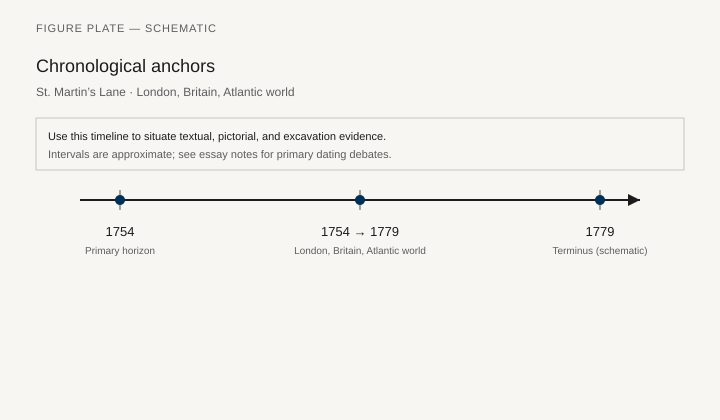
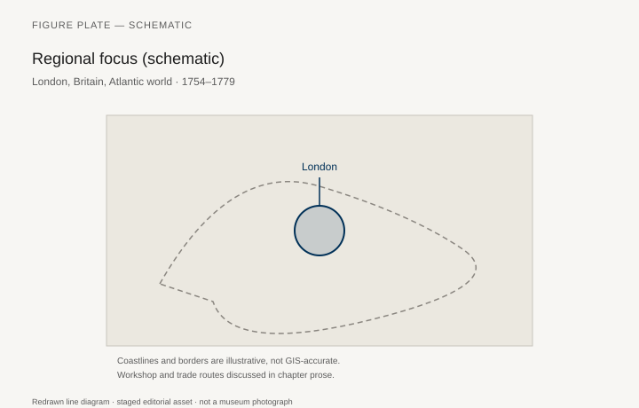
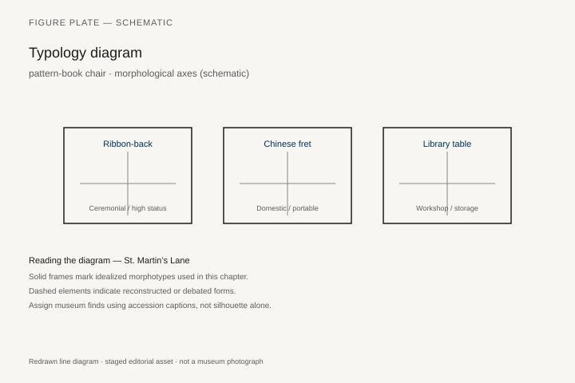
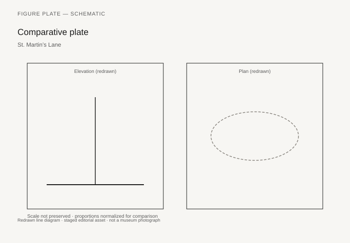

# St. Martin’s Lane

Thomas Chippendale’s *The Gentleman and Cabinet-Maker’s Director* was printed for the author and sold at his house in St. Martin’s Lane in 1754. The Met’s copy is Watson Library 161.1 C44 Q; the V&A holds the book as well. One hundred sixty-one plates: Gothic, Chinese, and “modern” (Rococo) taste, plus a set of plain pieces, with the orders of architecture up front and moldings drawn large enough to steal. A second edition followed in 1755; a third, enlarged, in 1762. The book sold. David Garrick was a client of the shop. North America used the plates without always using the shop. “Chippendale” became, and remains, a word for a chair the man never saw.

Christopher Gilbert’s *The Life and Work of Thomas Chippendale* (1978) is the biographical catalog. The shop was a full service: furniture, papers, upholstery, funerals. The *Director* was advertising, a pattern book for other men’s benches, and a claim to gentlemanly status by a man baptized in Otley, Yorkshire, in 1718.

## What the plates do not guarantee

A chair “after plate XII” can be London, Philadelphia, or a later revival. Philadelphia Chippendale — the high chests, the hairy-paw feet, the shops of Thomas Affleck, Benjamin Randolph, James Reynolds — is a documented American industry (the Philadelphia Museum and the Met’s American Wing). It is not a branch office. Mahogany, already the Atlantic luxury wood, came from the Caribbean through a slave economy. A plain sentence: the chair’s skin has a geography of forced labor. Jennifer Anderson’s *Mahogany* (2012) is the book.

The *Director*’s Chinese and Gothic plates are London fantasies. They sit next to actual Chinese hardwood furniture (chapter 19) without understanding it, and next to actual Gothic stalls (chapter 15) without measuring them. The plates are good for London Rococo and for the idea that a cabinetmaker might publish like an architect.

## The shop’s own work

Documented Chippendale commissions (Dumfries House, Nostell, Harewood, the Paxton and Dumfries bills) show a range from carved gilt to solid mahogany to, later, the cleaner lines of the 1770s when Robert Adam’s taste pressed the shop. The man died in 1779. The son’s shop continued. Attribution without a bill is a sport. Gilbert was stricter than the trade.

Upholstery, again, is half the object. The *Director* shows frames. Clients sat on silk and horsehair. Museum show-covers are guesses or documents, depending on the textile evidence.

## What 1754 actually sold

The first *Director* was printed for the author and sold at his house in St. Martin’s Lane. The title page says so. The Met’s copy, Watson Library 161.1 C44 Q, is a book a cabinetmaker could steal from: 161 plates, the orders of architecture up front, moldings drawn large, “Gothic, Chinese, and Modern taste” as a menu, plus a set of plain pieces that the later fame of the wild plates has starved of air. A second edition followed in 1755, close enough to be a reprint with corrections. The third, 1762, is enlarged — more plates, a thicker claim. `[CITE NEEDED: exact plate count of the 1762 edition as bound in a named library copy.]` The book is advertising, a pattern book for other men’s benches, and a claim to gentlemanly status by a man baptized in Otley, Yorkshire, in 1718.

Christopher Gilbert’s *The Life and Work of Thomas Chippendale* (1978) remains the biographical catalog. The shop was full service: furniture, papers, upholstery, funerals. David Garrick was a client. Garrick’s accounts, where they survive, pay for show-covers and changes of silk. The plates do not engrave those. A *Director* chair in a museum, show-wood stripped, is a drawing. Hepplewhite, in 1788, would still write that mahogany chairs should have seats of horsehair, “plain, striped, checquered, &c. at pleasure.” Chippendale had already been selling that skin.

The *Director* is a menu. The kitchen cooked what the client ordered. Dumfries House, where a documented suite survived in situ and was published as such, is the teaching collection for what the shop actually sent out: carved mahogany, sober and rich, less frenzied than the wildest Rococo plates. Nostell and Harewood show the same shop answering Adam’s later, cleaner pressure in the 1760s and 1770s. The Paxton and Dumfries bills are Gilbert’s method in paper: no “Chippendale” without a trail. The market still hates the method. It needs the adjective.

## Philadelphia reads the book

A chair “after plate XII” can be London, Philadelphia, or a later revival. Philadelphia Chippendale is a documented American industry, not a branch office. Thomas Affleck, Benjamin Randolph, James Reynolds, and the carvers around them appear in bills more often than most English journeymen. The Met’s high chest of drawers 18.110.4, Philadelphia, 1762–65 — mahogany, mahogany veneer, yellow pine, yellow poplar, northern white cedar, brass; 91 3/4 by 44 5/8 by 24 5/8 inches; Kennedy Fund, 1918 — carries a scrolled pediment with a figural finial bust that the museum’s own note compares to plates in the 1754 *Director*. The serpent-and-swan motif on the bottom drawer is based on a design in Thomas Johnson’s *A New Book of Ornaments* (1762). Two London books, one Philadelphia carcase, Caribbean wood. The owner stowed couture and linens. The chest is a wardrobe with a broken pediment.

A second Met high chest, 18.110.6, Philadelphia, 1755–90, mahogany, tulip poplar, yellow pine, 99 by 45 1/2 by 25 inches, is the “powerful stance” the American Wing has used for a generation to stand for the Philadelphia school. Morrison Heckscher’s *American Furniture in The Metropolitan Museum of Art* (the Queen Anne and Chippendale volume) is the catalog behind the postcard. Hairy-paw feet, a carved skirt, a local swagger: London’s book, not London’s bench.

## The wood’s other geography

Mahogany was already the Atlantic luxury wood. It came from the Caribbean through a slave economy. Jennifer Anderson’s *Mahogany: The Costs of Luxury in Early America* (2012) is the book that belongs next to Gilbert, not in a footnote. A plain sentence: the chair’s skin has a geography of forced labor. The *Director* does not engrave that either. St. Martin’s Lane sold taste. The island cut the tree.

The Chinese and Gothic plates are London fantasies. They sit next to actual Chinese hardwood furniture (chapter 19) without understanding it, and next to actual Gothic stalls (chapter 15) without measuring them. They sold because a client wanted a Gothick garden chair or a pagoda cabinet. Actual *huanghuali* in an English house, when it appeared, arrived as curiosity. It did not look like plate CXXIII. The plates taught taste as tourism. They also taught a cabinetmaker that he might publish like an architect. That second lesson is the one that lasted.

Hepplewhite (1788) and Sheraton (1791–94) are not “after Chippendale” in a line of kings. They are later London books for the thinner antique of chapter 30. Nineteenth-century “Chippendale” is a revival industry. Twentieth-century “Chippendale” is an auction category. This chapter’s job is a street address in 1754, a Yorkshire maker, 161 plates, a set of bills, and a forest at the other end of the ship.

## Dumfries House, May 1759

More than a quarter of the first edition’s subscribers were Scots, a concentration around Edinburgh and Fife that the Furniture History Society has mapped through James Rannie, Chippendale’s Leith partner, and a short-lived architect, Alexander Spens, once cited as co-author. The book reached benches that would never send a crate to London. `[CITE NEEDED: a library shelfmark if the old claim that Louis XVI owned a French *Director* is to stay.]`

Gilbert’s 1969 *Burlington Magazine* essay, “Thomas Chippendale at Dumfries House,” is still the teaching text for the early shop. The fifth Earl of Dumfries, furnishing a new Ayrshire house, visited London in early 1759. Bills for fabrics run from 12 February to 8 March. A letter of 29 May 1759 arranges the transport of more than fifty items north. The drawing-room suite that survived in situ — two mahogany settees and fourteen elbow chairs — cost £71 8s for the chairs and £26 10s for the sofas. A rosewood bookcase of 1759 cost £47 5s, a sum the later Dumfries literature never tires of repeating because the receipt survived. Girandoles that combine two *Director* plates went at £36 15s; a pair of concertina-action card tables at £11; a hexagonal lantern repeating a published design at £13 13s. A breakfast table by the London maker Samuel Smith, supplied 9 September 1756 at £3 3s and corresponding to plate XXXIII in the 1754 *Director*, taught the Earl that he could go to the man himself; Smith received no further commissions. Chippendale’s own mahogany breakfast table, receipt 5 May 1759, “of fine wood wt. a writing drawer and wirework,” cost £6 8s. The Earl, once installed, told his lawyer the new combination was “monstrous.” The furniture stayed. Dumfries remains the teaching rooms for the early Rococo shop because the bills and the objects still meet. A 1905 chair with a ribbon splat is a new object with an old name. The adjective can wait in the sale room.

## An Adam house, a warehouse visit, later cleaner lines

Dumfries House itself was built by John, Robert, and James Adam between 1754 and 1759 — the same years as the first *Director*. Gilbert’s *Burlington* essay notes that the Earl wanted economy, that he may have chosen ready-made pieces from Chippendale’s warehouse, and that the consignment of more than fifty items left London before the end of May 1759. A letter of 29 May to the Earl “at Liefnorris near Air” sets out the transport. The furniture that accepted those terms, Gilbert argued, can be read as typical of the shop’s regular late-1750s output and as a guide to how the plates were actually used. The wildest Rococo plates were a menu. Ayrshire got carved mahogany that a house could live with.

Nostell Priory and Harewood, in the 1760s and 1770s, show the same shop under Adam’s later pressure: cleaner lines, a different antique, bills that Gilbert trusted more than adjectives. The man died in 1779. The son’s shop continued. David Garrick’s accounts remain the theatrical end of the client list — show-covers, changes of silk, a full-service house that also did funerals. Upholstery is still half the object. The *Director* engraved frames.

The 1762 edition enlarged the claim. `[CITE NEEDED: plate count of a named 1762 copy.]` Hepplewhite and Sheraton, a generation later, wrote thinner books for a thinner taste. They did not kill the *Director*’s afterlife. Philadelphia kept reading 1754 into the 1760s, as 18.110.4 still shows: a *Director* pediment, a Johnson swan, Caribbean mahogany, a local carver. St. Martin’s Lane sold a book. The Atlantic made the furniture.

James Rannie, the Leith partner who underwrote the early business, is why so many first-edition subscribers were Scots. The Furniture History Society’s mapping around Edinburgh and Fife is not a curiosity. In a country with little tradition of turned common furniture, plates that could be applied to square-sectioned timber were in demand. Derivative “Chippendale” in a later croft or a colonial shop is the book working as the book was meant to work: without the London crate.

Mahogany remains the sentence Anderson wrote and Gilbert did not have to. The splat is London taste. The tree is Caribbean labor. 18.110.6, the taller Philadelphia high chest, 99 inches of carved swagger, is the same sentence at a different budget. Heckscher’s catalog is the place for the carver’s local habits — the hairy paw, the skirt, the stance. London’s book, Philadelphia’s bench, an island’s wood. The *Director* did not engrave any of those three geographies except the first.

## Nostell, Harewood, and the shop after Adam

Gilbert’s later chapters on Nostell Priory and Harewood House are the other half of Dumfries. After about 1765 the same St. Martin’s Lane firm answered Robert Adam’s cleaner antique: less Rococo frenzy, more inlay, a different mahogany sentence. The *Director* plates of 1754 do not predict those rooms. The bills do. Chippendale died in 1779; the son’s shop continued the Adam-facing work and the funerals. Attribution without a paper trail remains a sport the 1978 catalog tried to kill.

David Garrick’s commissions — town and the villa at Hampton — show the full-service shop: papers, upholstery, a theatre man’s taste. The surviving accounts pay for silk changes the plates never engraved. A museum *Director* chair in show-wood is still a drawing until the textile evidence is named.

The 1762 edition thickened the Gothic and Chinese plates without measuring a stall or a *huanghuali* yoke-back. Those pages taught taste as tourism. They also taught a cabinetmaker that he might publish like an architect. Philadelphia’s high chests (Met 18.110.4, 18.110.6) took the lesson and kept a local carver’s swagger. The forest at the other end of the ship did not change.

## Notes

- Thomas Chippendale, *The Gentleman and Cabinet-Maker’s Director* (London, 1754, 1755, 1762); Met Watson Library 161.1 C44 Q.
- Christopher Gilbert, *The Life and Work of Thomas Chippendale* (London: Studio Vista / Christie’s, 1978); “Thomas Chippendale at Dumfries House,” *Burlington Magazine* 111 (1969).
- Jennifer L. Anderson, *Mahogany: The Costs of Luxury in Early America* (Cambridge, MA: Harvard, 2012).
- Metropolitan Museum of Art, high chests 18.110.4, 18.110.6; Morrison H. Heckscher, *American Furniture in The Metropolitan Museum of Art*, Late Colonial period, vol. II.
- Thomas Johnson, *A New Book of Ornaments* (London, 1762), for the serpent-and-swan on 18.110.4.

## Figure plan

*Fig. 1.* Chronological anchors for **St. Martin’s Lane** (1754–1779). Schematic redrawn line diagram; staged editorial asset (2026). Not a photograph of a museum object.

*Fig. 2.* Regional focus (schematic): London, Britain, Atlantic world. Schematic redrawn line diagram; staged editorial asset (2026). Not a photograph of a museum object.

*Fig. 3.* Morphological typology for pattern-book chair (idealized morphotypes). Schematic redrawn line diagram; staged editorial asset (2026). Not a photograph of a museum object.

*Fig. 4.* Comparative elevation and plan plate for pattern-book chair. Schematic redrawn line diagram; staged editorial asset (2026). Not a photograph of a museum object.

### Supplemental photographs and redraws

**Fig. 5.** Title page or a plate from the 1754 *Director*.  
Met 161.1 C44 Q or a PD scan.  
License: PD.  
Alt: Engraved title page naming St. Martin’s Lane.  
Caption: Sold at his house. 161 plates for anyone who could pay for the book.

**Fig. 6.** Rococo chair plate from the *Director*.  
PD.  
Alt: Engraved cabriole chair with carved splat.  
Caption: “Modern taste” in 1754 means this curve.

**Fig. 7.** Drawing-room seating from Dumfries House.  
Chippendale and Rannie, dispatched May 1759; bills in Gilbert, *Burlington* 1969.  
License: as marked (house collection).  
Alt: Mahogany elbow chair or settee from a documented suite.  
Caption: Gilbert’s rule: the bill before the adjective. The Earl called the mix monstrous. It stayed.

**Fig. 8.** High chest of drawers, Philadelphia.  
Met 18.110.4, 1762–65; pediment after the *Director*, bottom drawer after Johnson 1762.  
License: Met CC0.  
Alt: Tall mahogany chest with a scrolled pediment and a carved lower drawer.  
Caption: A Philadelphia industry, two London books, a Caribbean wood.

**Fig. 9.** Chinese or Gothic plate from the *Director*.  
PD.  
Alt: Engraved cabinet with fretwork or pointed arches.  
Caption: London’s elsewhere, on paper.
