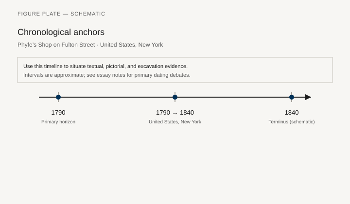
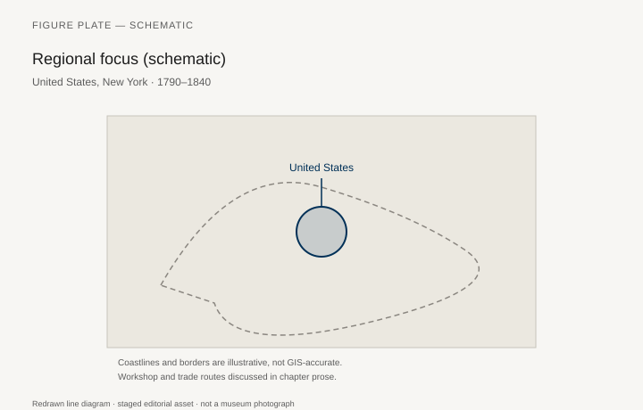
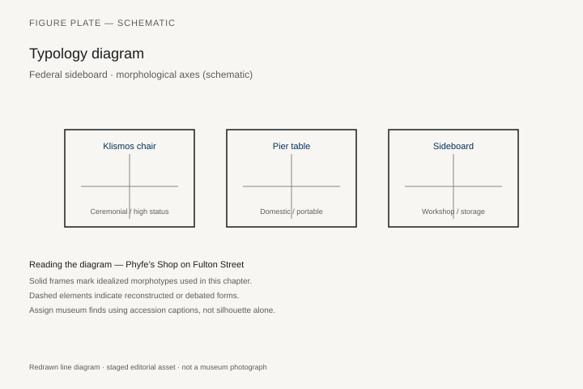
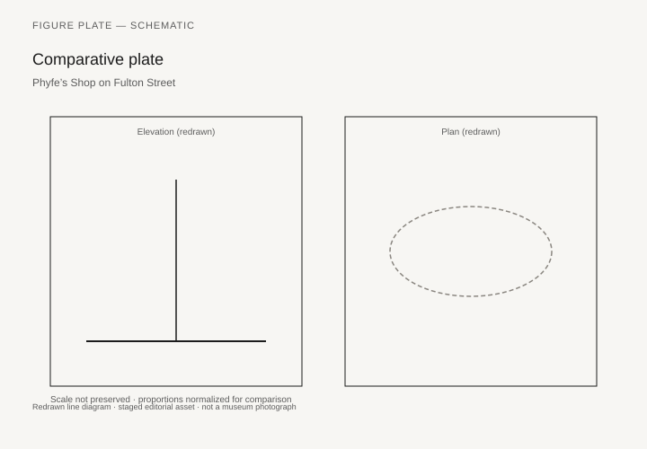

# Phyfe’s Shop on Fulton Street

Duncan Phyfe (born Duncan Fife, near Lock Fannich, Ross-shire, 1768/70–1854) ran a New York shop that made the city’s Federal and later Grecian furniture into a recognizable product. The Met’s sofa 42.16, attributed to the workshop, 1805–15 — mahogany, white pine, tulip poplar, 37 by 80¼ by 25 inches — is a scroll-back of the first rank. The museum’s present horsehair and gilt tacks copy the first upholstery foundations. Peter M. Kenny and Michael K. Brown’s *Duncan Phyfe: Master Cabinetmaker in New York* (Met, 2011) is the catalog that replaced a century of wishful attributions with a shop’s archive: addresses, apprentices, the move from Partition/Fulton Street, the later partnership with his sons.

Federal America is not only Phyfe. It is Salem and Boston (the Seymour shop, the McIntire carvers), Philadelphia after Chippendale, Charleston, Baltimore painted furniture, Newport’s fading Goddard-Townsend world. This chapter uses Phyfe because the Met’s 2011 show made the shop countable, and because the sofa 42.16 is a New York sentence in mahogany: reeded legs, carved thunderbolts or leaves on the stay rail, a Greekness that has gone through London and Paris and come out polished, not painted.

## A shop, not a lone genius

Phyfe employed specialists. Attribution to “the workshop” is the honest phrase on 42.16. The woods are a North Atlantic kit: mahogany for show, white pine and tulip poplar for the hidden members — the same secondary-wood logic as a Philadelphia high chest, the same Caribbean mahogany problem as Chippendale. New York’s port is the shop’s condition. So is a clientele of merchants who wanted a Grecian drawing room without Latrobe’s archaeologist paint.

The klismos and the saber leg arrive here as production. Dozens of chairs, not a unique set. The harp-back, the lyre, the vase splat: a vocabulary a journeyman could repeat. Quality is in the carving of the leaf and the balance of the sofa’s scroll, not in a new type each year.

## Other American benches

The Seymour shop’s veneers and the Salem carvers’ baskets of fruit are a different Federal: more inlay, more New England reserve. Southern shops used the same pattern books with local cypress and a different humidity problem. Enslaved joiners in the South and in New York (slavery in New York legally ends, in stages, in Phyfe’s working life) are part of the labor history that older catalogs skipped. Chapter 42 returns to who makes. Here, name the gap. `[CITE NEEDED: specific documented enslaved or free Black workmen in Phyfe’s or contemporary New York shops — Kenny 2011 notes, if any.]`

Painted fancy chairs (the Hitchcock type, slightly later) are the cheaper Grecian. They belong to a broader market than Fulton Street. The ladder of sitting in the early republic is wide.

## After 1820

Phyfe’s shop followed the Grecian into heavier pillars, then into a revivalism that the 2011 catalog does not try to make fashionable. The man died in 1854, the year a different New York was being built. The sofa 42.16 remains an 1810 idea: a Roman-Greek couch for a merchant house, horsehair that scratches, mahogany that glows, a city that wanted to look like a capital.

## Sofa 42.16, workshop attribution

The Met’s label on 42.16 is already careful: attributed to the workshop of Duncan Phyfe, New York, 1805–15; mahogany, white pine, tulip poplar; 37 by 80 1/4 by 25 inches; gift of Mrs. Harry Horton Benkard, 1942. “In its quality and condition, this scroll-back sofa is among the finest known examples of this classic New York form.” The modern black horsehair and gilded tacks cover original period upholstery foundations and “replicate the look of the sofa when it first came out of the workshop.” Peter Kenny, writing later on horsehair, was blunter about the skin: people admired the burnished look, not the comfort. Chippendale had sold crimson haircloth. Hepplewhite had prescribed horsehair for mahogany seats. Phyfe’s New York still wanted that formal shine.

Kenny and Michael K. Brown’s *Duncan Phyfe: Master Cabinetmaker in New York* (Met, 2011) is the catalog that replaced a century of wishful “Phyfe” with a shop’s archive: the Scottish birth near Lock Fannich, Ross-shire, 1768/70; the New York addresses; the move from Partition Street when it became Fulton; apprentices; the later partnership with his sons. Attribution to “the workshop” on 42.16 is the honest phrase. Specialists carved the thunderbolts or leaves on the stay rail, turned the reeded legs, balanced the scroll of the back. Quality is in that leaf and that balance, not in a new type each year.

The woods are a North Atlantic kit: mahogany for show, white pine and tulip poplar for the hidden members — the same secondary-wood logic as Philadelphia 18.110.4, the same Caribbean mahogany problem as Chippendale. New York’s port is the shop’s condition. So is a clientele of merchants who wanted a Grecian drawing room without Latrobe’s archaeologist paint.

## The Pearsall suite and a letter to Philadelphia

A different Met sofa, 60.4.1, about 1810–20, mahogany, tulip poplar, cane, gilded brass, 34 by 84 3/4 by 23 3/4 inches, belongs to a large suite once owned by Thomas Cornell Pearsall, a New York merchant and shipowner: a pair of armchairs, ten side chairs, two footstools; other chairs at the Museum of the City of New York. The armchair 60.4.2 and the side chair 60.4.4 (32 1/2 by 17 7/8 by 16 1/4 inches) sit in Gallery 728. The attribution rests on a Pearsall family tradition and on an inscription stamped inside the seat rails of the sofa and several chairs. The curule-base design derives from Greco-Roman seating in the 1808 supplement to the London *Chairmakers’ and Carvers’ Book of Prices*. Cane, not horsehair, is the seat. A shop could speak more than one Grecian dialect in the same decade.

The Met’s Heilbrunn essay on Phyfe and Charles-Honoré Lannuier records an 1816 letter from Phyfe to the Philadelphian Charles Bancker with illustrations and prices for chairs. A set with curule-shaped bases and splats, of which 60.4.4 is the Museum’s example, is tied to those drawings. Northern shops sold south: Mid-Atlantic and Southern states, Cuba, Guadeloupe; speculative lots to stores and auction rooms, or commissions of higher quality. The Museum’s Richmond Room (68.137) puts Phyfe and Lannuier furniture into a Virginia interior for that reason. New York made for a coast, not only for Fulton Street.

Lannuier, French-trained, arrived in 1803 and died in 1819. His labeled work is the other New York Grecian: more gilt, more Paris, a different shop next door to Phyfe’s reputation. The 2011 catalog keeps them adjacent without collapsing them. A saber leg is not a signature.

## Other benches, and the labor the older labels skipped

Federal America is not only Phyfe. Salem and Boston — the Seymour shop’s veneers, the McIntire carvers’ baskets of fruit — are a different Federal: more inlay, more New England reserve. Charles Montgomery’s *American Furniture: The Federal Period* (1966) remains the Winterthur survey. Philadelphia after Chippendale kept its own shops. Charleston and other Southern benches used the same pattern books with local cypress and a different humidity problem. Newport’s Goddard-Townsend world was fading. Baltimore painted furniture and, a little later, Hitchcock fancy chairs are Grecian for a wider street than Fulton. The ladder of sitting in the early republic is wide.

Enslaved joiners in the South, and enslaved and free Black workmen in New York — the state’s gradual emancipation ran out in 1827, inside Phyfe’s working life — are part of the labor history older catalogs skipped. Chapter 42 returns to who makes. Here the gap stays named. `[CITE NEEDED: specific documented enslaved or free Black workmen in Phyfe’s or contemporary New York shops — Kenny 2011 notes, if any.]` Anderson’s *Mahogany* (2012) again supplies the forest at the other end of the ship. A reeded leg does not become innocent because the shop was in Manhattan.

After 1820 the shop followed the Grecian into heavier pillars, then into a revivalism the 2011 catalog does not try to make fashionable. Phyfe died in 1854, the year a different New York was being built — iron, glass, steam factories up the Hudson. The sofa 42.16 remains an 1810 idea: a merchant couch, horsehair that scratches, a city that wanted to look like a capital. Thonet’s beech, next, will answer a different room: the café, not the parlor.

What the 2011 show did is make the shop countable. Apprentices have names. Addresses move. A piece without a paper trail goes back to “New York, attributed to the workshop.” That sentence is not a demotion. It is the first honest label a lot of American furniture ever received. The klismos arrives here as production — dozens of chairs, not a unique set. Latrobe’s painted archaeology (Met 1994.189) remains the architect’s version. Phyfe’s polish is the merchant’s. Both are American readings of a European reading of a vase. Chapter 8’s missing Greek wood is still missing. New York sat on the drawing anyway.

## 168–172 Fulton Street

The Met’s watercolor 22.28.1, 1817–20 — watercolor, ink, and gouache on white laid paper, 15 7/8 by 19 5/8 inches, Rogers Fund, 1922 — shows the shop and warehouse at 168–172 Fulton Street. Older labels gave it to John Rubens Smith; later work thinks an amateur, perhaps even a shop employee, working in the language of a billhead. Phyfe had settled at 35 Partition Street by 1795. He bought 34 next door in 1807 and 33 in 1811: dwelling, salesrooms, workshop, all on one side of the street. After Robert Fulton’s death, Partition and Fair were renamed Fulton and renumbered in 1816–17. The shop became 168, 170, and 172, with the house opposite at 169. A later renumbering around 1826 produced 194–196 and 193. The 1802 city directory lists one Phyfe, cabinetmaker, at the Partition Street address.

Lannuier’s shop, from 1804 until his death in 1819, was on Broad Street. He labeled. Phyfe more often did not. That is why 42.16 says “workshop of” and why the Pearsall rails, with their stamped inscription and family tradition, matter. A port city with two Grecian shops, one Paris-trained and one Scottish-New York, sold the same saber leg to different clients. The watercolor is the address made visible. The sofa is the product. The 2011 catalog is the archive that made both countable.

The Pearsall suite’s curule bases come from a London price book, not from a vase in a tomb. That is Federal New York in one joint: Greco-Roman as a published shape a journeyman could price. Cane on 60.4.1, horsehair on 42.16 — two skins, one decade. Seymour’s Salem veneers and McIntire’s fruit baskets remain the New England contrast: more inlay, less thunderbolt. Hitchcock stencils, a little later, are Grecian for the hall. The front parlor kept the mahogany.

1827 ends New York’s long unwind of slavery inside the shop’s working life. The names of workmen of color are still the gap. `[CITE NEEDED: Kenny 2011 or a directory study.]` The 2011 rule still holds for the wood: say “workshop of” unless a document says more. 42.16 keeps that rule on the wall.

## A watercolor of the shop, a letter with prices

The Met’s watercolor of Phyfe’s warehouse and warerooms (22.28.1) is the rare picture of the business as a street front, not as a sofa. Use it as a document of display: finished work in the window, a port city selling Grecian as stock. The 1816 letter to Charles Bancker in Philadelphia, with drawings and prices, is the other document: a New York shop selling south, to stores and to named clients. The Heilbrunn essay that prints the connection to the Pearsall curule chairs (60.4.4) is the public trail. Northern shops made for a coast.

Lannuier’s labeled pier tables and beds — gilt caryatids, stamped brass, a Parisian Empire that did not need Phyfe’s name — sat in the same directories. The 2011 catalog keeps the two shops adjacent without collapsing them. A saber leg is not a signature. A family tradition that says “Phyfe” is a starting rumor.

Hitchcock fancy chairs, slightly later, took Grecian stenciling onto a factory seat for hallways and upstairs rooms. They belong in the same decade’s houses as 42.16, not in the same parlor. The ladder of sitting is the chapter’s last honest measurement.

## Notes

- Peter M. Kenny and Michael K. Brown, *Duncan Phyfe: Master Cabinetmaker in New York* (New York: Met, 2011).
- Metropolitan Museum of Art, sofa 42.16 (Benkard, 1942); Pearsall suite 60.4.1, 60.4.2, 60.4.4; shop watercolor 22.28.1; Richmond Room 68.137.
- Charles F. Montgomery, *American Furniture: The Federal Period* (Winterthur / Viking, 1966).
- On mahogany: Anderson, *Mahogany* (2012).
- Met Heilbrunn essay, “Duncan Phyfe (1770–1854) and Charles-Honoré Lannuier (1779–1819),” for the 1816 Bancker letter.

## Figure plan

*Fig. 1.* Chronological anchors for **Phyfe’s Shop on Fulton Street** (1790–1840). Schematic redrawn line diagram; staged editorial asset (2026). Not a photograph of a museum object.

*Fig. 2.* Regional focus (schematic): United States, New York. Schematic redrawn line diagram; staged editorial asset (2026). Not a photograph of a museum object.

*Fig. 3.* Morphological typology for Federal sideboard (idealized morphotypes). Schematic redrawn line diagram; staged editorial asset (2026). Not a photograph of a museum object.

*Fig. 4.* Comparative elevation and plan plate for Federal sideboard. Schematic redrawn line diagram; staged editorial asset (2026). Not a photograph of a museum object.

### Supplemental photographs and redraws

**Fig. 5.** Sofa, workshop of Duncan Phyfe.  
Met 42.16, New York, 1805–15.  
License: Met CC0.  
Alt: Mahogany scroll-back sofa with reeded legs and black horsehair.  
Caption: The tacks and horsehair are a modern copy of the first foundations.

**Fig. 6.** Side chair from the Pearsall suite.  
Met 60.4.4, attributed to Duncan Phyfe, New York, 1791–1818.  
License: Met CC0.  
Alt: Mahogany side chair with a curule base and splat.  
Caption: Stamped rails, a merchant’s suite, a London price book’s Greco-Roman.

**Fig. 7.** Shop and Warehouse of Duncan Phyfe, 168–172 Fulton Street.  
Met 22.28.1, watercolor, ink, and gouache, 1817–20.  
License: Met, check OA.  
Alt: Three brick shopfronts with show windows and a “Duncan Phyfe, Cabinet-maker” sign.  
Caption: Partition Street, renamed. The 2011 catalog put the addresses back on a map.

**Fig. 8.** Seymour or Salem Federal card table, for contrast.  
Winterthur or Met.  
License: as marked.  
Alt: Satinwood-inlaid card table.  
Caption: New England Federal: more inlay, less New York thunderbolt.

**Fig. 9.** Painted fancy chair, Hitchcock or Baltimore.  
Met or a historical society.  
License: as marked.  
Alt: Painted side chair with gold stenciling.  
Caption: Grecian for a wider street than Fulton.
