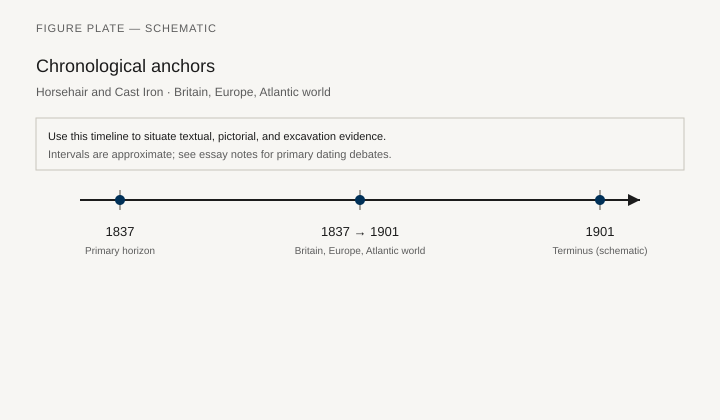
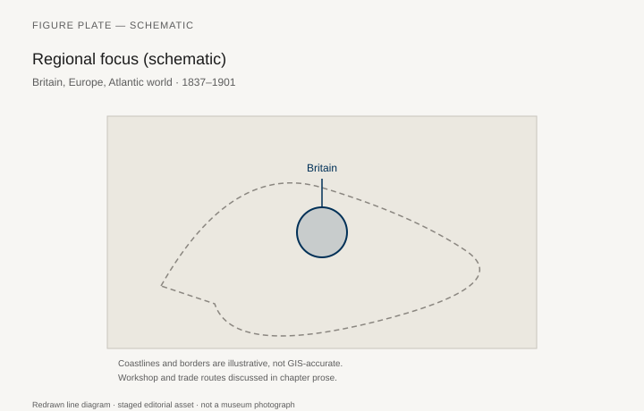
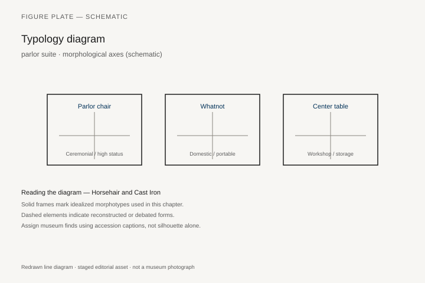
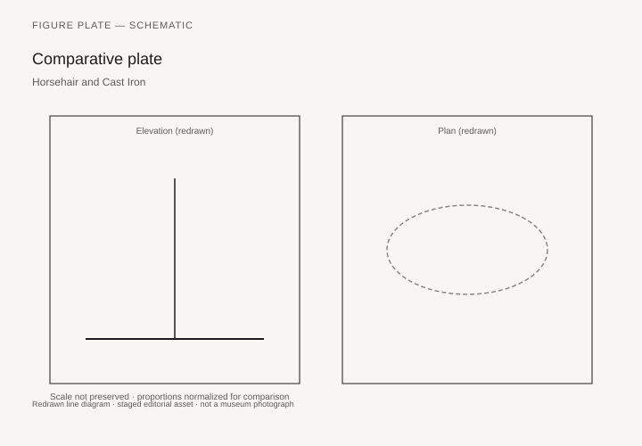

# Horsehair and Cast Iron

A mid-Victorian parlor can hold a balloon-back chair in walnut, a coil-sprung sofa in buttoned velvet, a papier-mâché chair from Birmingham, a cast-iron hall stand, and a “medieval” sideboard that Pugin would have disowned. The room is a warehouse of revival. What is new is not a style. It is coil springs (the 1820s–30s patents, then an industry), deep upholstery, the sewing machine, the railway, the department store, and a middle class that bought suites. Clive Edwards’s *Victorian Furniture* (1993) and the V&A’s British Galleries texts are safer than a joke about tassels.

This chapter is about the stuffed room and the metal room, not about listing Gothick, Elizabethan, Louis XVI, and “Japanese” as a menu. Those names were real catalog headings. They were also a way to sell the same sprung seat in different veneers.

## Springs, horsehair, and the body

Before coil springs, a seat is webbing, stuffing, and horsehair in a relatively shallow box. After, a sofa can be a mattress on its side. Comfort becomes a selling word. So does hygiene, later, when the same stuffing is accused of dust and moth. The *tapissier* and the upholsterer rise in the trade’s hierarchy. Frames can be beech, cheap and hidden. Show-wood is walnut, rosewood, mahogany, ebonized cheap hardwoods.

Cast iron — Coalbrookdale benches, hall stands, sewing-machine bases that are also furniture — puts the foundry in the house. Garden furniture in iron is public-park furniture at home. Brass beds, iron beds, the hospital’s metal bed: a new cleanliness and a new industry. Michael Thonet’s beech (chapter 33) is the light opposite of this heavy metal.

## Papier-mâché, gutta-percha, and the novelty shop

Birmingham and Wolverhampton japanned papier-mâché chairs and trays are Victorian in the strict sense: a local industry, a shiny black, mother-of-pearl inlay, a chair that surprises people who think furniture is timber. Gutta-percha and early plastics appear as small goods. The period is already synthetic. It does not wait for Bakelite.

Campaign furniture — the chest that is a trunk, the chair that folds — is an imperial type. Teak and brass, the army and the civil service. Jaffer’s India book (chapter 22) meets a British maker in Portsmouth. The type is older than Victoria; the catalog is Victorian.

## Pugin, the Gothic, and the moral attack

A. W. N. Pugin’s *True Principles* (1841) and the Houses of Parliament furniture are an argument against the parlor’s lies: veneer, sham Gothic, a pointed arch glued onto a commode. The argument will feed Arts and Crafts (chapter 35). It does not empty the department store. Eastlake’s *Hints on Household Taste* (1868) is the popular moral book. Liberty’s later shop will sell a cleaned-up version of the same conscience.

World’s fairs (1851, 1862, 1867, 1876, 1889) are furniture theatres. The Medieval Court, the Indian Courts, the machine furniture: a reader of this series has now seen enough other centuries to recognize what is being quoted and what is being invented.

## Samuel Pratt’s coil and the hidden frame

Samuel Pratt of New Bond Street — BIFMO lists him as an upholder and, with the family firm, a trunk and camp-equipment maker — received British Patent 5418 in 1826 for “Beds, Bedsteads, Couches, Seats and Other Articles of Furniture,” and Patent 5668 in 1828 for “Elastic Beds And Cushions.” The 1828 specification draws hour-glass wire coils. John Gloag, in *Victorian Comfort* (1961), put the commercial turn in the early 1830s: Birmingham factories making thousands of single- and double-cone springs, first for mattresses, then for easy-chairs. Clive Edwards has warned that springing is not a clean nineteenth-century invention. Coach-builders wanted a better ride before cabinetmakers wanted a deeper seat. The parlor still changed. A stuff-over seat on webbing is a shallow box. A coil-sprung sofa is a mattress stood on its side and buttoned so the ticking will not walk.

The balloon-back chair of the 1850s–70s is the period’s most repeated show-wood type: a rounded, often pierced back in walnut or mahogany, cabriole or turned front legs, a stuff-over seat whose real timber is beech. Edwards’s *Victorian Furniture* (1993) is the book that keeps the technology in view when the auction caption only wants the silhouette. The V&A British Galleries treat the type as a trade object, not a named masterpiece. That is the right temperature. A balloon-back is a shop product. The carver’s labor sits on the back rail. The upholsterer’s labor is the part you sit on and cannot see.

Comfort became a selling word. So, later, did hygiene. Horsehair, flock, and the closed sprung box collected dust and moth. Late-century reformers and early-twentieth-century modernists would use that accusation against the stuffed room. The accusation was not invented. It was also convenient. A chrome frame is easier to wipe than a buttoned sofa. That does not make the sofa a lie. It makes it a textile object with a timber skeleton.

BIFMO’s Pratt entry is useful for the shop, not only the patent. In December 1833 the firm supplied a chaise longue to Lord Leigh of Stoneleigh Abbey at £13 13s; in March 1834 a patent sofa seat at £7. Goods for Stafford House in 1838 ran to £228. The coil is a specification. The invoices are how it entered rooms that already had titles.

## The foundry in the hall

The Coalbrookdale Company — Abraham Darby’s coke-smelted ironworks at Coalbrookdale, Shropshire, from 1709 — spent the nineteenth century in the house as well as on the bridge. At the Great Exhibition of 1851 the firm showed, in “General Hardware,” garden chairs and hall chairs, umbrella stands, hall tables, a hat stand, tables, and the show pieces people remember: the Coalbrookdale Gates and the Dome with John Bell’s *Eagle Slayer*. A Council Medal went to the company for statues, a method of bronzing steel grates, and diamond flooring for steam engines. Ironbridge Gorge Museum still holds objects from that display.

The V&A’s garden bench M.6-1979 is the “Medallion” pattern, late nineteenth century, offered in the firm’s catalogues from the 1830s in green, chocolate, bronze, or “painted oak.” Another V&A bench, designed about 1870 and registered 22 April 1870 as no. 240809, is the “Medieval” model, usually given to Christopher Dresser, who designed hallstands, umbrella stands, and garden furniture for Coalbrookdale from 1867 into the 1880s. Dresser wanted some of wrought iron’s quality in the cheaper cast. The 1875 Coalbrookdale catalogue, Section III, is the document that lets a bench be named instead of guessed. Most pieces carry a maker’s mark. That habit matters. Other foundries copied patterns. Coalbrookdale usually signed.

Cast iron in the hall — the hat-and-stick stand, the umbrella drip, the hall table — is furniture that announces arrival. Garden iron is public-park seating brought home. Brass and iron bedsteads, the hospital’s metal bed, the sewing-machine base that is also a table: a cleanliness argument and a foundry argument in the same object. Thonet’s beech (chapter 33) is the light opposite. Both are industrial. One wants to be lifted by a waiter. The other wants to stay where the foundry put it.

## Jennens, Bettridge, and a chair that is not timber

The V&A’s chair W.3B-1929 — given by Marmaduke Langdale Horn — is japanned and painted wood with papier-mâché and mother-of-pearl, horsehair stuffing still in the seat, a silk top cover replaced. About 1850, probably Jennens & Bettridge of Birmingham. The convex back is moulded papier-mâché. Theodore Jennens patented steaming and pressing laminated papier-mâché sheets in 1847. Related chairs in the same set paint Fountains Abbey, Melrose Abbey, Warwick Castle in oval cartouches: the tourist print as a chair back. The seat was made separately and dropped into the frame so the upholsterer would not hammer tacks through the japanned skin. That is a materials fact, not a curiosity. The object is fragile where it shines.

Jennens & Bettridge’s illustrated catalogue of about 1851–52 (Winterthur holds a copy) lists trays, chairs, cabinets, screens, tables, and the royal appointment. Wolverhampton shared the japanned trade. Gutta-percha — the Malaysian latex that became a Victorian wonder material for small goods, golf balls, and cable insulation — sits in the same novelty shop as the papier-mâché chair. The period is already synthetic. Bakelite will inherit a habit, not invent one.

Campaign furniture is the other portable industry: the chest that is a trunk, the chair that folds, teak and brass, the army and the civil service. The type is older than Victoria. The catalog — Portsmouth and London makers selling to men posted east — is Victorian. Amin Jaffer’s work on furniture in British India (chapter 22) meets a workshop that already knew how to knock a piece down for a hold.

## Barry, Pugin, and the oak that refused the parlor

The old Palace of Westminster burned in 1834. Charles Barry won the rebuilding. From 1844, and intensely from 1846, A. W. N. Pugin supplied the Gothic interiors. Rosemary Hill’s biography keeps the division of labor honest: Barry could run the job and the paymasters; Pugin drew the pointed detail, the tiles, the wallpapers, the furniture. *The True Principles of Pointed or Christian Architecture* (1841) had already named the parlor’s sins: features that do not belong to construction, construction that hides itself, a pointed arch glued onto a commode.

UK Parliament’s Heritage Collections still use the furniture. The House of Commons portcullis chair — oak, visible upholstery nails, the simplest of Pugin’s Palace seats — exists in more than 2,500 examples around the building. Pugin wanted the nail to be seen because the nail does a job. A richer, more carved version served the Lords. The Sovereign’s Throne in the Lords Chamber, made by John Webb in 1847, gilded, set with rock crystals, embroidered with the lions and the harp, is court furniture. Barry drew the outline; Pugin loaded the detail; Barry edited. Pugin died in 1852, aged forty.

The V&A’s chair W.22-1974 is carved and chamfered oak, green leather, brass nailing, designed about 1850 by Pugin, made by Gillow & Co. It belongs to a set of six that sat in the Museum Boardroom and carry an inventory stamp for King Edward VII. Pugin had designed the type for the House of Commons lobbies about November 1850. Gillows supplied the Palace from 1851; Holland & Sons from 1856. The South Kensington Museum used the same chair in its own rooms. The moral attack on sham Gothic was also an office chair.

Charles Eastlake’s *Hints on Household Taste* (1868) translated the argument for a middle-class reader who would never see a Pugin drawing. Eastlake hated sham materials and the auction-room “style” that was only a veneer. Liberty’s later shop sold a cleaned-up version of the same conscience. The department store did not empty. The railway brought suites to towns that had bought from a local cabinetmaker. The sewing machine, industrial from the 1850s, made the deep cover cheaper. Whiteley’s, the Army & Navy Stores, later Maple and Waring & Gillow: a reader can follow the suite from a catalog page into a parlor that still wanted coil springs and a revival name.

## Fairs, suites, and the catalog heading

The Medieval Court at the Great Exhibition of 1851, the Indian Courts, the machine furniture, the 1862 London exhibition, Paris 1867, Philadelphia 1876, Paris 1889: world’s fairs are furniture theatres. A reader of this series has now seen enough other centuries to recognize what is being quoted. Chippendale’s *Director* (chapter 31) already sold Gothic and Chinese as plates. The Victorian catalog sells the same sprung seat as Gothick, Elizabethan, Louis XVI, “Japanese.” The heading is a veneer. The spring is the structure.

A suite — sideboard, table, two easy chairs, a sofa, a set of balloon-backs — is the middle-class unit of purchase. Edwards treats the suite as an industrial fact. So should this chapter. The stuffed room is not a list of styles. It is a spring industry, a foundry industry, a papier-mâché industry, and a moral literature that failed to stop any of them. Pugin’s oak is in the Palace. The parlor bought the other chair.

What the photograph of a mid-Victorian interior usually hides is the secondary wood and the spring. A back view, when a museum allows one, shows beech rails, webbing, the coil in its calico pocket, horsehair packed against the seat deck. Show-wood is the argument the room makes to a visitor. The upholsterer’s box is the argument the room makes to a back. Both are Victorian. The series will meet a later attack on this stuffing in Arts and Crafts (chapter 35) and a later translation of the light industrial chair in tubular steel (chapter 37). Neither attack empties the parlor overnight. Suites go on being sold after Pugin is dead, after Eastlake is in print, after Morris has opened a shop. The stuffed room is stubborn because it is comfortable in the sense the patents promised: a body held off the webbing by wire.

## Springs, fairs, and the moral attack that did not empty the shop

Coil springs (patents from the 1820s–30s, then a trade) turn a sofa into a mattress on its side. Horsehair, then other stuffings, then the later hygiene panic about moth and dust: comfort becomes a selling word and a medical argument. Frames can be cheap beech. Show-wood is walnut, rosewood, ebonized odds. The sewing machine and the railway make suites a middle-class purchase. A parlor is a warehouse of revival names — Gothick, Elizabethan, Louis XVI, Japanese — over the same sprung seat.

Cast iron (Coalbrookdale benches, hall stands) and papier-mâché from Birmingham put the foundry and the japanner in the house. Campaign chests in teak and brass are imperial types with older roots and a Victorian catalog. 1851 and the later fairs are furniture theatres: Medieval Courts, Indian Courts, machine furniture. A reader of this series can now see what is being quoted.

Pugin’s *True Principles* (1841) and the Houses of Parliament furniture attack veneer and sham Gothic. Eastlake’s *Hints* (1868) popularizes the attack. Neither empties the department store. They feed Arts and Crafts (chapter 35) and a market for “artistic” furniture that is still a market. Thonet’s beech café chair (chapter 33) is the light opposite of the stuffed room and already in the same city.

## Notes

- Clive Edwards, *Victorian Furniture: Technology and Design* (Manchester: Manchester University Press, 1993); Edwards, *Eighteenth-Century Furniture* (Manchester: Manchester University Press, 1996), on earlier springing.
- John Gloag, *Victorian Comfort: A Social History of Design, 1830–1900* (London: A. C. Black, 1961).
- BIFMO, “Pratt, Samuel, Henry & Samuel Luke (1813–1878),” patents 5418 (1826) and 5668 (1828).
- A. W. N. Pugin, *The True Principles of Pointed or Christian Architecture* (London, 1841).
- Charles Eastlake, *Hints on Household Taste* (London, 1868).
- Rosemary Hill, *God’s Architect: Pugin and the Building of Romantic Britain* (London: Allen Lane, 2007).
- V&A W.3B-1929 (Jennens & Bettridge papier-mâché chair); V&A W.22-1974 (Pugin / Gillow oak chair); V&A M.6-1979 (Coalbrookdale “Medallion” bench).
- UK Parliament Heritage Collections, A. W. N. Pugin furniture texts; Coalbrookdale at the 1851 Exhibition (Ironbridge / History West Midlands).

## Figure plan

*Fig. 1.* Chronological anchors for **Horsehair and Cast Iron** (1837–1901). Schematic redrawn line diagram; staged editorial asset (2026). Not a photograph of a museum object.

*Fig. 2.* Regional focus (schematic): Britain, Europe, Atlantic world. Schematic redrawn line diagram; staged editorial asset (2026). Not a photograph of a museum object.

*Fig. 3.* Morphological typology for parlor suite (idealized morphotypes). Schematic redrawn line diagram; staged editorial asset (2026). Not a photograph of a museum object.

*Fig. 4.* Comparative elevation and plan plate for parlor suite. Schematic redrawn line diagram; staged editorial asset (2026). Not a photograph of a museum object.

### Supplemental photographs and redraws

**Fig. 5.** Balloon-back chair, mid-19th century.  
V&A — confirm.  
License: V&A.  
Alt: Walnut chair with a rounded back and a stuff-over seat.  
Caption: Show-wood and a hidden beech frame.

**Fig. 6.** Buttoned sofa, coil-sprung, c. 1860–80.  
Museum or a documented house.  
License: as marked.  
Alt: Deep-buttoned velvet sofa.  
Caption: Comfort as a spring industry.

**Fig. 7.** Coalbrookdale cast-iron bench or hall stand.  
V&A or Ironbridge.  
License: as marked.  
Alt: Black cast-iron seating with a maker’s badge.  
Caption: The foundry in the garden and the hall.

**Fig. 8.** Papier-mâché chair, Birmingham.  
V&A.  
License: V&A.  
Alt: Black japanned chair with mother-of-pearl flowers.  
Caption: Not timber. Still a chair.

**Fig. 9.** Pugin or Houses of Parliament furniture (a documented piece).  
Parliamentary collection / V&A.  
License: as marked.  
Alt: Oak chair or table with honest Gothic construction.  
Caption: The moral attack, in oak, on the parlor’s glued arches.
