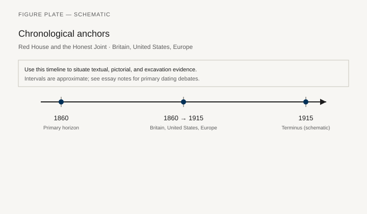
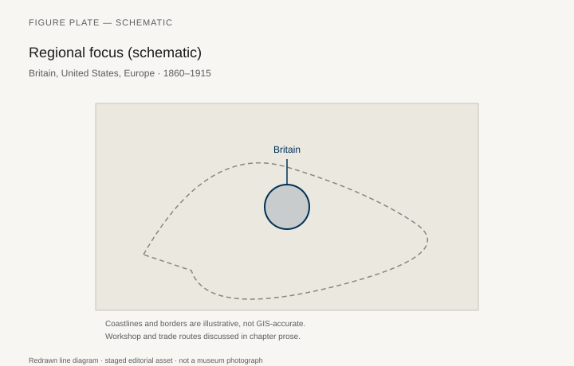
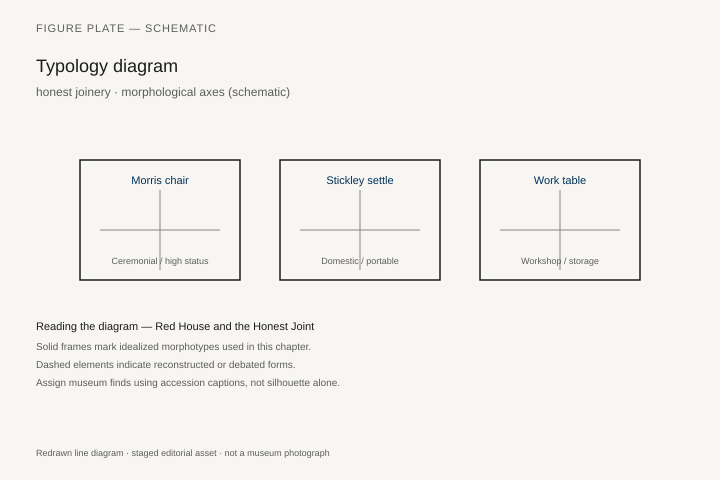
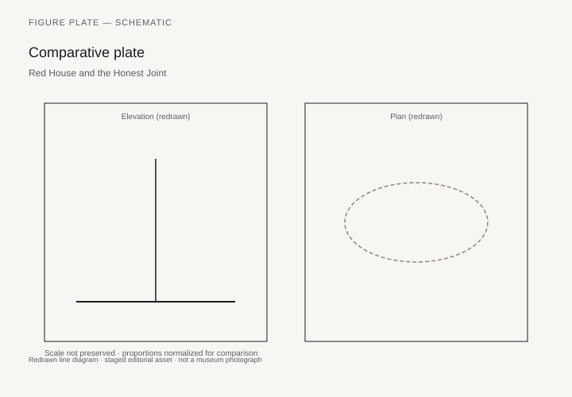

# Red House and the Honest Joint

Philip Webb designed Red House, Bexleyheath, for William and Jane Morris in 1859–60. The Sussex chairs that Morris & Co. later sold — V&A CIRC.288-1960 is the armchair, turned frame, rush seat, a country type with an imitation-bamboo memory of 1800 — sat in that house and then at Kelmscott House. Edward Burne-Jones had them in the studio. Robert Edis called them “excellent, comfortable and artistic” in 1881. Newnham College and the Fitzwilliam bought them. The firm’s catalog of about 1912 priced the armchair at 9s 9d. Liberty and Heals copied the range. The most famous Arts and Crafts seat is not a unique carved throne. It is a cheap rush-seated chair that a shop could repeat.

That fact should sit next to the other fact: Morris hated the factory that made repetition possible, and his firm still used subcontractors and catalogs. E. P. Thompson’s Morris and Fiona MacCarthy’s biography are the political life. Mary Greensted and the Cheltenham/V&A literature are the furniture. This chapter is about visible construction, a medievalism that is not Pugin’s Parliament, and an American oak sequel (Stickley, the Roycrofters, Greene and Greene) that Morris did not control.

## What “honest” meant

A rush seat shows how it is made. A through-tenon with a wedge can be seen. Stain is acceptable; a sham walnut grain on deal is not. The moral language is Christian-socialist and guild-socialist as much as it is aesthetic. C. R. Ashbee’s Guild of Handicraft, Ernest Gimson and the Barnsleys in the Cotswolds, the later Gordon Russell: a geography of shops that left London. Their chairs are more expensive than the Sussex, and look it.

The Sussex type itself is a revival of a vernacular, not a new joint. Morris’s genius as a furniture man was editorial: pick a country chair, black it or ebonize it, sell it to people who read Ruskin. The firm’s heavier “medieval” pieces (the St. George cabinet, the painted furniture of the 1860s) are the other pole: unique, pictorial, close to the Oxford Union murals. Keep both poles. The textbook likes only the rush seat.

## America: Eastwood and Pasadena

Gustav Stickley went to England in 1898, met Morris’s afterlife, and launched New Furniture, then Craftsman furniture, from Eastwood, New York. The Met’s armchair 2014.633, about 1903 — oak, pewter, copper and wood inlay, leather seat — belongs to a second generation of the shop, often linked to Harvey Ellis, now described in the museum’s own note as more collaborative than the Ellis myth. The inlay is cousin to Baillie Scott and Mackintosh. Stickley’s *Craftsman* magazine is a primary source. Bankruptcy in 1915 is part of the story: honesty did not guarantee a balance sheet.

Greene and Greene’s Gamble House furniture (Pasadena, 1908–09) is a different American oak: cloud-lift rails, ebony pegs, a Japanese-looking care that is Californian. The Gamble House and the Huntington hold the pieces. They are not Stickley, and they are not Sussex. Arts and Crafts is a family of arguments.

## What the movement did not do

It did not stop Thonet. It did not stop the department store. It did not, in most houses, replace the sprung suite. It created a language that later modernists could strip of medievalism and keep as “truth to materials.” Whether that inheritance is fair to Morris is a later fight (chapter 37). The rush seat remains, in the V&A, a chair a student could sit on.

## CIRC.288-1960: a country chair with a price

The V&A’s Sussex armchair CIRC.288-1960 is ebonised beech, turned ornament, a rush seat. Designed about 1860, this example made in London about 1870–90, probably by Philip Webb, made by Morris & Co. The museum’s own note is the spine of the type’s social life. The chair was named after a country chair found in Sussex. Similar turned frames with imitation-bamboo memories and rush seats had been fashionable between 1790 and 1820. William and Jane Morris used Sussex chairs at Red House, Bexleyheath, from 1860, then at Kelmscott House, Hammersmith. Edward Burne-Jones had them in the studio. So did the sculptor Alfred Gilbert. Robert Edis, in *Decoration and Furnishing of Town Houses* (1881), called the armchair “excellent, comfortable and artistic.” Newnham College bought them for students’ rooms. The Fitzwilliam put them in galleries. The firm’s catalogue of about 1912 — *Specimens of Furniture Upholstery & Interior Decoration* — gave the Sussex range a whole page and priced this armchair at 9s 9d. Liberty and Heals made their own versions.

The range began with the armchair and a single chair and grew: corner chairs, children’s chairs, settles. Other Sussex variants in the V&A (CIRC.25, 26, 27, 28-1962) have round seats and crossed rails; *The Furnisher* (1900–1) gave those to Ford Madox Brown, a partner until Morris reorganised the firm under his own name in 1875. The Circulation Department sent a Sussex armchair around Britain in the 1974 “Rural Chairs” exhibition. The handlist still admitted that Morris had found a model in Sussex and that it was not certain the type had originated there.

That last clause is the honest sentence. Arts and Crafts furniture is full of vernaculars that were edited in London. Webb’s genius, if the word is allowed, was editorial: pick a country chair, black it, sell it to people who read Ruskin. The firm’s heavier medieval pieces — the St. George cabinet, the painted furniture of the 1860s, the work that sits next to the Oxford Union murals — are the other pole: unique, pictorial, expensive. The textbook likes only the rush seat. Keep both poles. A moral movement that prints a price is a shop.

Red House itself, 1859–60, is the furnished experiment before the catalog hardened. Philip Webb designed the red-brick house; Morris, Jane, Burne-Jones, and the circle painted and fitted it. The National Trust now holds the building. The Sussex chairs that sat there were not yet a “range.” They became one because the firm, founded in 1861 as Morris, Marshall, Faulkner & Co., needed things it could repeat. Fiona MacCarthy’s *William Morris* (1994) and E. P. Thompson’s political life sit next to Mary Greensted’s Cotswolds furniture books. The politics and the chair are not the same subject. They keep colliding.

## Cotswolds after London

C. R. Ashbee’s Guild of Handicraft left London for Chipping Campden in 1902. Ernest Gimson and the Barnsley brothers — Sidney and Ernest — settled in the Cotswolds in the 1890s and built a furniture that is more expensive than the Sussex and looks it: through-tenons, chamfers, ladder backs, ash and oak, seats of rush or woven tape. Cheltenham’s collection and the V&A hold the type. Greensted’s *The Arts and Crafts Movement in the Cotswolds* (1993) is the local monograph. Gordon Russell, later, would carry a version of this honesty into factory production and, in the 1940s, into Utility (chapter 38). The geography is an argument: leave the city, show the joint, charge for the time.

“Honest” in this language is Christian-socialist and guild-socialist as much as it is aesthetic. A rush seat shows how it is made. A wedged through-tenon can be seen. Stain is acceptable. A sham walnut grain on deal is not. Glue is not the enemy; sham is. The attack on the Victorian parlor (chapter 34) is an attack on veneer that pretends to be construction. It is not an attack on adhesion. Readers who turn Arts and Crafts into a religion of the unglued joint have misread the shop.

The Sussex type itself is a revival of a vernacular, not a new joint. That is why Liberty and Heals could copy it. A country chair that has already been a fashion in 1800 can be a fashion again in 1880. What Morris added was a moral caption and a catalog. What the Cotswold shops added was time you could see in the chamfer.

## Eastwood, 2014.633, and the Ellis problem

Gustav Stickley (1858–1942), born in Osceola, Wisconsin, went to England in 1898, met Morris’s afterlife, and came home to launch New Furniture, then Craftsman furniture, from Eastwood, New York. The Met’s armchair 2014.633 — about 1903, oak, pewter, copper and wood inlays, leather seat, 47¼ × 23 × 22 in. — is a gift of the Leeds Art Foundation in honor of Morrison H. Heckscher, 2014, American Wing. The museum’s note is careful. The chair belongs to a second generation of Stickley furniture, solid forms relieved by metal and exotic-wood inlay. The type has traditionally been given to Harvey Ellis, the architect who entered Stickley’s shop in 1903. Recent research, the Met says, shows Ellis was not solely responsible; the inlay furniture may have been a collaborative effort among designers at United Crafts. The copper and pewter pattern is cousin to M. H. Baillie Scott and to Mackintosh.

That caption should be left as a caption. The Ellis myth is a dealer convenience. The chair is still Eastwood oak. Stickley’s *Craftsman* magazine (1901–16) is the primary source for the shop’s language: visible construction, stained oak, a house that would teach. Bankruptcy in 1915 is part of the story. Honesty did not guarantee a balance sheet. David Cathers’s Stickley work and the Dallas Museum of Art’s *Gustav Stickley and the American Arts and Crafts Movement* (2010) are the places to take the inlay chairs when the Met’s short note is not enough.

The Roycrofters at East Aurora, under Elbert Hubbard, are the other New York oak: more missionary, more branded, sometimes coarser. Frank Lloyd Wright’s chairs for the Prairie houses are a third American argument, closer to a building than to a catalog. Do not collapse them. Arts and Crafts in the United States is a family of oak arguments, not a branch office of Morris & Co.

## Pasadena is not Eastwood

Greene and Greene’s Gamble House, Pasadena, 1908–09, is a different American furniture. Charles and Henry Greene designed the house for David and Mary Gamble; the furniture is part of the architecture. Cloud-lift rails, ebony pegs, mahogany and teak, a Japanese-looking care that is Californian. The Gamble House and the Huntington hold the pieces. Edward R. Bosley’s Gamble House monograph and the Greene and Greene literature at the Huntington are the paper trail. These chairs are not Stickley. They are not Sussex. A cloud lift is not a through-tenon left rough for virtue. It is a joint made as considered as a Japanese *sashimono* and then pegged so you can see the decision.

The Japanese look is an American reading. Chapter 20’s tatami and tansu are not the source in a simple sense. The Greenes looked at woodblock books, at the timber of Buddhist buildings as they understood them, and at the California climate. The result is a house in which furniture does not want to be moved. That is closer to Skara Brae’s fitted dresser than the series usually admits — and it is also a rich couple’s house in Pasadena. Keep both facts.

## What the movement taught, and what it could not buy

Arts and Crafts created a language that later modernists could strip of medievalism and keep as “truth to materials.” Whether that inheritance is fair to Morris is a fight for chapter 37. Rietveld’s standard lumber and Breuer’s tubular steel both claim honesty. Neither needs a rush seat. The rush seat remains, in CIRC.288-1960, a chair a student could sit on. The Met’s 2014.633 is a chair a collector now sits in front of. The price difference was already there in 1912, when 9s 9d bought the Sussex armchair and the Cotswold shops sold time.

The movement did not stop Thonet. It did not stop the department store. It did not, in most houses, replace the sprung suite. It did leave a set of objects whose construction can still be read without a manual — and a set of shops whose accounts show that reading construction is not the same as making a living. Stickley’s bankruptcy and Morris’s subcontractors belong in the same paragraph as the wedged tenon. A history that only loves the joint will skip the invoice.

## What a rush seat still teaches

CIRC.288-1960 remains the chapter’s object because it is cheap, repeatable, and documented. Nine shillings and ninepence in the c. 1912 catalogue is a number a moral movement was willing to print. The Met’s 2014.633 is the American oak sequel with pewter and copper in the rail and a museum note that will no longer give the inlay to Ellis alone. Red House, the Cotswold shops, the Gamble House, Stickley’s bankruptcy: keep all of them. The invoice and the wedged tenon belong in the same paragraph. A student can still sit on the rush. That is not a small fact.

## Notes

- V&A CIRC.288-1960, Sussex armchair, Webb / Morris & Co.; related CIRC.25–28-1962; *Specimens of Furniture Upholstery & Interior Decoration* (Morris & Co., c. 1912), p. 63.
- Robert W. Edis, *Decoration and Furnishing of Town Houses* (London, 1881).
- Metropolitan Museum of Art, Stickley armchair 2014.633 (Gift of Leeds Art Foundation, in honor of Morrison H. Heckscher, 2014).
- Fiona MacCarthy, *William Morris* (London: Faber, 1994).
- Mary Greensted, *The Arts and Crafts Movement in the Cotswolds* (Stroud: Sutton, 1993).
- Gustav Stickley, *The Craftsman* (periodical, 1901–16).
- Kevin W. Tucker et al., *Gustav Stickley and the American Arts and Crafts Movement* (Dallas Museum of Art, 2010).
- Edward R. Bosley, *Greene & Greene* (London: Phaidon, 2000), and Gamble House literature at the Huntington.

## Figure plan

*Fig. 1.* Chronological anchors for **Red House and the Honest Joint** (1860–1915). Schematic redrawn line diagram; staged editorial asset (2026). Not a photograph of a museum object.

*Fig. 2.* Regional focus (schematic): Britain, United States, Europe. Schematic redrawn line diagram; staged editorial asset (2026). Not a photograph of a museum object.

*Fig. 3.* Morphological typology for honest joinery (idealized morphotypes). Schematic redrawn line diagram; staged editorial asset (2026). Not a photograph of a museum object.

*Fig. 4.* Comparative elevation and plan plate for honest joinery. Schematic redrawn line diagram; staged editorial asset (2026). Not a photograph of a museum object.

### Supplemental photographs and redraws

**Fig. 5.** Sussex armchair.  
V&A CIRC.288-1960.  
License: V&A.  
Alt: Ebonized turned chair with a rush seat and simple arms.  
Caption: 9s 9d in the firm’s catalog. Red House sat on this type first.

**Fig. 6.** Red House, exterior or a documented interior.  
National Trust; Wikimedia CC.  
Alt: Red-brick house with pointed arches and a garden.  
Caption: Webb’s building, Morris’s first furnished experiment.

**Fig. 7.** Stickley armchair, Met 2014.633.  
License: Met CC0.  
Alt: Tall oak armchair with metal and wood inlay and a leather seat.  
Caption: Eastwood, about 1903. Ellis is no longer the only name on the inlay.

**Fig. 8.** Gimson or Barnsley chair, Cotswolds.  
Cheltenham or V&A.  
License: as marked.  
Alt: Ash or oak chair with a ladder back and a woven seat.  
Caption: The expensive honesty, after London.

**Fig. 9.** Greene and Greene chair or detail from the Gamble House.  
Gamble House / Huntington.  
License: as marked.  
Alt: Mahogany chair with cloud-lift rails and ebony pegs.  
Caption: Pasadena’s Japanese-looking oak-and-mahogany, not Eastwood’s.

**Fig. 10.** Morris & Co. catalog page, Sussex range, c. 1912, PD.  
Alt: Printed chairs with prices.  
Caption: A moral movement that knew how to print a price.
