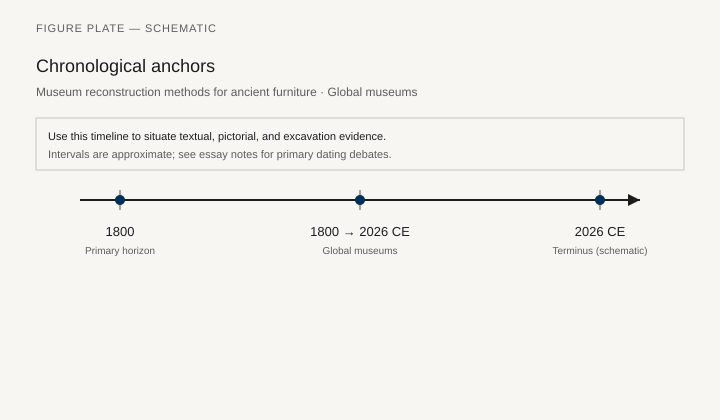
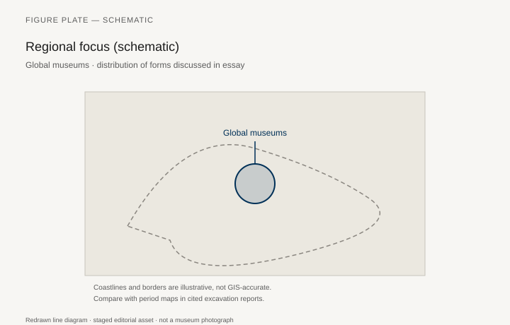
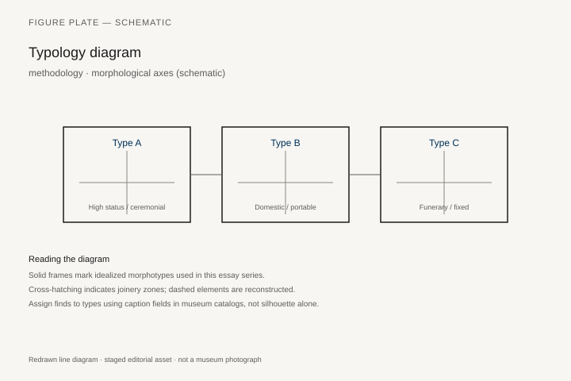
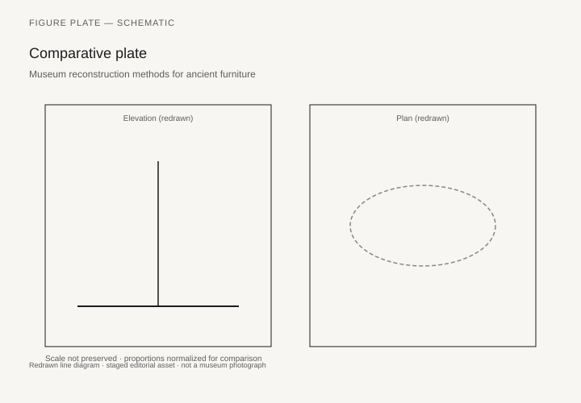

# Memphis, Flat-Pack, and the Late Century

Ettore Sottsass and the Memphis group showed, in Milan in 1981, a furniture of plastic laminate, terrazzo, and jokes that the International Style had tried to declare illegal: color as a shout, the bookcase as a totem (the *Carlton*, 1981), a room that refused to be beige. The objects were expensive and few. Their photographs were cheap and many. Barbara Radice’s *Memphis* (1984) is the insider book. The joke had a target: the tasteful Italian living room, the museum modernism of chapter 37, the idea that a chair had to look like a lesson.

In the same decades, IKEA’s flat-pack, after the 1956 “self-assembly” experiments and Ingvar Kamprad’s catalog empire, put more furniture into more rooms than Memphis could imagine. The two facts belong together without being the same story. One is a critique that became a look. The other is a logistics system that became a look.

## Postmodern as a shop problem

Robert Venturi and Denise Scott Brown’s furniture for Knoll (the Chippendale-back chair, 1984) is an architect’s caption on chapter 31. Michael Graves’s kettle is not furniture; his chairs are. Alessandro Mendini’s Proust armchair (a ready-made Baroque frame, pointillist paint, 1978, Studio Alchimia) is a piece of writing in upholstery. These objects live in museums (MoMA, Vitra, the Milan Triennale) more than in daily houses. They taught a generation of students that history could be quoted in laminate.

High-tech and the other 1970s — cast aluminum, the office systems of Herman Miller and Steelcase, the Equa and Aeron (1994) as the late-century work chair — are the un-joking line. Bill Stumpf and Don Chadwick’s Aeron is a furniture of mesh and adjustment, a workplace body. It belongs to labor as much as to design. The office is the period’s most original room.

## Flat-pack

Gillis Lundgren’s request for a table that would fit in a Volvo, the later standardized fittings, the Allen key as a household tool: IKEA’s history is told by the company and by a few critical books (the Journal of Design History essays; the more popular company biographies). Use them with the same caution as a Thonet catalog. What can be said without a press office: a global pine-and-particle-board system, a warehouse aesthetic, a price that moved furniture from inheritance to replacement. The environmental and labor questions (forestry, transport, factory conditions) are the late century’s real furniture politics. They continue in chapter 40.

Billy, Lack, Poäng (a bentwood cousin of an older Scandinavian idea): name types, not as ads, as facts of sitting. A student room in 1995 is a furniture history site.

## Other late-century shops

Japanese metabolist leftovers and Muji’s later quiet; African and Latin American workshops that never entered the Milan fair; the craft revival that skipped Memphis entirely (chapter 40’s studio furniture). This chapter’s Milan–Älmhult axis is not the world. It is the axis the magazines had.

## Two systems, one half-century

Memphis (Milan, 1981) and IKEA’s mature catalog empire are not the same story. Sottsass’s *Carlton* and Mendini’s Proust armchair are few, expensive, and infinitely photographed. They taught students that laminate could quote history and that beige was a choice. Venturi and Scott Brown’s Chippendale-back for Knoll (1984) is a caption on chapter 31. The objects live in Vitra and MoMA more than in daily houses.

IKEA’s flat-pack — after 1950s self-assembly experiments, a warehouse aesthetic, a global pine-and-particle system — put more furniture into more rooms than any manifesto. Billy, Lack, Poäng are types, not ads: facts of student sitting. Labor, forestry, and transport are the real politics. Company histories are not archives. Use them as the Thonet catalog is used: a source with a smile.

The un-joking line is the office. Stumpf and Chadwick’s Aeron (1994) is mesh, levers, a workplace body. Herman Miller and Steelcase systems are the period’s most original room. High-tech aluminum and the ergonomic promise belong to labor as much as to design.

Other late-century shops — Muji’s quiet, studio furniture that skipped Milan, workshops that never entered the fair — are not in this axis. Name the axis (Milan–Älmhult–Zeeland) so it does not pretend to be the world. Chapter 40 inherits the file, the certified forest, and another cheap desk after 2020.

## Carlton as a photograph that outran the edition

Ettore Sottsass (1917–2007) showed the *Carlton* room divider with Memphis at the 1981 Salone del Mobile in Milan. Cooper Hewitt 1986-4-1 — wood, plastic laminate, metal, 196 × 186.5 × 32.5 cm, museum purchase from the General Acquisition Endowment, distributed in the United States by Grace Designs — is one museum example. The National Gallery of Victoria’s D76.a-c-1985 is another: wood, thermosetting laminate, metal, plastic, purchased 1985 with the National Gallery Women’s Association. Barbara Radice’s *Memphis* (1984) is the insider book. The group around Sottsass included Martine Bedin, Aldo Cibic, Michele De Lucchi, Nathalie Du Pasquier, Matteo Thun, George J. Sowden; later Peter Shire, Masanori Umeda, Michael Graves.

*Carlton* is almost useless as a cabinet. Cooper Hewitt’s note says so. Diagonals refuse the modernist grid. Sottsass’s black-and-white Bacterio pattern runs on the base. Color is a shout. The object was expensive and few. The photographs were cheap and many. Terence Conran later called Memphis “joke junk.” That sentence is useful. It names the target: the tasteful Italian living room, the museum modernism of chapter 37, the idea that a chair had to look like a lesson. The joke had a target. The edition did not furnish a city.

Memphis’s first Milan show mixed furniture, lamps, and ceramics. Critics split. The look still escaped the edition: a laminate language that advertising and interior magazines could steal without buying a *Carlton*. That theft is how a critique becomes a style. The totem bookcase in a museum is the object. The poster of the totem is the historical force.

## Alchimia, Venturi, and St. Martin’s Lane quoted

Alessandro Mendini’s Proust armchair (1978, Studio Alchimia) is a ready-made Baroque frame painted in pointillist dots: a piece of writing in upholstery. Museum examples live in Milan, at Vitra, and in design-museum collections. It is not a chair a waiter can stack. It is a caption you can sit in once.

Robert Venturi and Denise Scott Brown’s Chippendale-back chair for Knoll (1984) is an architect’s caption on chapter 31. The V&A and Philadelphia collections hold examples. An oversized Chippendale splat in a flat color is St. Martin’s Lane quoted as a joke that is also a chair. Michael Graves’s kettle is not furniture; his chairs are. These objects taught a generation of students that history could be quoted in laminate. They did not replace the suite in ordinary rooms. They replaced the suite in the seminar.

High-tech and the other 1970s remain the un-joking cousin: cast aluminum, office systems, a different budget and a different body.

## The office as the period’s room

Bill Stumpf’s Ergon (1976) and Don Chadwick’s Equa (1984) lead to the Aeron. Cooper Hewitt 1997-73-1, gift of the employee-owners of Herman Miller, is die-cast aluminum, molded glass-reinforced polyester, Hytrel, polyester, Lycra; the museum dates the object 1992 and notes the November 1994 market introduction, too late for Cooper Hewitt’s *Good Offices and Beyond* that fall. MoMA 393.1994 is the same design. Pellicle mesh flexes and stays exposed. The chair comes in three sizes. Armrests move; lumbar support moves; the seat tilts. Adjustment is the promise.

The Aeron is a furniture of the workplace body. It belongs to labor as much as to design (chapter 42). The office is the late century’s most original room: systems furniture, a mesh seat, a screen. Memphis never entered it except as a postcard on a pinboard.

Steelcase and Herman Miller systems — panels, worksurfaces, a planned floor — are Florence Knoll’s office idea after thirty more years of management theory. Caption a systems workstation as furniture. It is the period’s carcase.

## Lundgren’s table and the Allen key

IKEA’s own museum now tells the LÖVET story with the caution a company museum requires. The leaf-shaped coffee table appeared in the 1956 catalogue. Ingvar Kamprad called it “a lovely little thing, in ultra-modern design.” Jacaranda top, brass-covered feet, packed in wood wool and cardboard. It was not the first self-assembly piece in the range; DELFI, KÖKSA, and RIGA tables were in the 1953 catalogue. The story that Gillis Lundgren sawed the legs off to fit a Volvo is the story the company likes. Use it as a story. What can be said without a press office: a global pine-and-particle-board system, standardized fittings, a warehouse aesthetic, a price that moved furniture from inheritance to replacement.

LÖVET stayed in the catalogue until 1962. When the table was reissued in 2013 as LÖVBACKEN, jacaranda had become a protected species; the new top was poplar veneer. That substitution is a chapter 40 fact arriving early. The *Journal of Design History* essays on IKEA are safer than visitor-center dates. Factory conditions, forestry, and transport are the late century’s real furniture politics. They continue.

Billy, Lack, Poäng — a bentwood cousin of an older Scandinavian idea — are types, not ads, as facts of sitting. A student room in 1995 is a furniture history site. The Allen key is the joint. It expects to be undone. Chapter 41 will put that cam lock next to Hatnefer’s peg.

## What the magazines left out

Japanese metabolist leftovers and Muji’s later quiet; African and Latin American workshops that never entered the Milan fair; the craft revival that skipped Memphis entirely (chapter 40’s studio furniture): this chapter’s Milan–Älmhult axis is not the world. It is the axis the magazines had.

A late-century history that only loves the *Carlton* will miss the mesh office chair. A history that only loves the warehouse will miss the joke that taught students to quote Chippendale. Keep both. The photograph of *Carlton* traveled farther than the edition. The Allen key traveled farther than the photograph.

## Who sat in the warehouse and who sat in the seminar

A 1995 student room with a Billy, a Lack, and a Poäng is a dated stratum a future curator will recognize the way this series recognizes Utility or a café of No. 14s. The Allen key in a kitchen drawer is a joint. The instruction sheet is a document. Neither is a joke about Chippendale. Both furnished more backs than the *Carlton* edition.

The seminar, in the same years, sat on whatever the school had and looked at slides of Memphis. Radice’s book, the Vitra holdings, Cooper Hewitt 1986-4-1, NGV D76.a-c-1985: that is how a critique became a syllabus. Venturi and Scott Brown’s Knoll chair (1984) made the syllabus literal — a splat from 1754, flattened, sold as a postmodern object. Chapter 31’s St. Martin’s Lane book had already taught theft. The 1984 chair admits the theft and charges for it.

Stumpf and Chadwick’s Aeron (Cooper Hewitt 1997-73-1; MoMA 393.1994) sat in a third room: the office that had learned, from Knoll, to treat furniture as a system. Mesh, three sizes, levers. Adjustment as a promise to a back that would stay longer than a tea-room customer. Chapter 42 will treat that promise as labor. This chapter only needs to say that the late century’s most original room was not a Milan fair stand and not a warehouse aisle. It was a workstation.

Sottsass later designed a lamp for a Swedish catalog. That crossover is a footnote, not a reconciliation. The two systems — manifesto laminate and particle-board logistics — shared a half-century and almost no sitters. Keep them in one chapter so a reader sees the split. Do not blend them into “1980s design.”

## Company museums and the dates they like

IKEA Museum’s LÖVET page is useful and partial. 1956 catalogue, Kamprad’s “lovely little thing,” wood wool and cardboard, not the first knock-down in the range. The Volvo-and-saw story is a founding tale. Treat it as one. *Journal of Design History* essays on the company’s logistics, labor, and forestry are the counterweight. Visitor-center dates are not an archive.

Cooper Hewitt’s Aeron note is the better model: introduced November 1994, missed the autumn office-seating show, three sizes, mesh that returns when the body leaves. MoMA 393.1994 agrees on the designers, Stumpf and Chadwick. Ergon (1976) and Equa (1984) are the predecessors a caption should keep. Adjustment is a workplace promise. Whether the back believed it is a labor question.

Memphis Milano still produces *Carlton*. That afterlife is not this chapter’s subject. The 1981 photograph is. The warehouse aisle is. Keep the two images on facing pages and refuse to let either eat the other.

## Notes

- Barbara Radice, *Memphis* (New York: Rizzoli, 1984).
- Cooper Hewitt 1986-4-1 (Sottsass *Carlton*); NGV D76.a-c-1985.
- Cooper Hewitt 1997-73-1 and MoMA 393.1994 (Aeron); Stumpf Ergon 1976, Chadwick Equa 1984 as predecessors.
- On IKEA: IKEA Museum text on LÖVET / 1956 catalogue; *Journal of Design History* critical essays; do not take visitor-center dates as archival. DELFI, KÖKSA, RIGA in the 1953 catalogue precede LÖVET.
- Venturi, Scott Brown, and Knoll, 1984 chair — museum records at V&A / Philadelphia.

## Figure plan

*Fig. 1.* Chronological anchors for the evidence discussed below. Schematic redrawn line diagram; staged editorial asset (2026). Not a photograph of a museum object.

*Fig. 2.* Regional focus for circulation and local workshop traditions. Schematic redrawn line diagram; staged editorial asset (2026). Not a photograph of a museum object.

*Fig. 3.* Morphological typology for archaeology (idealized morphotypes). Schematic redrawn line diagram; staged editorial asset (2026). Not a photograph of a museum object.

*Fig. 4.* Comparative elevation and plan plate for archaeology. Schematic redrawn line diagram; staged editorial asset (2026). Not a photograph of a museum object.

### Supplemental photographs and redraws

**Fig. 5.** Sottsass, *Carlton* bookcase, 1981.  
Vitra Design Museum or Memphis documentation.  
License: as marked; design still copyrighted.  
Alt: Totemic bookcase in colored plastic laminate.  
Caption: A photograph that traveled farther than the edition.

**Fig. 6.** Mendini, Proust armchair, 1978.  
Museum of design, Milan or a documented example.  
License: as marked.  
Alt: Baroque armchair painted in colored dots.  
Caption: Alchimia’s ready-made, a writing in fabric.

**Fig. 7.** Venturi Chippendale chair for Knoll, 1984.  
V&A or a university collection.  
License: as marked.  
Alt: Oversized Chippendale-back chair in a flat color.  
Caption: St. Martin’s Lane, quoted as a joke that is also a chair.

**Fig. 8.** IKEA catalog page, 1980s or 1990s, used as a historical document.  
License: IKEA — usually restricted; use a library-held catalog under fair research caption, or a PD news photograph of a warehouse.  
Alt: Flat-pack room in a catalog grid.  
Caption: Logistics as a style. The Allen key is the joint.

**Fig. 9.** Aeron chair, 1994.  
Cooper Hewitt or MoMA.  
License: as marked.  
Alt: Mesh office chair with a levered skeleton.  
Caption: The late century’s work seat. Adjustment as a promise.
