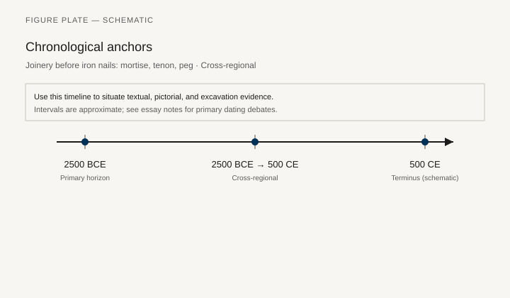
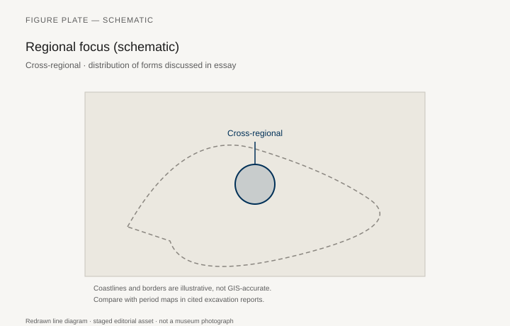
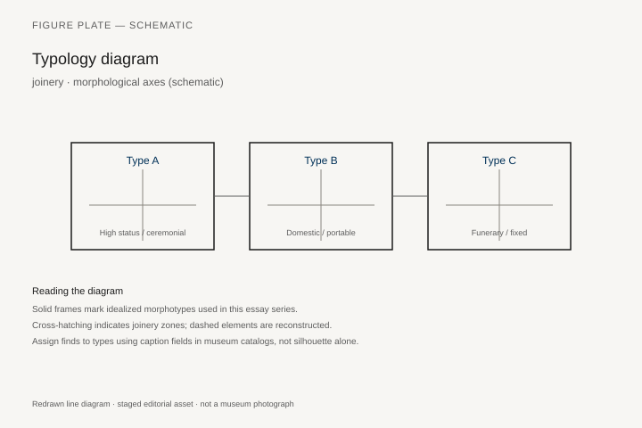
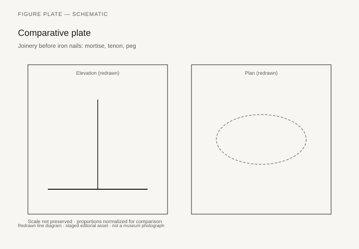

# How a Joint Holds

*Fig. 1.* Chronological anchors for the evidence discussed below. Schematic redrawn line diagram; staged editorial asset (2026). Not a photograph of a museum object.

*Fig. 2.* Regional focus for circulation and local workshop traditions. Schematic redrawn line diagram; staged editorial asset (2026). Not a photograph of a museum object.

*Fig. 3.* Morphological typology for joinery (idealized morphotypes). Schematic redrawn line diagram; staged editorial asset (2026). Not a photograph of a museum object.

*Fig. 4.* Comparative elevation and plan plate for joinery. Schematic redrawn line diagram; staged editorial asset (2026). Not a photograph of a museum object.

*Fig. 1.* Chronological anchors for the evidence discussed below. Schematic redrawn line diagram; staged editorial asset (2026). Not a photograph of a museum object.

*Fig. 2.* Regional focus for circulation and local workshop traditions. Schematic redrawn line diagram; staged editorial asset (2026). Not a photograph of a museum object.

*Fig. 3.* Morphological typology for tools (idealized morphotypes). Schematic redrawn line diagram; staged editorial asset (2026). Not a photograph of a museum object.

*Fig. 4.* Comparative elevation and plan plate for tools. Schematic redrawn line diagram; staged editorial asset (2026). Not a photograph of a museum object.

A mortise is a hole. A tenon is a tongue that fills it. A peg or a wedge keeps the tongue from walking out. Hatnefer’s chair (36.3.152) still has the pegs; the Met’s catalog adds resinous glue. A Ming yoke-back (1997.92) hides the same idea in members that look like they grew in a curve. A Thonet No. 14 (MAK H 2762) gives up the mortise for a screw and a bent rod. An IKEA cam lock is a joint that expects to be undone. This chapter is a materials essay, not a tool catalog. It asks what furniture is made of, who moved the trees, and why some joints outlive their rooms.

## Species and the lie of “local wood”

Egypt imported cedar and ebony and called the work Egyptian. Assyria imported tusks and called the ivories tribute. Paris imported mahogany, rosewood, and tortoiseshell and called the commode French. A species map of furniture is a map of power. Jennifer Anderson’s *Mahogany* (2012) is the model study: Caribbean forests, enslaved labor, Atlantic finish. Teak, rattan, *huanghuali*, hawksbill, elephant ivory (Nimrud to Victorian pianos): each has a violence and a shop.

Local woods still do most of the world’s sitting: oak in a Westphalian chest (Met 13.205.2), beech in Moravia, elm and zelkova in a *bandaji*, pine in a flat-pack, ash in an LCW. The luxury story is the import story. The ordinary story is the coppice, the farm hedge, the river pine.

Secondary woods — tulip poplar in a Phyfe sofa, oak under ebony in Antwerp, pine under Boulle — are the furniture’s honesty when a museum allows a back view. A carcase is a class system of timber.

## Tools, shops, guilds

Adze, chisel, saw, bow-drill, plane, lathe, steam box, veneer saw, sewing machine, CNC: the tool list is a chronology already told in other chapters. What to add here is the shop as a social machine. Egyptian reliefs of carpenters; medieval accounts; the Paris split of *menuisier* and *ébéniste*; the unnamed Asante carver of a single-block stool; the Moravian bending crew; the Zeeland molder. A joint is a teaching. Apprenticeship is how a mortise stays the same size for two hundred years.

Glue — hide, resin, fish, PVA, epoxy — is not a moral failure. It is a material. The Arts and Crafts attack on glue was an attack on sham, not on adhesion. Rietveld’s screws and Thonet’s screws are honest in a different register.

## Upholstery, cane, cord, plastic

A seat is often not wood. Hatnefer’s linen, a Ming cane seat, a Thonet cane, horsehair and coil springs, pony skin, Aeron mesh, a plastic shell: the body meets the furniture at a membrane. Conservation departments know this; style histories forget it. A “wooden chair” in a photograph may be a textile object with wooden legs.

Finishes — oil, wax, lacquer (the East Asian chemistry and the European imitation), japanning, polyurethane — are skins with their own trades. Lacquer in a Han tomb and *vernis Martin* in a Paris hôtel share a wish to seal and to shine. They do not share a workshop god.

## Waste, reuse, and the forest

Ships become chests; chests become firewood; a cassone front becomes a painting in a frame. Furniture is a temporary hold on a tree. The twenty-first century’s certifications and CITES listings (chapter 40) are late instruments. Earlier instruments were sumptuary laws, naval reserves (oak for keels, not for chairs), and simply running out of a grove.

If a last chapter of this series walks through American hardwood towns, it is because those towns are one place where the species map is still a local map: oak, walnut, cherry, maple, the Southern hardwood mix. The joint there is still, often, a mortise. That is not virtue by geography. It is a shop decision that has not yet been priced out.

## Import maps, hidden carcases, a membrane for the body

Egypt’s cedar, Assyria’s tusks, Paris mahogany, Caribbean forests in Anderson’s study: a species map is a power map. Local oak, beech, elm, pine, and ash still do most sitting. Secondary woods — tulip poplar in Phyfe, oak under Antwerp ebony, pine under Boulle — are the carcase’s class system, visible when a museum turns the object around.

Adze to CNC is a chronology already told. The shop is the social machine: Egyptian reliefs, Paris guild splits, unnamed Asante block-carvers, Moravian bending crews, Zeeland molders. Glue is not a moral failure. Arts and Crafts attacked sham, not adhesion. Thonet’s screw and an IKEA cam lock are honest in different registers — one expects to be serviced, one expects to be undone.

Seats are often not wood: Hatnefer’s linen, Ming cane, horsehair, mesh, plastic. Finishes — East Asian lacquer, *vernis Martin*, oil, polyurethane — are skins with trades. Ships become chests become firewood. Furniture is a temporary hold on a tree. The species map is still local in some shops: oak, walnut, cherry, maple. The joint there is still often a mortise. That is a shop decision, not virtue by geography.

## Four joints a reader can still visit

Hatnefer’s chair at the Met (36.3.152) still has the pegs. The catalog adds resinous glue. A Ming yoke-back (1997.92) hides the same tongue-and-hole idea in members that look as if they grew in a curve. The MAK’s Thonet No. 14, H 2762, gives up the mortise for a screw and a bent rod. An IKEA cam lock is a joint that expects to be undone. Geoffrey Killen’s *Ancient Egyptian Furniture*, vol. I (2017), is the materials chapter for the first of those. Ernest Joyce’s *The Technique of Furniture Making* will name the joints. This essay is not a manual. It asks who moved the trees and why some joints outlive their rooms.

A mortise is a hole. A tenon is a tongue that fills it. A peg or a wedge keeps the tongue from walking out. Glue — hide, resin, fish, PVA, epoxy — is not a moral failure. It is a material. The Arts and Crafts attack on glue (chapter 35) was an attack on sham, not on adhesion. Rietveld’s screws (MoMA 487.1953 is held by screws and paint) and Thonet’s screws are honest in a different register. The cam lock is honest about leaving.

## Anderson’s tree and the class system of timber

Egypt imported cedar and ebony and called the work Egyptian. Assyria imported tusks and called the ivories tribute. Paris imported mahogany, rosewood, and tortoiseshell and called the commode French. A species map of furniture is a map of power. Jennifer L. Anderson’s *Mahogany* (Harvard, 2012) is the model study: Caribbean forests, enslaved labor, Atlantic finish. Teak, rattan, *huanghuali*, hawksbill, elephant ivory from Nimrud to Victorian pianos: each has a violence and a shop.

Local woods still do most of the world’s sitting: oak in a Westphalian chest (Met 13.205.2), beech in Moravia, elm and zelkova in a *bandaji*, pine in a flat-pack, ash in the Met’s LCW 1984.566. The luxury story is the import story. The ordinary story is the coppice, the farm hedge, the river pine.

Secondary woods — tulip poplar in a Phyfe sofa, oak under ebony in Antwerp, pine under Boulle — are the furniture’s honesty when a museum allows a back view. A carcase is a class system of timber. Conservation photographs from the Met and the Wallace Collection make that system visible. Style histories that only show the face forget the pine.

## The shop as a teaching machine

Adze, chisel, saw, bow-drill, plane, lathe, steam box, veneer saw, sewing machine, CNC: the tool list is a chronology already told in other chapters. What to add here is the shop as a social machine. Egyptian reliefs of carpenters; medieval accounts; the Paris split of *menuisier* and *ébéniste*; the unnamed Asante carver of a single-block stool; the Moravian bending crew; the Zeeland molder. A joint is a teaching. Apprenticeship is how a mortise stays the same size for two hundred years.

Thonet’s steam-bending jig — a beech rod in a metal form — is a joint that is a bend plus a screw. The Eames rubber mount on 1984.566 is a joint that allows movement. The CNC finger is a joint only a file could plan. Joyce will draw all three. History has to say who stood at the jig.

## The membrane the body meets

A seat is often not wood. Hatnefer’s linen, a Ming cane seat, a Thonet cane, horsehair and coil springs (chapter 34), pony skin on a Perriand chaise, Aeron mesh (Cooper Hewitt 1997-73-1), a plastic shell: the body meets the furniture at a membrane. Conservation departments know this. Style histories forget it. A “wooden chair” in a photograph may be a textile object with wooden legs. The V&A Sussex rush (CIRC.288-1960) and a Thonet cane are the close-ups this chapter wants: the pattern of the plant, not the plank.

Finishes — oil, wax, lacquer (the East Asian chemistry and the European imitation), japanning, polyurethane — are skins with their own trades. Lacquer in a Han tomb and *vernis Martin* in a Paris hôtel share a wish to seal and to shine. They do not share a workshop god. Papier-mâché japanning at Birmingham (V&A W.3B-1929) is a finish that became a structure.

Ships become chests; chests become firewood; a cassone front becomes a painting in a frame. Furniture is a temporary hold on a tree. CITES listings and FSC paperwork (chapter 40) are late instruments. Earlier instruments were sumptuary laws, naval reserves (oak for keels, not for chairs), and simply running out of a grove. Forest Service historical ecology — Bragg and Bragg on the Saline-Fifteen witness trees, a “black oak” that is a complex of oaks — belongs with Anderson, not as a regional curiosity. The forest has an ecology before it has a shop.

A last chapter may walk through towns where the species map is still local. That is a shop decision that has not yet been priced out, not virtue by geography. No living manufacturer is the point. The point is that a tree still arrives at a bench with a name.

## What a back view is for

When a museum turns a commode around, the argument of this chapter becomes visible. Pine or oak carcase, glue blocks, a secondary wood that never expected to be seen. The face is mahogany or tortoiseshell or Boulle brass. Anderson’s logs at the dock are the same argument at the scale of a piled quay. The tree before the polish. The peg before the caption.

Joyce will teach a student to cut the mortise. Killen will show that an Egyptian chair already knew the peg. The cam lock will unscrew in a student room. Four facts, one problem: how a joint holds, and who paid for the tree. A back view, a dock piled with logs, a rush seat in close-up, a cam lock on a Sunday: those are the four pictures this chapter would hang if it were allowed only four.

## Hide glue, PVA, and a screw that expects a screwdriver

A conservation report will often tell you more about a joint than a style history. The Met’s note on Hatnefer’s chair names resinous glue as well as pegs. Antwerp cabinets (chapter 27) and the Kutubiyya minbar (chapter 16) have published conservation literature that tracks later repairs: a joint that has already been a joint twice. Boulle work hides a pine box. A Ming yoke-back hides a perfect mortise in a member that looks grown. Both are skills. Only one of them wanted you to see the skill as a curve.

Hide glue reverses with heat and moisture. PVA does not forgive the same way. Epoxy is a twentieth-century refusal to let go. Thonet’s screw expects a screwdriver in a café. The Eames shock mount expects the wood to move. The cam lock expects a move-out day. None of these is more honest than the others. Honesty is a caption a shop writes for a customer. The material is what fails first.

Beech in Moravia, ash on an LCW, oak in a Westphalian chest, rush on CIRC.288-1960, cane on a No. 14, horsehair in a Pratt-sprung seat, Pellicle on an Aeron: the series’ materials list is already a world map. This chapter’s only new sentence is that the map has a back side — secondary woods, wasted chips, a grove that ran out — and that a joint is how a shop decides which side you are allowed to see.

## Notes

- Geoffrey Killen, *Ancient Egyptian Furniture*, vol. I (Oxbow, 2017), materials and tools chapters.
- Jennifer L. Anderson, *Mahogany* (Harvard, 2012).
- Ernest Joyce, *The Technique of Furniture Making* (London: Batsford, various eds.) — a craft manual, useful for joints, not for history.
- On ivory and CITES: Barnett; later legal notices.
- Museum conservation reports cited in chapters 16 and 27 (Kutubiyya; Antwerp cabinet).

## Figure plan

**Fig. 1.** Exploded drawing of a mortise-and-tenon chair (Hatnefer or a Ming chair).  
Redrawn from Killen or Wang.  
License: redrawn.  
Alt: Diagram of pegged tenons in a chair frame.  
Caption: The tongue, the hole, the peg. Glue optional, history not.

**Fig. 2.** Back of a veneered commode, secondary woods visible.  
Met or Wallace conservation photo.  
License: as marked.  
Alt: Unpolished pine or oak carcase behind a fancy face.  
Caption: The class system of timber.

**Fig. 3.** Steam-bending jig, historic or reconstructed.  
MAK or a living-history shop.  
License: as marked.  
Alt: Beech rod in a metal form.  
Caption: Thonet’s joint is a bend plus a screw.

**Fig. 4.** Mahogany log or a historic timber advertisement, PD.  
Alt: Nineteenth-century print of tropical logs at a dock.  
Caption: Anderson’s subject: the tree before the polish.

**Fig. 5.** Cane or rush seat, close.  
V&A Sussex or a Thonet.  
License: as marked.  
Alt: Woven seat showing the pattern of the rush or cane.  
Caption: The body meets a plant, not a plank.

**Fig. 6.** Cam lock or CNC finger joint, 21st-century.  
Documentary photo.  
License: as marked.  
Alt: Particle-board joint or a milled wooden finger.  
Caption: Joints that expect to be undone, and joints that only a file could plan.
