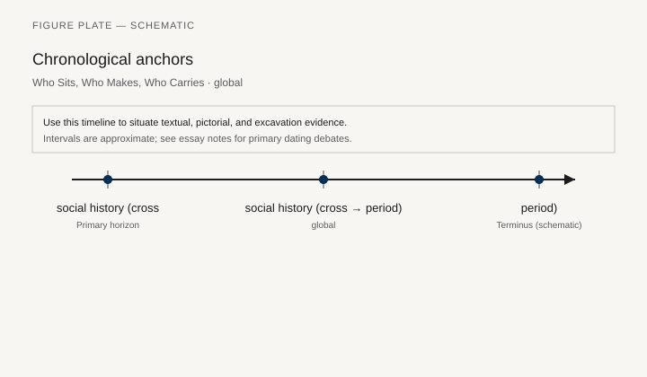
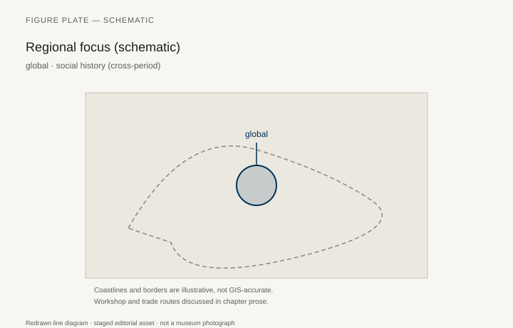
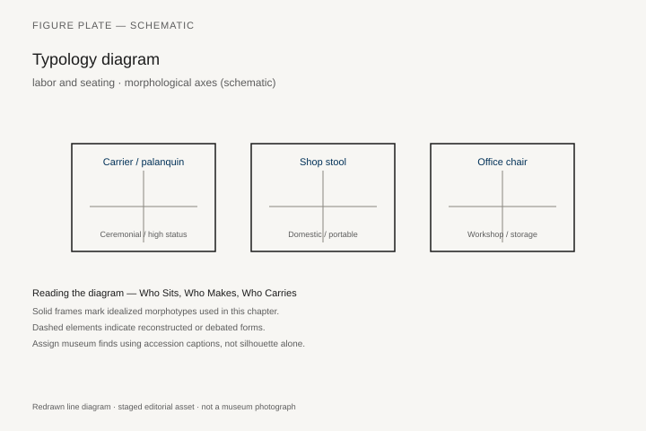
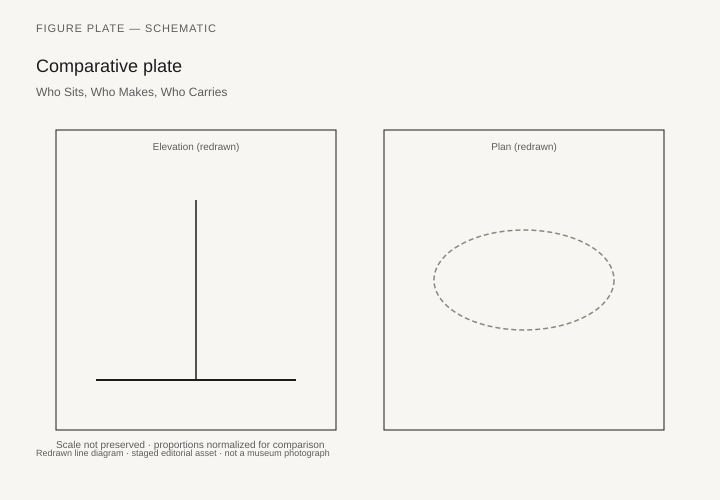

# Who Sits, Who Makes, Who Carries

Hatnefer’s chair is low; the Met’s catalog compares it to banquet scenes in which women sit low while offering scenes put a couple on high chairs. Tutankhamun’s footrest (JE 62046) puts other peoples under a king’s feet. The Apadana keeps delegations standing. A duchess’s *tabouret* at Versailles is a legal right. An Asante stool can be a person. A *bisellium* is an inscribed honor. A Thonet No. 14 is a chair a waiter can carry and a customer can claim for the price of a coffee. This chapter is the series’ social essay. It does not replace the object chapters. It names the three jobs furniture always has: marking who may rest, hiding or showing who made the rest, and requiring someone to lift it.

## Rank is a height

Platform, footstool, canopy, dais, *kang*, piled-house inner floor, *simhasana*, Golden Stool that no one sits on: height is not a metaphor. Inches divide. So does the back. A stool is not a chair; a chair is not a throne; a throne is not a sofa. Democracies invent benches (the theatre’s *prohedria* still marks the front; the school stack is more equal; the Aeron in the corner office is not). The klismos on a grave stele is a domestic eternity for a woman who owned, or was shown with, a servant and a box.

Gender is a seating plan more often than a joint. Etruscan couples on a couch, Greek *andron* klinai, Joseon *anbang* and *sarangbang*, the *voyeuse* at a Paris card table, the assumption that a secretary’s chair is smaller: read each in its chapter. Do not globalize “women sat low.” Do say that many archives describe women’s seating through men’s rooms.

## Labor is a missing name

Reisner’s gold remembers a queen and erases the carriers of her chair. The poles are the length of their work. Nimrud’s ivories remember carvers as styles (Phoenician, North Syrian), not as persons. A Paris *estampille* is a rare opposite: a legal name on a rail. An Asante carver may be known in a family and unknown on a Met label. Enslaved joiners in the mahogany chain and in American shops are the largest named absence in the Atlantic chapters. Factory women caning Thonet seats, Bauhaus weavers, Zeeland molders: the chair in the photograph is a group.

Carrying is a profession: palanquin bearers, howdah servants, the people who rolled the Kutubiyya minbar out of its closet, the waiter with four No. 14s in two hands, the delivery crew and the Allen key. A history of furniture that only studies sitting will miss the sweat of moving the seat.

## Comfort is a period word

The klismos as painted is a curve, not a promise. Rietveld claimed spirit. Victorian springs claimed the body. The Aeron claims adjustment. A Ming chair claims correctness. A charpoy claims that rope and air are enough. Comfort is not a progress line. It is a claim a maker makes in a market or a court. Some claims are true for some backs.

Disability and age — the high chair, the low stool, the cane, the later medical seat — barely appear in the old catalogs. They should appear in any revision of this series. `[CITE NEEDED: a historical study of invalid furniture before the twentieth century.]`

## Property, theft, and the museum

Who owns the chair is a legal sentence that includes dowry cassoni, parish chests, seized Asante gold, Napoleonic crusades of objects, the division of finds that sent Hatnefer’s chair to New York, the Lehman cassone with nineteenth-century additions, the Golden Stool that refused to be owned abroad. Museums are furniture’s afterlife and sometimes its crime scene. Captions in this series have tried to keep the path of leaving visible.

A reader who has come this far does not need a sermon. They need the habit of asking, at each case: who sat, who was not allowed to, whose hand cut the joint, whose hand carries the chair away at night.

## Inches, names, and the path of leaving

Height divides: platform, footstool, canopy, *kang*, piled inner floor, *simhasana*, a Golden Stool no one sits on, a *tabouret* that is a legal right, a *bisellium* in an inscription. A stool is not a chair; a chair is not a throne. Democracies invent benches and then mark the front row. Gender is a seating plan more often than a joint — Etruscan couples, Greek *andron*, Joseon rooms, a Paris *voyeuse* — and should not be globalized into “women sat low.”

Labor is a missing name: carriers of Hetepheres’s poles, ivory carvers known as styles, a Paris stamp as a rare opposite, caners of Thonet seats, Bauhaus weavers, Zeeland molders, enslaved joiners in the mahogany chain. Carrying is a profession: palanquin, howdah, minbar closet, waiter, delivery crew. Comfort is a period claim, not a progress line. Disability furniture is still thin in the old catalogs. `[CITE NEEDED]`

Museums are afterlives and sometimes crime scenes: division of finds, seized gold, a cassone completed in the nineteenth century, a stool that refused to be owned abroad. Ask, at each case: who sat, who was not allowed to, whose hand cut the joint, whose hand carries the chair away.

## Height is not a metaphor

Platform, footstool, canopy, dais, *kang*, piled-house inner floor, *simhasana*, the Golden Stool that no one sits on: inches divide. So does the back. A stool is not a chair; a chair is not a throne; a throne is not a sofa. The theatre’s *prohedria* still marks the front. The school stack is more equal. The Aeron in the corner office (Cooper Hewitt 1997-73-1) is not. Tutankhamun’s footrest JE 62046 puts other peoples under a king’s feet. The Apadana keeps delegations standing. A duchess’s *tabouret* at Versailles is a legal right. Saint-Simon, read as literature, and Norbert Elias’s *The Court Society*, read as a debated frame, are how that right entered modern writing. An Asante stool can be a person (Sarpong, 1971). A *bisellium* is an inscribed honor. A Thonet No. 14 is a chair a waiter can carry and a customer can claim for the price of a coffee.

The klismos on the grave stele of Hegeso (Athens NAM 3624) is a domestic eternity for a woman who owned, or was shown with, a servant and a box. Gender is a seating plan more often than a joint. Etruscan couples on a couch, Greek *andron* klinai, Joseon *anbang* and *sarangbang*, the *voyeuse* at a Paris card table, the assumption that a secretary’s chair is smaller: read each in its chapter. Do not globalize “women sat low.” Do say that many archives describe women’s seating through men’s rooms.

Hatnefer’s chair is low. The Met’s catalog compares it to banquet scenes in which women sit low while offering scenes put a couple on high chairs. That comparison is an Egyptian fact, not a world law.

## Names on rails, names erased

Reisner’s gold remembers a queen and erases the carriers of her chair. The poles are the length of their work. Nimrud’s ivories remember carvers as styles (Phoenician, North Syrian), not as persons. A Paris *estampille* is a rare opposite: a legal name on a rail. An Asante carver may be known in a family and unknown on a Met label. Enslaved joiners in the mahogany chain — Anderson’s subject — and in American shops are the largest named absence in the Atlantic chapters. Kenny and Brown’s Phyfe catalog is unusually willing to talk about the shop as a group. Factory women caning Thonet seats, Bauhaus weavers (Anni Albers and the workshop), Zeeland molders on the LCW line: the chair in the photograph is a group.

Carrying is a profession: palanquin bearers, howdah servants, the people who rolled the Kutubiyya minbar out of its closet (chapter 16), the waiter with four No. 14s in two hands, the delivery crew and the Allen key. A history of furniture that only studies sitting will miss the sweat of moving the seat. Hetepheres’s carrying-chair poles at the MFA are the Old Kingdom version of the same sentence. Four more people are the joint.

## Comfort as a claim, not a progress line

The klismos as painted is a curve, not a promise. Rietveld claimed spirit (MoMA 487.1953). Victorian springs claimed the body (Pratt’s 1828 patent; Edwards; Gloag). The Aeron claims adjustment. A Ming chair claims correctness. A charpoy claims that rope and air are enough. Some claims are true for some backs. None of them is a ladder from primitive to kind.

Disability and age — the high chair, the low stool, the cane, the later medical seat, Aalto’s Paimio angle — barely appear in the old catalogs. They should appear in any revision of this series. `[CITE NEEDED: a historical study of invalid furniture before the twentieth century.]` The Paimio chair at least admits a lung. Most thrones admit only a rank.

## Museums as afterlives and sometimes crime scenes

Who owns the chair is a legal sentence that includes dowry cassoni, parish chests, seized Asante gold, Napoleonic trains of objects, the division of finds that sent Hatnefer’s chair to New York, the Lehman cassone with nineteenth-century additions, the Golden Stool that refused to be owned abroad. Museums are furniture’s afterlife and sometimes its crime scene. Captions in this series have tried to keep the path of leaving visible.

A reader who has come this far does not need a sermon. They need the habit of asking, at each case: who sat, who was not allowed to, whose hand cut the joint, whose hand carries the chair away at night. The three jobs remain. Marking who may rest. Hiding or showing who made the rest. Requiring someone to lift it.

## The waiter, the weaver, the molder

A café photograph of identical No. 14s looks like equality until the corner office orders a different chair. A Bauhaus interior looks like a system until the weaver’s name drops off the label. An LCW photograph looks like California until Zeeland’s molders are put back in the sentence. Chapter 38 promised that return. This chapter keeps it.

The Hegeso stele (NAM 3624) and Tutankhamun’s footrest (JE 62046) are the ancient pair this social essay stands on: a woman with a servant and a box; a king with other peoples under his heels. The Aeron and the school stack are the modern pair: adjustment for one back; a pile of identical plywood for a hall that must be emptied. Between them the series has already walked palanquins, *tabourets*, Asante stools, and Phyfe’s shop. The habit is the point. Who sat. Who was not allowed to. Whose hand cut the joint. Whose hand carries the chair away.

## A stamp, a style name, a missing person

A Paris *estampille* on a rail is a legal name. Nimrud’s “Phoenician” and “North Syrian” are style names that replaced persons. Reisner’s labels remember a queen. The Met’s Hatnefer label remembers a find-division. An Asante family may remember a carver the museum does not. Anderson’s mahogany book is the Atlantic version of the same gap: enslaved joiners in the chain that ends as a French polish. Kenny and Brown put Phyfe’s shop back together as a group. Wilk put Thonet’s Moravian plants back into a Viennese silhouette. Kirkham put Ray Eames back next to Charles on the splint and the LCW.

Caners, weavers, molders, waiters, bearers: the jobs that do not get the monograph. A photograph of a café or a factory floor is often the only place they appear, and even then as a blur. This chapter cannot invent their names. It can refuse to write as if the chair arrived alone.

Disability furniture remains the thinnest file. Invalid chairs, raised seats, the later medical recliner, Aalto’s breathing angle: the old catalogs treated them as equipment, not as furniture history. A revision should treat them as both. `[CITE NEEDED: a historical study of invalid furniture before the twentieth century.]` Until that book is on the notes list, the gap stays marked.

Property law is the last social fact. A cassone in a dowry, a parish chest with three locks, a stool that is a person, a chair divided after an excavation: ownership is a sentence that outlives the sitter. Museums inherit those sentences. Captions can keep the path of leaving visible, or they can polish it away. This series has tried to keep it visible. The reader’s job, at the next case, is the same three questions the opening named.

## Notes

- Cross-references: chapters 4 (Hatnefer), 7 (Apadana), 9 (Etruscan couples), 24 (Asante), 28 (tabouret), 33 (waiter and café), 38 (Zeeland).
- Anderson, *Mahogany* (2012); Sarpong, *Sacred Stools* (1971); Kenny and Brown, *Duncan Phyfe* (2011).
- On Versailles etiquette: Saint-Simon, used as literature; Norbert Elias, *The Court Society*, as a debated frame.

## Figure plan

*Fig. 1.* Chronological anchors for **Who Sits, Who Makes, Who Carries** (social history (cross-period)). Schematic redrawn line diagram; staged editorial asset (2026). Not a photograph of a museum object.

*Fig. 2.* Regional focus (schematic): global. Schematic redrawn line diagram; staged editorial asset (2026). Not a photograph of a museum object.

*Fig. 3.* Morphological typology for labor and seating (idealized morphotypes). Schematic redrawn line diagram; staged editorial asset (2026). Not a photograph of a museum object.

*Fig. 4.* Comparative elevation and plan plate for labor and seating. Schematic redrawn line diagram; staged editorial asset (2026). Not a photograph of a museum object.

### Supplemental photographs and redraws

**Fig. 5.** Tutankhamun footrest JE 62046, nine bows.  
GEM / Cairo.  
License: museum.  
Alt: Footrest carved with bound figures.  
Caption: Sitting as a map of other people’s backs.

**Fig. 6.** Grave stele of Hegeso.  
Athens NAM 3624.  
License: Wikimedia PD.  
Alt: Woman in a klismos, servant with a box.  
Caption: A chair, a servant, a domestic forever.

**Fig. 7.** Workshop relief, Old Kingdom, or a 19th-c. factory photograph of caners.  
PD.  
Alt: People making furniture, not sitting on it.  
Caption: The missing names are usually here.

**Fig. 8.** Palanquin or carrying chair (Hetepheres poles, or a South Asian palanquin).  
MFA / Met.  
License: as marked.  
Alt: A seat with long poles.  
Caption: The joint that needs four more people.

**Fig. 9.** Café or office, a historic photograph of many identical chairs.  
PD.  
Alt: Rows of Thonet or, later, office chairs.  
Caption: Equality as a repeated seat — until the corner office orders a different one.
