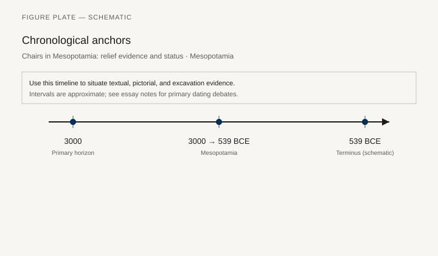
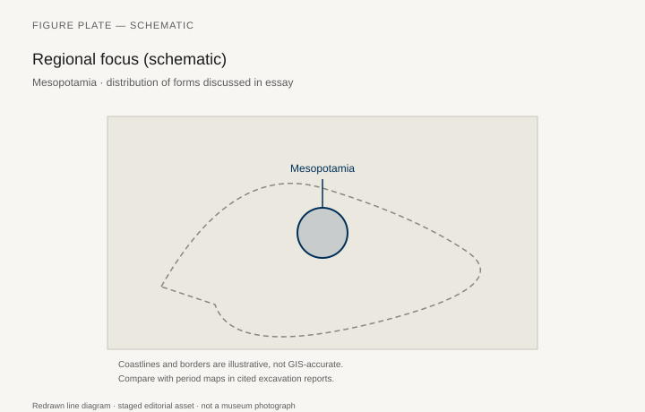
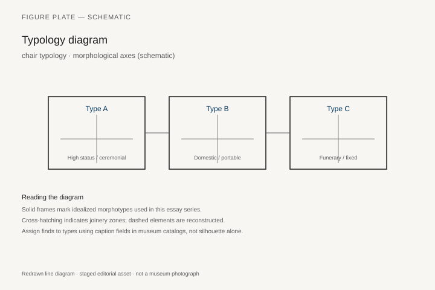
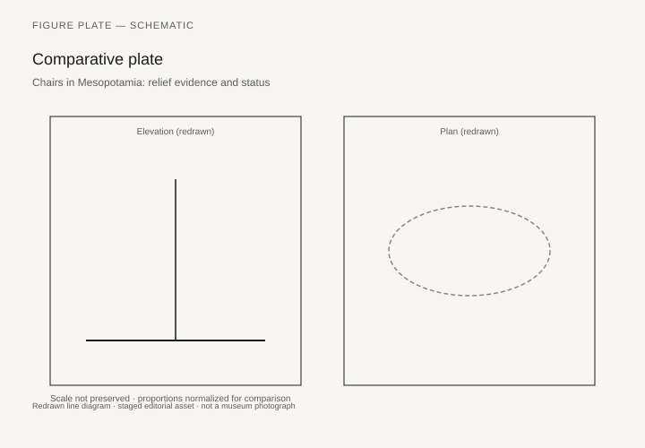

# Chairs in Mesopotamia: relief evidence and status

*Fig. 1.* Chronological anchors for the evidence discussed below. Schematic redrawn line diagram; staged editorial asset (2026). Not a photograph of a museum object.

*Fig. 2.* Regional focus for circulation and local workshop traditions. Schematic redrawn line diagram; staged editorial asset (2026). Not a photograph of a museum object.

*Fig. 3.* Morphological typology for chair typology (idealized morphotypes). Schematic redrawn line diagram; staged editorial asset (2026). Not a photograph of a museum object.

*Fig. 4.* Comparative elevation and plan plate for chair typology. Schematic redrawn line diagram; staged editorial asset (2026). Not a photograph of a museum object.

## Evidence and argument

Mesopotamian chairs arrive in the archaeological record mostly as ghosts: legs and tenons in palace destruction levels, and far more often as carved stone substitutes for wood on palace reliefs. Between **3000 and 539 BCE**, the question is not whether elites sat elevated—they did—but how sculptors translated workshop reality into an iconography of command.

Cylinder seals and Early Dynastic plaques already show figures on high-backed seats, while Neo-Assyrian palace programs freeze the king on a throne whose legs terminate in lion paws or bull hooves. Those animal feet are rhetorical, not zoological; they signal domination over the ordered world. Typology therefore tracks **posture protocols** as much as joinery: who may sit, on what height, with arms exposed or shielded by a wrap-around back.

Cuneiform inventories occasionally list wooden furniture alongside metal fittings, but rarely describe silhouette. When a text mentions a chair of ebony or cedar, the modern reader still lacks seat depth and back rake. The typology plate (Fig. 3) separates morphotypes—open stool, wrap-around throne, portable folding frame—so readers do not collapse distinct social uses into one generic “Mesopotamian chair.”

Chronology matters because chair height rises with centralized spectacle. Third-millennium seats in temples differ from eighth-century Assyrian audience furniture in scale and in the relief convention that enlarges the king’s knees toward the viewer. The timeline (Fig. 1) stays coarse; debates over Uruk IV versus Early Dynastic III seating belong in footnotes, not in millimeter-precise graphics.

Maps here are schematic guides to circulation: Mari, Nimrud, Babylon, Susa. Cedar moved downriver; ideas about enthronement moved with ambassadors and captured craftsmen. Compare the map with site plans in excavation reports rather than treating coastlines as GIS truth.

Gallery labels that show a single reconstructed throne risk implying a unified typology across two millennia. These redrawn figures state their didactic intent: morphology and rank, not a forged photograph of one accessioned object.

## Sources to consult

- Excavation reports and corpus volumes for Mesopotamia (primary).
- Museum catalog entries consulted as **textual descriptions**; figures in this article are redrawn schematics.
- Cross-references in `GRAPHICS_INDEX.md` for asset paths and reuse policy.

## Editorial note

Graphics for this slug live under `assets/mesopotamian-chair-evidence/`. External open-access museum URLs, when cited in prose elsewhere in the series, must document license terms in `LICENSES.md`. Prefer these redrawn diagrams when rights are unclear.
