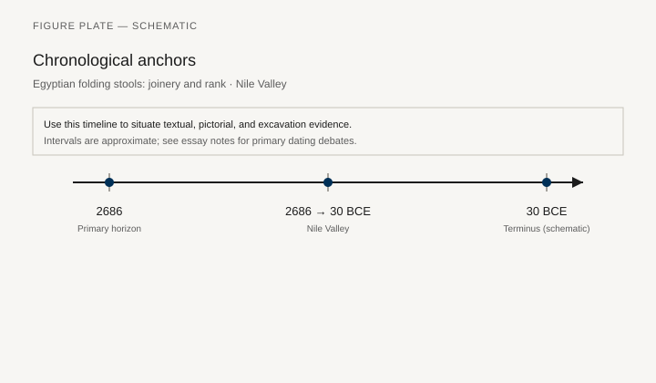
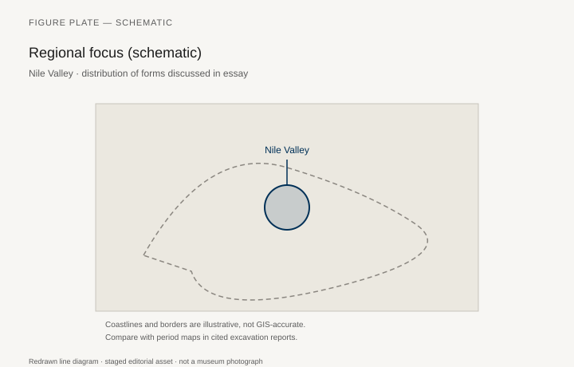
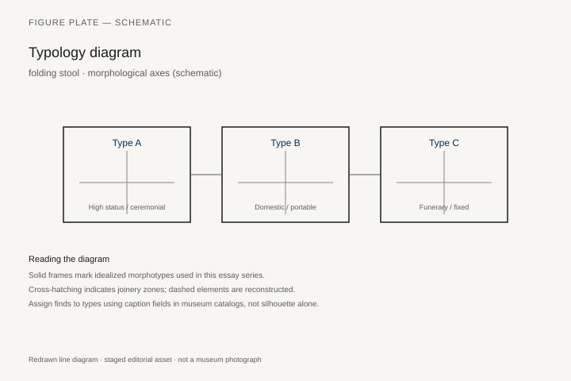
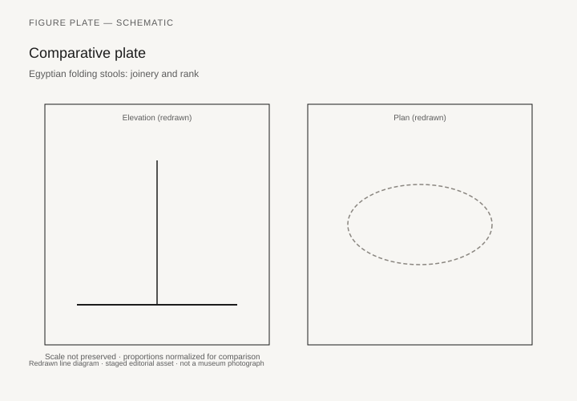

# Egyptian folding stools: joinery and rank

*Fig. 1.* Chronological anchors for the evidence discussed below. Schematic redrawn line diagram; staged editorial asset (2026). Not a photograph of a museum object.

*Fig. 2.* Regional focus for circulation and local workshop traditions. Schematic redrawn line diagram; staged editorial asset (2026). Not a photograph of a museum object.

*Fig. 3.* Morphological typology for folding stool (idealized morphotypes). Schematic redrawn line diagram; staged editorial asset (2026). Not a photograph of a museum object.

*Fig. 4.* Comparative elevation and plan plate for folding stool. Schematic redrawn line diagram; staged editorial asset (2026). Not a photograph of a museum object.

## Evidence and argument

The Egyptian folding stool is a portable argument about rank. In the New Kingdom especially, painted tomb scenes show officials carrying lattice-legged stools that open with crossed struts—furniture light enough for processions yet stiff enough for court. **2686–30 BCE** spans formats from compact camp stools to gilded examples buried with nobles.

Surviving wooden frames, often from Theban tombs, reveal careful pegging and animal-skin seats rather than upholstered panels. Lion paws on front legs echo palace thrones but on a collapsible scale; the typology diagram contrasts ceremonial fixed chairs with foldable field furniture. Joinery had to survive repeated opening without metal hinges as we know them—leather sleeves and shaped pivots carried the load.

Texts and scenes pair the stool with scribal kits and overseer roles: to sit on a folding stool was to hold delegated authority, not domestic ease. Misreading these objects as camping gear flattens Egyptian social grammar.

Fig. 1 anchors well-dated tomb groups (Eighteenth Dynasty Thebes, Ramesside burials) against long-lived types that persist into Ptolemaic painting. Where chronology wobbles between iconographic persistence and new joinery tricks, prose should say so plainly.

The Nile Valley map marks workshop centers and import routes for ebony and ivory inlays sometimes applied to stool rails. It does not survey every nome; it orients the reader toward corpus volumes on furniture from Egyptian museums (described textually, not photographed here).

Reconstruction drawings in older publications occasionally over-tighten lattice angles. Prefer measured drawings from excavation archives when building a physical replica; use these schematics for classroom comparison only.

## Sources to consult

- Excavation reports and corpus volumes for Nile Valley (primary).
- Museum catalog entries consulted as **textual descriptions**; figures in this article are redrawn schematics.
- Cross-references in `GRAPHICS_INDEX.md` for asset paths and reuse policy.

## Editorial note

Graphics for this slug live under `assets/egyptian-folding-stool/`. External open-access museum URLs, when cited in prose elsewhere in the series, must document license terms in `LICENSES.md`. Prefer these redrawn diagrams when rights are unclear.
