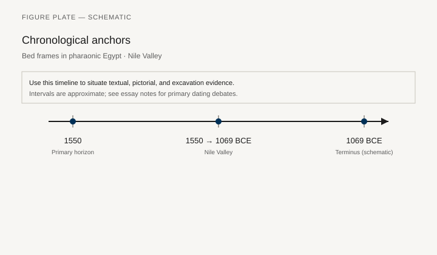
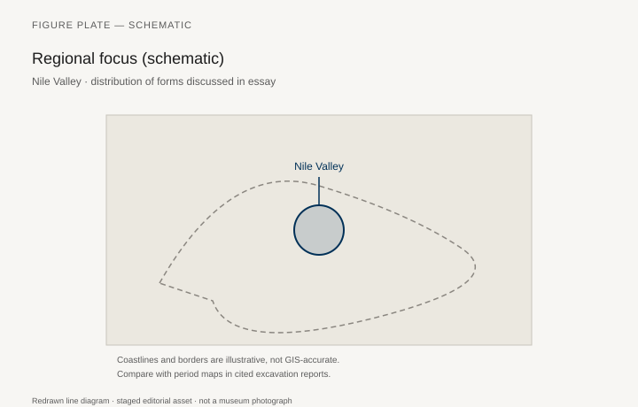
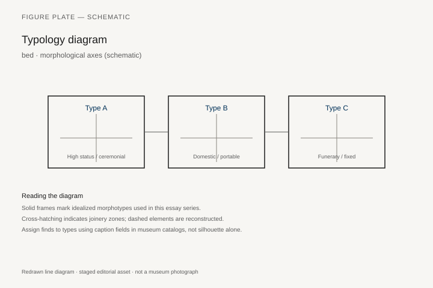
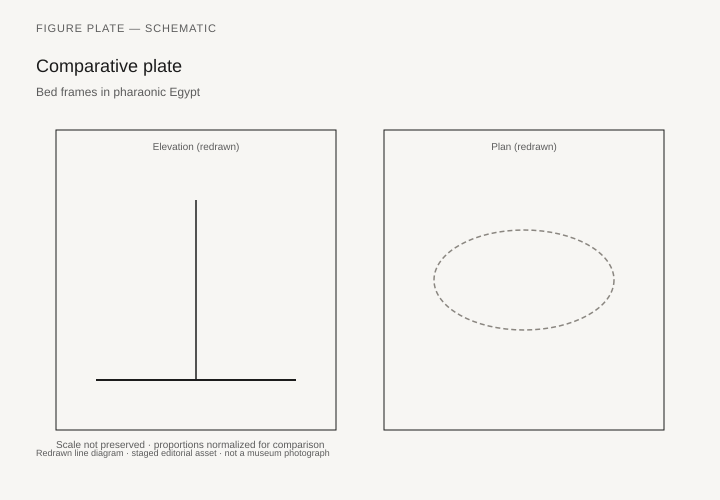

# Bed frames in pharaonic Egypt

*Fig. 1.* Chronological anchors for the evidence discussed below. Schematic redrawn line diagram; staged editorial asset (2026). Not a photograph of a museum object.

*Fig. 2.* Regional focus for circulation and local workshop traditions. Schematic redrawn line diagram; staged editorial asset (2026). Not a photograph of a museum object.

*Fig. 3.* Morphological typology for bed (idealized morphotypes). Schematic redrawn line diagram; staged editorial asset (2026). Not a photograph of a museum object.

*Fig. 4.* Comparative elevation and plan plate for bed. Schematic redrawn line diagram; staged editorial asset (2026). Not a photograph of a museum object.

## Evidence and argument

Pharaonic bed frames are not our mattresses on legs. They are low platforms with lion- or bull-footed supports, headboards that can carry protective deities, and string or mat surfaces that imply a different sleep posture than the raised European bed. The New Kingdom window **1550–1069 BCE** concentrates well-published examples from Theban tombs.

Surviving wood—when humidity allows—shows mortised rails and turned legs copied from metal prototypes in shape if not in material. Tomb scenes add color: gilded headboards, linen hangings, and beds carried as funeral equipment. The bed’s role in awakening rituals and protective magic ties furniture to text corpora that rarely mention dimensions.

Typology must separate **sleeping platforms**, **day couches**, and **funerary biers** that share zoomorphic feet but serve different rites. A single morphotype plate cannot stand in for that separation; readers should cross-walk Fig. 3 with scenes in the Theban necropolis publications.

Inventories list beds with determinatives that lexicographers still parse; this essay does not invent catalog numbers. Thin spot: exact household bed counts for middle-rank artisans remain under-published compared with royal burials.

Regional focus on the Nile Valley highlights Thebes, Amarna, and Delta sites with preserved wood. Export of style—not always of objects—shows in Aegean borrowings of headboard form.

Museum reconstructions sometimes raise beds higher than tomb scenes suggest. Treat elevation plates as comparative, not prescriptive for gallery mounting height.

## Sources to consult

- Excavation reports and corpus volumes for Nile Valley (primary).
- Museum catalog entries consulted as **textual descriptions**; figures in this article are redrawn schematics.
- Cross-references in `GRAPHICS_INDEX.md` for asset paths and reuse policy.

## Editorial note

Graphics for this slug live under `assets/egyptian-bed-frames/`. External open-access museum URLs, when cited in prose elsewhere in the series, must document license terms in `LICENSES.md`. Prefer these redrawn diagrams when rights are unclear.
