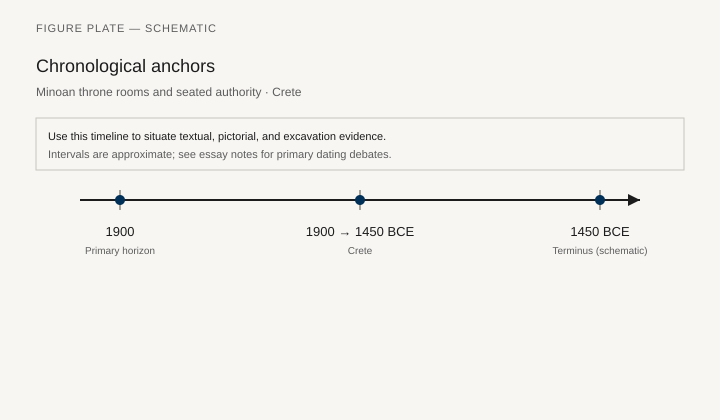
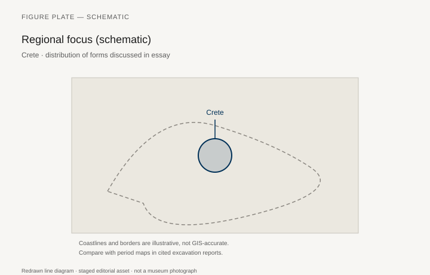
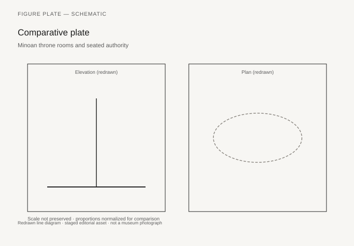

# Minoan throne rooms and seated authority

*Fig. 1.* Chronological anchors for the evidence discussed below. Schematic redrawn line diagram; staged editorial asset (2026). Not a photograph of a museum object.

*Fig. 2.* Regional focus for circulation and local workshop traditions. Schematic redrawn line diagram; staged editorial asset (2026). Not a photograph of a museum object.

*Fig. 3.* Morphological typology for throne (idealized morphotypes). Schematic redrawn line diagram; staged editorial asset (2026). Not a photograph of a museum object.

*Fig. 4.* Comparative elevation and plan plate for throne. Schematic redrawn line diagram; staged editorial asset (2026). Not a photograph of a museum object.

## Evidence and argument

Knossos Room 4—the so-called throne room—centers Minoan debates about seated authority. The gypsum seat against the north wall is fixed, flanked by benches and griffin frescoes. Whether a priest-king or a goddess’s epiphany occupied that seat remains contested; the furniture, however, is material and in situ on Crete between **1900 and 1450 BCE**.

Minoan palaces distribute seating across stepped benches, low stools, and one-off stone thrones rather than uniform chair typologies. Frescoes from Akrotiri show elegant camp stools and woven seats; administrative seating may have favored benches that kept bodies aligned for long sessions.

Hierarchy reads through **placement**: throne against wall, benches lateral, floor cushions for attendants. The typology figure encodes those roles, not IKEA categories.

Chronology links Neopalatial peak to LM IA–IB destruction horizons. Thera’s eruption threads into dating fresco parallels; the timeline stays schematic so LM/LH debates remain in prose.

Aegean trade routes on the map explain ivory inlays and Egyptianizing motifs without claiming direct import of finished thrones.

Replicas in heritage sites sometimes romanticize the gypsum seat. These diagrams refuse photographic mimicry; cite Evans and later stratigraphic critiques when arguing function.

## Sources to consult

- Excavation reports and corpus volumes for Crete (primary).
- Museum catalog entries consulted as **textual descriptions**; figures in this article are redrawn schematics.
- Cross-references in `GRAPHICS_INDEX.md` for asset paths and reuse policy.

## Editorial note

Graphics for this slug live under `assets/minoan-throne-hierarchy/`. External open-access museum URLs, when cited in prose elsewhere in the series, must document license terms in `LICENSES.md`. Prefer these redrawn diagrams when rights are unclear.
