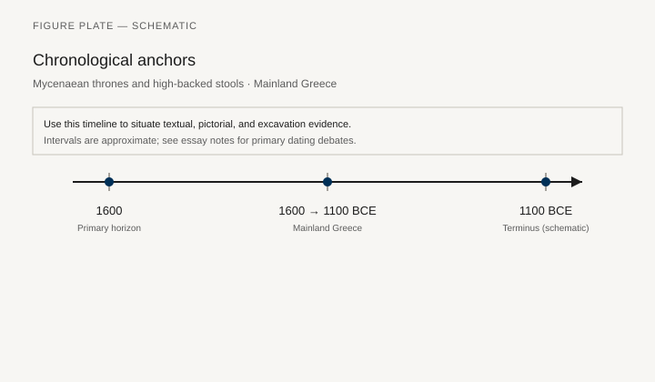
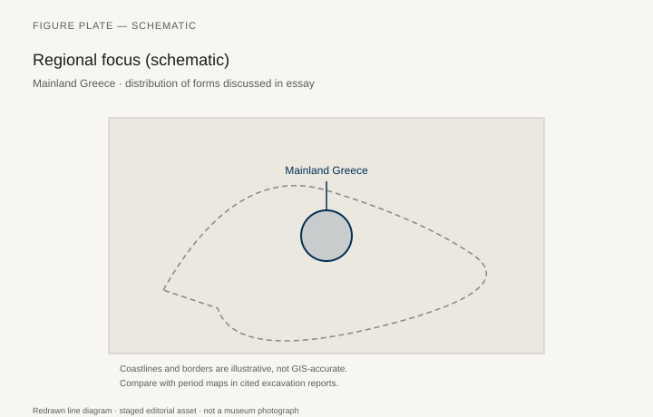
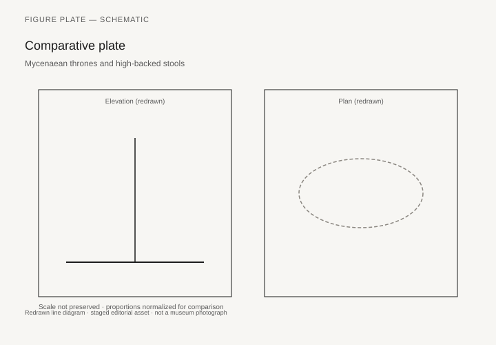

# Mycenaean thrones and high-backed stools

*Fig. 1.* Chronological anchors for the evidence discussed below. Schematic redrawn line diagram; staged editorial asset (2026). Not a photograph of a museum object.

*Fig. 2.* Regional focus for circulation and local workshop traditions. Schematic redrawn line diagram; staged editorial asset (2026). Not a photograph of a museum object.

*Fig. 3.* Morphological typology for throne (idealized morphotypes). Schematic redrawn line diagram; staged editorial asset (2026). Not a photograph of a museum object.

*Fig. 4.* Comparative elevation and plan plate for throne. Schematic redrawn line diagram; staged editorial asset (2026). Not a photograph of a museum object.

## Evidence and argument

On the Greek mainland **1600–1100 BCE**, thrones appear in palatial contexts at Pylos, Mycenae, and Tiryns as fragmentary stone or bronze fittings attached to wooden frames long decayed. High-backed stools in fresco and glyptic echo Minoan prototypes but stiffen toward martial display.

Linear B tablets mention furniture sparingly; when they do, lexical overlap with seating and footstools demands caution. Archaeology supplies carved chair stumps and ivory inlays from chamber tombs that imply conspicuous consumption at feasts.

Typology contrasts **fixed thrones** for wanax ceremony with **portable high stools** for banqueters. Leg shape—turned, saber, animal paw—tracks chronology from LH II to LH IIIC.

The timeline aligns palatial destructions with changes in seat height in pictorial art. Sub-Mycenaean simplification may reduce back height; confirm against regional cemetery evidence.

Mainland Greece on the map is a schematic anchor for workshop exchange with Crete and Cyprus.

Do not merge Mycenaean seats with later Greek klismos lines without an intermediate argument; morphology diverges at the joinery.

## Sources to consult

- Excavation reports and corpus volumes for Mainland Greece (primary).
- Museum catalog entries consulted as **textual descriptions**; figures in this article are redrawn schematics.
- Cross-references in `GRAPHICS_INDEX.md` for asset paths and reuse policy.

## Editorial note

Graphics for this slug live under `assets/mycenaean-throne-stools/`. External open-access museum URLs, when cited in prose elsewhere in the series, must document license terms in `LICENSES.md`. Prefer these redrawn diagrams when rights are unclear.
