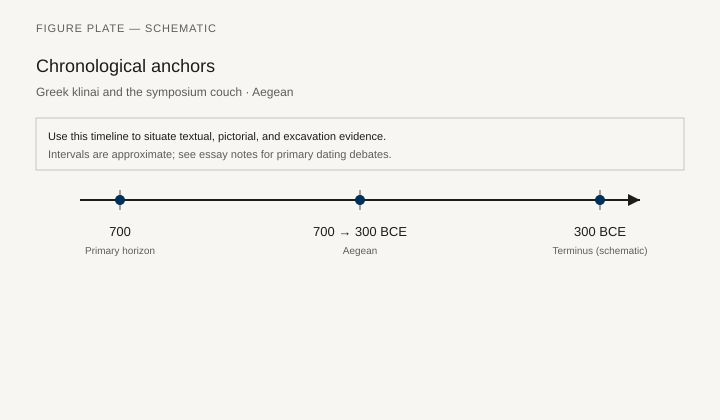
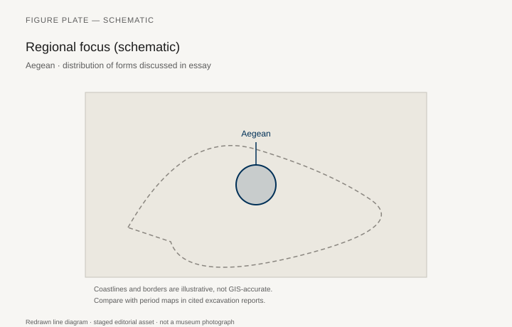
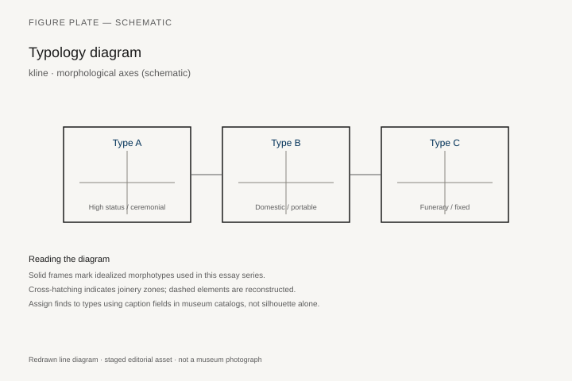
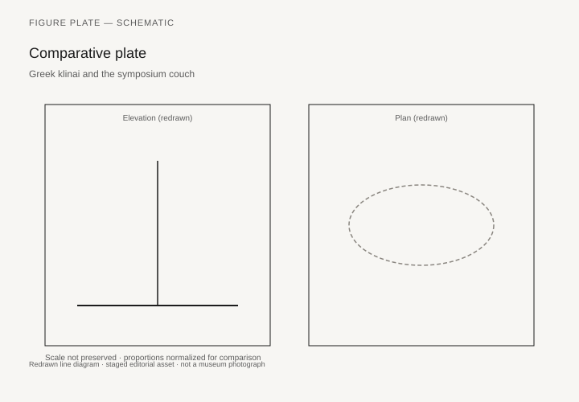

# Greek klinai and the symposium couch

*Fig. 1.* Chronological anchors for the evidence discussed below. Schematic redrawn line diagram; staged editorial asset (2026). Not a photograph of a museum object.

*Fig. 2.* Regional focus for circulation and local workshop traditions. Schematic redrawn line diagram; staged editorial asset (2026). Not a photograph of a museum object.

*Fig. 3.* Morphological typology for kline (idealized morphotypes). Schematic redrawn line diagram; staged editorial asset (2026). Not a photograph of a museum object.

*Fig. 4.* Comparative elevation and plan plate for kline. Schematic redrawn line diagram; staged editorial asset (2026). Not a photograph of a museum object.

## Evidence and argument

The Greek **kline** is a dining couch before it is a bed. From sympotic pottery through Macedonian tomb furniture, the Aegean world **700–300 BCE** normalized reclining on left elbow for banquets—a posture that drives room architecture and cushion logistics.

Vase painters show klinai as patterned mattresses on low frames; stone versions from tombs at Pella and Vergina preserve painted decoration on actual wood. Leg turnings and headrests become typological markers across Classical and Hellenistic phases.

Symposium etiquette maps guests to positions (honored middle, flanking couches). Furniture is choreography: without triclinium logic, the kline collapses into a generic couch.

Fig. 1 spans Archaic sympotic scenes through Hellenistic palace dining. Dating painterly fashion against excavated frames produces known mismatches; note them in text.

Regional circulation includes Magna Graecia and coastal Anatolia workshops copying Attic turnings.

Modern banquet reconstructions often set klinai too upright. Comparative plates show rake angles as hypotheses, not ergonomic finals.

## Sources to consult

- Excavation reports and corpus volumes for Aegean (primary).
- Museum catalog entries consulted as **textual descriptions**; figures in this article are redrawn schematics.
- Cross-references in `GRAPHICS_INDEX.md` for asset paths and reuse policy.

## Editorial note

Graphics for this slug live under `assets/greek-klinai-symposium/`. External open-access museum URLs, when cited in prose elsewhere in the series, must document license terms in `LICENSES.md`. Prefer these redrawn diagrams when rights are unclear.
