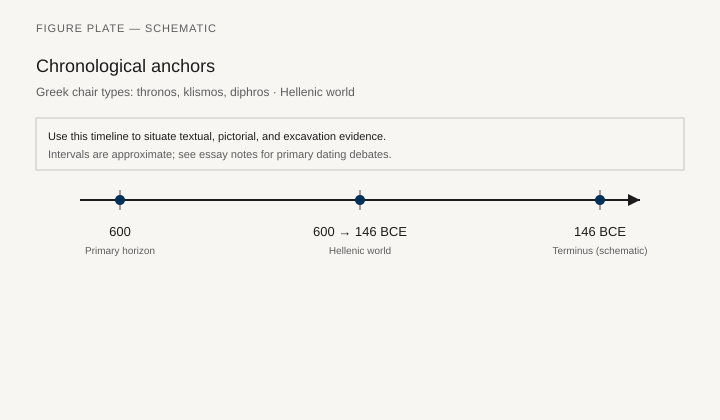
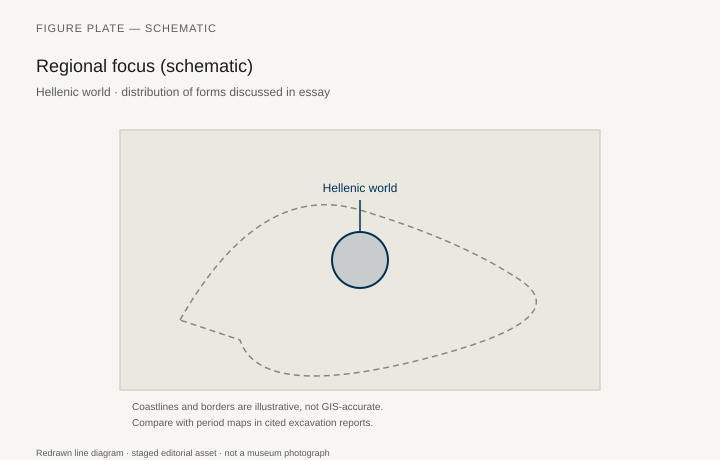
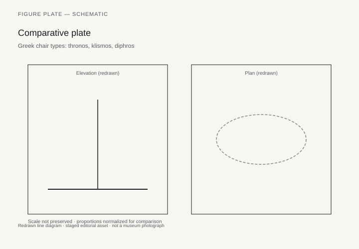

# Greek chair types: thronos, klismos, diphros

*Fig. 1.* Chronological anchors for the evidence discussed below. Schematic redrawn line diagram; staged editorial asset (2026). Not a photograph of a museum object.

*Fig. 2.* Regional focus for circulation and local workshop traditions. Schematic redrawn line diagram; staged editorial asset (2026). Not a photograph of a museum object.

*Fig. 3.* Morphological typology for chair typology (idealized morphotypes). Schematic redrawn line diagram; staged editorial asset (2026). Not a photograph of a museum object.

*Fig. 4.* Comparative elevation and plan plate for chair typology. Schematic redrawn line diagram; staged editorial asset (2026). Not a photograph of a museum object.

## Evidence and argument

Greek vocabulary sorts seating finer than English does: **thronos** (enthroned authority), **klismos** (curved stile chair), **diphros** (backless stool), **thronos** versus priestly **bathron**. Literary and votive evidence from **600–146 BCE** must align with scant wooden remains and abundant pottery scenes.

The klismos silhouette—saber legs, horizontal back rails—becomes an export image of Hellenic taste. Stone reliefs and bronze mirrors preserve the line when wood fails. Typology plates separate thronos mass from klismos elegance and diphros portability.

Chairs appear in drama as props of office: the tyrant’s seat, the judge’s bench. Reading typology without tragedy and oratory loses the performative frame.

Chronology tracks Persian War-era simplicity against fourth-century luxury inlays documented in inventories.

Hellenic world map marks Athens, Sparta, Delphi votives, and colonial finds—not a political border map.

Lexicon essays need philological caution; this piece flags thin spots where Latin **sella** later overlays Greek terms in bilingual inscriptions.

## Sources to consult

- Excavation reports and corpus volumes for Hellenic world (primary).
- Museum catalog entries consulted as **textual descriptions**; figures in this article are redrawn schematics.
- Cross-references in `GRAPHICS_INDEX.md` for asset paths and reuse policy.

## Editorial note

Graphics for this slug live under `assets/greek-chair-types/`. External open-access museum URLs, when cited in prose elsewhere in the series, must document license terms in `LICENSES.md`. Prefer these redrawn diagrams when rights are unclear.
