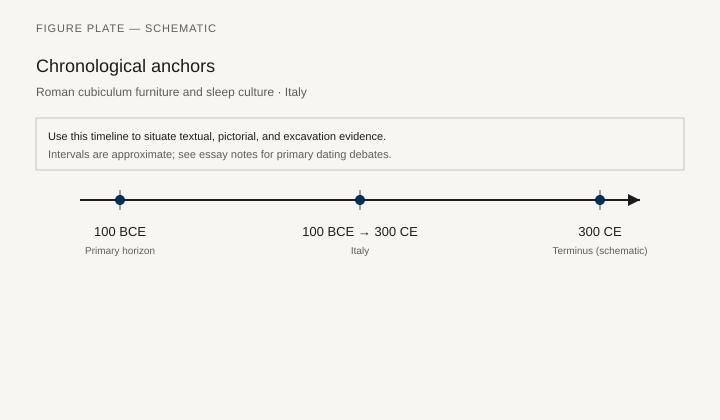
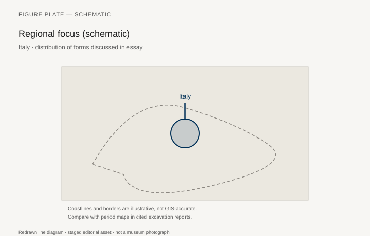
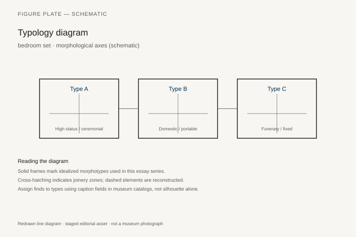
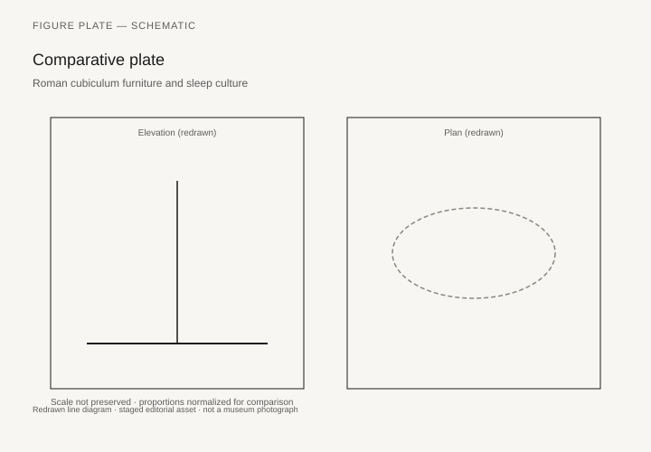

# Roman cubiculum furniture and sleep culture

*Fig. 1.* Chronological anchors for the evidence discussed below. Schematic redrawn line diagram; staged editorial asset (2026). Not a photograph of a museum object.

*Fig. 2.* Regional focus for circulation and local workshop traditions. Schematic redrawn line diagram; staged editorial asset (2026). Not a photograph of a museum object.

*Fig. 3.* Morphological typology for bedroom set (idealized morphotypes). Schematic redrawn line diagram; staged editorial asset (2026). Not a photograph of a museum object.

*Fig. 4.* Comparative elevation and plan plate for bedroom set. Schematic redrawn line diagram; staged editorial asset (2026). Not a photograph of a museum object.

## Evidence and argument

The Roman **cubiculum** bundles sleep, sex, and display. Beds (**lecti**), chests, and occasional chairs share a small room off the atrium or upper story. Italy **100 BCE–300 CE** provides Pompeian wall painting, carbonized wood from rare contexts, and legal texts on dowry furniture.

Bed frames range from simple rope-strung platforms to elaborate bronze-mounted headboards in elite houses. Night lamps, slippers, and mirrors in frescoes show furniture as part of a nocturnal kit rather than isolated sculpture.

Typology must separate **garden-room sleeping couches** from **formal reception beds** that never held sleep. Mislabeling confuses social use.

Timeline crosses Republic austerity with Imperial luxury and late antique simplification.

Campania dominates preservation; the map reminds readers that Rome’s urban furniture often survives only in representation.

Reconstruction ethics: carbonized fragments justify partial mounts; painted beds on walls justify color, not dimension alone.

## Sources to consult

- Excavation reports and corpus volumes for Italy (primary).
- Museum catalog entries consulted as **textual descriptions**; figures in this article are redrawn schematics.
- Cross-references in `GRAPHICS_INDEX.md` for asset paths and reuse policy.

## Editorial note

Graphics for this slug live under `assets/roman-cubiculum-furniture/`. External open-access museum URLs, when cited in prose elsewhere in the series, must document license terms in `LICENSES.md`. Prefer these redrawn diagrams when rights are unclear.
