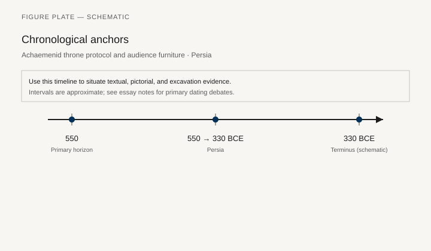
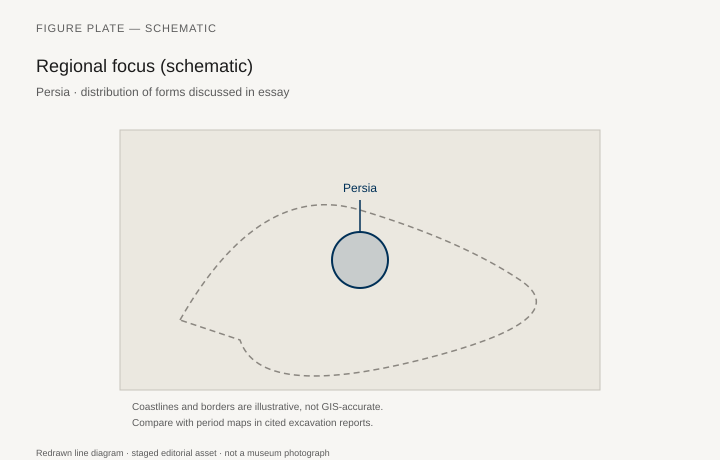
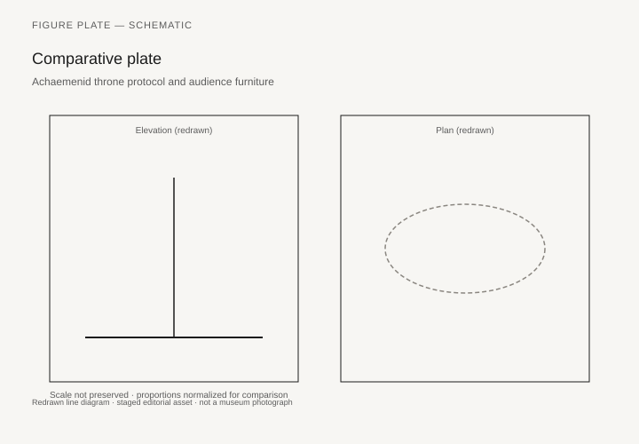

# Achaemenid throne protocol and audience furniture

*Fig. 1.* Chronological anchors for the evidence discussed below. Schematic redrawn line diagram; staged editorial asset (2026). Not a photograph of a museum object.

*Fig. 2.* Regional focus for circulation and local workshop traditions. Schematic redrawn line diagram; staged editorial asset (2026). Not a photograph of a museum object.

*Fig. 3.* Morphological typology for throne (idealized morphotypes). Schematic redrawn line diagram; staged editorial asset (2026). Not a photograph of a museum object.

*Fig. 4.* Comparative elevation and plan plate for throne. Schematic redrawn line diagram; staged editorial asset (2026). Not a photograph of a museum object.

## Evidence and argument

Achaemenid audience scenes at Persepolis encode throne protocol in stone: the king elevated, attendants with flywhisks, tribute bearers on lower ground **550–330 BCE**. Wooden thrones did not survive the burnings; the relief is the furniture.

Classical authors describe golden thrones and portable camps; archaeology supplies platform heights and stair alignments that imply furniture scale.

Typology separates **enthronement on platform** from **camp stool** mobility for royal tours.

Timeline crosses Cyrus through Darius III; Macedonian conquest ends the court but not the image repertoire.

Persia schematic map includes satrap capitals where local workshops adapted court forms.

Avoid conflating Apadana relief thrones with later Sasanian silver furniture; series cross-links handle succession.

## Sources to consult

- Excavation reports and corpus volumes for Persia (primary).
- Museum catalog entries consulted as **textual descriptions**; figures in this article are redrawn schematics.
- Cross-references in `GRAPHICS_INDEX.md` for asset paths and reuse policy.

## Editorial note

Graphics for this slug live under `assets/persian-throne-protocol/`. External open-access museum URLs, when cited in prose elsewhere in the series, must document license terms in `LICENSES.md`. Prefer these redrawn diagrams when rights are unclear.
