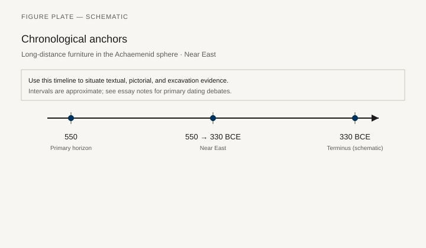
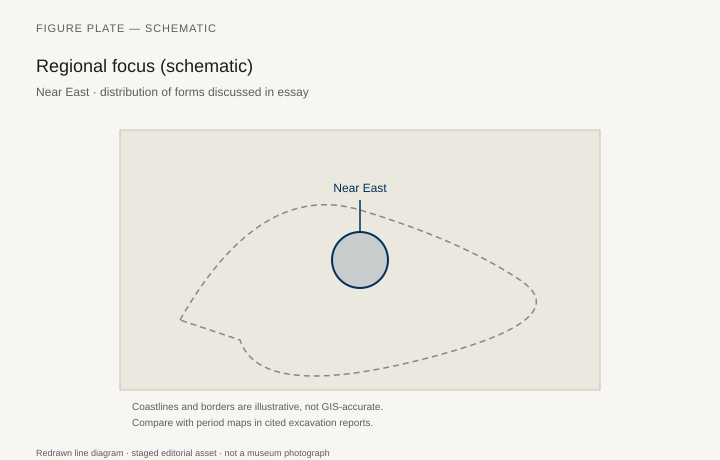
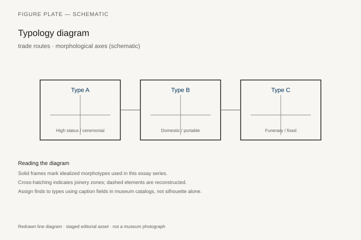
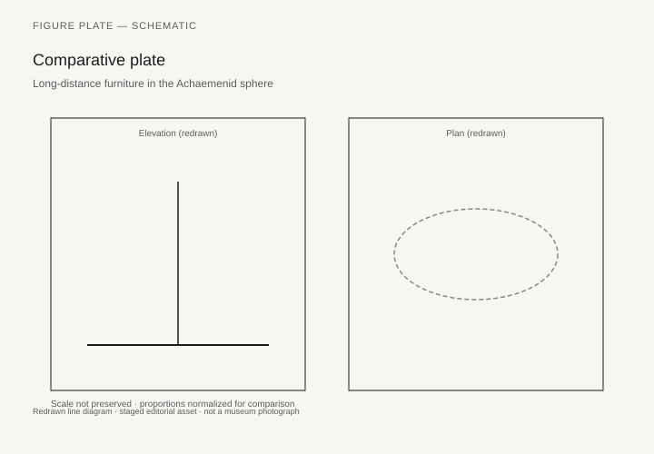

# Long-distance furniture in the Achaemenid sphere

*Fig. 1.* Chronological anchors for the evidence discussed below. Schematic redrawn line diagram; staged editorial asset (2026). Not a photograph of a museum object.

*Fig. 2.* Regional focus for circulation and local workshop traditions. Schematic redrawn line diagram; staged editorial asset (2026). Not a photograph of a museum object.

*Fig. 3.* Morphological typology for trade routes (idealized morphotypes). Schematic redrawn line diagram; staged editorial asset (2026). Not a photograph of a museum object.

*Fig. 4.* Comparative elevation and plan plate for trade routes. Schematic redrawn line diagram; staged editorial asset (2026). Not a photograph of a museum object.

## Evidence and argument

Luxury wood moved across the Achaemenid sphere along roads and sea lanes **550–330 BCE**. Cedar from Lebanon, Indian ivory, Egyptian ebony—texts and archaeology trace **materials** more often than finished dining sets.

Administrative tablets and Greek mercenary memoirs mention portable tables and elaborate beds in royal baggage trains. Furniture here is logistics: pack animals, disassembly, regilding after transit.

Typology for trade focuses on **flat-pack tables**, folding stands, and throne components shipped as prestige gifts.

Timeline aligns foundation of royal road systems with increased gift exchange in fifth-century diplomacy.

Near East map marks Sardis, Susa, Persepolis, and Mediterranean ports—schematic trade arcs only.

Thin citation zone: quantified export volumes for furniture specifically are rare; infer from timber duties and gift lists.

## Sources to consult

- Excavation reports and corpus volumes for Near East (primary).
- Museum catalog entries consulted as **textual descriptions**; figures in this article are redrawn schematics.
- Cross-references in `GRAPHICS_INDEX.md` for asset paths and reuse policy.

## Editorial note

Graphics for this slug live under `assets/achaemenid-furniture-trade/`. External open-access museum URLs, when cited in prose elsewhere in the series, must document license terms in `LICENSES.md`. Prefer these redrawn diagrams when rights are unclear.
