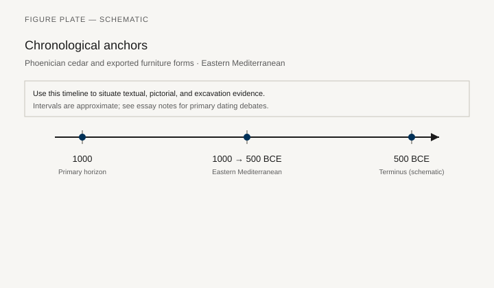
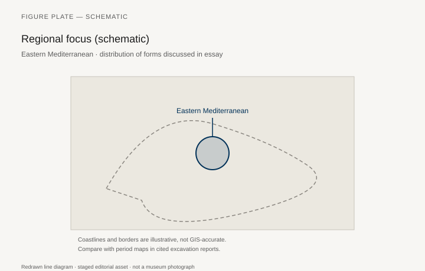
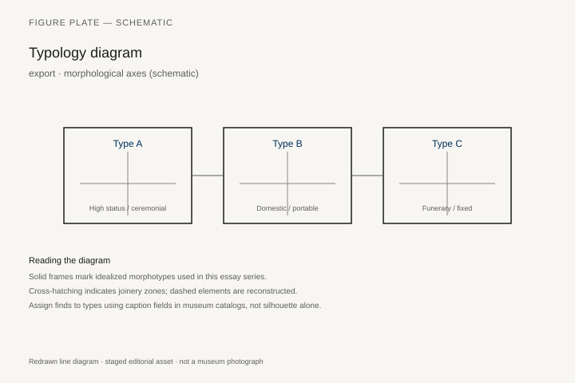
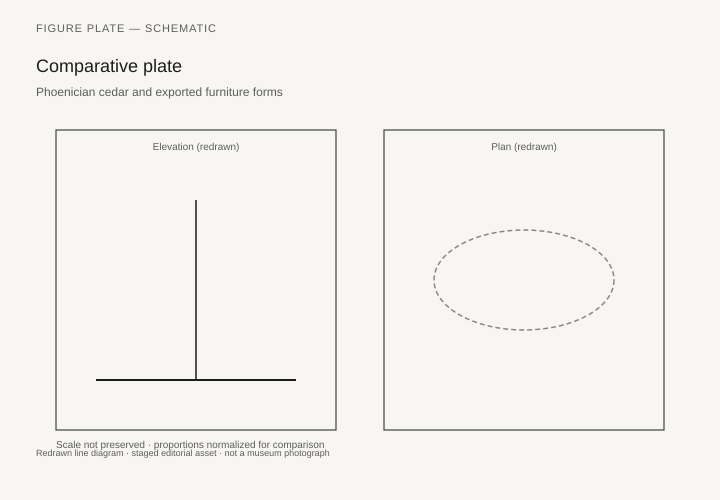

# Phoenician cedar and exported furniture forms

*Fig. 1.* Chronological anchors for the evidence discussed below. Schematic redrawn line diagram; staged editorial asset (2026). Not a photograph of a museum object.

*Fig. 2.* Regional focus for circulation and local workshop traditions. Schematic redrawn line diagram; staged editorial asset (2026). Not a photograph of a museum object.

*Fig. 3.* Morphological typology for export (idealized morphotypes). Schematic redrawn line diagram; staged editorial asset (2026). Not a photograph of a museum object.

*Fig. 4.* Comparative elevation and plan plate for export. Schematic redrawn line diagram; staged editorial asset (2026). Not a photograph of a museum object.

## Evidence and argument

Phoenician merchants exported **cedar logs** and, with them, forms: headboards with Egyptianizing volutes, low tables, and shrine furniture **1000–500 BCE**. Finished pieces rarely survive; shipwreck and colony archaeology supply hints.

Classical writers credit Phoenicians with introducing couches to the west; material proof is indirect—colony tombs with Levantine turnings.

Typology tracks **export silhouettes** versus local hybrid copies in Sardinia and Iberia.

Timeline spans Iron Age peak to Hellenistic absorption of workshops.

Eastern Mediterranean map arcs Tyre, Carthage, and colonial cemeteries.

Cedar supply essay in this series complements but does not duplicate timber law texts.

## Sources to consult

- Excavation reports and corpus volumes for Eastern Mediterranean (primary).
- Museum catalog entries consulted as **textual descriptions**; figures in this article are redrawn schematics.
- Cross-references in `GRAPHICS_INDEX.md` for asset paths and reuse policy.

## Editorial note

Graphics for this slug live under `assets/phoenician-export-furniture/`. External open-access museum URLs, when cited in prose elsewhere in the series, must document license terms in `LICENSES.md`. Prefer these redrawn diagrams when rights are unclear.
