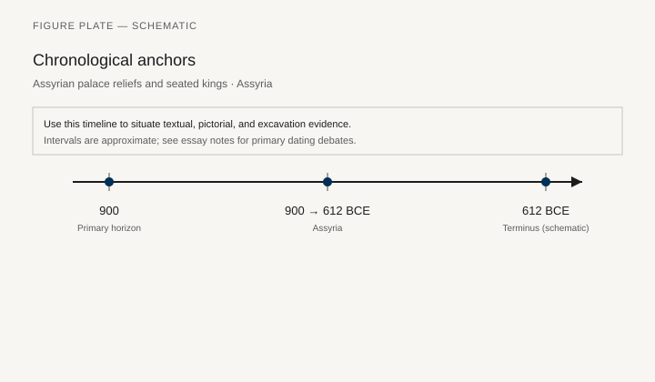
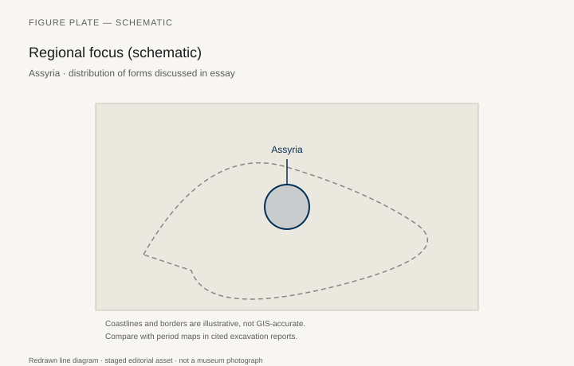
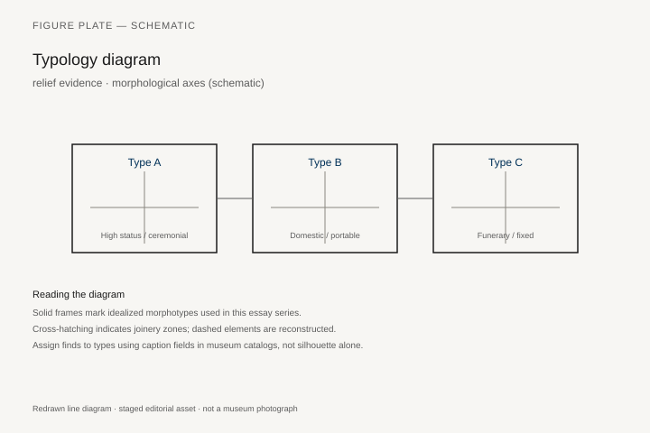
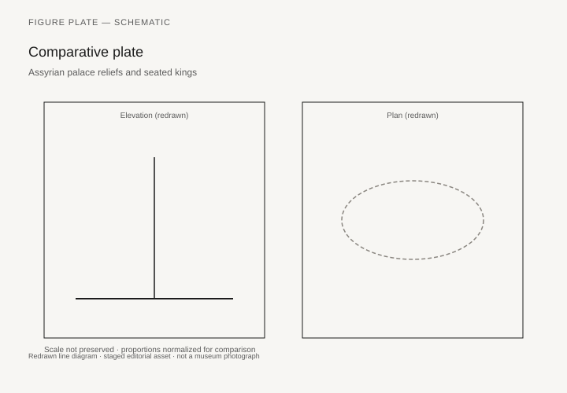

# Assyrian palace reliefs and seated kings

*Fig. 1.* Chronological anchors for the evidence discussed below. Schematic redrawn line diagram; staged editorial asset (2026). Not a photograph of a museum object.

*Fig. 2.* Regional focus for circulation and local workshop traditions. Schematic redrawn line diagram; staged editorial asset (2026). Not a photograph of a museum object.

*Fig. 3.* Morphological typology for relief evidence (idealized morphotypes). Schematic redrawn line diagram; staged editorial asset (2026). Not a photograph of a museum object.

*Fig. 4.* Comparative elevation and plan plate for relief evidence. Schematic redrawn line diagram; staged editorial asset (2026). Not a photograph of a museum object.

## Evidence and argument

Assyrian palace reliefs **900–612 BCE** are deliberate furniture catalogs for royal ideology. Kings sit on high-backed thrones with attendants shading them; conquered enemies kneel or stand. Scale is rhetorical: knees enlarged, throne legs as lion paws.

Relief evidence biases toward ceremony, not kitchens. Still, it preserves footstool types, high stools for scribes, and camp furniture in campaign scenes.

Typology codes **enthroned king**, **standing court**, **kneeling tribute** as furniture-relative postures.

Timeline links Ashurnasirpal II through Ashurbanipal libraries.

Assyria map centers Nimrud, Khorsabad, Nineveh destruction horizons.

Photographic forgery is unnecessary when line drawings extract silhouette; these SVGs are didactic reductions.

## Sources to consult

- Excavation reports and corpus volumes for Assyria (primary).
- Museum catalog entries consulted as **textual descriptions**; figures in this article are redrawn schematics.
- Cross-references in `GRAPHICS_INDEX.md` for asset paths and reuse policy.

## Editorial note

Graphics for this slug live under `assets/assyrian-relief-seating/`. External open-access museum URLs, when cited in prose elsewhere in the series, must document license terms in `LICENSES.md`. Prefer these redrawn diagrams when rights are unclear.
