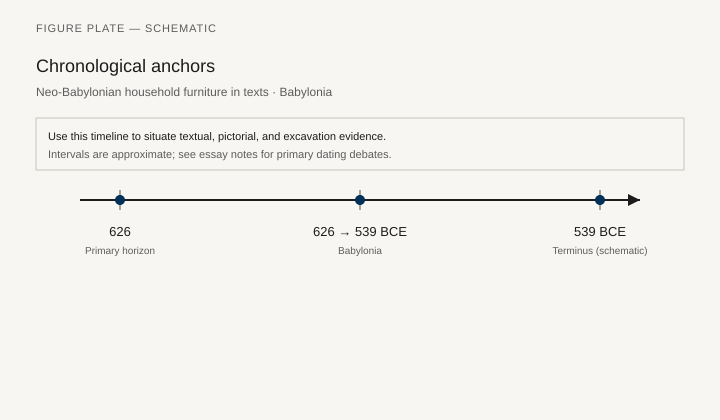
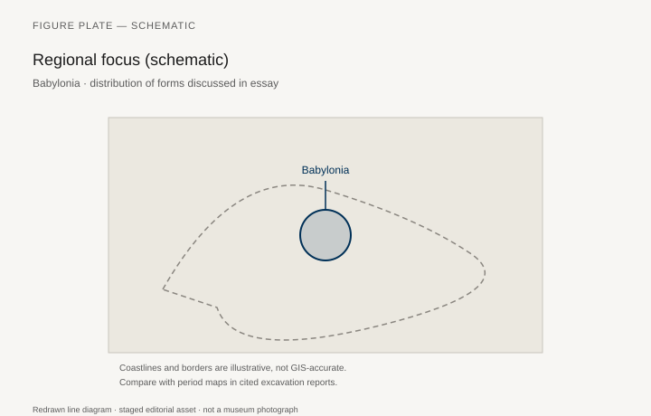
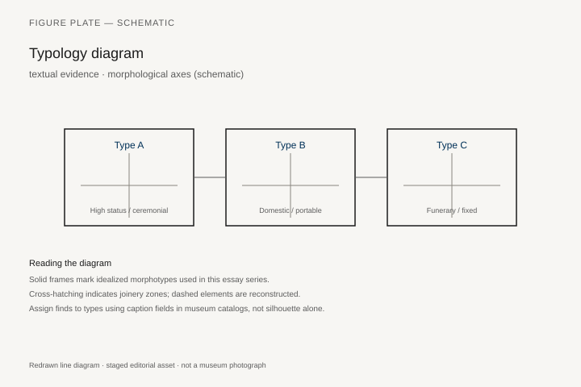
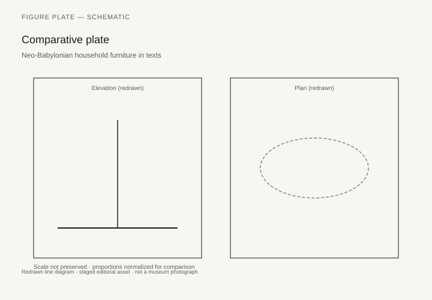

# Neo-Babylonian household furniture in texts

*Fig. 1.* Chronological anchors for the evidence discussed below. Schematic redrawn line diagram; staged editorial asset (2026). Not a photograph of a museum object.

*Fig. 2.* Regional focus for circulation and local workshop traditions. Schematic redrawn line diagram; staged editorial asset (2026). Not a photograph of a museum object.

*Fig. 3.* Morphological typology for textual evidence (idealized morphotypes). Schematic redrawn line diagram; staged editorial asset (2026). Not a photograph of a museum object.

*Fig. 4.* Comparative elevation and plan plate for textual evidence. Schematic redrawn line diagram; staged editorial asset (2026). Not a photograph of a museum object.

## Evidence and argument

Neo-Babylonian legal and economic texts **626–539 BCE** name household goods: beds, chairs, tables, lamps. Furniture appears in dowry lists, debt pledges, and temple leases—language without illustration.

Translating Akkadian terms onto modern typology risks false precision. Some words may mean chests used as seats; context clauses matter.

Typology here is **text-forward**: group by determinative and by room of mention (roof terrace, inner chamber).

Timeline crosses Nabopolassar through Cyrus’s entry; archival density peaks in late archives.

Babylonia map orients Ur, Uruk, Babylon urban households.

Flag: few published joins between text lines and excavated Neo-Babylonian house plans.

## Sources to consult

- Excavation reports and corpus volumes for Babylonia (primary).
- Museum catalog entries consulted as **textual descriptions**; figures in this article are redrawn schematics.
- Cross-references in `GRAPHICS_INDEX.md` for asset paths and reuse policy.

## Editorial note

Graphics for this slug live under `assets/neo-babylonian-household/`. External open-access museum URLs, when cited in prose elsewhere in the series, must document license terms in `LICENSES.md`. Prefer these redrawn diagrams when rights are unclear.
