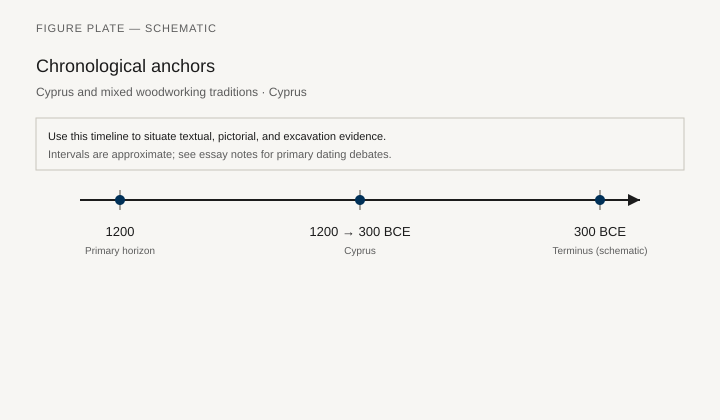
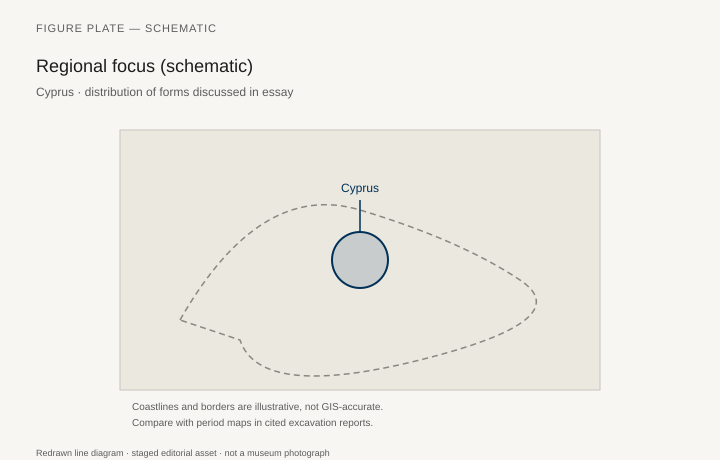
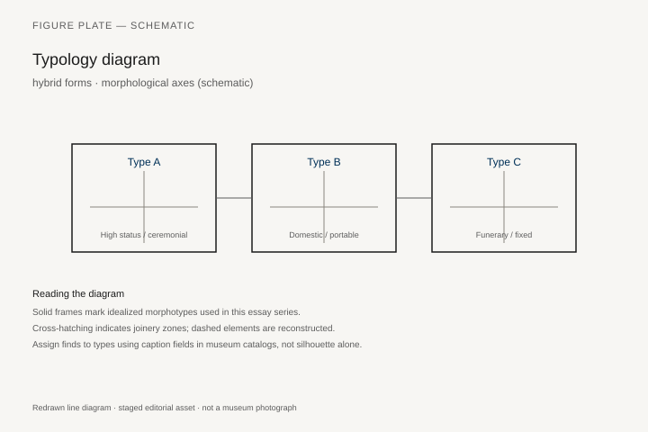
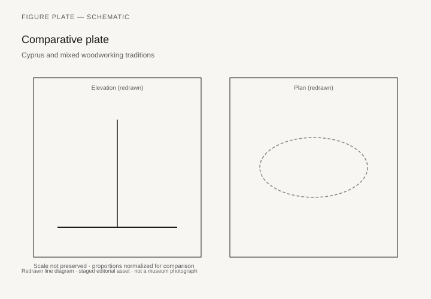

# Cyprus and mixed woodworking traditions

*Fig. 1.* Chronological anchors for the evidence discussed below. Schematic redrawn line diagram; staged editorial asset (2026). Not a photograph of a museum object.

*Fig. 2.* Regional focus for circulation and local workshop traditions. Schematic redrawn line diagram; staged editorial asset (2026). Not a photograph of a museum object.

*Fig. 3.* Morphological typology for hybrid forms (idealized morphotypes). Schematic redrawn line diagram; staged editorial asset (2026). Not a photograph of a museum object.

*Fig. 4.* Comparative elevation and plan plate for hybrid forms. Schematic redrawn line diagram; staged editorial asset (2026). Not a photograph of a museum object.

## Evidence and argument

Cyprus sat between Aegean, Levantine, and Near Eastern furniture idioms **1200–300 BCE**. Tomb beds with animal legs, ivory plaques, and bronze fittings show hybrid workshops serving both palace and export.

Wood species and metal technology shifted with Phoenician settlement and Archaic Greek trade.

Typology labels **hybrid morphotypes**—Minoan curve on Levantine plaque layout—without pretending single authorship.

Chronology runs Geometric through Hellenistic royal tombs at Soloi.

Island schematic on the map; compare with site plans in Cyprus Survey volumes.

Thin spot: fewer intact wooden frames than plaque hoards.

## Sources to consult

- Excavation reports and corpus volumes for Cyprus (primary).
- Museum catalog entries consulted as **textual descriptions**; figures in this article are redrawn schematics.
- Cross-references in `GRAPHICS_INDEX.md` for asset paths and reuse policy.

## Editorial note

Graphics for this slug live under `assets/cypriot-wood-traditions/`. External open-access museum URLs, when cited in prose elsewhere in the series, must document license terms in `LICENSES.md`. Prefer these redrawn diagrams when rights are unclear.
