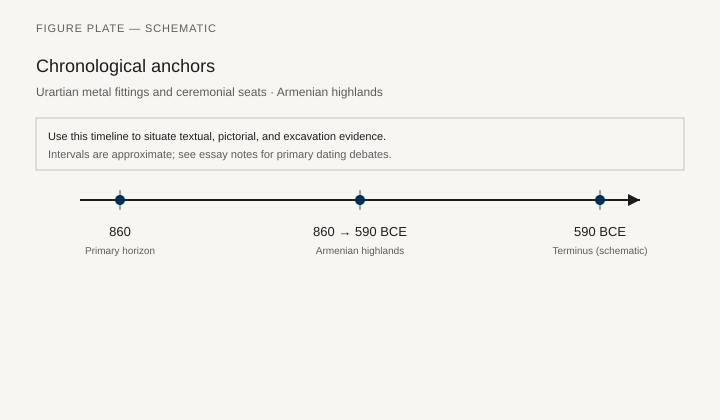
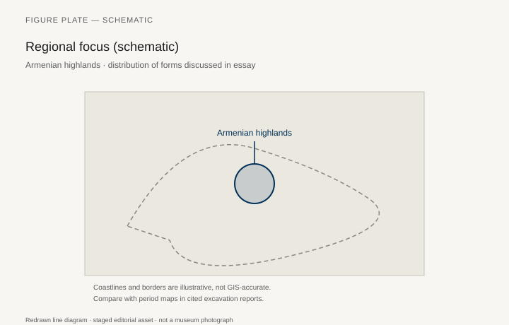
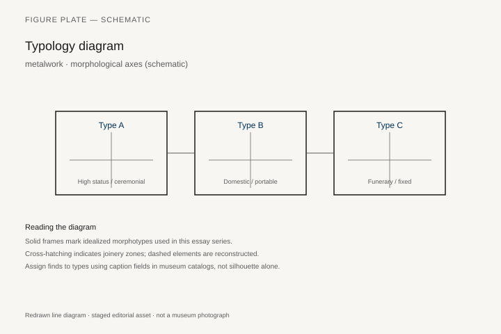
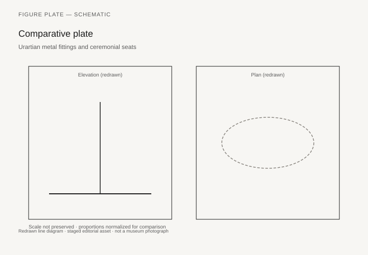

# Urartian metal fittings and ceremonial seats

*Fig. 1.* Chronological anchors for the evidence discussed below. Schematic redrawn line diagram; staged editorial asset (2026). Not a photograph of a museum object.

*Fig. 2.* Regional focus for circulation and local workshop traditions. Schematic redrawn line diagram; staged editorial asset (2026). Not a photograph of a museum object.

*Fig. 3.* Morphological typology for metalwork (idealized morphotypes). Schematic redrawn line diagram; staged editorial asset (2026). Not a photograph of a museum object.

*Fig. 4.* Comparative elevation and plan plate for metalwork. Schematic redrawn line diagram; staged editorial asset (2026). Not a photograph of a museum object.

## Evidence and argument

Urartian fortresses in the Armenian highlands **860–590 BCE** yield bronze shield rings, furniture nails, and ceremonial standards more often than wooden seats. Metal fittings imply thrones and banquet equipment in fire-destroyed halls.

Inscriptions boast of booty including enemy furniture; archaeology supplies local production of bronze couch fittings.

Typology emphasizes **metal appliqué** and riveted strapping on timber frames.

Timeline aligns Menua and Argishti building phases with Assyrian conflict horizons.

Highland map is intentionally coarse given alpine site dispersion.

Reconstruction must not invent wooden sections without mineralized wood evidence.

## Sources to consult

- Excavation reports and corpus volumes for Armenian highlands (primary).
- Museum catalog entries consulted as **textual descriptions**; figures in this article are redrawn schematics.
- Cross-references in `GRAPHICS_INDEX.md` for asset paths and reuse policy.

## Editorial note

Graphics for this slug live under `assets/urartian-metal-furniture/`. External open-access museum URLs, when cited in prose elsewhere in the series, must document license terms in `LICENSES.md`. Prefer these redrawn diagrams when rights are unclear.
