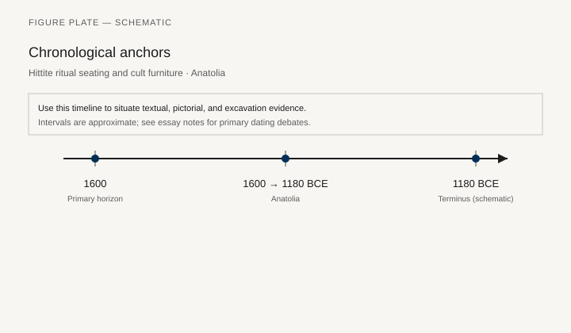
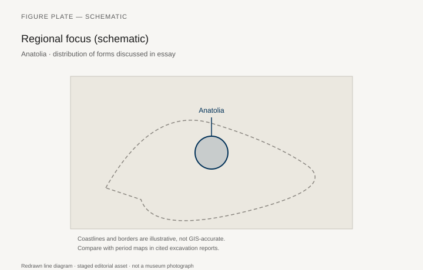
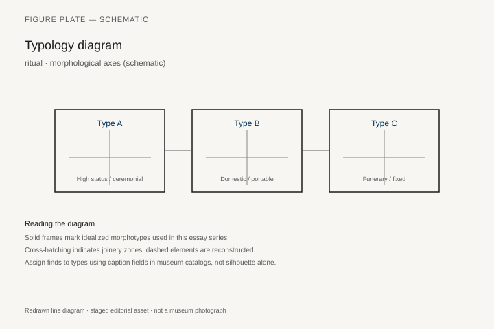
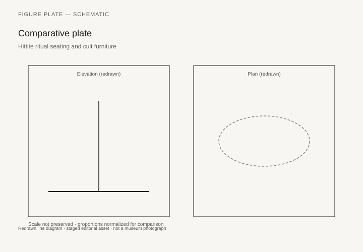

# Hittite ritual seating and cult furniture

*Fig. 1.* Chronological anchors for the evidence discussed below. Schematic redrawn line diagram; staged editorial asset (2026). Not a photograph of a museum object.

*Fig. 2.* Regional focus for circulation and local workshop traditions. Schematic redrawn line diagram; staged editorial asset (2026). Not a photograph of a museum object.

*Fig. 3.* Morphological typology for ritual (idealized morphotypes). Schematic redrawn line diagram; staged editorial asset (2026). Not a photograph of a museum object.

*Fig. 4.* Comparative elevation and plan plate for ritual. Schematic redrawn line diagram; staged editorial asset (2026). Not a photograph of a museum object.

## Evidence and argument

Hittite ritual texts from Anatolia **1600–1180 BCE** prescribe seating arrangements for festivals: gods, king, and priests occupy differentiated furniture in temple courtyards.

Archaeology at Boğazköy offers stone bases and fragmentary furnishings; cuneiform instructions supply choreography.

Typology links **cult stool**, **king’s seat**, and **ritual couch** where festivals mirror Mesopotamian loans.

New Hittite versus Empire phases appear on the timeline schematic.

Anatolia map marks capital and provincial temples without exhaustive survey.

Philological gaps: some Hittite furniture terms lack agreed morphological match.

## Sources to consult

- Excavation reports and corpus volumes for Anatolia (primary).
- Museum catalog entries consulted as **textual descriptions**; figures in this article are redrawn schematics.
- Cross-references in `GRAPHICS_INDEX.md` for asset paths and reuse policy.

## Editorial note

Graphics for this slug live under `assets/hittite-seating-ritual/`. External open-access museum URLs, when cited in prose elsewhere in the series, must document license terms in `LICENSES.md`. Prefer these redrawn diagrams when rights are unclear.
