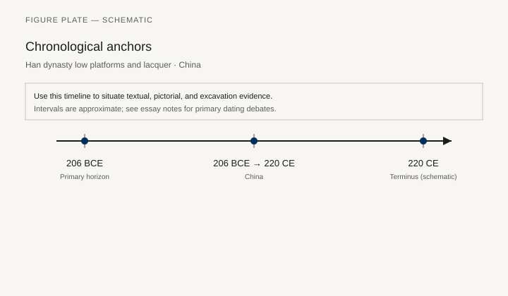
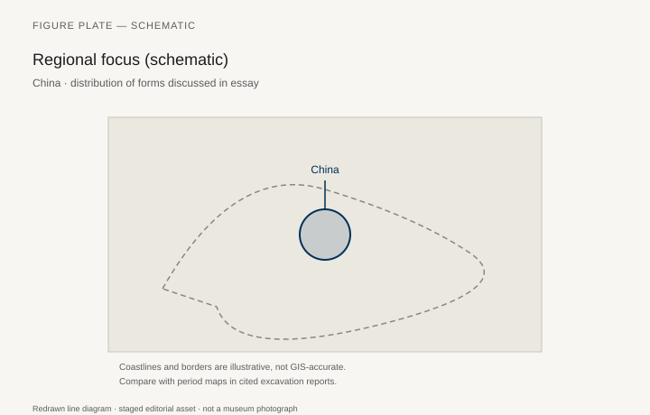
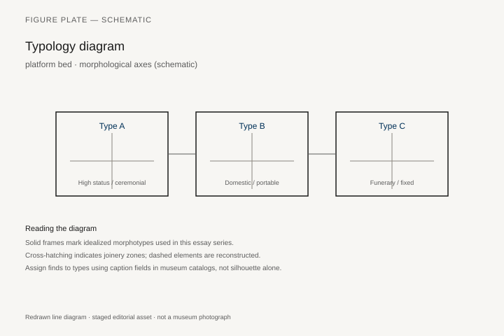
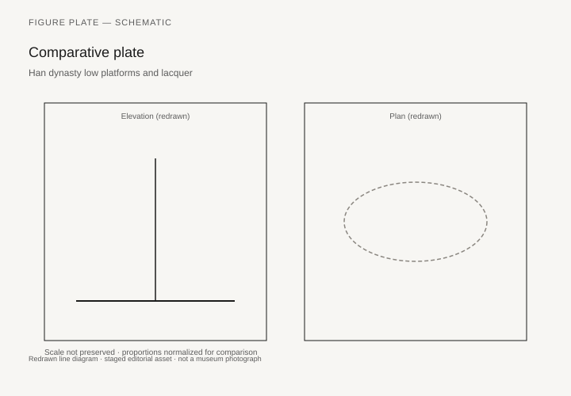

# Han dynasty low platforms and lacquer

*Fig. 1.* Chronological anchors for the evidence discussed below. Schematic redrawn line diagram; staged editorial asset (2026). Not a photograph of a museum object.

*Fig. 2.* Regional focus for circulation and local workshop traditions. Schematic redrawn line diagram; staged editorial asset (2026). Not a photograph of a museum object.

*Fig. 3.* Morphological typology for platform bed (idealized morphotypes). Schematic redrawn line diagram; staged editorial asset (2026). Not a photograph of a museum object.

*Fig. 4.* Comparative elevation and plan plate for platform bed. Schematic redrawn line diagram; staged editorial asset (2026). Not a photograph of a museum object.

## Evidence and argument

Han tombs in China **206 BCE–220 CE** preserve lacquered low platforms, couch frames, and screen furniture in waterlogged contexts. Platform sleeping and seated reception on mats intersect with emerging raised furniture for elite display.

Lacquer layers preserve color and metal fittings when wood structure collapses.

Typology separates **platform bed (chuang)**, **couch**, and **armchair precursors** in late Han art.

Timeline crosses Western Han opulence and Eastern Han simplification.

China map marks Chang’an, Luoyang, and key tomb districts schematically.

Climate bias: northern dry tombs versus southern waterlogged preservation.

## Sources to consult

- Excavation reports and corpus volumes for China (primary).
- Museum catalog entries consulted as **textual descriptions**; figures in this article are redrawn schematics.
- Cross-references in `GRAPHICS_INDEX.md` for asset paths and reuse policy.

## Editorial note

Graphics for this slug live under `assets/han-dynasty-low-platforms/`. External open-access museum URLs, when cited in prose elsewhere in the series, must document license terms in `LICENSES.md`. Prefer these redrawn diagrams when rights are unclear.
