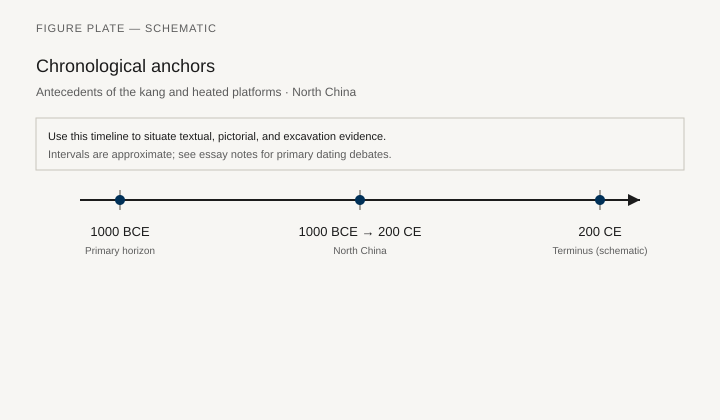
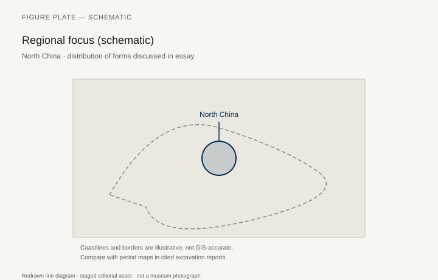
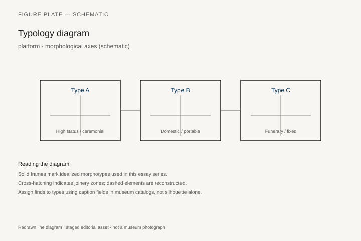
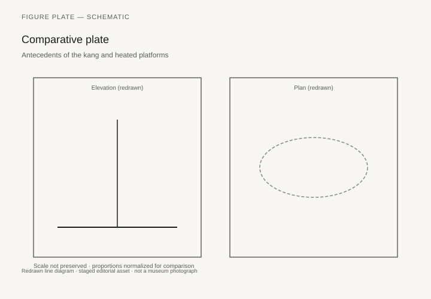

# Antecedents of the kang and heated platforms

*Fig. 1.* Chronological anchors for the evidence discussed below. Schematic redrawn line diagram; staged editorial asset (2026). Not a photograph of a museum object.

*Fig. 2.* Regional focus for circulation and local workshop traditions. Schematic redrawn line diagram; staged editorial asset (2026). Not a photograph of a museum object.

*Fig. 3.* Morphological typology for platform (idealized morphotypes). Schematic redrawn line diagram; staged editorial asset (2026). Not a photograph of a museum object.

*Fig. 4.* Comparative elevation and plan plate for platform. Schematic redrawn line diagram; staged editorial asset (2026). Not a photograph of a museum object.

## Evidence and argument

Heated sleeping platforms—the **kang** tradition in North China—have long archaeological antecedents in raised heated surfaces and stove-linked benches **1000 BCE–200 CE**. This essay traces platform logic before brick kang maturity.

Warring States and Han architecture shows kang-like sleeping surfaces tied to flue systems in northern winters.

Typology links **stove bench**, **raised sleeping platform**, and **mat-on-floor** summer habits.

Timeline is deliberately long and coarse given regional climate variation.

North China schematic map; not a climatic GIS model.

**Weak article flag:** pre-Han heated platform evidence is architectural inference more than furniture finds.

## Sources to consult

- Excavation reports and corpus volumes for North China (primary).
- Museum catalog entries consulted as **textual descriptions**; figures in this article are redrawn schematics.
- Cross-references in `GRAPHICS_INDEX.md` for asset paths and reuse policy.

## Editorial note

Graphics for this slug live under `assets/chinese-kang-platform-beds/`. External open-access museum URLs, when cited in prose elsewhere in the series, must document license terms in `LICENSES.md`. Prefer these redrawn diagrams when rights are unclear.
