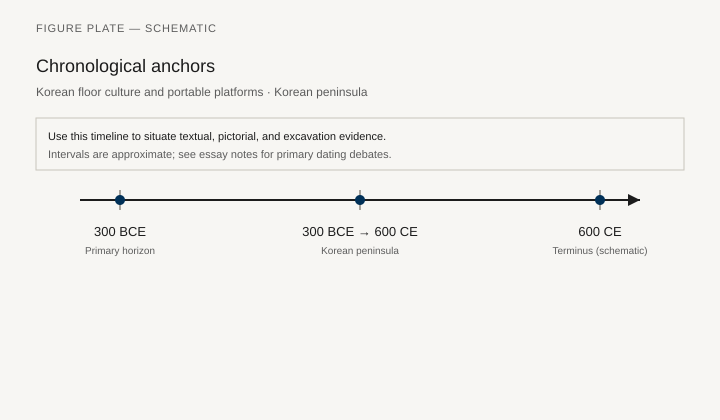
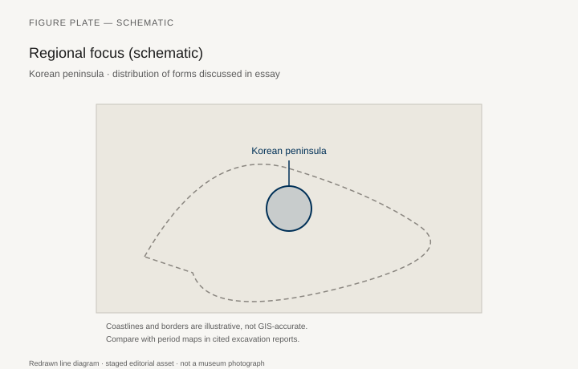
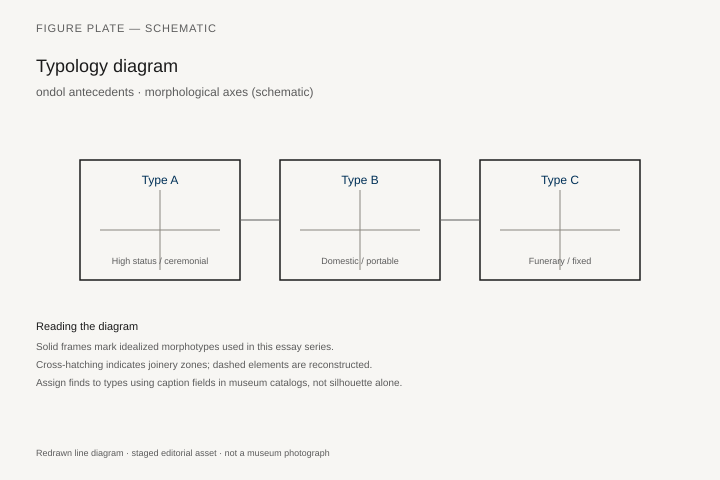
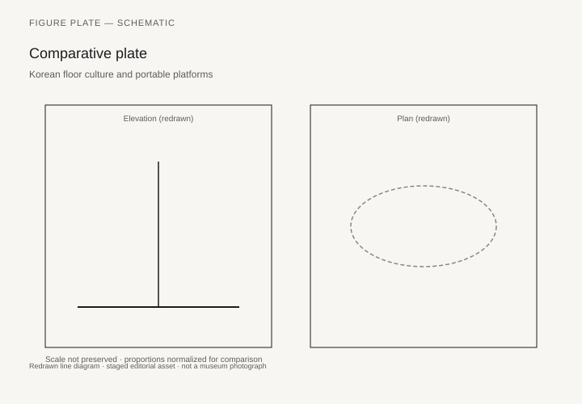

# Korean floor culture and portable platforms

*Fig. 1.* Chronological anchors for the evidence discussed below. Schematic redrawn line diagram; staged editorial asset (2026). Not a photograph of a museum object.

*Fig. 2.* Regional focus for circulation and local workshop traditions. Schematic redrawn line diagram; staged editorial asset (2026). Not a photograph of a museum object.

*Fig. 3.* Morphological typology for ondol antecedents (idealized morphotypes). Schematic redrawn line diagram; staged editorial asset (2026). Not a photograph of a museum object.

*Fig. 4.* Comparative elevation and plan plate for ondol antecedents. Schematic redrawn line diagram; staged editorial asset (2026). Not a photograph of a museum object.

## Evidence and argument

Korean floor culture and **ondol** heating **300 BCE–600 CE** encourage low portable platforms and heated floors rather than high chairs. Archaeology for early platforms is sparse; later Joseon evidence is often projected backward cautiously.

Comparative Japan and China essays in this series provide context without merging traditions.

Typology: **heated floor**, **low tray table**, **portable lectern** for elites on mats.

Timeline schematic across Three Kingdoms toward Unified Silla.

Peninsula map illustrative only.

**Weak article flag:** sparse early furniture finds; argument relies on architectural parallels.

## Sources to consult

- Excavation reports and corpus volumes for Korean peninsula (primary).
- Museum catalog entries consulted as **textual descriptions**; figures in this article are redrawn schematics.
- Cross-references in `GRAPHICS_INDEX.md` for asset paths and reuse policy.

## Editorial note

Graphics for this slug live under `assets/korean-on-demand-platforms/`. External open-access museum URLs, when cited in prose elsewhere in the series, must document license terms in `LICENSES.md`. Prefer these redrawn diagrams when rights are unclear.
