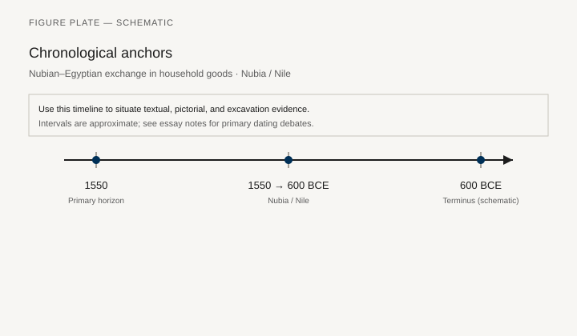
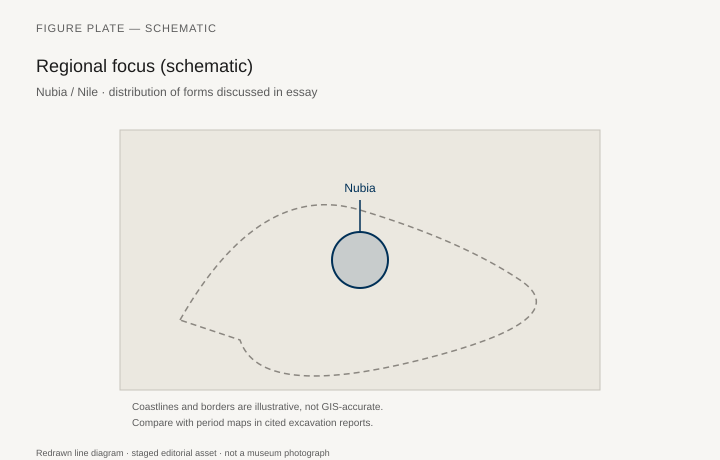
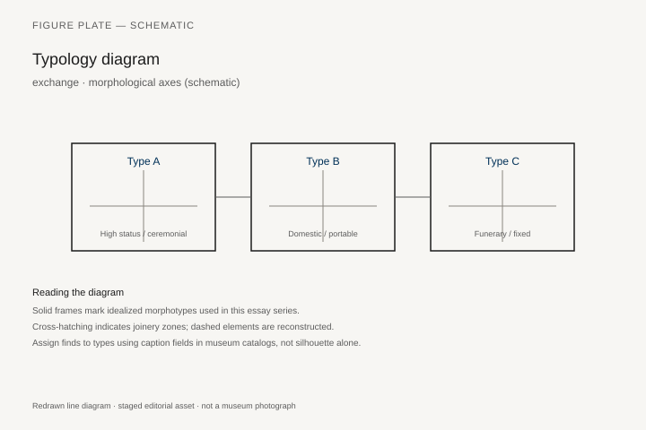
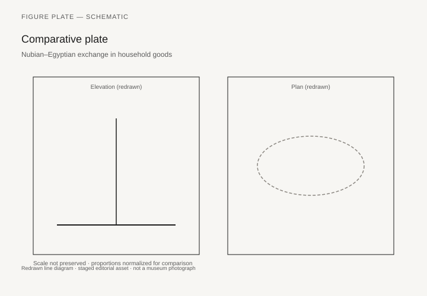

# Nubian–Egyptian exchange in household goods

*Fig. 1.* Chronological anchors for the evidence discussed below. Schematic redrawn line diagram; staged editorial asset (2026). Not a photograph of a museum object.

*Fig. 2.* Regional focus for circulation and local workshop traditions. Schematic redrawn line diagram; staged editorial asset (2026). Not a photograph of a museum object.

*Fig. 3.* Morphological typology for exchange (idealized morphotypes). Schematic redrawn line diagram; staged editorial asset (2026). Not a photograph of a museum object.

*Fig. 4.* Comparative elevation and plan plate for exchange. Schematic redrawn line diagram; staged editorial asset (2026). Not a photograph of a museum object.

## Evidence and argument

Nubian and Egyptian interaction **1550–600 BCE** moved beds, stools, and storage along the Nile. Kerma and Napatan elites adopted and resisted Egyptianizing furniture forms.

Tomb furniture at el-Kurru and Nuri shows hybrid animal-leg beds and Egyptian chest types.

Typology tracks **Egyptian import**, **Nubian local**, and **Kushite revival** morphotypes.

Timeline crosses New Kingdom occupation through Twenty-fifth Dynasty.

Nile corridor map schematic.

Colonial bias in excavation reports may overstate Egyptianization.

## Sources to consult

- Excavation reports and corpus volumes for Nubia / Nile (primary).
- Museum catalog entries consulted as **textual descriptions**; figures in this article are redrawn schematics.
- Cross-references in `GRAPHICS_INDEX.md` for asset paths and reuse policy.

## Editorial note

Graphics for this slug live under `assets/nubian-egyptian-exchange/`. External open-access museum URLs, when cited in prose elsewhere in the series, must document license terms in `LICENSES.md`. Prefer these redrawn diagrams when rights are unclear.
