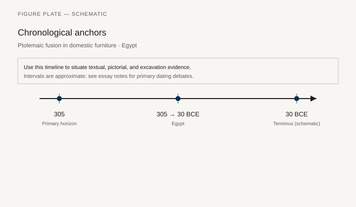
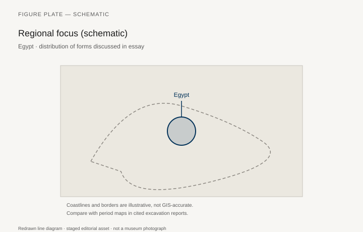
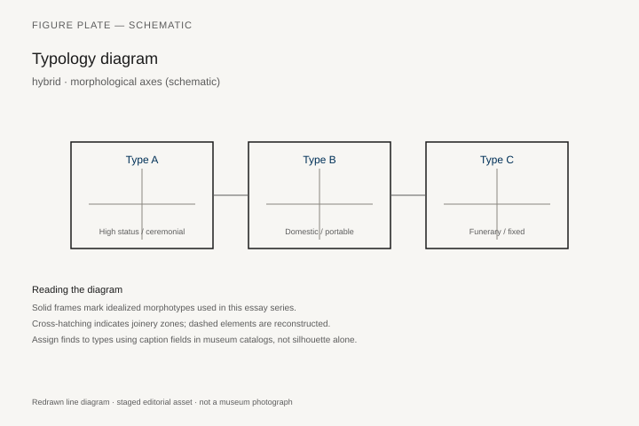
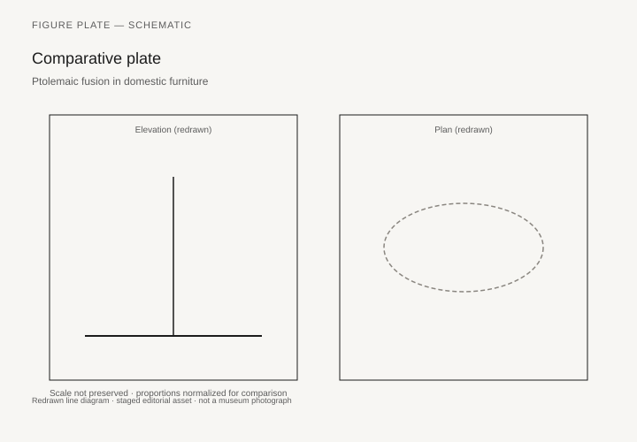

# Ptolemaic fusion in domestic furniture

*Fig. 1.* Chronological anchors for the evidence discussed below. Schematic redrawn line diagram; staged editorial asset (2026). Not a photograph of a museum object.

*Fig. 2.* Regional focus for circulation and local workshop traditions. Schematic redrawn line diagram; staged editorial asset (2026). Not a photograph of a museum object.

*Fig. 3.* Morphological typology for hybrid (idealized morphotypes). Schematic redrawn line diagram; staged editorial asset (2026). Not a photograph of a museum object.

*Fig. 4.* Comparative elevation and plan plate for hybrid. Schematic redrawn line diagram; staged editorial asset (2026). Not a photograph of a museum object.

## Evidence and argument

Ptolemaic Egypt **305–30 BCE** blends Macedonian klinai, pharaonic beds, and Alexandrian luxury in houses and tombs. Fusion is visible in painted tomb furniture and surviving wooden fragments.

Greek names on Egyptian forms complicate typology labels.

Typology encodes **hybrid headboard**, **Greek couch on Egyptian platform**.

Timeline from Ptolemy I through Roman annexation.

Egypt map: Alexandria, Fayum, Theban tombs.

Alexandrian wood is underrepresented versus textual opulence.

## Sources to consult

- Excavation reports and corpus volumes for Egypt (primary).
- Museum catalog entries consulted as **textual descriptions**; figures in this article are redrawn schematics.
- Cross-references in `GRAPHICS_INDEX.md` for asset paths and reuse policy.

## Editorial note

Graphics for this slug live under `assets/ptolemaic-fusion-forms/`. External open-access museum URLs, when cited in prose elsewhere in the series, must document license terms in `LICENSES.md`. Prefer these redrawn diagrams when rights are unclear.
