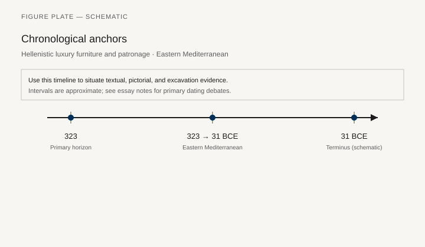
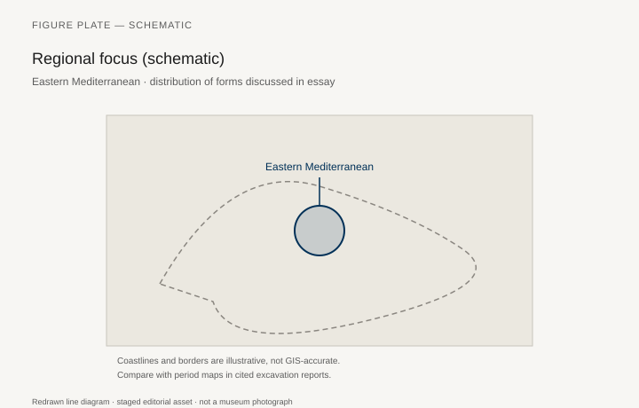
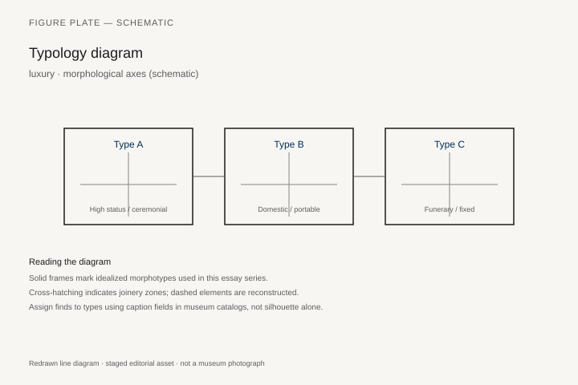
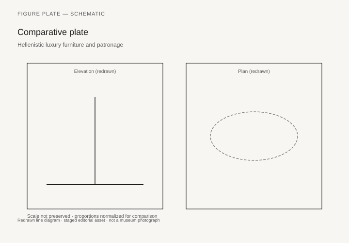

# Hellenistic luxury furniture and patronage

*Fig. 1.* Chronological anchors for the evidence discussed below. Schematic redrawn line diagram; staged editorial asset (2026). Not a photograph of a museum object.

*Fig. 2.* Regional focus for circulation and local workshop traditions. Schematic redrawn line diagram; staged editorial asset (2026). Not a photograph of a museum object.

*Fig. 3.* Morphological typology for luxury (idealized morphotypes). Schematic redrawn line diagram; staged editorial asset (2026). Not a photograph of a museum object.

*Fig. 4.* Comparative elevation and plan plate for luxury. Schematic redrawn line diagram; staged editorial asset (2026). Not a photograph of a museum object.

## Evidence and argument

Hellenistic patrons **323–31 BCE** commissioned inlaid thrones, silver couches, and parade furniture attested in inventories, shipwrecks, and victory booty lists.

Delos houses and Vergina tombs anchor domestic reality against royal exaggeration.

Typology: **court throne**, **sympotic silver**, **portable shrine furniture**.

Timeline from Alexander’s successors through Actium.

Eastern Mediterranean trade schematic.

Shipwreck furniture is rare; most examples are metal vessels interpreted as banquet sets.

## Sources to consult

- Excavation reports and corpus volumes for Eastern Mediterranean (primary).
- Museum catalog entries consulted as **textual descriptions**; figures in this article are redrawn schematics.
- Cross-references in `GRAPHICS_INDEX.md` for asset paths and reuse policy.

## Editorial note

Graphics for this slug live under `assets/hellenistic-luxury-goods/`. External open-access museum URLs, when cited in prose elsewhere in the series, must document license terms in `LICENSES.md`. Prefer these redrawn diagrams when rights are unclear.
