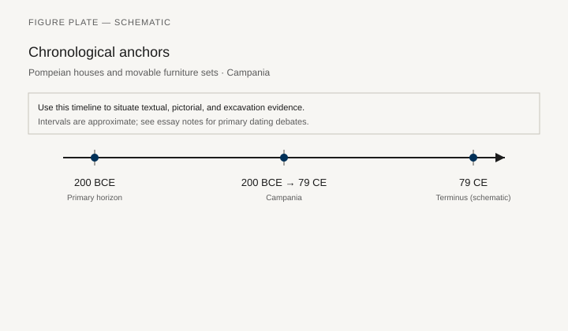
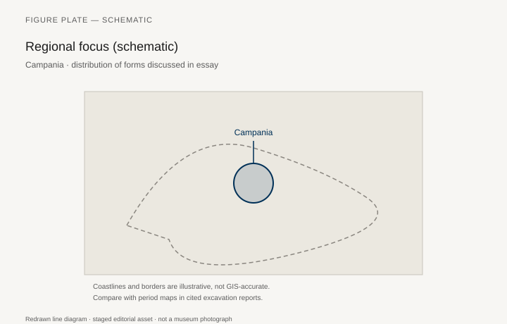
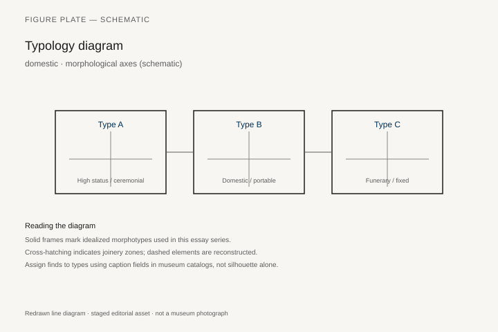
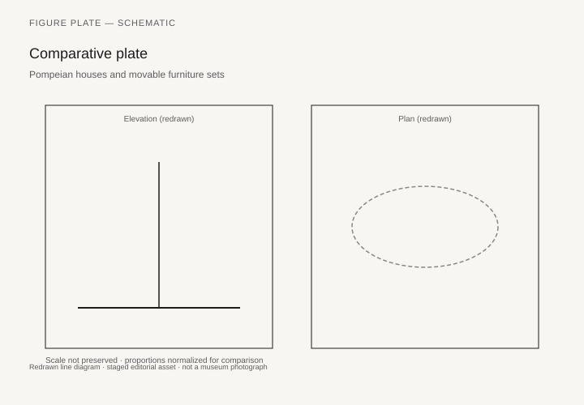

# Pompeian houses and movable furniture sets

*Fig. 1.* Chronological anchors for the evidence discussed below. Schematic redrawn line diagram; staged editorial asset (2026). Not a photograph of a museum object.

*Fig. 2.* Regional focus for circulation and local workshop traditions. Schematic redrawn line diagram; staged editorial asset (2026). Not a photograph of a museum object.

*Fig. 3.* Morphological typology for domestic (idealized morphotypes). Schematic redrawn line diagram; staged editorial asset (2026). Not a photograph of a museum object.

*Fig. 4.* Comparative elevation and plan plate for domestic. Schematic redrawn line diagram; staged editorial asset (2026). Not a photograph of a museum object.

## Evidence and argument

Pompeian houses **200 BCE–79 CE** freeze movable furniture in wall paint, bronze fittings, and occasional carbonized wood. Chests, tables, lamps, and couches appear as sets tied to room function.

The eruption records placement, not always ownership across generations.

Typology by room: **atrium bench**, **cubiculum bed**, **triclinium couch**.

Timeline ends 79 CE; pre-Roman Oscan layers omitted here.

Campania map with Vesuvian cities labeled schematically.

Household inventories from legal texts complement archaeology in the economics essay.

## Sources to consult

- Excavation reports and corpus volumes for Campania (primary).
- Museum catalog entries consulted as **textual descriptions**; figures in this article are redrawn schematics.
- Cross-references in `GRAPHICS_INDEX.md` for asset paths and reuse policy.

## Editorial note

Graphics for this slug live under `assets/pompeian-house-furniture/`. External open-access museum URLs, when cited in prose elsewhere in the series, must document license terms in `LICENSES.md`. Prefer these redrawn diagrams when rights are unclear.
