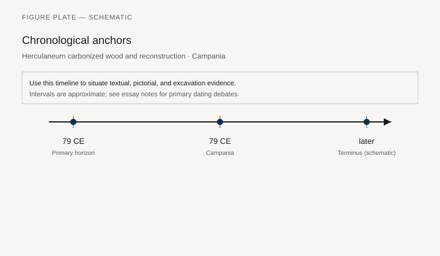
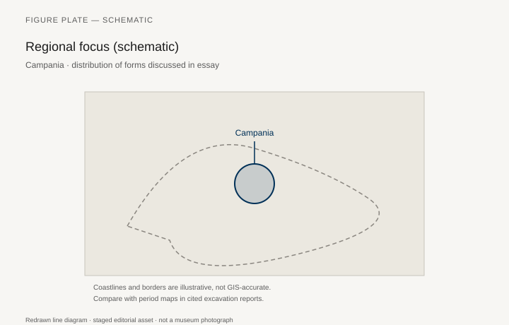
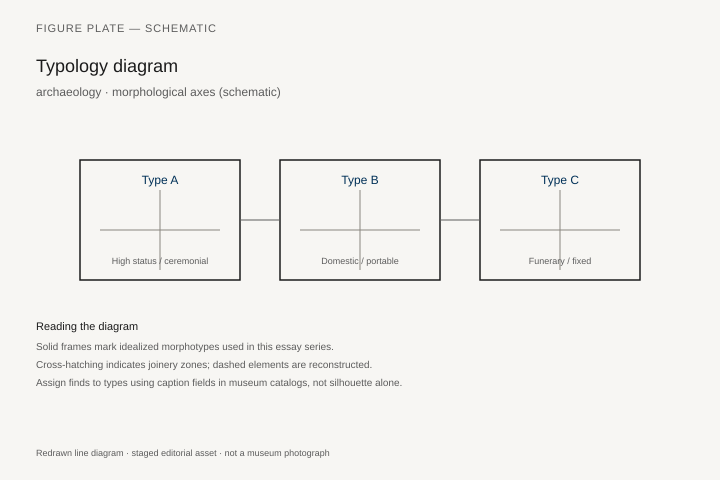
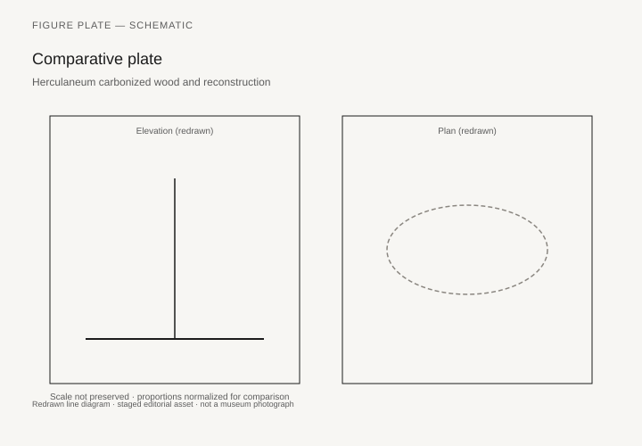

# Herculaneum carbonized wood and reconstruction

*Fig. 1.* Chronological anchors for the evidence discussed below. Schematic redrawn line diagram; staged editorial asset (2026). Not a photograph of a museum object.

*Fig. 2.* Regional focus for circulation and local workshop traditions. Schematic redrawn line diagram; staged editorial asset (2026). Not a photograph of a museum object.

*Fig. 3.* Morphological typology for archaeology (idealized morphotypes). Schematic redrawn line diagram; staged editorial asset (2026). Not a photograph of a museum object.

*Fig. 4.* Comparative elevation and plan plate for archaeology. Schematic redrawn line diagram; staged editorial asset (2026). Not a photograph of a museum object.

## Evidence and argument

Herculaneum’s **79 CE** pyroclastic surge carbonized wooden furniture in the Villa of the Papyri and waterfront shops—among the rare cases where Roman joinery survives as charred fiber.

Conservation stabilizes fragments; reconstruction debates focus on hinge types and couch rake.

Typology derives from **measurable charred lengths**, not fresco alone.

Single-year anchor on timeline; comparative Pompeii contexts noted.

Bay of Naples inset map.

Flag: public access to fragments rotates; cite conservation bulletins, not static photos.

## Sources to consult

- Excavation reports and corpus volumes for Campania (primary).
- Museum catalog entries consulted as **textual descriptions**; figures in this article are redrawn schematics.
- Cross-references in `GRAPHICS_INDEX.md` for asset paths and reuse policy.

## Editorial note

Graphics for this slug live under `assets/herculaneum-carbonized-wood/`. External open-access museum URLs, when cited in prose elsewhere in the series, must document license terms in `LICENSES.md`. Prefer these redrawn diagrams when rights are unclear.
