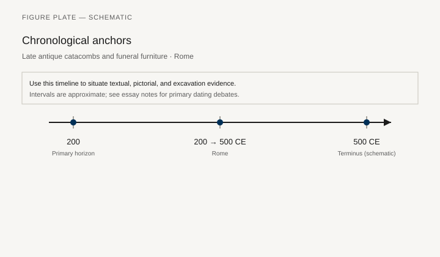
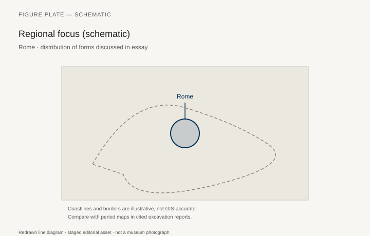
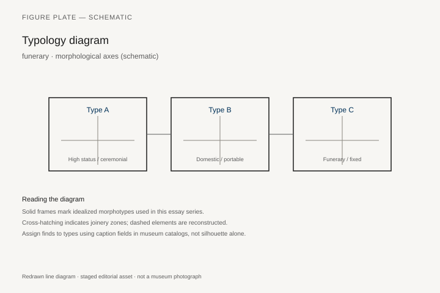
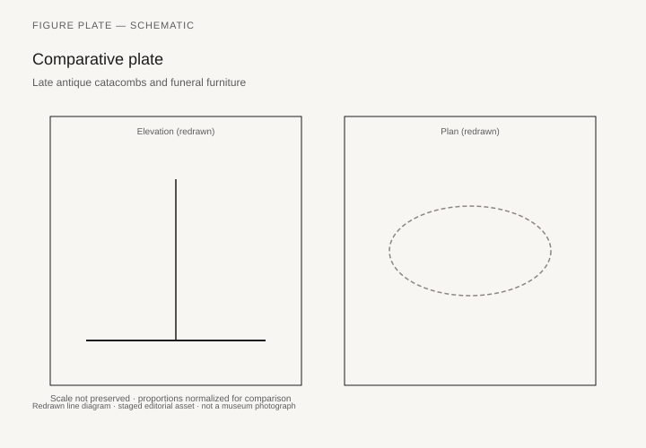

# Late antique catacombs and funeral furniture

*Fig. 1.* Chronological anchors for the evidence discussed below. Schematic redrawn line diagram; staged editorial asset (2026). Not a photograph of a museum object.

*Fig. 2.* Regional focus for circulation and local workshop traditions. Schematic redrawn line diagram; staged editorial asset (2026). Not a photograph of a museum object.

*Fig. 3.* Morphological typology for funerary (idealized morphotypes). Schematic redrawn line diagram; staged editorial asset (2026). Not a photograph of a museum object.

*Fig. 4.* Comparative elevation and plan plate for funerary. Schematic redrawn line diagram; staged editorial asset (2026). Not a photograph of a museum object.

## Evidence and argument

Late antique Roman catacombs **200–500 CE** rarely contain furniture; stone sarcophagi and arcosolia substitute for perishable couches. Christian burial shifts emphasis from banquet couch to loculus niche.

Silver and ivory fittings in elite catacomb zones hint at displaced household goods.

Typology contrasts **pagan funeral couch tradition** with **Christian niche burial**.

Timeline crosses legal recognition of Christianity through Gothic sieges.

Rome schematic map for major catacomb belts.

Thin physical furniture; argument is mostly typological succession.

## Sources to consult

- Excavation reports and corpus volumes for Rome (primary).
- Museum catalog entries consulted as **textual descriptions**; figures in this article are redrawn schematics.
- Cross-references in `GRAPHICS_INDEX.md` for asset paths and reuse policy.

## Editorial note

Graphics for this slug live under `assets/catacombs-funeral-furniture/`. External open-access museum URLs, when cited in prose elsewhere in the series, must document license terms in `LICENSES.md`. Prefer these redrawn diagrams when rights are unclear.
