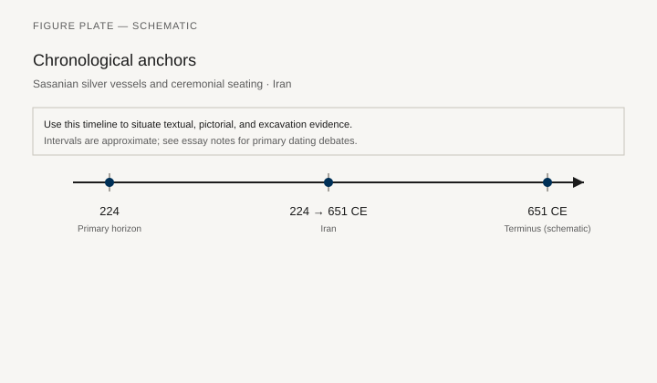
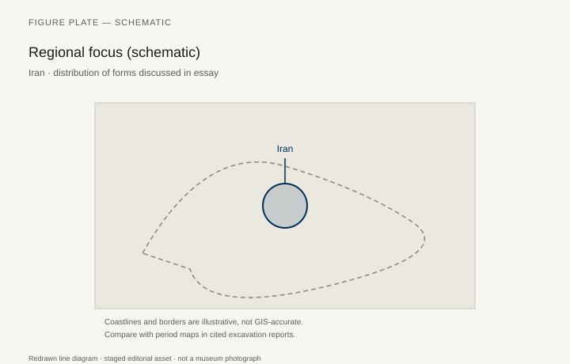
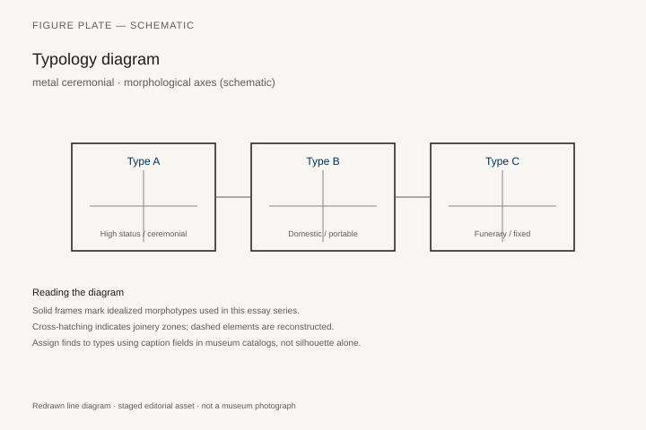
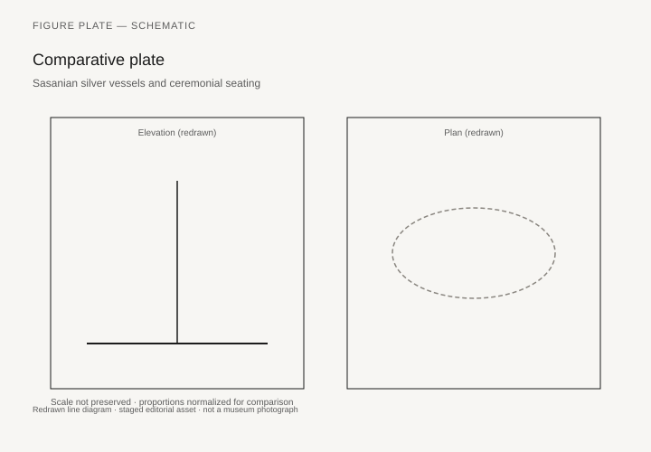

# Sasanian silver vessels and ceremonial seating

*Fig. 1.* Chronological anchors for the evidence discussed below. Schematic redrawn line diagram; staged editorial asset (2026). Not a photograph of a museum object.

*Fig. 2.* Regional focus for circulation and local workshop traditions. Schematic redrawn line diagram; staged editorial asset (2026). Not a photograph of a museum object.

*Fig. 3.* Morphological typology for metal ceremonial (idealized morphotypes). Schematic redrawn line diagram; staged editorial asset (2026). Not a photograph of a museum object.

*Fig. 4.* Comparative elevation and plan plate for metal ceremonial. Schematic redrawn line diagram; staged editorial asset (2026). Not a photograph of a museum object.

## Evidence and argument

Sasanian silver plates and vessels **224–651 CE** show banqueting and enthronement scenes; some scholars read them as furniture surrogates in metal.

Rock reliefs add investiture thrones; wooden originals are lost.

Typology links **ceremonial stool**, **banquet couch in relief**, **royal throne on platform**.

Timeline from Ardashir through Arab conquest.

Iran plateau schematic map.

Metal survives; wooden frames are hypothetical beyond rivet clusters.

## Sources to consult

- Excavation reports and corpus volumes for Iran (primary).
- Museum catalog entries consulted as **textual descriptions**; figures in this article are redrawn schematics.
- Cross-references in `GRAPHICS_INDEX.md` for asset paths and reuse policy.

## Editorial note

Graphics for this slug live under `assets/sasanian-silver-furniture/`. External open-access museum URLs, when cited in prose elsewhere in the series, must document license terms in `LICENSES.md`. Prefer these redrawn diagrams when rights are unclear.
