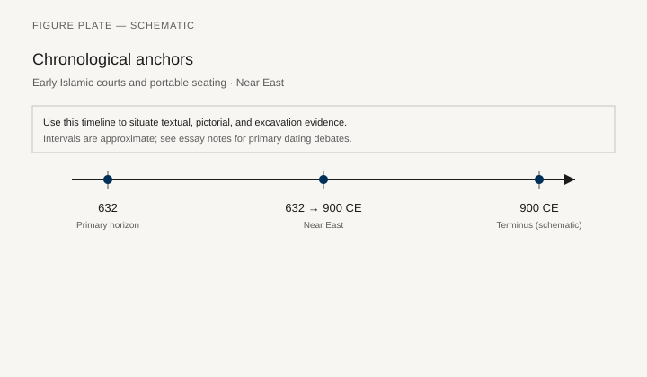
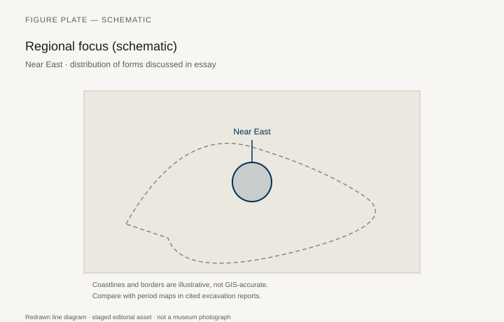
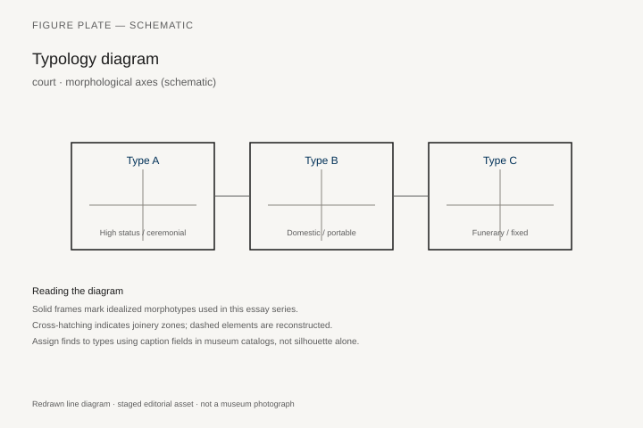
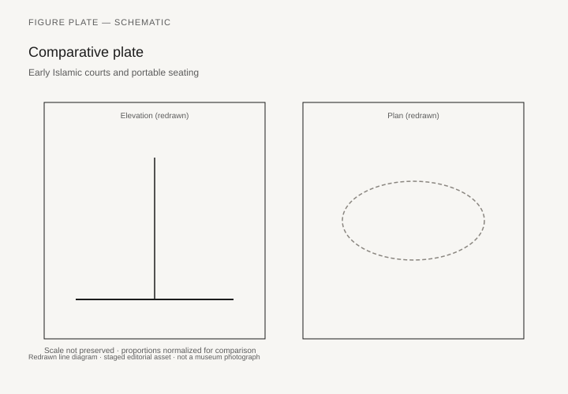

# Early Islamic courts and portable seating

*Fig. 1.* Chronological anchors for the evidence discussed below. Schematic redrawn line diagram; staged editorial asset (2026). Not a photograph of a museum object.

*Fig. 2.* Regional focus for circulation and local workshop traditions. Schematic redrawn line diagram; staged editorial asset (2026). Not a photograph of a museum object.

*Fig. 3.* Morphological typology for court (idealized morphotypes). Schematic redrawn line diagram; staged editorial asset (2026). Not a photograph of a museum object.

*Fig. 4.* Comparative elevation and plan plate for court. Schematic redrawn line diagram; staged editorial asset (2026). Not a photograph of a museum object.

## Evidence and argument

Early Islamic courts **632–900 CE** favored portable cushions, folding chairs for authority, and low couches in Umayyad and Abbasid palaces. Damascus and Samarra frescoes show seated caliphs on rich textiles more than on fixed thrones.

Byzantine and Sasanian inheritances merge in stool and throne protocol.

Typology: **portable lectern**, **divan**, **folding enrobed seat**.

Timeline crosses Rashidun through Abbasid foundation.

Near East schematic map.

Archaeological furniture rarer than literary court ceremony.

## Sources to consult

- Excavation reports and corpus volumes for Near East (primary).
- Museum catalog entries consulted as **textual descriptions**; figures in this article are redrawn schematics.
- Cross-references in `GRAPHICS_INDEX.md` for asset paths and reuse policy.

## Editorial note

Graphics for this slug live under `assets/islamic-early-seating/`. External open-access museum URLs, when cited in prose elsewhere in the series, must document license terms in `LICENSES.md`. Prefer these redrawn diagrams when rights are unclear.
