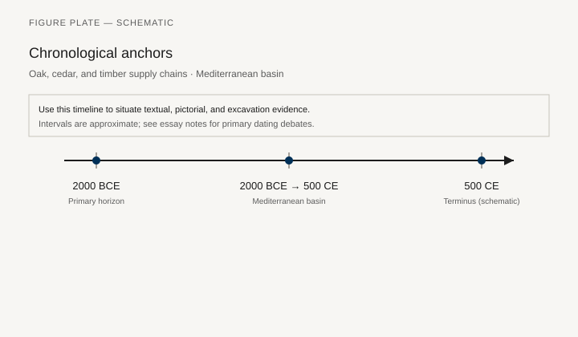
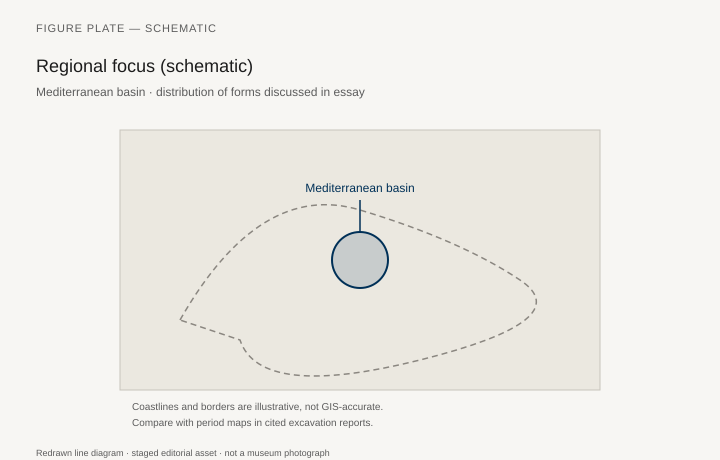
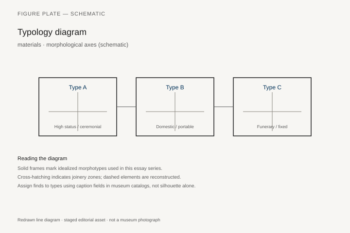
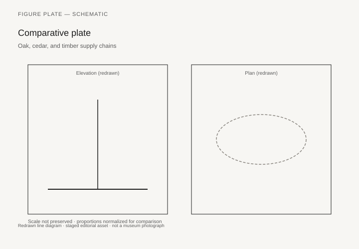

# Oak, cedar, and timber supply chains

*Fig. 1.* Chronological anchors for the evidence discussed below. Schematic redrawn line diagram; staged editorial asset (2026). Not a photograph of a museum object.

*Fig. 2.* Regional focus for circulation and local workshop traditions. Schematic redrawn line diagram; staged editorial asset (2026). Not a photograph of a museum object.

*Fig. 3.* Morphological typology for materials (idealized morphotypes). Schematic redrawn line diagram; staged editorial asset (2026). Not a photograph of a museum object.

*Fig. 4.* Comparative elevation and plan plate for materials. Schematic redrawn line diagram; staged editorial asset (2026). Not a photograph of a museum object.

## Evidence and argument

Mediterranean furniture depended on **oak**, **cedar**, **cypress**, and imported **ebony** **2000 BCE–500 CE**. Supply chains appear in shipwreck cargoes, Assyrian tribute lists, and Roman tariff inscriptions.

This essay is materials-forward: grain, season, and shipboard stowage shape what workshops could build.

Typology by timber species and typical object class (bed vs. shrine door).

Long timeline intentionally coarse.

Basin-wide schematic map of forest zones—not modern deforestation data.

Ecological claims need forestry archaeology; avoid retroactive sustainability moralizing.

## Sources to consult

- Excavation reports and corpus volumes for Mediterranean basin (primary).
- Museum catalog entries consulted as **textual descriptions**; figures in this article are redrawn schematics.
- Cross-references in `GRAPHICS_INDEX.md` for asset paths and reuse policy.

## Editorial note

Graphics for this slug live under `assets/oak-and-cedar-supply-chains/`. External open-access museum URLs, when cited in prose elsewhere in the series, must document license terms in `LICENSES.md`. Prefer these redrawn diagrams when rights are unclear.
