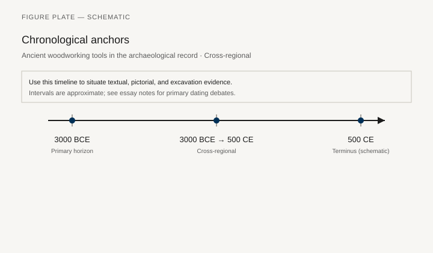
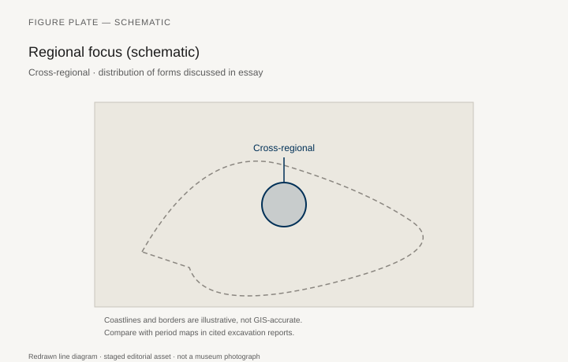
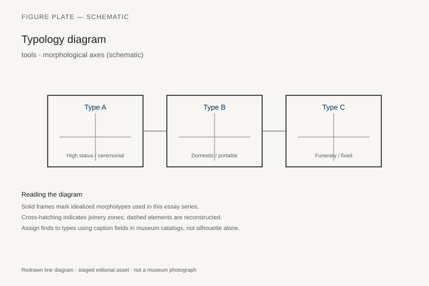
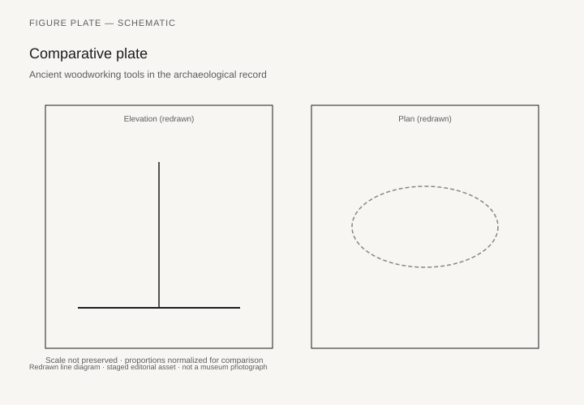

# Ancient woodworking tools in the archaeological record

*Fig. 1.* Chronological anchors for the evidence discussed below. Schematic redrawn line diagram; staged editorial asset (2026). Not a photograph of a museum object.

*Fig. 2.* Regional focus for circulation and local workshop traditions. Schematic redrawn line diagram; staged editorial asset (2026). Not a photograph of a museum object.

*Fig. 3.* Morphological typology for tools (idealized morphotypes). Schematic redrawn line diagram; staged editorial asset (2026). Not a photograph of a museum object.

*Fig. 4.* Comparative elevation and plan plate for tools. Schematic redrawn line diagram; staged editorial asset (2026). Not a photograph of a museum object.

## Evidence and argument

Axes, adzes, bow drills, saws, and chisels from **3000 BCE–500 CE** appear in tool caches, tomb kits, and shipwright deposits. Tool marks on furniture fragments allow typological matching when wood survives.

Cross-regional comparison shows Egyptian copper saws versus Roman iron tooth patterns.

Typology plate groups tools by **cut**, **bore**, and **finish** functions.

Timeline tracks metallurgical shifts affecting edge hardness.

World schematic map for find spots cited in corpora.

Tool alone does not prove furniture type; match marks cautiously.

## Sources to consult

- Excavation reports and corpus volumes for Cross-regional (primary).
- Museum catalog entries consulted as **textual descriptions**; figures in this article are redrawn schematics.
- Cross-references in `GRAPHICS_INDEX.md` for asset paths and reuse policy.

## Editorial note

Graphics for this slug live under `assets/woodworking-tools-ancient/`. External open-access museum URLs, when cited in prose elsewhere in the series, must document license terms in `LICENSES.md`. Prefer these redrawn diagrams when rights are unclear.
