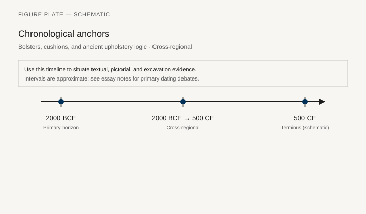
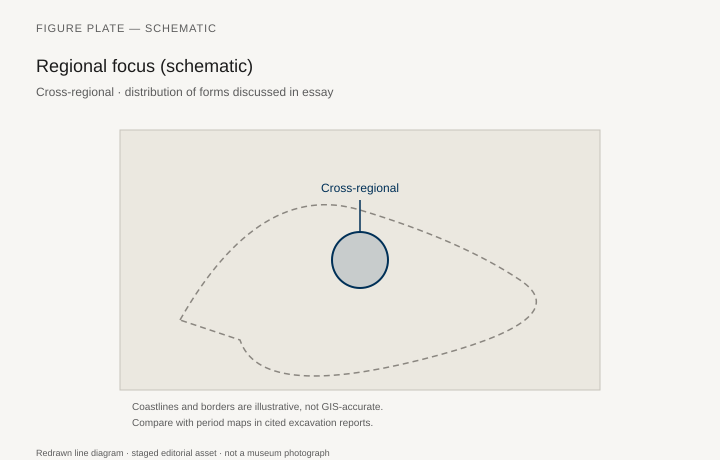
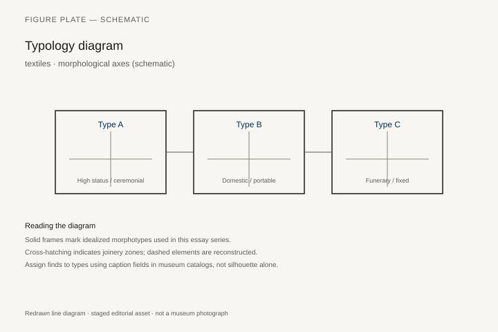
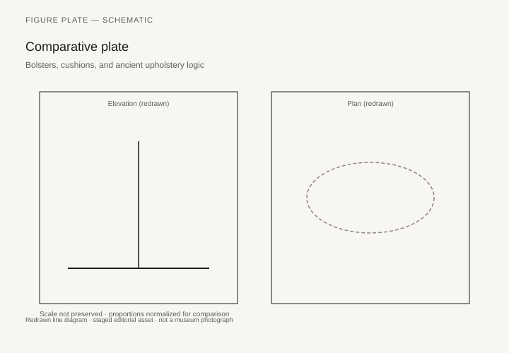

# Bolsters, cushions, and ancient upholstery logic

*Fig. 1.* Chronological anchors for the evidence discussed below. Schematic redrawn line diagram; staged editorial asset (2026). Not a photograph of a museum object.

*Fig. 2.* Regional focus for circulation and local workshop traditions. Schematic redrawn line diagram; staged editorial asset (2026). Not a photograph of a museum object.

*Fig. 3.* Morphological typology for textiles (idealized morphotypes). Schematic redrawn line diagram; staged editorial asset (2026). Not a photograph of a museum object.

*Fig. 4.* Comparative elevation and plan plate for textiles. Schematic redrawn line diagram; staged editorial asset (2026). Not a photograph of a museum object.

## Evidence and argument

Ancient **bolsters, cushions, and woven covers** **2000 BCE–500 CE** converted rigid frames into usable seats. Textiles rarely survive; tomb linens and impression marks on bronze couch fittings hint at stuffing.

Symposium and triclinium culture depends on textile layer as much as wood.

Typology: **bolster**, **mattress sack**, **draped cover**.

Timeline tracks wool vs. linen prestige by region.

Cross-regional schematic.

Weak preservation biases argument toward Egypt and Pompeii.

## Sources to consult

- Excavation reports and corpus volumes for Cross-regional (primary).
- Museum catalog entries consulted as **textual descriptions**; figures in this article are redrawn schematics.
- Cross-references in `GRAPHICS_INDEX.md` for asset paths and reuse policy.

## Editorial note

Graphics for this slug live under `assets/upholstery-bolsters-ancient/`. External open-access museum URLs, when cited in prose elsewhere in the series, must document license terms in `LICENSES.md`. Prefer these redrawn diagrams when rights are unclear.
